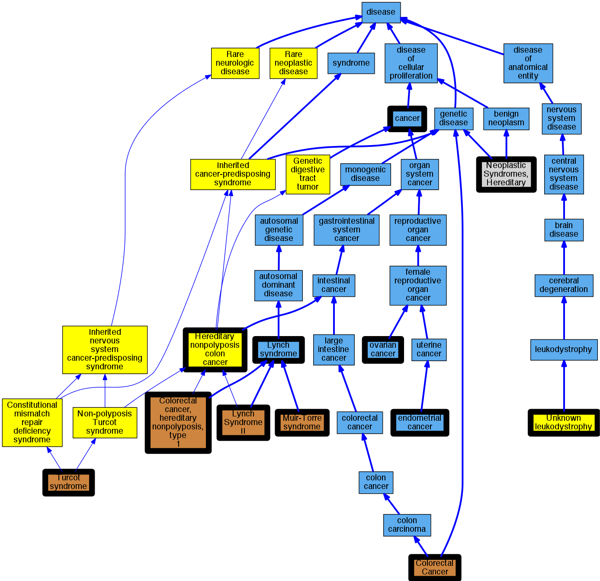

## GENE: MLH1

[matched diseases visual](MLH1.png)  <-- click on raw to zoom

### COLORECTAL CANCER, HEREDITARY NONPOLYPOSIS, TYPE 2
 * [OMIM:609310 Lynch Syndrome II](http://beta.monarchinitiative.org/disease/OMIM:609310) Confidence: low/0.1989795918367347
    * Equiv:[MESH:D055847 Lynch Syndrome II](http://beta.monarchinitiative.org/disease/MESH:D055847)
    * Syn: "Coca2"
    * Syn: "Colon Cancer, Familial Nonpolyposis, Type 2"
    * Syn: "COLORECTAL CANCER, HEREDITARY NONPOLYPOSIS, TYPE 2; HNPCC2"
    * Syn: "HNPCC2"

### COLORECTAL CANCER, SPORADIC, SUSCEPTIBILITY TO
 * [DOID:162 cancer](http://beta.monarchinitiative.org/disease/DOID:162) Confidence: low/0.13
    * Syn: "malignant neoplasm"
    * Syn: "malignant tumor "
    * Syn: "primary cancer"

### Colorectal cancer, non-polyposis
 * [OMIM:114500 Colorectal Cancer](http://beta.monarchinitiative.org/disease/OMIM:114500) Confidence: low/0.15625
    * Syn: "Colon Cancer"
    * Syn: "COLORECTAL CANCER; CRC"
    * Syn: "CRC"

### Endometrial cancer
 * [DOID:1380 endometrial cancer](http://beta.monarchinitiative.org/disease/DOID:1380) Confidence: high
    * Syn: "endometrial Ca"
    * Syn: "endometrial neoplasm"
    * Syn: "malignant endometrial neoplasm"
    * Syn: "malignant neoplasm of endometrium"
    * Syn: "neoplasm of endometrium (disorder)"
    * Syn: "primary malignant neoplasm of endometrium"
    * Syn: "tumor of Endometrium"

### Hereditary non-polyposis colon cancer
 * [Orphanet:144 Hereditary nonpolyposis colon cancer](http://beta.monarchinitiative.org/disease/Orphanet:144) Confidence: high

### Lynch Syndrome
 * [DOID:3883 Lynch syndrome](http://beta.monarchinitiative.org/disease/DOID:3883) Confidence: high
    * Syn: "COCA 1"
    * Syn: "Hereditary Defective Mismatch Repair syndrome"
    * Syn: "hereditary non-polyposis colon cancer type 1"
    * Syn: "hereditary nonpolyposis colorectal cancer"
    * Syn: "hereditary nonpolyposis colorectal neoplasm"
    * Syn: "HNPCC - hereditary nonpolyposis colon cancer"

### Lynch syndrome
 * [DOID:3883 Lynch syndrome](http://beta.monarchinitiative.org/disease/DOID:3883) Confidence: high
    * Syn: "COCA 1"
    * Syn: "Hereditary Defective Mismatch Repair syndrome"
    * Syn: "hereditary non-polyposis colon cancer type 1"
    * Syn: "hereditary nonpolyposis colorectal cancer"
    * Syn: "hereditary nonpolyposis colorectal neoplasm"
    * Syn: "HNPCC - hereditary nonpolyposis colon cancer"

### Lynch syndrome I
 * [OMIM:120435 Colorectal cancer, hereditary nonpolyposis, type 1](http://beta.monarchinitiative.org/disease/OMIM:120435) Confidence: high
    * Equiv:[MESH:C535972 Colorectal cancer, hereditary nonpolyposis, type 1](http://beta.monarchinitiative.org/disease/MESH:C535972)
    * Syn: "Coca1"
    * Syn: "Colon Cancer, Familial Nonpolyposis, Type 1"
    * Syn: "Colorectal Cancer, Hereditary Nonpolyposis, Type 1"
    * Syn: "Lynch Syndrome 2"
    * Syn: "LYNCH SYNDROME I"

### MISMATCH REPAIR CANCER SYNDROME
 * [OMIM:276300 Turcot syndrome](http://beta.monarchinitiative.org/disease/OMIM:276300) Confidence: low/0.18000000000000002
    * Equiv:[MESH:C536928 Turcot syndrome](http://beta.monarchinitiative.org/disease/MESH:C536928)
    * Syn: "Brain Tumor-Polyposis Syndrome 1"
    * Syn: "Btp1 Syndrome"
    * Syn: "Childhood Cancer Syndrome"
    * Syn: "Constitutional Mismatch Repair Deficiency Syndrome"
    * Syn: "MISMATCH REPAIR CANCER SYNDROME; MMRCS"
    * Syn: "Mismatch Repair Deficiency"
    * Syn: "Mmr Deficiency"
    * Syn: "MMRCS"
    * Syn: "Turcot Syndrome"

### MUIR-TORRE SYNDROME
 * [OMIM:158320 Muir-Torre syndrome](http://beta.monarchinitiative.org/disease/OMIM:158320) Confidence: high
    * Equiv:[DOID:0050465 Muir-Torre syndrome](http://beta.monarchinitiative.org/disease/DOID:0050465)
    * Equiv:[MESH:D055653 Muir-Torre Syndrome](http://beta.monarchinitiative.org/disease/MESH:D055653)
    * Syn: "Cutaneous Sebaceous Neoplasms and Keratoacanthomas, Multiple, With Gastrointestinal and Other Carcinomas"
    * Syn: "MRTES"
    * Syn: "MUIR-TORRE SYNDROME; MRTES"

### Neoplastic Syndromes, Hereditary
 * [MESH:D009386 Neoplastic Syndromes, Hereditary](http://beta.monarchinitiative.org/disease/MESH:D009386) Confidence: high

### Ovarian cancer
 * [DOID:2394 ovarian cancer](http://beta.monarchinitiative.org/disease/DOID:2394) Confidence: high
    * Syn: "malignant Ovarian tumor"
    * Syn: "malignant tumour of ovary"
    * Syn: "ovarian neoplasm"
    * Syn: "ovary neoplasm"
    * Syn: "primary ovarian cancer"
    * Syn: "tumor of the Ovary"

### RECLASSIFIED - VARIANT OF UNKNOWN SIGNIFICANCE
 * [Orphanet:84096 Unknown leukodystrophy](http://beta.monarchinitiative.org/disease/Orphanet:84096) Confidence: low/0.0675
