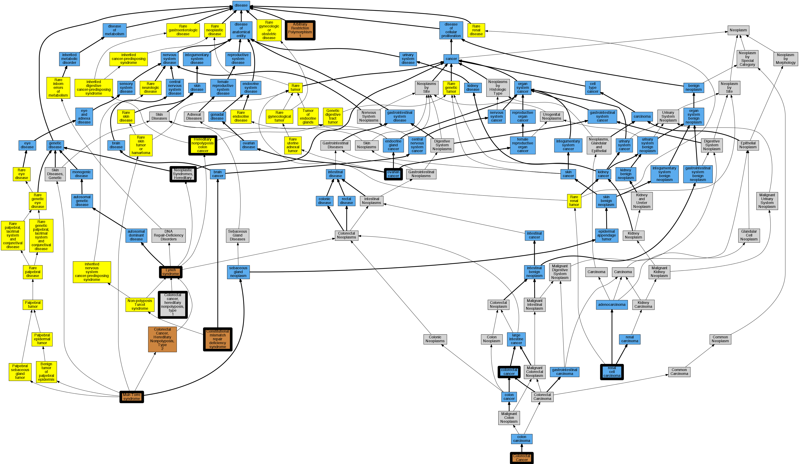

## GENE: MSH2

[matched diseases visual](MSH2.png)  <-- click on raw to zoom

### Colorectal cancer
 * [DOID:9256 colorectal cancer](http://beta.monarchinitiative.org/disease/DOID:9256) Confidence: high

### Colorectal cancer, non-polyposis
 * [OMIM:114500 Colorectal Cancer](http://beta.monarchinitiative.org/disease/OMIM:114500) Confidence: low/0.15625
    * Syn: "Colon Cancer"
    * Syn: "COLORECTAL CANCER; CRC"
    * Syn: "CRC"

### Hereditary non-polyposis colon cancer
 * [Orphanet:443909 Hereditary nonpolyposis colon cancer](http://beta.monarchinitiative.org/disease/Orphanet:443909) Confidence: high
    * Syn: "Familial nonpolyposis colon cancer"
    * Syn: "Familial nonpolyposis colorectal cancer"
    * Syn: "Hereditary nonpolyposis colorectal cancer"
    * Syn: "HNPCC"

### Ovarian cancer
 * [DOID:2394 ovarian cancer](http://beta.monarchinitiative.org/disease/DOID:2394) Confidence: high
    * Equiv:[MESH:D010051 Ovarian Neoplasms](http://beta.monarchinitiative.org/disease/MESH:D010051)
    * Equiv:[Orphanet:213500 Rare ovarian cancer](http://beta.monarchinitiative.org/disease/Orphanet:213500)
    * Syn: "Cancer of Ovary"
    * Syn: "Cancer of the Ovary"
    * Syn: "Cancer, Ovarian"
    * Syn: "Cancer, Ovary"
    * Syn: "Cancers, Ovarian"
    * Syn: "Cancers, Ovary"
    * Syn: "malignant Ovarian tumor"
    * Syn: "malignant tumour of ovary"
    * Syn: "Neoplasm, Ovarian"
    * Syn: "Neoplasm, Ovary"
    * Syn: "Neoplasms, Ovarian"
    * Syn: "Neoplasms, Ovary"
    * Syn: "Ovarian Cancer"
    * Syn: "Ovarian Cancers"
    * Syn: "Ovarian malignant tumor"
    * Syn: "Ovarian Neoplasm"
    * Syn: "ovarian neoplasm"
    * Syn: "Ovary Cancer"
    * Syn: "Ovary Cancers"
    * Syn: "Ovary Neoplasm"
    * Syn: "ovary neoplasm"
    * Syn: "Ovary Neoplasms"
    * Syn: "primary ovarian cancer"
    * Syn: "tumor of the Ovary"

### Lynch syndrome
 * [DOID:3883 Lynch syndrome](http://beta.monarchinitiative.org/disease/DOID:3883) Confidence: high
    * Equiv:[MESH:D003123 Colorectal Neoplasms, Hereditary Nonpolyposis](http://beta.monarchinitiative.org/disease/MESH:D003123)
    * Equiv:[Orphanet:144 Hereditary nonpolyposis colon cancer](http://beta.monarchinitiative.org/disease/Orphanet:144)
    * Syn: "COCA 1"
    * Syn: "Colon Cancer, Familial Nonpolyposis"
    * Syn: "Colorectal Cancer Hereditary Nonpolyposis"
    * Syn: "Familial Nonpolyposis Colon Cancer"
    * Syn: "Hereditary Defective Mismatch Repair syndrome"
    * Syn: "hereditary non-polyposis colon cancer type 1"
    * Syn: "Hereditary Nonpolyposis Colon Cancer"
    * Syn: "Hereditary Nonpolyposis Colorectal Cancer"
    * Syn: "hereditary nonpolyposis colorectal cancer"
    * Syn: "hereditary nonpolyposis colorectal neoplasm"
    * Syn: "Hereditary Nonpolyposis Colorectal Neoplasms"
    * Syn: "HNPCC - hereditary nonpolyposis colon cancer"
    * Syn: "Lynch Cancer Family Syndrome I"
    * Syn: "Lynch Syndrome"
    * Syn: "Lynch Syndrome I"
    * Syn: "Syndrome, Lynch"

### MISMATCH REPAIR CANCER SYNDROME
 * [OMIM:276300 Constitutional mismatch repair deficiency syndrome](http://beta.monarchinitiative.org/disease/OMIM:276300) Confidence: high
    * Equiv:[Orphanet:252202 Constitutional mismatch repair deficiency syndrome](http://beta.monarchinitiative.org/disease/Orphanet:252202)
    * Equiv:[MESH:C536928 Turcot syndrome](http://beta.monarchinitiative.org/disease/MESH:C536928)
    * Syn: "Brain Tumor-Polyposis Syndrome 1"
    * Syn: "Btp1 Syndrome"
    * Syn: "Childhood Cancer Syndrome"
    * Syn: "CMMR-D syndrome"
    * Syn: "CNS tumors with Familial polyposis of the colon"
    * Syn: "Constitutional Mismatch Repair Deficiency Syndrome"
    * Syn: "Mismatch Repair Cancer Syndrome"
    * Syn: "MISMATCH REPAIR CANCER SYNDROME; MMRCS"
    * Syn: "Mismatch Repair Deficiency"
    * Syn: "MMR Deficiency"
    * Syn: "Mmr Deficiency"
    * Syn: "MMRCS"
    * Syn: "Turcot Syndrome"

### MSH2 POLYMORPHISM
 * [OMIM:107750 Arbitrary Restriction Polymorphism 1](http://beta.monarchinitiative.org/disease/OMIM:107750) Confidence: low/0.01953125
    * Syn: "Anonymous Restriction Polymorphism 1"
    * Syn: "ARBITRARY RESTRICTION POLYMORPHISM 1"
    * Syn: "Arp-14A"
    * Syn: "Restriction Fragment Length Polymorphism 14A"
    * Syn: "Rflp-14A"

### Lynch syndrome I
 * [OMIM:120435 Lynch Syndrome 1](http://beta.monarchinitiative.org/disease/OMIM:120435) Confidence: high
    * Equiv:[MESH:C537261 Lynch syndrome I (site-specific colonic cancer)](http://beta.monarchinitiative.org/disease/MESH:C537261)
    * Syn: "Coca1"
    * Syn: "Colon Cancer, Familial Nonpolyposis, Type 1"
    * Syn: "Colorectal Cancer, Hereditary Nonpolyposis, Type 1"
    * Syn: "Lynch Syndrome 2"
    * Syn: "LYNCH SYNDROME I"

### MUIR-TORRE SYNDROME
 * [OMIM:158320 Muir-Torre syndrome](http://beta.monarchinitiative.org/disease/OMIM:158320) Confidence: high
    * Equiv:[Orphanet:587 Muir-Torre syndrome](http://beta.monarchinitiative.org/disease/Orphanet:587)
    * Equiv:[DOID:0050465 Muir-Torre syndrome](http://beta.monarchinitiative.org/disease/DOID:0050465)
    * Equiv:[MESH:D055653 Muir-Torre Syndrome](http://beta.monarchinitiative.org/disease/MESH:D055653)
    * Syn: "Cutaneous Sebaceous Neoplasms and Keratoacanthomas, Multiple, With Gastrointestinal and Other Carcinomas"
    * Syn: "MRTES"
    * Syn: "Muir Torre Syndrome"
    * Syn: "MUIR-TORRE SYNDROME; MRTES"
    * Syn: "Multiple keratoacanthoma, Muir-Torre type"
    * Syn: "Syndrome, Muir-Torre"

### COLORECTAL CANCER, HEREDITARY NONPOLYPOSIS, TYPE 1
 * [MESH:C535972 Colorectal cancer, hereditary nonpolyposis, type 1](http://beta.monarchinitiative.org/disease/MESH:C535972) Confidence: high
    * Syn: "Colon cancer, familial nonpolyposis, type 1"

### COLORECTAL CANCER, HEREDITARY NONPOLYPOSIS, TYPE 1
 * [MESH:C535972 Colorectal cancer, hereditary nonpolyposis, type 1](http://beta.monarchinitiative.org/disease/MESH:C535972) Confidence: high
    * Syn: "Colon cancer, familial nonpolyposis, type 1"

### COLORECTAL CANCER, HEREDITARY, NONPOLYPOSIS, TYPE 1
 * [MESH:C535972 Colorectal cancer, hereditary nonpolyposis, type 1](http://beta.monarchinitiative.org/disease/MESH:C535972) Confidence: high
    * Syn: "Colon cancer, familial nonpolyposis, type 1"

### Colorectal cancer
 * [DOID:9256 colorectal cancer](http://beta.monarchinitiative.org/disease/DOID:9256) Confidence: high

### Lynch Syndrome
 * [DOID:3883 Lynch syndrome](http://beta.monarchinitiative.org/disease/DOID:3883) Confidence: high
    * Equiv:[MESH:D003123 Colorectal Neoplasms, Hereditary Nonpolyposis](http://beta.monarchinitiative.org/disease/MESH:D003123)
    * Equiv:[Orphanet:144 Hereditary nonpolyposis colon cancer](http://beta.monarchinitiative.org/disease/Orphanet:144)
    * Syn: "COCA 1"
    * Syn: "Colon Cancer, Familial Nonpolyposis"
    * Syn: "Colorectal Cancer Hereditary Nonpolyposis"
    * Syn: "Familial Nonpolyposis Colon Cancer"
    * Syn: "Hereditary Defective Mismatch Repair syndrome"
    * Syn: "hereditary non-polyposis colon cancer type 1"
    * Syn: "Hereditary Nonpolyposis Colon Cancer"
    * Syn: "Hereditary Nonpolyposis Colorectal Cancer"
    * Syn: "hereditary nonpolyposis colorectal cancer"
    * Syn: "hereditary nonpolyposis colorectal neoplasm"
    * Syn: "Hereditary Nonpolyposis Colorectal Neoplasms"
    * Syn: "HNPCC - hereditary nonpolyposis colon cancer"
    * Syn: "Lynch Cancer Family Syndrome I"
    * Syn: "Lynch Syndrome"
    * Syn: "Lynch Syndrome I"
    * Syn: "Syndrome, Lynch"

### Neoplastic Syndromes, Hereditary
 * [MESH:D009386 Neoplastic Syndromes, Hereditary](http://beta.monarchinitiative.org/disease/MESH:D009386) Confidence: high
    * Syn: "Cancer Syndrome, Hereditary"
    * Syn: "Cancer Syndromes, Hereditary"
    * Syn: "Hereditary Cancer Syndrome"
    * Syn: "Hereditary Cancer Syndromes"
    * Syn: "Hereditary Neoplastic Syndrome"
    * Syn: "Hereditary Neoplastic Syndromes"
    * Syn: "Neoplastic Syndrome, Hereditary"
    * Syn: "Syndrome, Hereditary Cancer"
    * Syn: "Syndrome, Hereditary Neoplastic"
    * Syn: "Syndromes, Hereditary Cancer"
    * Syn: "Syndromes, Hereditary Neoplastic"

### Renal cell carcinoma
 * [DOID:4450 renal cell carcinoma](http://beta.monarchinitiative.org/disease/DOID:4450) Confidence: high
    * Equiv:[Orphanet:217071 Renal cell carcinoma](http://beta.monarchinitiative.org/disease/Orphanet:217071)
    * Syn: "Adenocarcinoma Of Kidney"
    * Syn: "adenocarcinoma of kidney"
    * Syn: "Adenocarcinoma, Renal"
    * Syn: "Adenocarcinoma, Renal Cell"
    * Syn: "Adenocarcinomas, Renal Cell"
    * Syn: "Cancer, Renal Cell"
    * Syn: "Cancers, Renal Cell"
    * Syn: "Carcinoma, Collecting Duct"
    * Syn: "Carcinoma, Collecting Duct (Kidney)"
    * Syn: "Carcinoma, Hypernephroid"
    * Syn: "Carcinoma, Nephroid"
    * Syn: "Carcinomas, Collecting Duct"
    * Syn: "Carcinomas, Collecting Duct (Kidney)"
    * Syn: "Carcinomas, Hypernephroid"
    * Syn: "Carcinomas, Nephroid"
    * Syn: "Carcinomas, Renal Cell"
    * Syn: "Chromophil Renal Cell Carcinoma"
    * Syn: "Chromophobe Renal Cell Carcinoma"
    * Syn: "Clear Cell Renal Carcinoma"
    * Syn: "Clear Cell Renal Cell Carcinoma"
    * Syn: "Collecting Duct Carcinoma"
    * Syn: "Collecting Duct Carcinoma (Kidney)"
    * Syn: "Collecting Duct Carcinoma of the Kidney"
    * Syn: "Collecting Duct Carcinomas"
    * Syn: "Collecting Duct Carcinomas (Kidney)"
    * Syn: "Duct Carcinoma, Collecting"
    * Syn: "Duct Carcinoma, Collecting (Kidney)"
    * Syn: "Duct Carcinomas, Collecting"
    * Syn: "Duct Carcinomas, Collecting (Kidney)"
    * Syn: "Grawitz Tumor"
    * Syn: "Hypernephroid Carcinoma"
    * Syn: "Hypernephroid Carcinomas"
    * Syn: "Hypernephroma"
    * Syn: "hypernephroma (disorder)"
    * Syn: "Hypernephromas"
    * Syn: "Nephroid Carcinoma"
    * Syn: "Nephroid Carcinomas"
    * Syn: "Papillary Renal Cell Carcinoma"
    * Syn: "RCC"
    * Syn: "Renal Cell Adenocarcinoma"
    * Syn: "Renal Cell Adenocarcinomas"
    * Syn: "Renal Cell Cancer"
    * Syn: "Renal Cell Cancers"
    * Syn: "Renal Cell Carcinoma"
    * Syn: "Renal Cell Carcinoma, Papillary"
    * Syn: "Renal Cell Carcinomas"
    * Syn: "Renal Collecting Duct Carcinoma"
    * Syn: "Sarcomatoid Renal Cell Carcinoma"
    * Syn: "Tumor, Grawitz"
