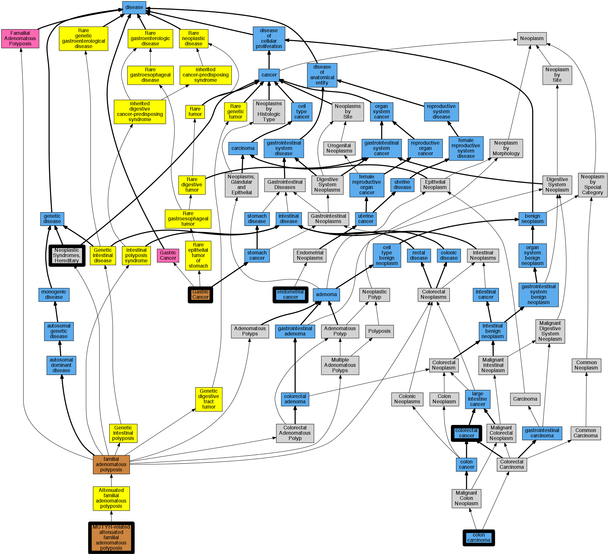

## GENE: MUTYH

[matched diseases visual](MUTYH.png)  <-- click on raw to zoom

### Carcinoma of colon
 * [DOID:1520 colon carcinoma](http://beta.monarchinitiative.org/disease/DOID:1520) Confidence: high
    * Syn: "carcinoma OF colon"
    * Syn: "carcinoma of colon"
    * Syn: "carcinoma of colon (disorder)"
    * Syn: "Colonic carcinoma"

### Colorectal cancer
 * [DOID:9256 colorectal cancer](http://beta.monarchinitiative.org/disease/DOID:9256) Confidence: high

### FAMILIAL ADENOMATOUS POLYPOSIS 2
 * [OMIM:608456 MUTYH-related attenuated familial adenomatous polyposis](http://beta.monarchinitiative.org/disease/OMIM:608456) Confidence: low/0.09000000000000001
    * Equiv:[Orphanet:247798 MUTYH-related attenuated familial adenomatous polyposis](http://beta.monarchinitiative.org/disease/Orphanet:247798)
    * Syn: "Adenomas, Multiple Colorectal, Autosomal Recessive"
    * Syn: "Colorectal Adenomatous Polyposis, Autosomal Recessive"
    * Syn: "FAMILIAL ADENOMATOUS POLYPOSIS, 2; FAP2"
    * Syn: "FAP2"
    * Syn: "MUTYH-related AFAP"
    * Syn: "MUTYH-related attenuated familial polyposis coli"
    * Syn: "MUTYH-related attenuated FAP"

### Colorectal cancer
 * [DOID:9256 colorectal cancer](http://beta.monarchinitiative.org/disease/DOID:9256) Confidence: high

### FAMILIAL ADENOMATOUS POLYPOSIS 2 WITH PILOMATRICOMAS
 * [OMIM:608456 MUTYH-related attenuated familial adenomatous polyposis](http://beta.monarchinitiative.org/disease/OMIM:608456) Confidence: low/0.07777777777777778
    * Equiv:[Orphanet:247798 MUTYH-related attenuated familial adenomatous polyposis](http://beta.monarchinitiative.org/disease/Orphanet:247798)
    * Syn: "Adenomas, Multiple Colorectal, Autosomal Recessive"
    * Syn: "Colorectal Adenomatous Polyposis, Autosomal Recessive"
    * Syn: "FAMILIAL ADENOMATOUS POLYPOSIS, 2; FAP2"
    * Syn: "FAP2"
    * Syn: "MUTYH-related AFAP"
    * Syn: "MUTYH-related attenuated familial polyposis coli"
    * Syn: "MUTYH-related attenuated FAP"

### GASTRIC CANCER, SOMATIC
 * [OMIM:613659 Gastric Cancer](http://beta.monarchinitiative.org/disease/OMIM:613659) Confidence: low/0.18055555555555555
    * Syn: "GASTRIC CANCER"
    * Syn: "Gastric Cancer, Intestinal"

### MUTYH-Associated Polyposis
 * [http://www.ncbi.nlm.nih.gov/gene/4155602 MUTYH](http://beta.monarchinitiative.org/disease/http://www.ncbi.nlm.nih.gov/gene/4155602) Confidence: low/0.1388888888888889

### Neoplastic Syndromes, Hereditary
 * [MESH:D009386 Neoplastic Syndromes, Hereditary](http://beta.monarchinitiative.org/disease/MESH:D009386) Confidence: high
    * Syn: "Cancer Syndrome, Hereditary"
    * Syn: "Cancer Syndromes, Hereditary"
    * Syn: "Hereditary Cancer Syndrome"
    * Syn: "Hereditary Cancer Syndromes"
    * Syn: "Hereditary Neoplastic Syndrome"
    * Syn: "Hereditary Neoplastic Syndromes"
    * Syn: "Neoplastic Syndrome, Hereditary"
    * Syn: "Syndrome, Hereditary Cancer"
    * Syn: "Syndrome, Hereditary Neoplastic"
    * Syn: "Syndromes, Hereditary Cancer"
    * Syn: "Syndromes, Hereditary Neoplastic"

### ENDOMETRIAL CANCER
 * [DOID:1380 endometrial cancer](http://beta.monarchinitiative.org/disease/DOID:1380) Confidence: high
    * Syn: "endometrial Ca"
    * Syn: "endometrial neoplasm"
    * Syn: "malignant endometrial neoplasm"
    * Syn: "malignant neoplasm of endometrium"
    * Syn: "neoplasm of endometrium (disorder)"
    * Syn: "primary malignant neoplasm of endometrium"
    * Syn: "tumor of Endometrium"

### MYH-associated polyposis
 * [DOID:0050424 familial adenomatous polyposis](http://beta.monarchinitiative.org/disease/DOID:0050424) Confidence: high
    * Equiv:[Orphanet:733 Familial adenomatous polyposis](http://beta.monarchinitiative.org/disease/Orphanet:733)
    * Syn: "Adenomatous Intestinal Polyposes"
    * Syn: "Adenomatous Intestinal Polyposis"
    * Syn: "Adenomatous Polyposes, Familial"
    * Syn: "Adenomatous Polyposis Coli, Familial"
    * Syn: "Adenomatous Polyposis Colus"
    * Syn: "Adenomatous Polyposis of the Colon"
    * Syn: "adenomatous polyposis of the colon"
    * Syn: "Adenomatous Polyposis, Familial"
    * Syn: "Coli, Adenomatous Polyposis"
    * Syn: "Coli, Familial Polyposis"
    * Syn: "Coli, Hereditary Polyposis"
    * Syn: "Coli, Polyposis"
    * Syn: "Colorectal adenomatous polyposis"
    * Syn: "Colus, Adenomatous Polyposis"
    * Syn: "Colus, Familial Polyposis"
    * Syn: "Colus, Hereditary Polyposis"
    * Syn: "Colus, Polyposis"
    * Syn: "Familial Adenomatous Polyposes"
    * Syn: "Familial Adenomatous Polyposis"
    * Syn: "Familial Adenomatous Polyposis Coli"
    * Syn: "Familial Adenomatous Polyposis of the Colon"
    * Syn: "Familial Intestinal Polyposes"
    * Syn: "Familial Intestinal Polyposis"
    * Syn: "Familial Multiple Polyposes"
    * Syn: "Familial Multiple Polyposi"
    * Syn: "Familial Multiple Polyposis"
    * Syn: "Familial Multiple Polyposis Syndrome"
    * Syn: "Familial Multiple Polyposus"
    * Syn: "Familial Polyposis Coli"
    * Syn: "Familial polyposis coli"
    * Syn: "Familial Polyposis Colus"
    * Syn: "Familial Polyposis of the Colon"
    * Syn: "Familial Polyposis Syndrome"
    * Syn: "Familial Polyposis Syndromes"
    * Syn: "FAP"
    * Syn: "Hereditary Polyposis Coli"
    * Syn: "Hereditary Polyposis Colus"
    * Syn: "Intestinal Polyposes, Familial"
    * Syn: "Intestinal Polyposis, Adenomatous"
    * Syn: "Intestinal Polyposis, Familial"
    * Syn: "Multiple Polyposes, Familial"
    * Syn: "Multiple Polyposi, Familial"
    * Syn: "Multiple Polyposis, Familial"
    * Syn: "Multiple Polyposus, Familial"
    * Syn: "Myh Associated Polyposis"
    * Syn: "Myh-Associated Polyposes"
    * Syn: "Myh-Associated Polyposis"
    * Syn: "Polyposes, Familial Adenomatous"
    * Syn: "Polyposes, Familial Multiple"
    * Syn: "Polyposes, Myh-Associated"
    * Syn: "Polyposi, Familial Multiple"
    * Syn: "Polyposis Coli"
    * Syn: "Polyposis Coli, Adenomatous"
    * Syn: "Polyposis Coli, Familial"
    * Syn: "Polyposis Coli, Hereditary"
    * Syn: "Polyposis Colus"
    * Syn: "Polyposis Colus, Adenomatous"
    * Syn: "Polyposis Colus, Familial"
    * Syn: "Polyposis Colus, Hereditary"
    * Syn: "Polyposis Syndrome, Familial"
    * Syn: "Polyposis, Adenomatous Intestinal"
    * Syn: "Polyposis, Familial Adenomatous"
    * Syn: "Polyposis, Familial Multiple"
    * Syn: "Polyposis, Myh-Associated"
    * Syn: "Polyposus, Familial Multiple"
