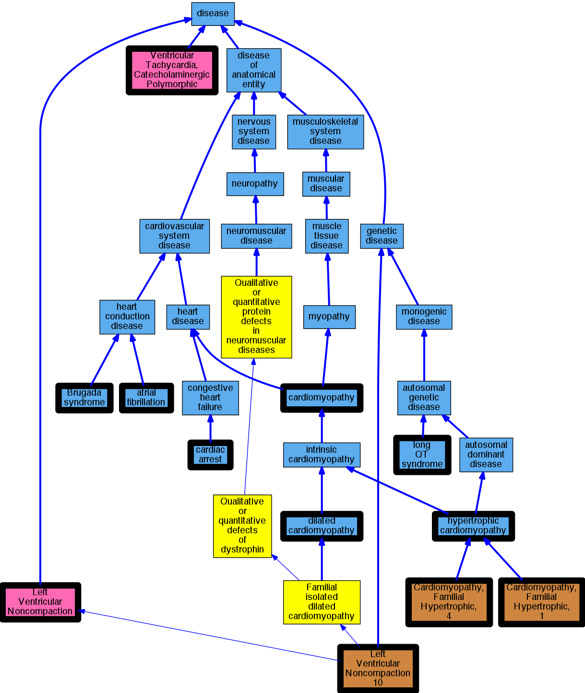

## GENE: MYBPC3

[matched diseases visual](MYBPC3.png)  <-- click on raw to zoom

### Brugada syndrome
 * [DOID:0050451 Brugada syndrome](http://beta.monarchinitiative.org/disease/DOID:0050451) Confidence: high

### CARDIOMYOPATHY, DILATED, 1MM
 * [OMIM:615396 Left Ventricular Noncompaction 10](http://beta.monarchinitiative.org/disease/OMIM:615396) Confidence: high
    * Syn: "Cardiomyopathy, Dilated, 1Mm"
    * Syn: "LEFT VENTRICULAR NONCOMPACTION 10; LVNC10"
    * Syn: "LVNC10"

### CARDIOMYOPATHY, FAMILIAL HYPERTROPHIC, 4
 * [OMIM:115197 Cardiomyopathy, Familial Hypertrophic, 4](http://beta.monarchinitiative.org/disease/OMIM:115197) Confidence: high
    * Equiv:[MESH:C566169 Cardiomyopathy, Familial Hypertrophic, 4](http://beta.monarchinitiative.org/disease/MESH:C566169)
    * Syn: "Cardiomyopathy, Familial Hypertrophic, 4, Susceptibility to"
    * Syn: "CARDIOMYOPATHY, FAMILIAL HYPERTROPHIC, 4; CMH4"
    * Syn: "CMH4"

### CARDIOMYOPATHY, FAMILIAL HYPERTROPHIC, 4, SUSCEPTIBILITY TO
 * [OMIM:115197 Cardiomyopathy, Familial Hypertrophic, 4](http://beta.monarchinitiative.org/disease/OMIM:115197) Confidence: high
    * Equiv:[MESH:C566169 Cardiomyopathy, Familial Hypertrophic, 4](http://beta.monarchinitiative.org/disease/MESH:C566169)
    * Syn: "Cardiomyopathy, Familial Hypertrophic, 4, Susceptibility to"
    * Syn: "CARDIOMYOPATHY, FAMILIAL HYPERTROPHIC, 4; CMH4"
    * Syn: "CMH4"

### Cardiac Arrest
 * [DOID:0060319 cardiac arrest](http://beta.monarchinitiative.org/disease/DOID:0060319) Confidence: high
    * Equiv:[MESH:D006323 Heart Arrest](http://beta.monarchinitiative.org/disease/MESH:D006323)
    * Syn: "cardiopulmonary arrest"
    * Syn: "circulatory arrest"

### Cardiomyopathy
 * [DOID:0050700 cardiomyopathy](http://beta.monarchinitiative.org/disease/DOID:0050700) Confidence: high
    * Equiv:[MESH:D009202 Cardiomyopathies](http://beta.monarchinitiative.org/disease/MESH:D009202)
    * Syn: "Cardiomyopathies"

### Cardiomyopathy, dilated
 * [DOID:12930 dilated cardiomyopathy](http://beta.monarchinitiative.org/disease/DOID:12930) Confidence: high
    * Syn: "Congestive cardiomyopathy"
    * Syn: "Familial dilated cardiomyopathy"
    * Syn: "Idiopathic dilation cardiomyopathy"
    * Syn: "primary dilated cardiomyopathy"

### Cardiomyopathy, dilated, 1MM
 * [OMIM:615396 Left Ventricular Noncompaction 10](http://beta.monarchinitiative.org/disease/OMIM:615396) Confidence: high
    * Syn: "Cardiomyopathy, Dilated, 1Mm"
    * Syn: "LEFT VENTRICULAR NONCOMPACTION 10; LVNC10"
    * Syn: "LVNC10"

### Cardiomyopathy, familial hypertrophic, 4
 * [OMIM:115197 Cardiomyopathy, Familial Hypertrophic, 4](http://beta.monarchinitiative.org/disease/OMIM:115197) Confidence: high
    * Equiv:[MESH:C566169 Cardiomyopathy, Familial Hypertrophic, 4](http://beta.monarchinitiative.org/disease/MESH:C566169)
    * Syn: "Cardiomyopathy, Familial Hypertrophic, 4, Susceptibility to"
    * Syn: "CARDIOMYOPATHY, FAMILIAL HYPERTROPHIC, 4; CMH4"
    * Syn: "CMH4"

### Cardiomyopathy, hypertrophic
 * [DOID:11984 hypertrophic cardiomyopathy](http://beta.monarchinitiative.org/disease/DOID:11984) Confidence: high
    * Equiv:[MESH:D002312 Cardiomyopathy, Hypertrophic](http://beta.monarchinitiative.org/disease/MESH:D002312)
    * Equiv:[MESH:D024741 Cardiomyopathy, Hypertrophic, Familial](http://beta.monarchinitiative.org/disease/MESH:D024741)
    * Syn: "familial hypertrophic cardiomyopathy"
    * Syn: "hypertrophic obstructive cardiomyopathy"

### Cardiomyopathy, hypertrophic ?
 * [DOID:11984 hypertrophic cardiomyopathy](http://beta.monarchinitiative.org/disease/DOID:11984) Confidence: low/0.18055555555555555
    * Equiv:[MESH:D002312 Cardiomyopathy, Hypertrophic](http://beta.monarchinitiative.org/disease/MESH:D002312)
    * Equiv:[MESH:D024741 Cardiomyopathy, Hypertrophic, Familial](http://beta.monarchinitiative.org/disease/MESH:D024741)
    * Syn: "familial hypertrophic cardiomyopathy"
    * Syn: "hypertrophic obstructive cardiomyopathy"

### Cardiomyopathy, left ventricular noncompaction
 * [DC:0000237 Left Ventricular Noncompaction](http://beta.monarchinitiative.org/disease/DC:0000237) Confidence: low/0.1953125

### Catecholaminergic polymorphic ventricular tachycardia
 * [DC:0000665 Ventricular Tachycardia, Catecholaminergic Polymorphic](http://beta.monarchinitiative.org/disease/DC:0000665) Confidence: high

### Dilated Cardiomyopathy
 * [DOID:12930 dilated cardiomyopathy](http://beta.monarchinitiative.org/disease/DOID:12930) Confidence: high
    * Syn: "Congestive cardiomyopathy"
    * Syn: "Familial dilated cardiomyopathy"
    * Syn: "Idiopathic dilation cardiomyopathy"
    * Syn: "primary dilated cardiomyopathy"

### Familial hypertrophic cardiomyopathy 1
 * [OMIM:192600 Cardiomyopathy, Familial Hypertrophic, 1](http://beta.monarchinitiative.org/disease/OMIM:192600) Confidence: high
    * Equiv:[MESH:C566005 Cardiomyopathy, Familial Hypertrophic, 1](http://beta.monarchinitiative.org/disease/MESH:C566005)
    * Syn: "Asymmetric Septal Hypertrophy"
    * Syn: "CARDIOMYOPATHY, FAMILIAL HYPERTROPHIC, 1; CMH1"
    * Syn: "Cmh"
    * Syn: "CMH1"
    * Syn: "Hypertrophic Subaortic Stenosis, Idiopathic"
    * Syn: "Ventricular Hypertrophy, Hereditary"

### Familial hypertrophic cardiomyopathy 4
 * [OMIM:115197 Cardiomyopathy, Familial Hypertrophic, 4](http://beta.monarchinitiative.org/disease/OMIM:115197) Confidence: high
    * Equiv:[MESH:C566169 Cardiomyopathy, Familial Hypertrophic, 4](http://beta.monarchinitiative.org/disease/MESH:C566169)
    * Syn: "Cardiomyopathy, Familial Hypertrophic, 4, Susceptibility to"
    * Syn: "CARDIOMYOPATHY, FAMILIAL HYPERTROPHIC, 4; CMH4"
    * Syn: "CMH4"

### Hypertrophic Cardiomyopathy
 * [DOID:11984 hypertrophic cardiomyopathy](http://beta.monarchinitiative.org/disease/DOID:11984) Confidence: high
    * Equiv:[MESH:D002312 Cardiomyopathy, Hypertrophic](http://beta.monarchinitiative.org/disease/MESH:D002312)
    * Equiv:[MESH:D024741 Cardiomyopathy, Hypertrophic, Familial](http://beta.monarchinitiative.org/disease/MESH:D024741)
    * Syn: "familial hypertrophic cardiomyopathy"
    * Syn: "hypertrophic obstructive cardiomyopathy"

### Hypertrophic cardiomyopathy
 * [DOID:11984 hypertrophic cardiomyopathy](http://beta.monarchinitiative.org/disease/DOID:11984) Confidence: high
    * Equiv:[MESH:D002312 Cardiomyopathy, Hypertrophic](http://beta.monarchinitiative.org/disease/MESH:D002312)
    * Equiv:[MESH:D024741 Cardiomyopathy, Hypertrophic, Familial](http://beta.monarchinitiative.org/disease/MESH:D024741)
    * Syn: "familial hypertrophic cardiomyopathy"
    * Syn: "hypertrophic obstructive cardiomyopathy"

### LEFT VENTRICULAR NONCOMPACTION 10
 * [OMIM:615396 Left Ventricular Noncompaction 10](http://beta.monarchinitiative.org/disease/OMIM:615396) Confidence: high
    * Syn: "Cardiomyopathy, Dilated, 1Mm"
    * Syn: "LEFT VENTRICULAR NONCOMPACTION 10; LVNC10"
    * Syn: "LVNC10"

### Left ventricular noncompaction 10
 * [OMIM:615396 Left Ventricular Noncompaction 10](http://beta.monarchinitiative.org/disease/OMIM:615396) Confidence: high
    * Syn: "Cardiomyopathy, Dilated, 1Mm"
    * Syn: "LEFT VENTRICULAR NONCOMPACTION 10; LVNC10"
    * Syn: "LVNC10"

### Long QT syndrome
 * [DOID:2843 long QT syndrome](http://beta.monarchinitiative.org/disease/DOID:2843) Confidence: high
    * Equiv:[MESH:D008133 Long QT Syndrome](http://beta.monarchinitiative.org/disease/MESH:D008133)
    * Syn: "long Q-T syndrome"
    * Syn: "LQT"
    * Syn: "Romano-Ward syndrome"
    * Syn: "Romano-Ward syndrome (disorder)"

### Paroxysmal atrial fibrillation
 * [DOID:0060224 atrial fibrillation](http://beta.monarchinitiative.org/disease/DOID:0060224) Confidence: low/0.18055555555555555
    * Syn: "A-fib"

### Primary dilated cardiomyopathy
 * [DOID:12930 dilated cardiomyopathy](http://beta.monarchinitiative.org/disease/DOID:12930) Confidence: high
    * Syn: "Congestive cardiomyopathy"
    * Syn: "Familial dilated cardiomyopathy"
    * Syn: "Idiopathic dilation cardiomyopathy"
    * Syn: "primary dilated cardiomyopathy"

### Primary familial hypertrophic cardiomyopathy
 * [DOID:11984 hypertrophic cardiomyopathy](http://beta.monarchinitiative.org/disease/DOID:11984) Confidence: low/0.1953125
    * Equiv:[MESH:D002312 Cardiomyopathy, Hypertrophic](http://beta.monarchinitiative.org/disease/MESH:D002312)
    * Equiv:[MESH:D024741 Cardiomyopathy, Hypertrophic, Familial](http://beta.monarchinitiative.org/disease/MESH:D024741)
    * Syn: "familial hypertrophic cardiomyopathy"
    * Syn: "hypertrophic obstructive cardiomyopathy"
