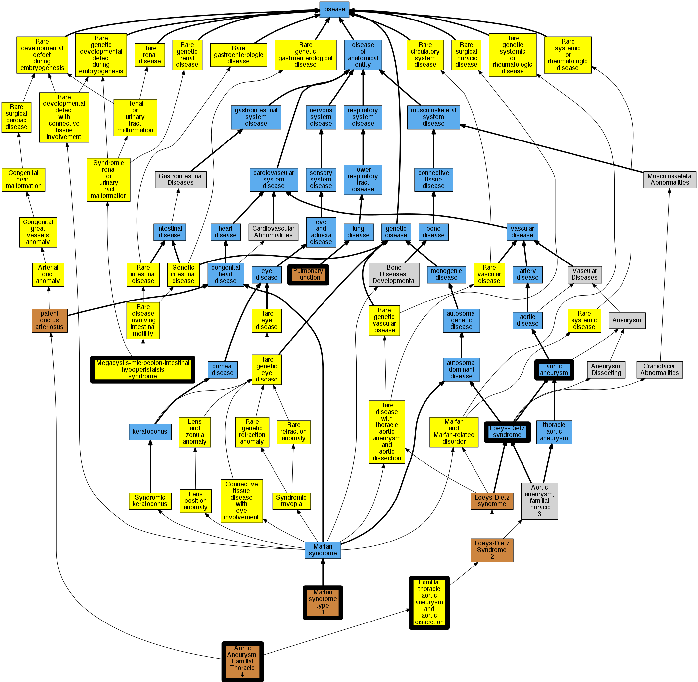

## GENE: MYH11

[matched diseases visual](MYH11.png)  <-- click on raw to zoom

### AORTIC ANEURYSM, FAMILIAL THORACIC 4
 * [OMIM:132900 Aortic aneurysm, familial thoracic 4](http://beta.monarchinitiative.org/disease/OMIM:132900) Confidence: high
    * Equiv:[MESH:C537784 Aortic aneurysm, familial thoracic 4](http://beta.monarchinitiative.org/disease/MESH:C537784)
    * Syn: "AAT4"
    * Syn: "AORTIC ANEURYSM, FAMILIAL THORACIC 4; AAT4"
    * Syn: "Aortic Aneurysm/Aortic Dissection and Patent Ductus Arteriosus"
    * Syn: "Faa4"

### Altered myosin contractile function
 * [OMIM:608852 Pulmonary Function](http://beta.monarchinitiative.org/disease/OMIM:608852) Confidence: low/0.0703125
    * Syn: "Lung Function, Accelerated Rate of Decline In, Smoking-Related"
    * Syn: "Plf"
    * Syn: "PULMONARY FUNCTION"

### Aortic aneurysm
 * [DOID:3627 aortic aneurysm](http://beta.monarchinitiative.org/disease/DOID:3627) Confidence: high
    * Equiv:[MESH:D001014 Aortic Aneurysm](http://beta.monarchinitiative.org/disease/MESH:D001014)
    * Equiv:[MESH:D001019 Aortic Rupture](http://beta.monarchinitiative.org/disease/MESH:D001019)
    * Syn: "abdominal aortic aneurysm, ruptured"
    * Syn: "Aortic aneurysm of unspecified site, ruptured"
    * Syn: "Aortic aneurysm of unspecified site, ruptured (disorder)"
    * Syn: "Ruptured abdominal Aortic Aneurysm"
    * Syn: "ruptured abdominal aortic aneurysm"
    * Syn: "Ruptured abdominal aortic aneurysm (disorder)"
    * Syn: "Ruptured Aortic Aneurysm"
    * Syn: "ruptured aortic aneurysm"
    * Syn: "Ruptured aortic aneurysm (disorder)"
    * Syn: "Ruptured aortic aneurysm NOS"
    * Syn: "Ruptured aortic aneurysm NOS (disorder)"
    * Syn: "Ruptured Thoracic Aneurysm"
    * Syn: "ruptured thoracic aortic aneurysm"
    * Syn: "Ruptured thoracic aortic aneurysm (disorder)"
    * Syn: "ruptured thoracoabdominal aortic aneurysm"
    * Syn: "Thoracic aortic aneurysm which has ruptured (disorder)"
    * Syn: "Thoracic aortic aneurysm, ruptured"
    * Syn: "Thoracoabdominal aortic aneurysm, ruptured (disorder)"

### Aortic aneurysm, familial thoracic 4
 * [OMIM:132900 Aortic aneurysm, familial thoracic 4](http://beta.monarchinitiative.org/disease/OMIM:132900) Confidence: high
    * Equiv:[MESH:C537784 Aortic aneurysm, familial thoracic 4](http://beta.monarchinitiative.org/disease/MESH:C537784)
    * Syn: "AAT4"
    * Syn: "AORTIC ANEURYSM, FAMILIAL THORACIC 4; AAT4"
    * Syn: "Aortic Aneurysm/Aortic Dissection and Patent Ductus Arteriosus"
    * Syn: "Faa4"

### Aortopathy

### Loeys-Dietz syndrome
 * [DOID:0050466 Loeys-Dietz syndrome](http://beta.monarchinitiative.org/disease/DOID:0050466) Confidence: high

### Marfan's syndrome
 * [DOID:14323 Marfan syndrome](http://beta.monarchinitiative.org/disease/DOID:14323) Confidence: high
    * Syn: "Marfan's syndrome"

### Megacystis, microcolon, hypoperistalsis syndrome
 * [Orphanet:2241 Megacystis-microcolon-intestinal hypoperistalsis syndrome](http://beta.monarchinitiative.org/disease/Orphanet:2241) Confidence: low/0.18000000000000002

### Thoracic aortic aneurysms and aortic dissections
 * [Orphanet:91387 Familial thoracic aortic aneurysm and aortic dissection](http://beta.monarchinitiative.org/disease/Orphanet:91387) Confidence: low/0.19097222222222224

### Thoracic aortic aneurysms and dissections
 * [Orphanet:91387 Familial thoracic aortic aneurysm and aortic dissection](http://beta.monarchinitiative.org/disease/Orphanet:91387) Confidence: low/0.19097222222222224
