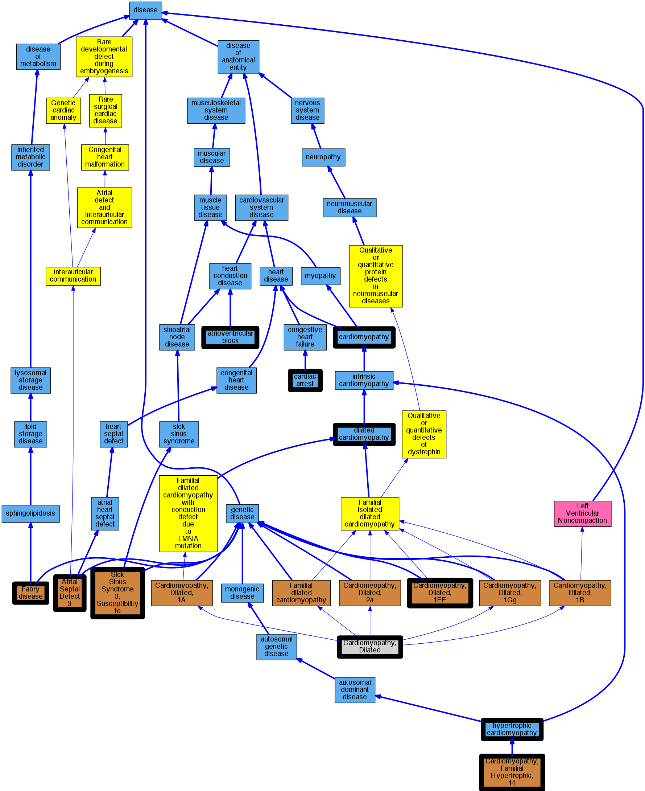

## GENE: MYH6

[matched diseases visual](MYH6.png)  <-- click on raw to zoom

### ATRIAL SEPTAL DEFECT 3
 * [OMIM:614089 Atrial Septal Defect 3](http://beta.monarchinitiative.org/disease/OMIM:614089) Confidence: high
    * Equiv:[MESH:C563540 Atrial Septal Defect 3](http://beta.monarchinitiative.org/disease/MESH:C563540)
    * Syn: "ASD3"
    * Syn: "ATRIAL SEPTAL DEFECT 3; ASD3"

### Cardiac Arrest
 * [DOID:0060319 cardiac arrest](http://beta.monarchinitiative.org/disease/DOID:0060319) Confidence: high
    * Equiv:[MESH:D006323 Heart Arrest](http://beta.monarchinitiative.org/disease/MESH:D006323)
    * Syn: "cardiopulmonary arrest"
    * Syn: "circulatory arrest"

### MYOSIN, CARDIAC, HEAVY CHAIN VARIANT
 * [OMIM:301500 Fabry disease](http://beta.monarchinitiative.org/disease/OMIM:301500) Confidence: low/0.0825
    * Equiv:[DOID:14499 Fabry disease](http://beta.monarchinitiative.org/disease/DOID:14499)
    * Equiv:[MESH:C567062 Fabry Disease, Cardiac Variant](http://beta.monarchinitiative.org/disease/MESH:C567062)
    * Equiv:[MESH:D000795 Fabry Disease](http://beta.monarchinitiative.org/disease/MESH:D000795)
    * Syn: "alpha galactosidase deficiency"
    * Syn: "Alpha-Galactosidase a Deficiency"
    * Syn: "Alpha-galactosidase A deficiency"
    * Syn: "Anderson-Fabry Disease"
    * Syn: "Angiokeratoma Corporis Diffusum"
    * Syn: "Ceramide Trihexosidase Deficiency"
    * Syn: "deficiency of melibiase"
    * Syn: "FABRY DISEASE"
    * Syn: "Fabry Disease, Cardiac Variant"
    * Syn: "Fabry's disease"
    * Syn: "Fabry's disease (disorder)"
    * Syn: "Gla Deficiency"
    * Syn: "Hereditary Dystopic Lipidosis"

### Primary dilated cardiomyopathy
 * [DOID:12930 dilated cardiomyopathy](http://beta.monarchinitiative.org/disease/DOID:12930) Confidence: high
    * Syn: "Congestive cardiomyopathy"
    * Syn: "Familial dilated cardiomyopathy"
    * Syn: "Idiopathic dilation cardiomyopathy"
    * Syn: "primary dilated cardiomyopathy"

### Primary familial hypertrophic cardiomyopathy
 * [DOID:11984 hypertrophic cardiomyopathy](http://beta.monarchinitiative.org/disease/DOID:11984) Confidence: low/0.1953125
    * Equiv:[MESH:D002312 Cardiomyopathy, Hypertrophic](http://beta.monarchinitiative.org/disease/MESH:D002312)
    * Equiv:[MESH:D024741 Cardiomyopathy, Hypertrophic, Familial](http://beta.monarchinitiative.org/disease/MESH:D024741)
    * Syn: "familial hypertrophic cardiomyopathy"
    * Syn: "hypertrophic obstructive cardiomyopathy"

### Cardiomyopathy
 * [DOID:0050700 cardiomyopathy](http://beta.monarchinitiative.org/disease/DOID:0050700) Confidence: high
    * Equiv:[MESH:D009202 Cardiomyopathies](http://beta.monarchinitiative.org/disease/MESH:D009202)
    * Syn: "Cardiomyopathies"

### Cardiomyopathy, dilated
 * [DOID:12930 dilated cardiomyopathy](http://beta.monarchinitiative.org/disease/DOID:12930) Confidence: high
    * Syn: "Congestive cardiomyopathy"
    * Syn: "Familial dilated cardiomyopathy"
    * Syn: "Idiopathic dilation cardiomyopathy"
    * Syn: "primary dilated cardiomyopathy"

### Cardiomyopathy, dilated
 * [DOID:12930 dilated cardiomyopathy](http://beta.monarchinitiative.org/disease/DOID:12930) Confidence: high
    * Syn: "Congestive cardiomyopathy"
    * Syn: "Familial dilated cardiomyopathy"
    * Syn: "Idiopathic dilation cardiomyopathy"
    * Syn: "primary dilated cardiomyopathy"

### Cardiomyopathy, dilated ?
 * [MESH:D002311 Cardiomyopathy, Dilated](http://beta.monarchinitiative.org/disease/MESH:D002311) Confidence: low/0.18055555555555555

### Primary familial hypertrophic cardiomyopathy
 * [DOID:11984 hypertrophic cardiomyopathy](http://beta.monarchinitiative.org/disease/DOID:11984) Confidence: low/0.1953125
    * Equiv:[MESH:D002312 Cardiomyopathy, Hypertrophic](http://beta.monarchinitiative.org/disease/MESH:D002312)
    * Equiv:[MESH:D024741 Cardiomyopathy, Hypertrophic, Familial](http://beta.monarchinitiative.org/disease/MESH:D024741)
    * Syn: "familial hypertrophic cardiomyopathy"
    * Syn: "hypertrophic obstructive cardiomyopathy"

### SICK SINUS SYNDROME 3, SUSCEPTIBILITY TO
 * [OMIM:614090 Sick Sinus Syndrome 3, Susceptibility to](http://beta.monarchinitiative.org/disease/OMIM:614090) Confidence: high
    * Syn: "SICK SINUS SYNDROME 3, SUSCEPTIBILITY TO; SSS3"
    * Syn: "SSS3"

### AV Block Third Degree Adverse Event
 * [DOID:0050820 atrioventricular block](http://beta.monarchinitiative.org/disease/DOID:0050820) Confidence: low/0.1388888888888889
    * Equiv:[MESH:D054537 Atrioventricular Block](http://beta.monarchinitiative.org/disease/MESH:D054537)
    * Syn: "AV block"

### CARDIOMYOPATHY, DILATED, 1EE
 * [OMIM:613252 Cardiomyopathy, Dilated, 1EE](http://beta.monarchinitiative.org/disease/OMIM:613252) Confidence: high
    * Equiv:[MESH:C567683 Cardiomyopathy, Dilated, 1EE](http://beta.monarchinitiative.org/disease/MESH:C567683)
    * Syn: "CARDIOMYOPATHY, DILATED, 1EE; CMD1EE"
    * Syn: "CMD1EE"

### CARDIOMYOPATHY, FAMILIAL HYPERTROPHIC, 14
 * [OMIM:613251 Cardiomyopathy, Familial Hypertrophic, 14](http://beta.monarchinitiative.org/disease/OMIM:613251) Confidence: high
    * Equiv:[MESH:C567684 Cardiomyopathy, Familial Hypertrophic, 14](http://beta.monarchinitiative.org/disease/MESH:C567684)
    * Syn: "CARDIOMYOPATHY, FAMILIAL HYPERTROPHIC, 14; CMH14"
    * Syn: "CMH14"

### Cardiomyopathy
 * [DOID:0050700 cardiomyopathy](http://beta.monarchinitiative.org/disease/DOID:0050700) Confidence: high
    * Equiv:[MESH:D009202 Cardiomyopathies](http://beta.monarchinitiative.org/disease/MESH:D009202)
    * Syn: "Cardiomyopathies"

### Cardiomyopathy, hypertrophic
 * [DOID:11984 hypertrophic cardiomyopathy](http://beta.monarchinitiative.org/disease/DOID:11984) Confidence: high
    * Equiv:[MESH:D002312 Cardiomyopathy, Hypertrophic](http://beta.monarchinitiative.org/disease/MESH:D002312)
    * Equiv:[MESH:D024741 Cardiomyopathy, Hypertrophic, Familial](http://beta.monarchinitiative.org/disease/MESH:D024741)
    * Syn: "familial hypertrophic cardiomyopathy"
    * Syn: "hypertrophic obstructive cardiomyopathy"

### Primary dilated cardiomyopathy
 * [DOID:12930 dilated cardiomyopathy](http://beta.monarchinitiative.org/disease/DOID:12930) Confidence: high
    * Syn: "Congestive cardiomyopathy"
    * Syn: "Familial dilated cardiomyopathy"
    * Syn: "Idiopathic dilation cardiomyopathy"
    * Syn: "primary dilated cardiomyopathy"

### Primary dilated cardiomyopathy
 * [DOID:12930 dilated cardiomyopathy](http://beta.monarchinitiative.org/disease/DOID:12930) Confidence: high
    * Syn: "Congestive cardiomyopathy"
    * Syn: "Familial dilated cardiomyopathy"
    * Syn: "Idiopathic dilation cardiomyopathy"
    * Syn: "primary dilated cardiomyopathy"

### Primary dilated cardiomyopathy
 * [DOID:12930 dilated cardiomyopathy](http://beta.monarchinitiative.org/disease/DOID:12930) Confidence: high
    * Syn: "Congestive cardiomyopathy"
    * Syn: "Familial dilated cardiomyopathy"
    * Syn: "Idiopathic dilation cardiomyopathy"
    * Syn: "primary dilated cardiomyopathy"

### Primary familial hypertrophic cardiomyopathy
 * [DOID:11984 hypertrophic cardiomyopathy](http://beta.monarchinitiative.org/disease/DOID:11984) Confidence: low/0.1953125
    * Equiv:[MESH:D002312 Cardiomyopathy, Hypertrophic](http://beta.monarchinitiative.org/disease/MESH:D002312)
    * Equiv:[MESH:D024741 Cardiomyopathy, Hypertrophic, Familial](http://beta.monarchinitiative.org/disease/MESH:D024741)
    * Syn: "familial hypertrophic cardiomyopathy"
    * Syn: "hypertrophic obstructive cardiomyopathy"
