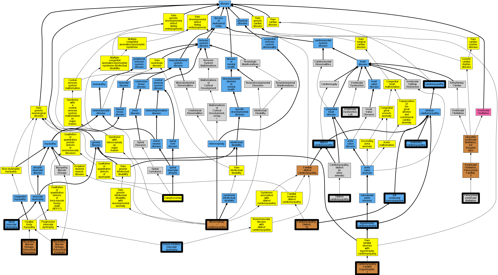

## GENE: MYH7

[matched diseases visual](MYH7.png)  <-- click on raw to zoom

### CARDIOMYOPATHY, DILATED, 1S
 * [OMIM:613426 Cardiomyopathy, Dilated, 1S](http://beta.monarchinitiative.org/disease/OMIM:613426) Confidence: high
    * Equiv:[MESH:C563538 Cardiomyopathy, Dilated, 1s](http://beta.monarchinitiative.org/disease/MESH:C563538)
    * Syn: "CARDIOMYOPATHY, DILATED, 1S; CMD1S"
    * Syn: "CMD1S"
    * Syn: "Left Ventricular Noncompaction 5"

### CARDIOMYOPATHY, HYPERTROPHIC, MIDVENTRICULAR, DIGENIC
 * [OMIM:251220 Microcephaly - cardiomyopathy](http://beta.monarchinitiative.org/disease/OMIM:251220) Confidence: low/0.03515625
    * Equiv:[Orphanet:2515 Microcephaly - cardiomyopathy](http://beta.monarchinitiative.org/disease/Orphanet:2515)
    * Syn: "Microcephaly cardiomyopathy"
    * Syn: "Microcephaly with cardiomyopathy"
    * Syn: "Microcephaly with mental retardation and dilated cardiomyopathy"
    * Syn: "MICROCEPHALY-CARDIOMYOPATHY"
    * Syn: "Microcephaly-Cardiomyopathy"
    * Syn: "Microcephaly-cardiomyopathy syndrome"
    * Syn: "Severe microcephaly and self-limiting dilated cardiomyopathy"
    * Syn: "Severe microcephaly with mental retardation and dilated cardiomyopathy"
    * Syn: "Winship-Viljoen-Leary syndrome"

### Camptocormia
 * [Orphanet:1320 Camptocormia](http://beta.monarchinitiative.org/disease/Orphanet:1320) Confidence: high
    * Equiv:[MESH:C537968 Camptocormia](http://beta.monarchinitiative.org/disease/MESH:C537968)
    * Syn: "Bent spine"
    * Syn: "Bent Spine Syndrome"
    * Syn: "Camptocormism"
    * Syn: "Camptocormism"

### Cardiomyopathy
 * [DOID:0050700 cardiomyopathy](http://beta.monarchinitiative.org/disease/DOID:0050700) Confidence: high
    * Equiv:[MESH:D009202 Cardiomyopathies](http://beta.monarchinitiative.org/disease/MESH:D009202)
    * Equiv:[Orphanet:167848 Cardiomyopathy](http://beta.monarchinitiative.org/disease/Orphanet:167848)
    * Syn: "Cardiomyopathies"
    * Syn: "Cardiomyopathies, Primary"
    * Syn: "Cardiomyopathies, Secondary"
    * Syn: "Cardiomyopathy"
    * Syn: "Cardiomyopathy, Primary"
    * Syn: "Cardiomyopathy, Secondary"
    * Syn: "Disease, Myocardial"
    * Syn: "Disease, Primary Myocardial"
    * Syn: "Disease, Secondary Myocardial"
    * Syn: "Diseases, Myocardial"
    * Syn: "Diseases, Primary Myocardial"
    * Syn: "Diseases, Secondary Myocardial"
    * Syn: "Myocardial Disease"
    * Syn: "Myocardial Disease, Primary"
    * Syn: "Myocardial Disease, Secondary"
    * Syn: "Myocardial Diseases"
    * Syn: "Myocardial Diseases, Primary"
    * Syn: "Myocardial Diseases, Secondary"
    * Syn: "Myocardiopathies"
    * Syn: "Myocardiopathy"
    * Syn: "Primary Cardiomyopathies"
    * Syn: "Primary Cardiomyopathy"
    * Syn: "Primary Myocardial Disease"
    * Syn: "Primary Myocardial Diseases"
    * Syn: "Secondary Cardiomyopathies"
    * Syn: "Secondary Cardiomyopathy"
    * Syn: "Secondary Myocardial Disease"
    * Syn: "Secondary Myocardial Diseases"

### Cardiomyopathy
 * [DOID:0050700 cardiomyopathy](http://beta.monarchinitiative.org/disease/DOID:0050700) Confidence: high
    * Equiv:[MESH:D009202 Cardiomyopathies](http://beta.monarchinitiative.org/disease/MESH:D009202)
    * Equiv:[Orphanet:167848 Cardiomyopathy](http://beta.monarchinitiative.org/disease/Orphanet:167848)
    * Syn: "Cardiomyopathies"
    * Syn: "Cardiomyopathies, Primary"
    * Syn: "Cardiomyopathies, Secondary"
    * Syn: "Cardiomyopathy"
    * Syn: "Cardiomyopathy, Primary"
    * Syn: "Cardiomyopathy, Secondary"
    * Syn: "Disease, Myocardial"
    * Syn: "Disease, Primary Myocardial"
    * Syn: "Disease, Secondary Myocardial"
    * Syn: "Diseases, Myocardial"
    * Syn: "Diseases, Primary Myocardial"
    * Syn: "Diseases, Secondary Myocardial"
    * Syn: "Myocardial Disease"
    * Syn: "Myocardial Disease, Primary"
    * Syn: "Myocardial Disease, Secondary"
    * Syn: "Myocardial Diseases"
    * Syn: "Myocardial Diseases, Primary"
    * Syn: "Myocardial Diseases, Secondary"
    * Syn: "Myocardiopathies"
    * Syn: "Myocardiopathy"
    * Syn: "Primary Cardiomyopathies"
    * Syn: "Primary Cardiomyopathy"
    * Syn: "Primary Myocardial Disease"
    * Syn: "Primary Myocardial Diseases"
    * Syn: "Secondary Cardiomyopathies"
    * Syn: "Secondary Cardiomyopathy"
    * Syn: "Secondary Myocardial Disease"
    * Syn: "Secondary Myocardial Diseases"

### Cardiomyopathy, dilated
 * [DOID:12930 dilated cardiomyopathy](http://beta.monarchinitiative.org/disease/DOID:12930) Confidence: high
    * Equiv:[Orphanet:217604 Dilated cardiomyopathy](http://beta.monarchinitiative.org/disease/Orphanet:217604)
    * Syn: "1A, Dilated cardiomyopathy"
    * Syn: "1As, Dilated cardiomyopathy"
    * Syn: "Cardiomyopathies, Congestive"
    * Syn: "Cardiomyopathies, Dilated"
    * Syn: "Cardiomyopathies, Familial Idiopathic"
    * Syn: "Cardiomyopathies, Idiopathic Dilated"
    * Syn: "cardiomyopathy 1A, Dilated"
    * Syn: "cardiomyopathy 1As, Dilated"
    * Syn: "Cardiomyopathy, Congestive"
    * Syn: "Cardiomyopathy, Dilated, 1a"
    * Syn: "Cardiomyopathy, Dilated, Autosomal Recessive"
    * Syn: "Cardiomyopathy, Dilated, CMD1A"
    * Syn: "Cardiomyopathy, Dilated, LMNA"
    * Syn: "Cardiomyopathy, Dilated, With Conduction Defect 1"
    * Syn: "Cardiomyopathy, Dilated, with Conduction Deffect1"
    * Syn: "Cardiomyopathy, Familial Idiopathic"
    * Syn: "Cardiomyopathy, Idiopathic Dilated"
    * Syn: "Congestive Cardiomyopathies"
    * Syn: "Congestive Cardiomyopathy"
    * Syn: "Congestive cardiomyopathy"
    * Syn: "Dilated Cardiomyopathies"
    * Syn: "Dilated Cardiomyopathies, Idiopathic"
    * Syn: "Dilated Cardiomyopathy"
    * Syn: "Dilated cardiomyopathy 1A"
    * Syn: "Dilated cardiomyopathy 1As"
    * Syn: "Dilated Cardiomyopathy, Idiopathic"
    * Syn: "Familial dilated cardiomyopathy"
    * Syn: "Familial Idiopathic Cardiomyopathies"
    * Syn: "Familial Idiopathic Cardiomyopathy"
    * Syn: "Idiopathic Cardiomyopathies, Familial"
    * Syn: "Idiopathic Cardiomyopathy, Familial"
    * Syn: "Idiopathic Dilated Cardiomyopathies"
    * Syn: "Idiopathic Dilated Cardiomyopathy"
    * Syn: "Idiopathic dilation cardiomyopathy"
    * Syn: "primary dilated cardiomyopathy"

### Cardiomyopathy, familial hypertrophic
 * [DOID:11984 hypertrophic cardiomyopathy](http://beta.monarchinitiative.org/disease/DOID:11984) Confidence: high
    * Equiv:[MESH:D002312 Cardiomyopathy, Hypertrophic](http://beta.monarchinitiative.org/disease/MESH:D002312)
    * Equiv:[Orphanet:217569 Hypertrophic cardiomyopathy](http://beta.monarchinitiative.org/disease/Orphanet:217569)
    * Syn: "Cardiomyopathies, Hypertrophic"
    * Syn: "Cardiomyopathies, Hypertrophic Obstructive"
    * Syn: "Cardiomyopathy, Hypertrophic Obstructive"
    * Syn: "familial hypertrophic cardiomyopathy"
    * Syn: "Hypertrophic Cardiomyopathies"
    * Syn: "Hypertrophic Cardiomyopathy"
    * Syn: "Hypertrophic Obstructive Cardiomyopathies"
    * Syn: "Hypertrophic Obstructive Cardiomyopathy"
    * Syn: "hypertrophic obstructive cardiomyopathy"
    * Syn: "Hypertrophic subaortic stenosis"
    * Syn: "Obstructive Cardiomyopathies, Hypertrophic"
    * Syn: "Obstructive Cardiomyopathy, Hypertrophic"
    * Syn: "Obstructive hypertrophic cardiomyopathy"

### Dilated cardiomyopathy 1S
 * [OMIM:613426 Cardiomyopathy, Dilated, 1S](http://beta.monarchinitiative.org/disease/OMIM:613426) Confidence: high
    * Equiv:[MESH:C563538 Cardiomyopathy, Dilated, 1s](http://beta.monarchinitiative.org/disease/MESH:C563538)
    * Syn: "CARDIOMYOPATHY, DILATED, 1S; CMD1S"
    * Syn: "CMD1S"
    * Syn: "Left Ventricular Noncompaction 5"

### LAING DISTAL MYOPATHY
 * [DOID:11720 distal muscular dystrophy](http://beta.monarchinitiative.org/disease/DOID:11720) Confidence: high
    * Equiv:[MESH:D049310 Distal Myopathies](http://beta.monarchinitiative.org/disease/MESH:D049310)
    * Equiv:[Orphanet:599 Distal myopathy](http://beta.monarchinitiative.org/disease/Orphanet:599)
    * Syn: "Distal 1 Myopathies"
    * Syn: "Distal 1 Myopathy"
    * Syn: "Distal Muscular Dystrophies"
    * Syn: "Distal Muscular Dystrophy"
    * Syn: "Distal muscular dystrophy"
    * Syn: "Distal Myopathy"
    * Syn: "distal myopathy"
    * Syn: "Distal Myopathy 1"
    * Syn: "Distal Myopathy 1s"
    * Syn: "Distal Myopathy Markesbery Griggs Type"
    * Syn: "Distal Myopathy Markesbery-Griggs Type"
    * Syn: "Distal Myopathy, Laing"
    * Syn: "Distal Myopathy, Udd"
    * Syn: "Distal Myopathy, Welander"
    * Syn: "Finnish Markesbery Muscular Dystrophy"
    * Syn: "Finnish-Markesbery Muscular Dystrophy"
    * Syn: "Laing Distal Myopathy"
    * Syn: "Laing Early Onset Distal Myopathy"
    * Syn: "Laing Early-Onset Distal Myopathy"
    * Syn: "Miyoshi muscular dystrophy"
    * Syn: "Muscular Dystrophies, Distal"
    * Syn: "Muscular Dystrophies, Tibial"
    * Syn: "Muscular Dystrophy, Distal"
    * Syn: "Muscular Dystrophy, Distal, Late-Onset, Autosomal Dominant"
    * Syn: "Muscular Dystrophy, Finnish-Markesbery"
    * Syn: "Muscular Dystrophy, Tibial"
    * Syn: "Muscular Dystrophy, Udd-Markesbery"
    * Syn: "Myopathies, Distal"
    * Syn: "Myopathies, Distal 1"
    * Syn: "Myopathy 1, Distal"
    * Syn: "Myopathy 1s, Distal"
    * Syn: "Myopathy, Distal"
    * Syn: "Myopathy, Distal 1"
    * Syn: "Myopathy, Distal, Early-Onset, Autosomal Dominant"
    * Syn: "Myopathy, Distal, Swedish"
    * Syn: "Myopathy, Laing Distal"
    * Syn: "Myopathy, Late Distal Hereditary"
    * Syn: "Myopathy, Udd"
    * Syn: "Myopathy, Udd Distal"
    * Syn: "Tardive Tibial Muscular Dystrophy"
    * Syn: "Tibial Muscular Dystrophy"
    * Syn: "Tibial Muscular Dystrophy, Tardive"
    * Syn: "Udd Distal Myopathy"
    * Syn: "Udd Markesbery Muscular Dystrophy"
    * Syn: "Udd Myopathy"
    * Syn: "Udd-Markesbery Muscular Dystrophy"
    * Syn: "Welander Distal Myopathy"

### MYOPATHY, MYOSIN STORAGE, AUTOSOMAL RECESSIVE
 * [OMIM:255160 Myopathy, Myosin Storage, Autosomal Recessive](http://beta.monarchinitiative.org/disease/OMIM:255160) Confidence: high
    * Syn: "MSMB"
    * Syn: "Myopathy, Hyaline Body, Autosomal Recessive"
    * Syn: "MYOPATHY, MYOSIN STORAGE, AUTOSOMAL RECESSIVE; MSMB"

### Paroxysmal familial ventricular fibrillation
 * [MESH:C537182 Paroxysmal ventricular fibrillation](http://beta.monarchinitiative.org/disease/MESH:C537182) Confidence: high
    * Syn: "Idiopathic ventricular fibrillation"
    * Syn: "Paroxysmal familial ventricular fibrillation"
    * Syn: "Ventricular fibrillation, paroxysmal familial"

### Primary dilated cardiomyopathy
 * [DOID:12930 dilated cardiomyopathy](http://beta.monarchinitiative.org/disease/DOID:12930) Confidence: high
    * Equiv:[Orphanet:217604 Dilated cardiomyopathy](http://beta.monarchinitiative.org/disease/Orphanet:217604)
    * Syn: "1A, Dilated cardiomyopathy"
    * Syn: "1As, Dilated cardiomyopathy"
    * Syn: "Cardiomyopathies, Congestive"
    * Syn: "Cardiomyopathies, Dilated"
    * Syn: "Cardiomyopathies, Familial Idiopathic"
    * Syn: "Cardiomyopathies, Idiopathic Dilated"
    * Syn: "cardiomyopathy 1A, Dilated"
    * Syn: "cardiomyopathy 1As, Dilated"
    * Syn: "Cardiomyopathy, Congestive"
    * Syn: "Cardiomyopathy, Dilated, 1a"
    * Syn: "Cardiomyopathy, Dilated, Autosomal Recessive"
    * Syn: "Cardiomyopathy, Dilated, CMD1A"
    * Syn: "Cardiomyopathy, Dilated, LMNA"
    * Syn: "Cardiomyopathy, Dilated, With Conduction Defect 1"
    * Syn: "Cardiomyopathy, Dilated, with Conduction Deffect1"
    * Syn: "Cardiomyopathy, Familial Idiopathic"
    * Syn: "Cardiomyopathy, Idiopathic Dilated"
    * Syn: "Congestive Cardiomyopathies"
    * Syn: "Congestive Cardiomyopathy"
    * Syn: "Congestive cardiomyopathy"
    * Syn: "Dilated Cardiomyopathies"
    * Syn: "Dilated Cardiomyopathies, Idiopathic"
    * Syn: "Dilated Cardiomyopathy"
    * Syn: "Dilated cardiomyopathy 1A"
    * Syn: "Dilated cardiomyopathy 1As"
    * Syn: "Dilated Cardiomyopathy, Idiopathic"
    * Syn: "Familial dilated cardiomyopathy"
    * Syn: "Familial Idiopathic Cardiomyopathies"
    * Syn: "Familial Idiopathic Cardiomyopathy"
    * Syn: "Idiopathic Cardiomyopathies, Familial"
    * Syn: "Idiopathic Cardiomyopathy, Familial"
    * Syn: "Idiopathic Dilated Cardiomyopathies"
    * Syn: "Idiopathic Dilated Cardiomyopathy"
    * Syn: "Idiopathic dilation cardiomyopathy"
    * Syn: "primary dilated cardiomyopathy"

### Primary dilated cardiomyopathy
 * [DOID:12930 dilated cardiomyopathy](http://beta.monarchinitiative.org/disease/DOID:12930) Confidence: high
    * Equiv:[Orphanet:217604 Dilated cardiomyopathy](http://beta.monarchinitiative.org/disease/Orphanet:217604)
    * Syn: "1A, Dilated cardiomyopathy"
    * Syn: "1As, Dilated cardiomyopathy"
    * Syn: "Cardiomyopathies, Congestive"
    * Syn: "Cardiomyopathies, Dilated"
    * Syn: "Cardiomyopathies, Familial Idiopathic"
    * Syn: "Cardiomyopathies, Idiopathic Dilated"
    * Syn: "cardiomyopathy 1A, Dilated"
    * Syn: "cardiomyopathy 1As, Dilated"
    * Syn: "Cardiomyopathy, Congestive"
    * Syn: "Cardiomyopathy, Dilated, 1a"
    * Syn: "Cardiomyopathy, Dilated, Autosomal Recessive"
    * Syn: "Cardiomyopathy, Dilated, CMD1A"
    * Syn: "Cardiomyopathy, Dilated, LMNA"
    * Syn: "Cardiomyopathy, Dilated, With Conduction Defect 1"
    * Syn: "Cardiomyopathy, Dilated, with Conduction Deffect1"
    * Syn: "Cardiomyopathy, Familial Idiopathic"
    * Syn: "Cardiomyopathy, Idiopathic Dilated"
    * Syn: "Congestive Cardiomyopathies"
    * Syn: "Congestive Cardiomyopathy"
    * Syn: "Congestive cardiomyopathy"
    * Syn: "Dilated Cardiomyopathies"
    * Syn: "Dilated Cardiomyopathies, Idiopathic"
    * Syn: "Dilated Cardiomyopathy"
    * Syn: "Dilated cardiomyopathy 1A"
    * Syn: "Dilated cardiomyopathy 1As"
    * Syn: "Dilated Cardiomyopathy, Idiopathic"
    * Syn: "Familial dilated cardiomyopathy"
    * Syn: "Familial Idiopathic Cardiomyopathies"
    * Syn: "Familial Idiopathic Cardiomyopathy"
    * Syn: "Idiopathic Cardiomyopathies, Familial"
    * Syn: "Idiopathic Cardiomyopathy, Familial"
    * Syn: "Idiopathic Dilated Cardiomyopathies"
    * Syn: "Idiopathic Dilated Cardiomyopathy"
    * Syn: "Idiopathic dilation cardiomyopathy"
    * Syn: "primary dilated cardiomyopathy"

### Primary familial hypertrophic cardiomyopathy
 * [DOID:11984 hypertrophic cardiomyopathy](http://beta.monarchinitiative.org/disease/DOID:11984) Confidence: low/0.1953125
    * Equiv:[MESH:D002312 Cardiomyopathy, Hypertrophic](http://beta.monarchinitiative.org/disease/MESH:D002312)
    * Equiv:[Orphanet:217569 Hypertrophic cardiomyopathy](http://beta.monarchinitiative.org/disease/Orphanet:217569)
    * Syn: "Cardiomyopathies, Hypertrophic"
    * Syn: "Cardiomyopathies, Hypertrophic Obstructive"
    * Syn: "Cardiomyopathy, Hypertrophic Obstructive"
    * Syn: "familial hypertrophic cardiomyopathy"
    * Syn: "Hypertrophic Cardiomyopathies"
    * Syn: "Hypertrophic Cardiomyopathy"
    * Syn: "Hypertrophic Obstructive Cardiomyopathies"
    * Syn: "Hypertrophic Obstructive Cardiomyopathy"
    * Syn: "hypertrophic obstructive cardiomyopathy"
    * Syn: "Hypertrophic subaortic stenosis"
    * Syn: "Obstructive Cardiomyopathies, Hypertrophic"
    * Syn: "Obstructive Cardiomyopathy, Hypertrophic"
    * Syn: "Obstructive hypertrophic cardiomyopathy"

### Primary familial hypertrophic cardiomyopathy
 * [DOID:11984 hypertrophic cardiomyopathy](http://beta.monarchinitiative.org/disease/DOID:11984) Confidence: low/0.1953125
    * Equiv:[MESH:D002312 Cardiomyopathy, Hypertrophic](http://beta.monarchinitiative.org/disease/MESH:D002312)
    * Equiv:[Orphanet:217569 Hypertrophic cardiomyopathy](http://beta.monarchinitiative.org/disease/Orphanet:217569)
    * Syn: "Cardiomyopathies, Hypertrophic"
    * Syn: "Cardiomyopathies, Hypertrophic Obstructive"
    * Syn: "Cardiomyopathy, Hypertrophic Obstructive"
    * Syn: "familial hypertrophic cardiomyopathy"
    * Syn: "Hypertrophic Cardiomyopathies"
    * Syn: "Hypertrophic Cardiomyopathy"
    * Syn: "Hypertrophic Obstructive Cardiomyopathies"
    * Syn: "Hypertrophic Obstructive Cardiomyopathy"
    * Syn: "hypertrophic obstructive cardiomyopathy"
    * Syn: "Hypertrophic subaortic stenosis"
    * Syn: "Obstructive Cardiomyopathies, Hypertrophic"
    * Syn: "Obstructive Cardiomyopathy, Hypertrophic"
    * Syn: "Obstructive hypertrophic cardiomyopathy"

### Cardiomyopathy, dilated ?
 * [OMIA:000162-9615 Dilated cardiomyopathy](http://beta.monarchinitiative.org/disease/OMIA:000162-9615) Confidence: low/0.18055555555555555

### Cardiomyopathy, hypertrophic ?
 * [DOID:11984 hypertrophic cardiomyopathy](http://beta.monarchinitiative.org/disease/DOID:11984) Confidence: low/0.18055555555555555
    * Equiv:[MESH:D002312 Cardiomyopathy, Hypertrophic](http://beta.monarchinitiative.org/disease/MESH:D002312)
    * Equiv:[Orphanet:217569 Hypertrophic cardiomyopathy](http://beta.monarchinitiative.org/disease/Orphanet:217569)
    * Syn: "Cardiomyopathies, Hypertrophic"
    * Syn: "Cardiomyopathies, Hypertrophic Obstructive"
    * Syn: "Cardiomyopathy, Hypertrophic Obstructive"
    * Syn: "familial hypertrophic cardiomyopathy"
    * Syn: "Hypertrophic Cardiomyopathies"
    * Syn: "Hypertrophic Cardiomyopathy"
    * Syn: "Hypertrophic Obstructive Cardiomyopathies"
    * Syn: "Hypertrophic Obstructive Cardiomyopathy"
    * Syn: "hypertrophic obstructive cardiomyopathy"
    * Syn: "Hypertrophic subaortic stenosis"
    * Syn: "Obstructive Cardiomyopathies, Hypertrophic"
    * Syn: "Obstructive Cardiomyopathy, Hypertrophic"
    * Syn: "Obstructive hypertrophic cardiomyopathy"

### Cardiomyopathy, left ventrcular noncompaction
 * [DOID:0050700 cardiomyopathy](http://beta.monarchinitiative.org/disease/DOID:0050700) Confidence: low/0.1328125
    * Equiv:[MESH:D009202 Cardiomyopathies](http://beta.monarchinitiative.org/disease/MESH:D009202)
    * Equiv:[Orphanet:167848 Cardiomyopathy](http://beta.monarchinitiative.org/disease/Orphanet:167848)
    * Syn: "Cardiomyopathies"
    * Syn: "Cardiomyopathies, Primary"
    * Syn: "Cardiomyopathies, Secondary"
    * Syn: "Cardiomyopathy"
    * Syn: "Cardiomyopathy, Primary"
    * Syn: "Cardiomyopathy, Secondary"
    * Syn: "Disease, Myocardial"
    * Syn: "Disease, Primary Myocardial"
    * Syn: "Disease, Secondary Myocardial"
    * Syn: "Diseases, Myocardial"
    * Syn: "Diseases, Primary Myocardial"
    * Syn: "Diseases, Secondary Myocardial"
    * Syn: "Myocardial Disease"
    * Syn: "Myocardial Disease, Primary"
    * Syn: "Myocardial Disease, Secondary"
    * Syn: "Myocardial Diseases"
    * Syn: "Myocardial Diseases, Primary"
    * Syn: "Myocardial Diseases, Secondary"
    * Syn: "Myocardiopathies"
    * Syn: "Myocardiopathy"
    * Syn: "Primary Cardiomyopathies"
    * Syn: "Primary Cardiomyopathy"
    * Syn: "Primary Myocardial Disease"
    * Syn: "Primary Myocardial Diseases"
    * Syn: "Secondary Cardiomyopathies"
    * Syn: "Secondary Cardiomyopathy"
    * Syn: "Secondary Myocardial Disease"
    * Syn: "Secondary Myocardial Diseases"

### Cardiomyopathy, restrictive
 * [DOID:397 restrictive cardiomyopathy](http://beta.monarchinitiative.org/disease/DOID:397) Confidence: high
    * Equiv:[MESH:D002313 Cardiomyopathy, Restrictive](http://beta.monarchinitiative.org/disease/MESH:D002313)
    * Equiv:[Orphanet:217632 Restrictive cardiomyopathy](http://beta.monarchinitiative.org/disease/Orphanet:217632)
    * Syn: "Cardiomyopathies, Restrictive"
    * Syn: "Cardiomyopathy, constrictive"
    * Syn: "Familial Restrictive Cardiomyopathy"
    * Syn: "Familial restrictive cardiomyopathy"
    * Syn: "primary restrictive cardiomyopathy (disorder)"
    * Syn: "Restrictive Cardiomyopathies"
    * Syn: "Restrictive Cardiomyopathy"
    * Syn: "Restrictive cardiomyopathy"
    * Syn: "Restrictive cardiomyopathy (disorder)"

### Dilated Cardiomyopathy
 * [DOID:12930 dilated cardiomyopathy](http://beta.monarchinitiative.org/disease/DOID:12930) Confidence: high
    * Equiv:[Orphanet:217604 Dilated cardiomyopathy](http://beta.monarchinitiative.org/disease/Orphanet:217604)
    * Syn: "1A, Dilated cardiomyopathy"
    * Syn: "1As, Dilated cardiomyopathy"
    * Syn: "Cardiomyopathies, Congestive"
    * Syn: "Cardiomyopathies, Dilated"
    * Syn: "Cardiomyopathies, Familial Idiopathic"
    * Syn: "Cardiomyopathies, Idiopathic Dilated"
    * Syn: "cardiomyopathy 1A, Dilated"
    * Syn: "cardiomyopathy 1As, Dilated"
    * Syn: "Cardiomyopathy, Congestive"
    * Syn: "Cardiomyopathy, Dilated, 1a"
    * Syn: "Cardiomyopathy, Dilated, Autosomal Recessive"
    * Syn: "Cardiomyopathy, Dilated, CMD1A"
    * Syn: "Cardiomyopathy, Dilated, LMNA"
    * Syn: "Cardiomyopathy, Dilated, With Conduction Defect 1"
    * Syn: "Cardiomyopathy, Dilated, with Conduction Deffect1"
    * Syn: "Cardiomyopathy, Familial Idiopathic"
    * Syn: "Cardiomyopathy, Idiopathic Dilated"
    * Syn: "Congestive Cardiomyopathies"
    * Syn: "Congestive Cardiomyopathy"
    * Syn: "Congestive cardiomyopathy"
    * Syn: "Dilated Cardiomyopathies"
    * Syn: "Dilated Cardiomyopathies, Idiopathic"
    * Syn: "Dilated Cardiomyopathy"
    * Syn: "Dilated cardiomyopathy 1A"
    * Syn: "Dilated cardiomyopathy 1As"
    * Syn: "Dilated Cardiomyopathy, Idiopathic"
    * Syn: "Familial dilated cardiomyopathy"
    * Syn: "Familial Idiopathic Cardiomyopathies"
    * Syn: "Familial Idiopathic Cardiomyopathy"
    * Syn: "Idiopathic Cardiomyopathies, Familial"
    * Syn: "Idiopathic Cardiomyopathy, Familial"
    * Syn: "Idiopathic Dilated Cardiomyopathies"
    * Syn: "Idiopathic Dilated Cardiomyopathy"
    * Syn: "Idiopathic dilation cardiomyopathy"
    * Syn: "primary dilated cardiomyopathy"

### Hypertrophic cardiomyopathy
 * [DOID:11984 hypertrophic cardiomyopathy](http://beta.monarchinitiative.org/disease/DOID:11984) Confidence: high
    * Equiv:[MESH:D002312 Cardiomyopathy, Hypertrophic](http://beta.monarchinitiative.org/disease/MESH:D002312)
    * Equiv:[Orphanet:217569 Hypertrophic cardiomyopathy](http://beta.monarchinitiative.org/disease/Orphanet:217569)
    * Syn: "Cardiomyopathies, Hypertrophic"
    * Syn: "Cardiomyopathies, Hypertrophic Obstructive"
    * Syn: "Cardiomyopathy, Hypertrophic Obstructive"
    * Syn: "familial hypertrophic cardiomyopathy"
    * Syn: "Hypertrophic Cardiomyopathies"
    * Syn: "Hypertrophic Cardiomyopathy"
    * Syn: "Hypertrophic Obstructive Cardiomyopathies"
    * Syn: "Hypertrophic Obstructive Cardiomyopathy"
    * Syn: "hypertrophic obstructive cardiomyopathy"
    * Syn: "Hypertrophic subaortic stenosis"
    * Syn: "Obstructive Cardiomyopathies, Hypertrophic"
    * Syn: "Obstructive Cardiomyopathy, Hypertrophic"
    * Syn: "Obstructive hypertrophic cardiomyopathy"

### Hypertrophic cardiomyopathy
 * [DOID:11984 hypertrophic cardiomyopathy](http://beta.monarchinitiative.org/disease/DOID:11984) Confidence: high
    * Equiv:[MESH:D002312 Cardiomyopathy, Hypertrophic](http://beta.monarchinitiative.org/disease/MESH:D002312)
    * Equiv:[Orphanet:217569 Hypertrophic cardiomyopathy](http://beta.monarchinitiative.org/disease/Orphanet:217569)
    * Syn: "Cardiomyopathies, Hypertrophic"
    * Syn: "Cardiomyopathies, Hypertrophic Obstructive"
    * Syn: "Cardiomyopathy, Hypertrophic Obstructive"
    * Syn: "familial hypertrophic cardiomyopathy"
    * Syn: "Hypertrophic Cardiomyopathies"
    * Syn: "Hypertrophic Cardiomyopathy"
    * Syn: "Hypertrophic Obstructive Cardiomyopathies"
    * Syn: "Hypertrophic Obstructive Cardiomyopathy"
    * Syn: "hypertrophic obstructive cardiomyopathy"
    * Syn: "Hypertrophic subaortic stenosis"
    * Syn: "Obstructive Cardiomyopathies, Hypertrophic"
    * Syn: "Obstructive Cardiomyopathy, Hypertrophic"
    * Syn: "Obstructive hypertrophic cardiomyopathy"

### Laing distal myopathy
 * [DOID:11720 distal muscular dystrophy](http://beta.monarchinitiative.org/disease/DOID:11720) Confidence: high
    * Equiv:[MESH:D049310 Distal Myopathies](http://beta.monarchinitiative.org/disease/MESH:D049310)
    * Equiv:[Orphanet:599 Distal myopathy](http://beta.monarchinitiative.org/disease/Orphanet:599)
    * Syn: "Distal 1 Myopathies"
    * Syn: "Distal 1 Myopathy"
    * Syn: "Distal Muscular Dystrophies"
    * Syn: "Distal Muscular Dystrophy"
    * Syn: "Distal muscular dystrophy"
    * Syn: "Distal Myopathy"
    * Syn: "distal myopathy"
    * Syn: "Distal Myopathy 1"
    * Syn: "Distal Myopathy 1s"
    * Syn: "Distal Myopathy Markesbery Griggs Type"
    * Syn: "Distal Myopathy Markesbery-Griggs Type"
    * Syn: "Distal Myopathy, Laing"
    * Syn: "Distal Myopathy, Udd"
    * Syn: "Distal Myopathy, Welander"
    * Syn: "Finnish Markesbery Muscular Dystrophy"
    * Syn: "Finnish-Markesbery Muscular Dystrophy"
    * Syn: "Laing Distal Myopathy"
    * Syn: "Laing Early Onset Distal Myopathy"
    * Syn: "Laing Early-Onset Distal Myopathy"
    * Syn: "Miyoshi muscular dystrophy"
    * Syn: "Muscular Dystrophies, Distal"
    * Syn: "Muscular Dystrophies, Tibial"
    * Syn: "Muscular Dystrophy, Distal"
    * Syn: "Muscular Dystrophy, Distal, Late-Onset, Autosomal Dominant"
    * Syn: "Muscular Dystrophy, Finnish-Markesbery"
    * Syn: "Muscular Dystrophy, Tibial"
    * Syn: "Muscular Dystrophy, Udd-Markesbery"
    * Syn: "Myopathies, Distal"
    * Syn: "Myopathies, Distal 1"
    * Syn: "Myopathy 1, Distal"
    * Syn: "Myopathy 1s, Distal"
    * Syn: "Myopathy, Distal"
    * Syn: "Myopathy, Distal 1"
    * Syn: "Myopathy, Distal, Early-Onset, Autosomal Dominant"
    * Syn: "Myopathy, Distal, Swedish"
    * Syn: "Myopathy, Laing Distal"
    * Syn: "Myopathy, Late Distal Hereditary"
    * Syn: "Myopathy, Udd"
    * Syn: "Myopathy, Udd Distal"
    * Syn: "Tardive Tibial Muscular Dystrophy"
    * Syn: "Tibial Muscular Dystrophy"
    * Syn: "Tibial Muscular Dystrophy, Tardive"
    * Syn: "Udd Distal Myopathy"
    * Syn: "Udd Markesbery Muscular Dystrophy"
    * Syn: "Udd Myopathy"
    * Syn: "Udd-Markesbery Muscular Dystrophy"
    * Syn: "Welander Distal Myopathy"

### Left ventricular noncompaction cardiomyopathy
 * [DOID:0060480 left ventricular noncompaction](http://beta.monarchinitiative.org/disease/DOID:0060480) Confidence: low/0.1953125
    * Equiv:[Orphanet:54260 Left ventricular noncompaction](http://beta.monarchinitiative.org/disease/Orphanet:54260)
    * Syn: "Left ventricular hypertrabeculation"
    * Syn: "left ventricular hypertrabeculation"
    * Syn: "LVNC"
    * Syn: "Spongy myocardium"

### Primary dilated cardiomyopathy
 * [DOID:12930 dilated cardiomyopathy](http://beta.monarchinitiative.org/disease/DOID:12930) Confidence: high
    * Equiv:[Orphanet:217604 Dilated cardiomyopathy](http://beta.monarchinitiative.org/disease/Orphanet:217604)
    * Syn: "1A, Dilated cardiomyopathy"
    * Syn: "1As, Dilated cardiomyopathy"
    * Syn: "Cardiomyopathies, Congestive"
    * Syn: "Cardiomyopathies, Dilated"
    * Syn: "Cardiomyopathies, Familial Idiopathic"
    * Syn: "Cardiomyopathies, Idiopathic Dilated"
    * Syn: "cardiomyopathy 1A, Dilated"
    * Syn: "cardiomyopathy 1As, Dilated"
    * Syn: "Cardiomyopathy, Congestive"
    * Syn: "Cardiomyopathy, Dilated, 1a"
    * Syn: "Cardiomyopathy, Dilated, Autosomal Recessive"
    * Syn: "Cardiomyopathy, Dilated, CMD1A"
    * Syn: "Cardiomyopathy, Dilated, LMNA"
    * Syn: "Cardiomyopathy, Dilated, With Conduction Defect 1"
    * Syn: "Cardiomyopathy, Dilated, with Conduction Deffect1"
    * Syn: "Cardiomyopathy, Familial Idiopathic"
    * Syn: "Cardiomyopathy, Idiopathic Dilated"
    * Syn: "Congestive Cardiomyopathies"
    * Syn: "Congestive Cardiomyopathy"
    * Syn: "Congestive cardiomyopathy"
    * Syn: "Dilated Cardiomyopathies"
    * Syn: "Dilated Cardiomyopathies, Idiopathic"
    * Syn: "Dilated Cardiomyopathy"
    * Syn: "Dilated cardiomyopathy 1A"
    * Syn: "Dilated cardiomyopathy 1As"
    * Syn: "Dilated Cardiomyopathy, Idiopathic"
    * Syn: "Familial dilated cardiomyopathy"
    * Syn: "Familial Idiopathic Cardiomyopathies"
    * Syn: "Familial Idiopathic Cardiomyopathy"
    * Syn: "Idiopathic Cardiomyopathies, Familial"
    * Syn: "Idiopathic Cardiomyopathy, Familial"
    * Syn: "Idiopathic Dilated Cardiomyopathies"
    * Syn: "Idiopathic Dilated Cardiomyopathy"
    * Syn: "Idiopathic dilation cardiomyopathy"
    * Syn: "primary dilated cardiomyopathy"

### Primary familial hypertrophic cardiomyopathy
 * [DOID:11984 hypertrophic cardiomyopathy](http://beta.monarchinitiative.org/disease/DOID:11984) Confidence: low/0.1953125
    * Equiv:[MESH:D002312 Cardiomyopathy, Hypertrophic](http://beta.monarchinitiative.org/disease/MESH:D002312)
    * Equiv:[Orphanet:217569 Hypertrophic cardiomyopathy](http://beta.monarchinitiative.org/disease/Orphanet:217569)
    * Syn: "Cardiomyopathies, Hypertrophic"
    * Syn: "Cardiomyopathies, Hypertrophic Obstructive"
    * Syn: "Cardiomyopathy, Hypertrophic Obstructive"
    * Syn: "familial hypertrophic cardiomyopathy"
    * Syn: "Hypertrophic Cardiomyopathies"
    * Syn: "Hypertrophic Cardiomyopathy"
    * Syn: "Hypertrophic Obstructive Cardiomyopathies"
    * Syn: "Hypertrophic Obstructive Cardiomyopathy"
    * Syn: "hypertrophic obstructive cardiomyopathy"
    * Syn: "Hypertrophic subaortic stenosis"
    * Syn: "Obstructive Cardiomyopathies, Hypertrophic"
    * Syn: "Obstructive Cardiomyopathy, Hypertrophic"
    * Syn: "Obstructive hypertrophic cardiomyopathy"

### Cardiomyopathy, dilated
 * [DOID:12930 dilated cardiomyopathy](http://beta.monarchinitiative.org/disease/DOID:12930) Confidence: high
    * Equiv:[Orphanet:217604 Dilated cardiomyopathy](http://beta.monarchinitiative.org/disease/Orphanet:217604)
    * Syn: "1A, Dilated cardiomyopathy"
    * Syn: "1As, Dilated cardiomyopathy"
    * Syn: "Cardiomyopathies, Congestive"
    * Syn: "Cardiomyopathies, Dilated"
    * Syn: "Cardiomyopathies, Familial Idiopathic"
    * Syn: "Cardiomyopathies, Idiopathic Dilated"
    * Syn: "cardiomyopathy 1A, Dilated"
    * Syn: "cardiomyopathy 1As, Dilated"
    * Syn: "Cardiomyopathy, Congestive"
    * Syn: "Cardiomyopathy, Dilated, 1a"
    * Syn: "Cardiomyopathy, Dilated, Autosomal Recessive"
    * Syn: "Cardiomyopathy, Dilated, CMD1A"
    * Syn: "Cardiomyopathy, Dilated, LMNA"
    * Syn: "Cardiomyopathy, Dilated, With Conduction Defect 1"
    * Syn: "Cardiomyopathy, Dilated, with Conduction Deffect1"
    * Syn: "Cardiomyopathy, Familial Idiopathic"
    * Syn: "Cardiomyopathy, Idiopathic Dilated"
    * Syn: "Congestive Cardiomyopathies"
    * Syn: "Congestive Cardiomyopathy"
    * Syn: "Congestive cardiomyopathy"
    * Syn: "Dilated Cardiomyopathies"
    * Syn: "Dilated Cardiomyopathies, Idiopathic"
    * Syn: "Dilated Cardiomyopathy"
    * Syn: "Dilated cardiomyopathy 1A"
    * Syn: "Dilated cardiomyopathy 1As"
    * Syn: "Dilated Cardiomyopathy, Idiopathic"
    * Syn: "Familial dilated cardiomyopathy"
    * Syn: "Familial Idiopathic Cardiomyopathies"
    * Syn: "Familial Idiopathic Cardiomyopathy"
    * Syn: "Idiopathic Cardiomyopathies, Familial"
    * Syn: "Idiopathic Cardiomyopathy, Familial"
    * Syn: "Idiopathic Dilated Cardiomyopathies"
    * Syn: "Idiopathic Dilated Cardiomyopathy"
    * Syn: "Idiopathic dilation cardiomyopathy"
    * Syn: "primary dilated cardiomyopathy"

### Cardiomyopathy, dilated, 1S
 * [OMIM:613426 Cardiomyopathy, Dilated, 1S](http://beta.monarchinitiative.org/disease/OMIM:613426) Confidence: high
    * Equiv:[MESH:C563538 Cardiomyopathy, Dilated, 1s](http://beta.monarchinitiative.org/disease/MESH:C563538)
    * Syn: "CARDIOMYOPATHY, DILATED, 1S; CMD1S"
    * Syn: "CMD1S"
    * Syn: "Left Ventricular Noncompaction 5"

### Cardiomyopathy, familial hypertrophic
 * [DOID:11984 hypertrophic cardiomyopathy](http://beta.monarchinitiative.org/disease/DOID:11984) Confidence: high
    * Equiv:[MESH:D002312 Cardiomyopathy, Hypertrophic](http://beta.monarchinitiative.org/disease/MESH:D002312)
    * Equiv:[Orphanet:217569 Hypertrophic cardiomyopathy](http://beta.monarchinitiative.org/disease/Orphanet:217569)
    * Syn: "Cardiomyopathies, Hypertrophic"
    * Syn: "Cardiomyopathies, Hypertrophic Obstructive"
    * Syn: "Cardiomyopathy, Hypertrophic Obstructive"
    * Syn: "familial hypertrophic cardiomyopathy"
    * Syn: "Hypertrophic Cardiomyopathies"
    * Syn: "Hypertrophic Cardiomyopathy"
    * Syn: "Hypertrophic Obstructive Cardiomyopathies"
    * Syn: "Hypertrophic Obstructive Cardiomyopathy"
    * Syn: "hypertrophic obstructive cardiomyopathy"
    * Syn: "Hypertrophic subaortic stenosis"
    * Syn: "Obstructive Cardiomyopathies, Hypertrophic"
    * Syn: "Obstructive Cardiomyopathy, Hypertrophic"
    * Syn: "Obstructive hypertrophic cardiomyopathy"

### Cardiomyopathy, restrictive
 * [DOID:397 restrictive cardiomyopathy](http://beta.monarchinitiative.org/disease/DOID:397) Confidence: high
    * Equiv:[MESH:D002313 Cardiomyopathy, Restrictive](http://beta.monarchinitiative.org/disease/MESH:D002313)
    * Equiv:[Orphanet:217632 Restrictive cardiomyopathy](http://beta.monarchinitiative.org/disease/Orphanet:217632)
    * Syn: "Cardiomyopathies, Restrictive"
    * Syn: "Cardiomyopathy, constrictive"
    * Syn: "Familial Restrictive Cardiomyopathy"
    * Syn: "Familial restrictive cardiomyopathy"
    * Syn: "primary restrictive cardiomyopathy (disorder)"
    * Syn: "Restrictive Cardiomyopathies"
    * Syn: "Restrictive Cardiomyopathy"
    * Syn: "Restrictive cardiomyopathy"
    * Syn: "Restrictive cardiomyopathy (disorder)"

### Cardiomyopathy, restrictive
 * [DOID:397 restrictive cardiomyopathy](http://beta.monarchinitiative.org/disease/DOID:397) Confidence: high
    * Equiv:[MESH:D002313 Cardiomyopathy, Restrictive](http://beta.monarchinitiative.org/disease/MESH:D002313)
    * Equiv:[Orphanet:217632 Restrictive cardiomyopathy](http://beta.monarchinitiative.org/disease/Orphanet:217632)
    * Syn: "Cardiomyopathies, Restrictive"
    * Syn: "Cardiomyopathy, constrictive"
    * Syn: "Familial Restrictive Cardiomyopathy"
    * Syn: "Familial restrictive cardiomyopathy"
    * Syn: "primary restrictive cardiomyopathy (disorder)"
    * Syn: "Restrictive Cardiomyopathies"
    * Syn: "Restrictive Cardiomyopathy"
    * Syn: "Restrictive cardiomyopathy"
    * Syn: "Restrictive cardiomyopathy (disorder)"

### Dilated Cardiomyopathy
 * [DOID:12930 dilated cardiomyopathy](http://beta.monarchinitiative.org/disease/DOID:12930) Confidence: high
    * Equiv:[Orphanet:217604 Dilated cardiomyopathy](http://beta.monarchinitiative.org/disease/Orphanet:217604)
    * Syn: "1A, Dilated cardiomyopathy"
    * Syn: "1As, Dilated cardiomyopathy"
    * Syn: "Cardiomyopathies, Congestive"
    * Syn: "Cardiomyopathies, Dilated"
    * Syn: "Cardiomyopathies, Familial Idiopathic"
    * Syn: "Cardiomyopathies, Idiopathic Dilated"
    * Syn: "cardiomyopathy 1A, Dilated"
    * Syn: "cardiomyopathy 1As, Dilated"
    * Syn: "Cardiomyopathy, Congestive"
    * Syn: "Cardiomyopathy, Dilated, 1a"
    * Syn: "Cardiomyopathy, Dilated, Autosomal Recessive"
    * Syn: "Cardiomyopathy, Dilated, CMD1A"
    * Syn: "Cardiomyopathy, Dilated, LMNA"
    * Syn: "Cardiomyopathy, Dilated, With Conduction Defect 1"
    * Syn: "Cardiomyopathy, Dilated, with Conduction Deffect1"
    * Syn: "Cardiomyopathy, Familial Idiopathic"
    * Syn: "Cardiomyopathy, Idiopathic Dilated"
    * Syn: "Congestive Cardiomyopathies"
    * Syn: "Congestive Cardiomyopathy"
    * Syn: "Congestive cardiomyopathy"
    * Syn: "Dilated Cardiomyopathies"
    * Syn: "Dilated Cardiomyopathies, Idiopathic"
    * Syn: "Dilated Cardiomyopathy"
    * Syn: "Dilated cardiomyopathy 1A"
    * Syn: "Dilated cardiomyopathy 1As"
    * Syn: "Dilated Cardiomyopathy, Idiopathic"
    * Syn: "Familial dilated cardiomyopathy"
    * Syn: "Familial Idiopathic Cardiomyopathies"
    * Syn: "Familial Idiopathic Cardiomyopathy"
    * Syn: "Idiopathic Cardiomyopathies, Familial"
    * Syn: "Idiopathic Cardiomyopathy, Familial"
    * Syn: "Idiopathic Dilated Cardiomyopathies"
    * Syn: "Idiopathic Dilated Cardiomyopathy"
    * Syn: "Idiopathic dilation cardiomyopathy"
    * Syn: "primary dilated cardiomyopathy"

### Dilated cardiomyopathy 1S
 * [OMIM:613426 Cardiomyopathy, Dilated, 1S](http://beta.monarchinitiative.org/disease/OMIM:613426) Confidence: high
    * Equiv:[MESH:C563538 Cardiomyopathy, Dilated, 1s](http://beta.monarchinitiative.org/disease/MESH:C563538)
    * Syn: "CARDIOMYOPATHY, DILATED, 1S; CMD1S"
    * Syn: "CMD1S"
    * Syn: "Left Ventricular Noncompaction 5"

### Hypertrophic Cardiomyopathy
 * [DOID:11984 hypertrophic cardiomyopathy](http://beta.monarchinitiative.org/disease/DOID:11984) Confidence: high
    * Equiv:[MESH:D002312 Cardiomyopathy, Hypertrophic](http://beta.monarchinitiative.org/disease/MESH:D002312)
    * Equiv:[Orphanet:217569 Hypertrophic cardiomyopathy](http://beta.monarchinitiative.org/disease/Orphanet:217569)
    * Syn: "Cardiomyopathies, Hypertrophic"
    * Syn: "Cardiomyopathies, Hypertrophic Obstructive"
    * Syn: "Cardiomyopathy, Hypertrophic Obstructive"
    * Syn: "familial hypertrophic cardiomyopathy"
    * Syn: "Hypertrophic Cardiomyopathies"
    * Syn: "Hypertrophic Cardiomyopathy"
    * Syn: "Hypertrophic Obstructive Cardiomyopathies"
    * Syn: "Hypertrophic Obstructive Cardiomyopathy"
    * Syn: "hypertrophic obstructive cardiomyopathy"
    * Syn: "Hypertrophic subaortic stenosis"
    * Syn: "Obstructive Cardiomyopathies, Hypertrophic"
    * Syn: "Obstructive Cardiomyopathy, Hypertrophic"
    * Syn: "Obstructive hypertrophic cardiomyopathy"

### Increased left ventricular wall thickness
 * [MESH:D018487 Ventricular Dysfunction, Left](http://beta.monarchinitiative.org/disease/MESH:D018487) Confidence: low/0.10333333333333333
    * Syn: "Dysfunction, Left Ventricular"
    * Syn: "Dysfunctions, Left Ventricular"
    * Syn: "Left Ventricular Dysfunction"
    * Syn: "Left Ventricular Dysfunctions"
    * Syn: "Ventricular Dysfunctions, Left"

### MYOPATHY, MYOSIN STORAGE, AUTOSOMAL DOMINANT
 * [OMIM:608358 Myopathy, Myosin Storage, Autosomal Dominant](http://beta.monarchinitiative.org/disease/OMIM:608358) Confidence: high
    * Syn: "MSMA"
    * Syn: "Myopathy With Lysis of Type 1 Myofibrils"
    * Syn: "Myopathy, Hyaline Body, Autosomal Dominant"
    * Syn: "MYOPATHY, MYOSIN STORAGE, AUTOSOMAL DOMINANT; MSMA"

### Myopathy, distal, 1
 * [DOID:11720 distal muscular dystrophy](http://beta.monarchinitiative.org/disease/DOID:11720) Confidence: high
    * Equiv:[MESH:D049310 Distal Myopathies](http://beta.monarchinitiative.org/disease/MESH:D049310)
    * Equiv:[Orphanet:599 Distal myopathy](http://beta.monarchinitiative.org/disease/Orphanet:599)
    * Syn: "Distal 1 Myopathies"
    * Syn: "Distal 1 Myopathy"
    * Syn: "Distal Muscular Dystrophies"
    * Syn: "Distal Muscular Dystrophy"
    * Syn: "Distal muscular dystrophy"
    * Syn: "Distal Myopathy"
    * Syn: "distal myopathy"
    * Syn: "Distal Myopathy 1"
    * Syn: "Distal Myopathy 1s"
    * Syn: "Distal Myopathy Markesbery Griggs Type"
    * Syn: "Distal Myopathy Markesbery-Griggs Type"
    * Syn: "Distal Myopathy, Laing"
    * Syn: "Distal Myopathy, Udd"
    * Syn: "Distal Myopathy, Welander"
    * Syn: "Finnish Markesbery Muscular Dystrophy"
    * Syn: "Finnish-Markesbery Muscular Dystrophy"
    * Syn: "Laing Distal Myopathy"
    * Syn: "Laing Early Onset Distal Myopathy"
    * Syn: "Laing Early-Onset Distal Myopathy"
    * Syn: "Miyoshi muscular dystrophy"
    * Syn: "Muscular Dystrophies, Distal"
    * Syn: "Muscular Dystrophies, Tibial"
    * Syn: "Muscular Dystrophy, Distal"
    * Syn: "Muscular Dystrophy, Distal, Late-Onset, Autosomal Dominant"
    * Syn: "Muscular Dystrophy, Finnish-Markesbery"
    * Syn: "Muscular Dystrophy, Tibial"
    * Syn: "Muscular Dystrophy, Udd-Markesbery"
    * Syn: "Myopathies, Distal"
    * Syn: "Myopathies, Distal 1"
    * Syn: "Myopathy 1, Distal"
    * Syn: "Myopathy 1s, Distal"
    * Syn: "Myopathy, Distal"
    * Syn: "Myopathy, Distal 1"
    * Syn: "Myopathy, Distal, Early-Onset, Autosomal Dominant"
    * Syn: "Myopathy, Distal, Swedish"
    * Syn: "Myopathy, Laing Distal"
    * Syn: "Myopathy, Late Distal Hereditary"
    * Syn: "Myopathy, Udd"
    * Syn: "Myopathy, Udd Distal"
    * Syn: "Tardive Tibial Muscular Dystrophy"
    * Syn: "Tibial Muscular Dystrophy"
    * Syn: "Tibial Muscular Dystrophy, Tardive"
    * Syn: "Udd Distal Myopathy"
    * Syn: "Udd Markesbery Muscular Dystrophy"
    * Syn: "Udd Myopathy"
    * Syn: "Udd-Markesbery Muscular Dystrophy"
    * Syn: "Welander Distal Myopathy"

### Myopathy, distal, 1
 * [DOID:11720 distal muscular dystrophy](http://beta.monarchinitiative.org/disease/DOID:11720) Confidence: high
    * Equiv:[MESH:D049310 Distal Myopathies](http://beta.monarchinitiative.org/disease/MESH:D049310)
    * Equiv:[Orphanet:599 Distal myopathy](http://beta.monarchinitiative.org/disease/Orphanet:599)
    * Syn: "Distal 1 Myopathies"
    * Syn: "Distal 1 Myopathy"
    * Syn: "Distal Muscular Dystrophies"
    * Syn: "Distal Muscular Dystrophy"
    * Syn: "Distal muscular dystrophy"
    * Syn: "Distal Myopathy"
    * Syn: "distal myopathy"
    * Syn: "Distal Myopathy 1"
    * Syn: "Distal Myopathy 1s"
    * Syn: "Distal Myopathy Markesbery Griggs Type"
    * Syn: "Distal Myopathy Markesbery-Griggs Type"
    * Syn: "Distal Myopathy, Laing"
    * Syn: "Distal Myopathy, Udd"
    * Syn: "Distal Myopathy, Welander"
    * Syn: "Finnish Markesbery Muscular Dystrophy"
    * Syn: "Finnish-Markesbery Muscular Dystrophy"
    * Syn: "Laing Distal Myopathy"
    * Syn: "Laing Early Onset Distal Myopathy"
    * Syn: "Laing Early-Onset Distal Myopathy"
    * Syn: "Miyoshi muscular dystrophy"
    * Syn: "Muscular Dystrophies, Distal"
    * Syn: "Muscular Dystrophies, Tibial"
    * Syn: "Muscular Dystrophy, Distal"
    * Syn: "Muscular Dystrophy, Distal, Late-Onset, Autosomal Dominant"
    * Syn: "Muscular Dystrophy, Finnish-Markesbery"
    * Syn: "Muscular Dystrophy, Tibial"
    * Syn: "Muscular Dystrophy, Udd-Markesbery"
    * Syn: "Myopathies, Distal"
    * Syn: "Myopathies, Distal 1"
    * Syn: "Myopathy 1, Distal"
    * Syn: "Myopathy 1s, Distal"
    * Syn: "Myopathy, Distal"
    * Syn: "Myopathy, Distal 1"
    * Syn: "Myopathy, Distal, Early-Onset, Autosomal Dominant"
    * Syn: "Myopathy, Distal, Swedish"
    * Syn: "Myopathy, Laing Distal"
    * Syn: "Myopathy, Late Distal Hereditary"
    * Syn: "Myopathy, Udd"
    * Syn: "Myopathy, Udd Distal"
    * Syn: "Tardive Tibial Muscular Dystrophy"
    * Syn: "Tibial Muscular Dystrophy"
    * Syn: "Tibial Muscular Dystrophy, Tardive"
    * Syn: "Udd Distal Myopathy"
    * Syn: "Udd Markesbery Muscular Dystrophy"
    * Syn: "Udd Myopathy"
    * Syn: "Udd-Markesbery Muscular Dystrophy"
    * Syn: "Welander Distal Myopathy"

### Restrictive cardiomyopathy
 * [DOID:397 restrictive cardiomyopathy](http://beta.monarchinitiative.org/disease/DOID:397) Confidence: high
    * Equiv:[MESH:D002313 Cardiomyopathy, Restrictive](http://beta.monarchinitiative.org/disease/MESH:D002313)
    * Equiv:[Orphanet:217632 Restrictive cardiomyopathy](http://beta.monarchinitiative.org/disease/Orphanet:217632)
    * Syn: "Cardiomyopathies, Restrictive"
    * Syn: "Cardiomyopathy, constrictive"
    * Syn: "Familial Restrictive Cardiomyopathy"
    * Syn: "Familial restrictive cardiomyopathy"
    * Syn: "primary restrictive cardiomyopathy (disorder)"
    * Syn: "Restrictive Cardiomyopathies"
    * Syn: "Restrictive Cardiomyopathy"
    * Syn: "Restrictive cardiomyopathy"
    * Syn: "Restrictive cardiomyopathy (disorder)"

### SCAPULOPERONEAL MYOPATHY, MYH7-RELATED
 * [DOID:11726 Emery-Dreifuss muscular dystrophy](http://beta.monarchinitiative.org/disease/DOID:11726) Confidence: high
    * Equiv:[MESH:D020389 Muscular Dystrophy, Emery-Dreifuss](http://beta.monarchinitiative.org/disease/MESH:D020389)
    * Equiv:[Orphanet:261 Emery-Dreifuss muscular dystrophy](http://beta.monarchinitiative.org/disease/Orphanet:261)
    * Syn: "Autosomal Dominant Emery Dreifuss Muscular Dystrophy"
    * Syn: "Autosomal Dominant Emery-Dreifuss Muscular Dystrophy"
    * Syn: "Autosomal Recessive Emery Dreifuss Muscular Dystrophy"
    * Syn: "Autosomal Recessive Emery-Dreifuss Muscular Dystrophy"
    * Syn: "Benign Scapuloperoneal Muscular Dystrophy with Early Contractures"
    * Syn: "EDMD"
    * Syn: "Emery Dreifuss Muscular Dystrophy"
    * Syn: "Emery Dreifuss Muscular Dystrophy 2"
    * Syn: "Emery Dreifuss Muscular Dystrophy, 1"
    * Syn: "Emery Dreifuss Muscular Dystrophy, Autosomal Dominant"
    * Syn: "Emery Dreifuss Muscular Dystrophy, Autosomal Recessive"
    * Syn: "Emery Dreifuss Muscular Dystrophy, X Linked"
    * Syn: "Emery Dreifuss Syndrome"
    * Syn: "Emery-Dreifuss Muscular Dystrophy"
    * Syn: "Emery-Dreifuss Muscular Dystrophy 2"
    * Syn: "Emery-Dreifuss Muscular Dystrophy, 1"
    * Syn: "Emery-Dreifuss Muscular Dystrophy, Autosomal Dominant"
    * Syn: "Emery-Dreifuss Muscular Dystrophy, Autosomal Recessive"
    * Syn: "Emery-Dreifuss Muscular Dystrophy, X-Linked"
    * Syn: "Emery-Dreifuss Syndrome"
    * Syn: "Emery-Dreifuss Type Muscular Dystrophy"
    * Syn: "Hauptmann Thannhauser Muscular Dystrophy"
    * Syn: "Hauptmann-Thannhauser Muscular Dystrophy"
    * Syn: "Muscular Dystrophy With Early Contractures And Cardiomyopathy, Autosomal Dominant"
    * Syn: "Muscular Dystrophy, Emery Dreifuss"
    * Syn: "Muscular Dystrophy, Emery-Dreifuss Type"
    * Syn: "Muscular Dystrophy, Emery-Dreifuss, Autosomal Dominant"
    * Syn: "Muscular Dystrophy, Emery-Dreifuss, Autosomal Recessive"
    * Syn: "Muscular Dystrophy, Emery-Dreifuss, X-Linked"
    * Syn: "Muscular Dystrophy, Scapuloperoneal"
    * Syn: "MYH7-Related Scapuloperoneal Myopathy"
    * Syn: "Myopathy, MYH7-Related Scapuloperoneal"
    * Syn: "Scapuloilioperoneal Atrophy with Cardiopathy"
    * Syn: "Scapuloperoneal Muscular Dystrophy"
    * Syn: "Scapuloperoneal Myopathy, MYH7 Related"
    * Syn: "Scapuloperoneal Myopathy, MYH7-Related"
    * Syn: "Scapuloperoneal Syndrome, X Linked"
    * Syn: "Scapuloperoneal Syndrome, X-Linked"
    * Syn: "X Linked Emery Dreifuss Muscular Dystrophy"
    * Syn: "X-Linked Emery-Dreifuss Muscular Dystrophy"
    * Syn: "X-Linked Scapuloperoneal Syndrome"

### CARDIOMYOPATHY, FAMILIAL HYPERTROPHIC, 1
 * [OMIM:192600 Cardiomyopathy, Familial Hypertrophic, 1](http://beta.monarchinitiative.org/disease/OMIM:192600) Confidence: high
    * Equiv:[MESH:C566005 Cardiomyopathy, Familial Hypertrophic, 1](http://beta.monarchinitiative.org/disease/MESH:C566005)
    * Syn: "Asymmetric Septal Hypertrophy"
    * Syn: "CARDIOMYOPATHY, FAMILIAL HYPERTROPHIC, 1; CMH1"
    * Syn: "Cmh"
    * Syn: "CMH1"
    * Syn: "Hypertrophic Subaortic Stenosis, Idiopathic"
    * Syn: "Ventricular Hypertrophy, Hereditary"

### Cardiomyopathy, familial hypertrophic, 1
 * [OMIM:192600 Cardiomyopathy, Familial Hypertrophic, 1](http://beta.monarchinitiative.org/disease/OMIM:192600) Confidence: high
    * Equiv:[MESH:C566005 Cardiomyopathy, Familial Hypertrophic, 1](http://beta.monarchinitiative.org/disease/MESH:C566005)
    * Syn: "Asymmetric Septal Hypertrophy"
    * Syn: "CARDIOMYOPATHY, FAMILIAL HYPERTROPHIC, 1; CMH1"
    * Syn: "Cmh"
    * Syn: "CMH1"
    * Syn: "Hypertrophic Subaortic Stenosis, Idiopathic"
    * Syn: "Ventricular Hypertrophy, Hereditary"

### Cardiomyopathy, hypertrophic
 * [DOID:11984 hypertrophic cardiomyopathy](http://beta.monarchinitiative.org/disease/DOID:11984) Confidence: high
    * Equiv:[MESH:D002312 Cardiomyopathy, Hypertrophic](http://beta.monarchinitiative.org/disease/MESH:D002312)
    * Equiv:[Orphanet:217569 Hypertrophic cardiomyopathy](http://beta.monarchinitiative.org/disease/Orphanet:217569)
    * Syn: "Cardiomyopathies, Hypertrophic"
    * Syn: "Cardiomyopathies, Hypertrophic Obstructive"
    * Syn: "Cardiomyopathy, Hypertrophic Obstructive"
    * Syn: "familial hypertrophic cardiomyopathy"
    * Syn: "Hypertrophic Cardiomyopathies"
    * Syn: "Hypertrophic Cardiomyopathy"
    * Syn: "Hypertrophic Obstructive Cardiomyopathies"
    * Syn: "Hypertrophic Obstructive Cardiomyopathy"
    * Syn: "hypertrophic obstructive cardiomyopathy"
    * Syn: "Hypertrophic subaortic stenosis"
    * Syn: "Obstructive Cardiomyopathies, Hypertrophic"
    * Syn: "Obstructive Cardiomyopathy, Hypertrophic"
    * Syn: "Obstructive hypertrophic cardiomyopathy"

### Cardiomyopathy, hypertrophic,""Cardiomyopathy, hypertrophic""
 * [DOID:11984 hypertrophic cardiomyopathy](http://beta.monarchinitiative.org/disease/DOID:11984) Confidence: low/0.18055555555555555
    * Equiv:[MESH:D002312 Cardiomyopathy, Hypertrophic](http://beta.monarchinitiative.org/disease/MESH:D002312)
    * Equiv:[Orphanet:217569 Hypertrophic cardiomyopathy](http://beta.monarchinitiative.org/disease/Orphanet:217569)
    * Syn: "Cardiomyopathies, Hypertrophic"
    * Syn: "Cardiomyopathies, Hypertrophic Obstructive"
    * Syn: "Cardiomyopathy, Hypertrophic Obstructive"
    * Syn: "familial hypertrophic cardiomyopathy"
    * Syn: "Hypertrophic Cardiomyopathies"
    * Syn: "Hypertrophic Cardiomyopathy"
    * Syn: "Hypertrophic Obstructive Cardiomyopathies"
    * Syn: "Hypertrophic Obstructive Cardiomyopathy"
    * Syn: "hypertrophic obstructive cardiomyopathy"
    * Syn: "Hypertrophic subaortic stenosis"
    * Syn: "Obstructive Cardiomyopathies, Hypertrophic"
    * Syn: "Obstructive Cardiomyopathy, Hypertrophic"
    * Syn: "Obstructive hypertrophic cardiomyopathy"

### Familial hypertrophic cardiomyopathy 1
 * [OMIM:192600 Cardiomyopathy, Familial Hypertrophic, 1](http://beta.monarchinitiative.org/disease/OMIM:192600) Confidence: high
    * Equiv:[MESH:C566005 Cardiomyopathy, Familial Hypertrophic, 1](http://beta.monarchinitiative.org/disease/MESH:C566005)
    * Syn: "Asymmetric Septal Hypertrophy"
    * Syn: "CARDIOMYOPATHY, FAMILIAL HYPERTROPHIC, 1; CMH1"
    * Syn: "Cmh"
    * Syn: "CMH1"
    * Syn: "Hypertrophic Subaortic Stenosis, Idiopathic"
    * Syn: "Ventricular Hypertrophy, Hereditary"

### Hypertrophic Cardiomyopathy
 * [DOID:11984 hypertrophic cardiomyopathy](http://beta.monarchinitiative.org/disease/DOID:11984) Confidence: high
    * Equiv:[MESH:D002312 Cardiomyopathy, Hypertrophic](http://beta.monarchinitiative.org/disease/MESH:D002312)
    * Equiv:[Orphanet:217569 Hypertrophic cardiomyopathy](http://beta.monarchinitiative.org/disease/Orphanet:217569)
    * Syn: "Cardiomyopathies, Hypertrophic"
    * Syn: "Cardiomyopathies, Hypertrophic Obstructive"
    * Syn: "Cardiomyopathy, Hypertrophic Obstructive"
    * Syn: "familial hypertrophic cardiomyopathy"
    * Syn: "Hypertrophic Cardiomyopathies"
    * Syn: "Hypertrophic Cardiomyopathy"
    * Syn: "Hypertrophic Obstructive Cardiomyopathies"
    * Syn: "Hypertrophic Obstructive Cardiomyopathy"
    * Syn: "hypertrophic obstructive cardiomyopathy"
    * Syn: "Hypertrophic subaortic stenosis"
    * Syn: "Obstructive Cardiomyopathies, Hypertrophic"
    * Syn: "Obstructive Cardiomyopathy, Hypertrophic"
    * Syn: "Obstructive hypertrophic cardiomyopathy"

### LEFT VENTRICULAR NONCOMPACTION 5
 * [OMIM:613426 Cardiomyopathy, Dilated, 1S](http://beta.monarchinitiative.org/disease/OMIM:613426) Confidence: high
    * Equiv:[MESH:C563538 Cardiomyopathy, Dilated, 1s](http://beta.monarchinitiative.org/disease/MESH:C563538)
    * Syn: "CARDIOMYOPATHY, DILATED, 1S; CMD1S"
    * Syn: "CMD1S"
    * Syn: "Left Ventricular Noncompaction 5"

### Left ventricular noncompaction 5
 * [OMIM:613426 Cardiomyopathy, Dilated, 1S](http://beta.monarchinitiative.org/disease/OMIM:613426) Confidence: high
    * Equiv:[MESH:C563538 Cardiomyopathy, Dilated, 1s](http://beta.monarchinitiative.org/disease/MESH:C563538)
    * Syn: "CARDIOMYOPATHY, DILATED, 1S; CMD1S"
    * Syn: "CMD1S"
    * Syn: "Left Ventricular Noncompaction 5"

### Paroxysmal familial ventricular fibrillation
 * [MESH:C537182 Paroxysmal ventricular fibrillation](http://beta.monarchinitiative.org/disease/MESH:C537182) Confidence: high
    * Syn: "Idiopathic ventricular fibrillation"
    * Syn: "Paroxysmal familial ventricular fibrillation"
    * Syn: "Ventricular fibrillation, paroxysmal familial"

### Primary dilated cardiomyopathy
 * [DOID:12930 dilated cardiomyopathy](http://beta.monarchinitiative.org/disease/DOID:12930) Confidence: high
    * Equiv:[Orphanet:217604 Dilated cardiomyopathy](http://beta.monarchinitiative.org/disease/Orphanet:217604)
    * Syn: "1A, Dilated cardiomyopathy"
    * Syn: "1As, Dilated cardiomyopathy"
    * Syn: "Cardiomyopathies, Congestive"
    * Syn: "Cardiomyopathies, Dilated"
    * Syn: "Cardiomyopathies, Familial Idiopathic"
    * Syn: "Cardiomyopathies, Idiopathic Dilated"
    * Syn: "cardiomyopathy 1A, Dilated"
    * Syn: "cardiomyopathy 1As, Dilated"
    * Syn: "Cardiomyopathy, Congestive"
    * Syn: "Cardiomyopathy, Dilated, 1a"
    * Syn: "Cardiomyopathy, Dilated, Autosomal Recessive"
    * Syn: "Cardiomyopathy, Dilated, CMD1A"
    * Syn: "Cardiomyopathy, Dilated, LMNA"
    * Syn: "Cardiomyopathy, Dilated, With Conduction Defect 1"
    * Syn: "Cardiomyopathy, Dilated, with Conduction Deffect1"
    * Syn: "Cardiomyopathy, Familial Idiopathic"
    * Syn: "Cardiomyopathy, Idiopathic Dilated"
    * Syn: "Congestive Cardiomyopathies"
    * Syn: "Congestive Cardiomyopathy"
    * Syn: "Congestive cardiomyopathy"
    * Syn: "Dilated Cardiomyopathies"
    * Syn: "Dilated Cardiomyopathies, Idiopathic"
    * Syn: "Dilated Cardiomyopathy"
    * Syn: "Dilated cardiomyopathy 1A"
    * Syn: "Dilated cardiomyopathy 1As"
    * Syn: "Dilated Cardiomyopathy, Idiopathic"
    * Syn: "Familial dilated cardiomyopathy"
    * Syn: "Familial Idiopathic Cardiomyopathies"
    * Syn: "Familial Idiopathic Cardiomyopathy"
    * Syn: "Idiopathic Cardiomyopathies, Familial"
    * Syn: "Idiopathic Cardiomyopathy, Familial"
    * Syn: "Idiopathic Dilated Cardiomyopathies"
    * Syn: "Idiopathic Dilated Cardiomyopathy"
    * Syn: "Idiopathic dilation cardiomyopathy"
    * Syn: "primary dilated cardiomyopathy"
