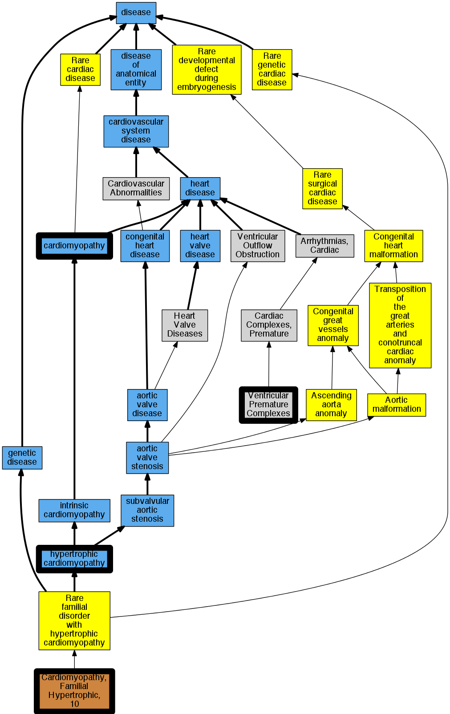

## GENE: MYL2

[matched diseases visual](MYL2.png)  <-- click on raw to zoom

### CARDIOMYOPATHY, FAMILIAL HYPERTROPHIC, 10
 * [OMIM:608758 Cardiomyopathy, Familial Hypertrophic, 10](http://beta.monarchinitiative.org/disease/OMIM:608758) Confidence: high
    * Equiv:[MESH:C563865 Cardiomyopathy, Familial Hypertrophic, 10](http://beta.monarchinitiative.org/disease/MESH:C563865)
    * Syn: "CARDIOMYOPATHY, FAMILIAL HYPERTROPHIC, 10; CMH10"
    * Syn: "Cardiomyopathy, Hypertrophic, Mid-Left Ventricular Chamber Type, 2"
    * Syn: "CMH10"

### Cardiomyopathy
 * [DOID:0050700 cardiomyopathy](http://beta.monarchinitiative.org/disease/DOID:0050700) Confidence: high
    * Equiv:[MESH:D009202 Cardiomyopathies](http://beta.monarchinitiative.org/disease/MESH:D009202)
    * Syn: "Cardiomyopathies"

### Cardiomyopathy, familial hypertrophic, 10
 * [OMIM:608758 Cardiomyopathy, Familial Hypertrophic, 10](http://beta.monarchinitiative.org/disease/OMIM:608758) Confidence: high
    * Equiv:[MESH:C563865 Cardiomyopathy, Familial Hypertrophic, 10](http://beta.monarchinitiative.org/disease/MESH:C563865)
    * Syn: "CARDIOMYOPATHY, FAMILIAL HYPERTROPHIC, 10; CMH10"
    * Syn: "Cardiomyopathy, Hypertrophic, Mid-Left Ventricular Chamber Type, 2"
    * Syn: "CMH10"

### Cardiomyopathy, hypertrophic
 * [DOID:11984 hypertrophic cardiomyopathy](http://beta.monarchinitiative.org/disease/DOID:11984) Confidence: high
    * Equiv:[MESH:D002312 Cardiomyopathy, Hypertrophic](http://beta.monarchinitiative.org/disease/MESH:D002312)
    * Equiv:[MESH:D024741 Cardiomyopathy, Hypertrophic, Familial](http://beta.monarchinitiative.org/disease/MESH:D024741)
    * Syn: "familial hypertrophic cardiomyopathy"
    * Syn: "hypertrophic obstructive cardiomyopathy"

### Hypertrophic Cardiomyopathy
 * [DOID:11984 hypertrophic cardiomyopathy](http://beta.monarchinitiative.org/disease/DOID:11984) Confidence: high
    * Equiv:[MESH:D002312 Cardiomyopathy, Hypertrophic](http://beta.monarchinitiative.org/disease/MESH:D002312)
    * Equiv:[MESH:D024741 Cardiomyopathy, Hypertrophic, Familial](http://beta.monarchinitiative.org/disease/MESH:D024741)
    * Syn: "familial hypertrophic cardiomyopathy"
    * Syn: "hypertrophic obstructive cardiomyopathy"

### Primary familial hypertrophic cardiomyopathy
 * [DOID:11984 hypertrophic cardiomyopathy](http://beta.monarchinitiative.org/disease/DOID:11984) Confidence: low/0.1953125
    * Equiv:[MESH:D002312 Cardiomyopathy, Hypertrophic](http://beta.monarchinitiative.org/disease/MESH:D002312)
    * Equiv:[MESH:D024741 Cardiomyopathy, Hypertrophic, Familial](http://beta.monarchinitiative.org/disease/MESH:D024741)
    * Syn: "familial hypertrophic cardiomyopathy"
    * Syn: "hypertrophic obstructive cardiomyopathy"

### Ventricular extrasystoles
 * [OMIM:115000 Cardiac Complexes, Premature](http://beta.monarchinitiative.org/disease/OMIM:115000) Confidence: low/0.15625
    * Equiv:[MESH:D001145 Arrhythmias, Cardiac](http://beta.monarchinitiative.org/disease/MESH:D001145)
    * Equiv:[MESH:D005117 Cardiac Complexes, Premature](http://beta.monarchinitiative.org/disease/MESH:D005117)
    * Syn: "CARDIAC ARRHYTHMIA"
    * Syn: "Extrasystoles"
