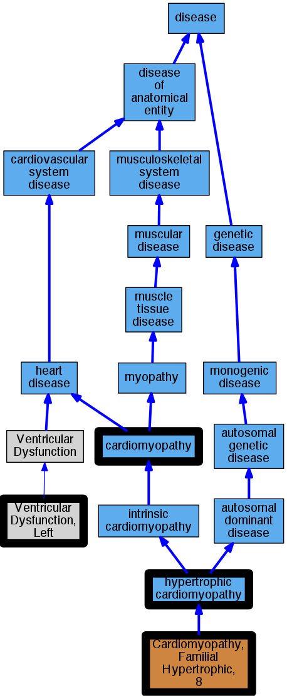

## GENE: MYL3

[matched diseases visual](MYL3.png)  <-- click on raw to zoom

### CARDIOMYOPATHY, FAMILIAL HYPERTROPHIC, 8
 * [OMIM:608751 Cardiomyopathy, Familial Hypertrophic, 8](http://beta.monarchinitiative.org/disease/OMIM:608751) Confidence: high
    * Equiv:[MESH:C563866 Cardiomyopathy, Familial Hypertrophic, 8](http://beta.monarchinitiative.org/disease/MESH:C563866)
    * Syn: "CARDIOMYOPATHY, FAMILIAL HYPERTROPHIC, 8; CMH8"
    * Syn: "Cardiomyopathy, Hypertrophic, Mid-Left Ventricular Chamber Type, 1"
    * Syn: "CMH8"

### Cardiomyopathy
 * [DOID:0050700 cardiomyopathy](http://beta.monarchinitiative.org/disease/DOID:0050700) Confidence: high
    * Equiv:[MESH:D009202 Cardiomyopathies](http://beta.monarchinitiative.org/disease/MESH:D009202)
    * Syn: "Cardiomyopathies"

### Cardiomyopathy, familial hypertrophic, 8
 * [OMIM:608751 Cardiomyopathy, Familial Hypertrophic, 8](http://beta.monarchinitiative.org/disease/OMIM:608751) Confidence: high
    * Equiv:[MESH:C563866 Cardiomyopathy, Familial Hypertrophic, 8](http://beta.monarchinitiative.org/disease/MESH:C563866)
    * Syn: "CARDIOMYOPATHY, FAMILIAL HYPERTROPHIC, 8; CMH8"
    * Syn: "Cardiomyopathy, Hypertrophic, Mid-Left Ventricular Chamber Type, 1"
    * Syn: "CMH8"

### Cardiomyopathy, hypertrophic
 * [DOID:11984 hypertrophic cardiomyopathy](http://beta.monarchinitiative.org/disease/DOID:11984) Confidence: high
    * Equiv:[MESH:D002312 Cardiomyopathy, Hypertrophic](http://beta.monarchinitiative.org/disease/MESH:D002312)
    * Equiv:[MESH:D024741 Cardiomyopathy, Hypertrophic, Familial](http://beta.monarchinitiative.org/disease/MESH:D024741)
    * Syn: "familial hypertrophic cardiomyopathy"
    * Syn: "hypertrophic obstructive cardiomyopathy"

### Hypertrophic Cardiomyopathy
 * [DOID:11984 hypertrophic cardiomyopathy](http://beta.monarchinitiative.org/disease/DOID:11984) Confidence: high
    * Equiv:[MESH:D002312 Cardiomyopathy, Hypertrophic](http://beta.monarchinitiative.org/disease/MESH:D002312)
    * Equiv:[MESH:D024741 Cardiomyopathy, Hypertrophic, Familial](http://beta.monarchinitiative.org/disease/MESH:D024741)
    * Syn: "familial hypertrophic cardiomyopathy"
    * Syn: "hypertrophic obstructive cardiomyopathy"

### Hypertrophic cardiomyopathy
 * [DOID:11984 hypertrophic cardiomyopathy](http://beta.monarchinitiative.org/disease/DOID:11984) Confidence: high
    * Equiv:[MESH:D002312 Cardiomyopathy, Hypertrophic](http://beta.monarchinitiative.org/disease/MESH:D002312)
    * Equiv:[MESH:D024741 Cardiomyopathy, Hypertrophic, Familial](http://beta.monarchinitiative.org/disease/MESH:D024741)
    * Syn: "familial hypertrophic cardiomyopathy"
    * Syn: "hypertrophic obstructive cardiomyopathy"

### Increased left ventricular wall thickness
 * [MESH:D018487 Ventricular Dysfunction, Left](http://beta.monarchinitiative.org/disease/MESH:D018487) Confidence: low/0.10333333333333333

### Primary familial hypertrophic cardiomyopathy
 * [DOID:11984 hypertrophic cardiomyopathy](http://beta.monarchinitiative.org/disease/DOID:11984) Confidence: low/0.1953125
    * Equiv:[MESH:D002312 Cardiomyopathy, Hypertrophic](http://beta.monarchinitiative.org/disease/MESH:D002312)
    * Equiv:[MESH:D024741 Cardiomyopathy, Hypertrophic, Familial](http://beta.monarchinitiative.org/disease/MESH:D024741)
    * Syn: "familial hypertrophic cardiomyopathy"
    * Syn: "hypertrophic obstructive cardiomyopathy"
