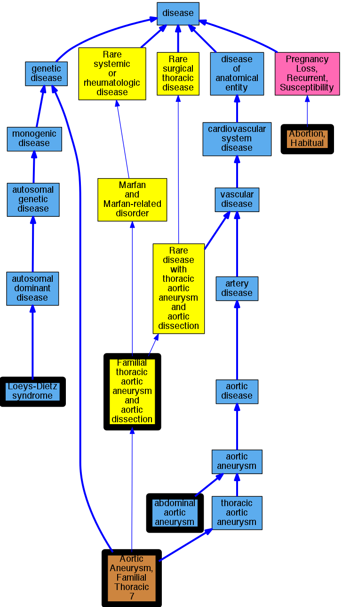

## GENE: MYLK

[matched diseases visual](MYLK.png)  <-- click on raw to zoom

### AORTIC ANEURYSM, FAMILIAL THORACIC 7
 * [OMIM:613780 Aortic Aneurysm, Familial Thoracic 7](http://beta.monarchinitiative.org/disease/OMIM:613780) Confidence: high
    * Syn: "AAT7"
    * Syn: "AORTIC ANEURYSM, FAMILIAL THORACIC 7; AAT7"
    * Syn: "Aortic Dissection, Familial, With or Without Aortic Aneurysm"

### Abdominal aortic aneurysm
 * [DOID:7693 abdominal aortic aneurysm](http://beta.monarchinitiative.org/disease/DOID:7693) Confidence: high
    * Syn: "AORTIC ANEURYSM, FAMILIAL ABDOMINAL 1"

### Loeys-Dietz syndrome
 * [DOID:0050466 Loeys-Dietz syndrome](http://beta.monarchinitiative.org/disease/DOID:0050466) Confidence: high

### Marfanoid habitus
 * [OMIM:614389 Abortion, Habitual](http://beta.monarchinitiative.org/disease/OMIM:614389) Confidence: low/0.09375
    * Equiv:[MESH:D000026 Abortion, Habitual](http://beta.monarchinitiative.org/disease/MESH:D000026)
    * Syn: "Abortion, Spontaneous, Recurrent"
    * Syn: "Embryonic Loss, Recurrent"
    * Syn: "Fetal Loss, Recurrent, Susceptibility to"
    * Syn: "Miscarriage, Recurrent"
    * Syn: "PREGNANCY LOSS, RECURRENT, SUSCEPTIBILITY TO, 1; RPRGL1"
    * Syn: "Rpl"
    * Syn: "Rprgl"
    * Syn: "RPRGL1"
    * Syn: "Stillbirth, Recurrent"

### Thoracic aortic aneurysms and aortic dissections
 * [Orphanet:91387 Familial thoracic aortic aneurysm and aortic dissection](http://beta.monarchinitiative.org/disease/Orphanet:91387) Confidence: low/0.19097222222222224
