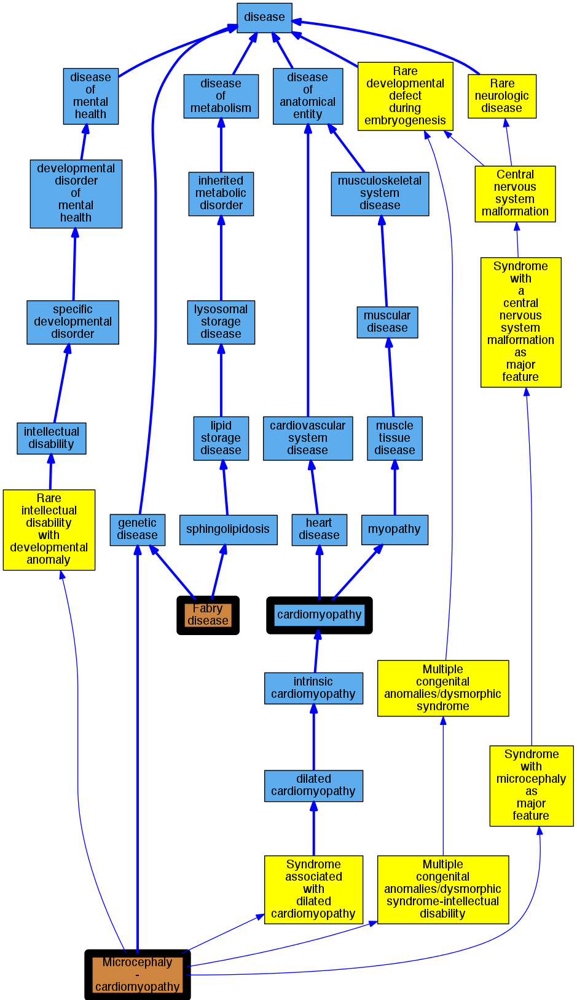

## GENE: MYLK2

[matched diseases visual](MYLK2.png)  <-- click on raw to zoom

### CARDIOMYOPATHY, HYPERTROPHIC, MIDVENTRICULAR, DIGENIC
 * [OMIM:251220 Microcephaly - cardiomyopathy](http://beta.monarchinitiative.org/disease/OMIM:251220) Confidence: low/0.0703125
    * Equiv:[Orphanet:2515 Microcephaly - cardiomyopathy](http://beta.monarchinitiative.org/disease/Orphanet:2515)
    * Syn: "MICROCEPHALY-CARDIOMYOPATHY"

### Cardiomyopathy
 * [DOID:0050700 cardiomyopathy](http://beta.monarchinitiative.org/disease/DOID:0050700) Confidence: high
    * Equiv:[MESH:D009202 Cardiomyopathies](http://beta.monarchinitiative.org/disease/MESH:D009202)
    * Syn: "Cardiomyopathies"

### Fabry''s disease
 * [OMIM:301500 Fabry disease](http://beta.monarchinitiative.org/disease/OMIM:301500) Confidence: high
    * Equiv:[DOID:14499 Fabry disease](http://beta.monarchinitiative.org/disease/DOID:14499)
    * Equiv:[MESH:C567062 Fabry Disease, Cardiac Variant](http://beta.monarchinitiative.org/disease/MESH:C567062)
    * Equiv:[MESH:D000795 Fabry Disease](http://beta.monarchinitiative.org/disease/MESH:D000795)
    * Syn: "alpha galactosidase deficiency"
    * Syn: "Alpha-Galactosidase a Deficiency"
    * Syn: "Alpha-galactosidase A deficiency"
    * Syn: "Anderson-Fabry Disease"
    * Syn: "Angiokeratoma Corporis Diffusum"
    * Syn: "Ceramide Trihexosidase Deficiency"
    * Syn: "deficiency of melibiase"
    * Syn: "FABRY DISEASE"
    * Syn: "Fabry Disease, Cardiac Variant"
    * Syn: "Fabry's disease"
    * Syn: "Fabry's disease (disorder)"
    * Syn: "Gla Deficiency"
    * Syn: "Hereditary Dystopic Lipidosis"
