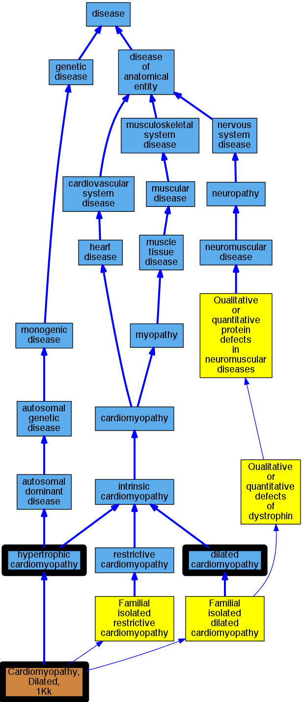

## GENE: MYPN

[matched diseases visual](MYPN.png)  <-- click on raw to zoom

### CARDIOMYOPATHY, DILATED, 1KK
 * [OMIM:615248 Cardiomyopathy, Dilated, 1Kk](http://beta.monarchinitiative.org/disease/OMIM:615248) Confidence: high
    * Syn: "CARDIOMYOPATHY, DILATED, 1KK; CMD1KK"
    * Syn: "Cardiomyopathy, Familial Hypertrophic, 22"
    * Syn: "Cardiomyopathy, Familial Restrictive, 4"
    * Syn: "CMD1KK"

### CARDIOMYOPATHY, FAMILIAL HYPERTROPHIC, 22
 * [OMIM:615248 Cardiomyopathy, Dilated, 1Kk](http://beta.monarchinitiative.org/disease/OMIM:615248) Confidence: high
    * Syn: "CARDIOMYOPATHY, DILATED, 1KK; CMD1KK"
    * Syn: "Cardiomyopathy, Familial Hypertrophic, 22"
    * Syn: "Cardiomyopathy, Familial Restrictive, 4"
    * Syn: "CMD1KK"

### CARDIOMYOPATHY, FAMILIAL RESTRICTIVE, 4
 * [OMIM:615248 Cardiomyopathy, Dilated, 1Kk](http://beta.monarchinitiative.org/disease/OMIM:615248) Confidence: high
    * Syn: "CARDIOMYOPATHY, DILATED, 1KK; CMD1KK"
    * Syn: "Cardiomyopathy, Familial Hypertrophic, 22"
    * Syn: "Cardiomyopathy, Familial Restrictive, 4"
    * Syn: "CMD1KK"

### Cardiomyopathy, dilated
 * [DOID:12930 dilated cardiomyopathy](http://beta.monarchinitiative.org/disease/DOID:12930) Confidence: high
    * Syn: "Congestive cardiomyopathy"
    * Syn: "Familial dilated cardiomyopathy"
    * Syn: "Idiopathic dilation cardiomyopathy"
    * Syn: "primary dilated cardiomyopathy"

### Primary dilated cardiomyopathy
 * [DOID:12930 dilated cardiomyopathy](http://beta.monarchinitiative.org/disease/DOID:12930) Confidence: high
    * Syn: "Congestive cardiomyopathy"
    * Syn: "Familial dilated cardiomyopathy"
    * Syn: "Idiopathic dilation cardiomyopathy"
    * Syn: "primary dilated cardiomyopathy"

### Primary familial hypertrophic cardiomyopathy
 * [DOID:11984 hypertrophic cardiomyopathy](http://beta.monarchinitiative.org/disease/DOID:11984) Confidence: low/0.1953125
    * Equiv:[MESH:D002312 Cardiomyopathy, Hypertrophic](http://beta.monarchinitiative.org/disease/MESH:D002312)
    * Equiv:[MESH:D024741 Cardiomyopathy, Hypertrophic, Familial](http://beta.monarchinitiative.org/disease/MESH:D024741)
    * Syn: "familial hypertrophic cardiomyopathy"
    * Syn: "hypertrophic obstructive cardiomyopathy"
