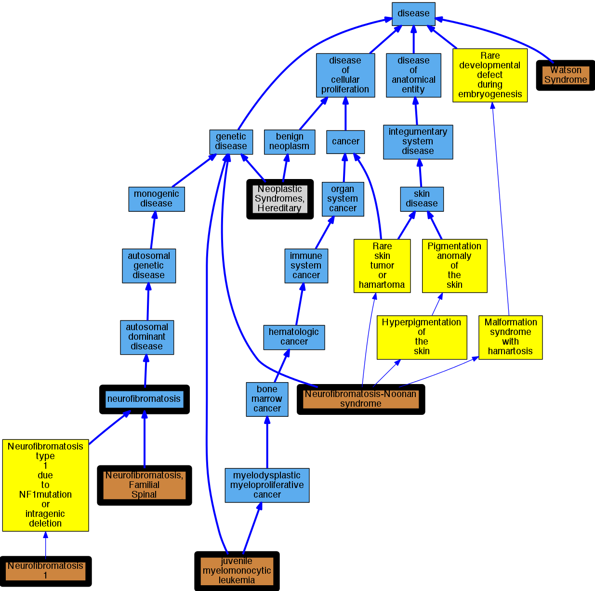

## GENE: NF1

[matched diseases visual](NF1.png)  <-- click on raw to zoom

### LEUKEMIA, JUVENILE MYELOMONOCYTIC
 * [OMIM:607785 juvenile myelomonocytic leukemia](http://beta.monarchinitiative.org/disease/OMIM:607785) Confidence: high
    * Equiv:[Orphanet:86834 Juvenile myelomonocytic leukemia](http://beta.monarchinitiative.org/disease/Orphanet:86834)
    * Equiv:[DOID:0050458 juvenile myelomonocytic leukemia](http://beta.monarchinitiative.org/disease/DOID:0050458)
    * Equiv:[MESH:D054429 Leukemia, Myelomonocytic, Juvenile](http://beta.monarchinitiative.org/disease/MESH:D054429)
    * Syn: "JMML"
    * Syn: "Juvenile Chronic Myelogenous Leukemia"
    * Syn: "Juvenile chronic myelomonocytic leukemia"
    * Syn: "Juvenile Myelomonocytic Leukemia"
    * Syn: "JUVENILE MYELOMONOCYTIC LEUKEMIA; JMML"
    * Syn: "Juvenile Myelomonocytic Leukemias"
    * Syn: "Leukemia, Chronic Myelomonocytic"
    * Syn: "Leukemia, Juvenile Myelomonocytic"
    * Syn: "Myelomonocytic Leukemia, Juvenile"
    * Syn: "Myelomonocytic Leukemias, Juvenile"

### NEUROFIBROMATOSIS, TYPE I
 * [OMIM:162200 Neurofibromatosis type 1](http://beta.monarchinitiative.org/disease/OMIM:162200) Confidence: high
    * Equiv:[MESH:D009456 Neurofibromatosis 1](http://beta.monarchinitiative.org/disease/MESH:D009456)
    * Syn: "Cafe au Lait Spots with Pulmonic Stenosis"
    * Syn: "Cafe-au-Lait Spots with Pulmonic Stenosis"
    * Syn: "I, Neurofibromatosis Type"
    * Syn: "Molluscum Fibrosum"
    * Syn: "Neurofibromatoses, Peripheral"
    * Syn: "Neurofibromatoses, Type I"
    * Syn: "Neurofibromatosis I"
    * Syn: "Neurofibromatosis Type 1"
    * Syn: "Neurofibromatosis Type I"
    * Syn: "Neurofibromatosis, Peripheral"
    * Syn: "Neurofibromatosis, Peripheral Type"
    * Syn: "Neurofibromatosis, Peripheral, NF 1"
    * Syn: "Neurofibromatosis, Peripheral, NF1"
    * Syn: "Neurofibromatosis, Type 1"
    * Syn: "Neurofibromatosis, Type I"
    * Syn: "NEUROFIBROMATOSIS, TYPE I; NF1"
    * Syn: "NF1"
    * Syn: "NF1"
    * Syn: "NF1 (Neurofibromatosis 1)"
    * Syn: "Peripheral Neurofibromatoses"
    * Syn: "Peripheral Neurofibromatosis"
    * Syn: "Pulmonic Stenosis with Cafe au Lait Spots"
    * Syn: "Pulmonic Stenosis with Cafe-au-Lait Spots"
    * Syn: "Recklinghausen Disease of Nerve"
    * Syn: "Recklinghausen Disease, Nerve"
    * Syn: "Recklinghausen's Disease of Nerve"
    * Syn: "Recklinghausens Disease of Nerve"
    * Syn: "Syndrome, Watson"
    * Syn: "Type 1 Neurofibromatosis"
    * Syn: "Type 1, Neurofibromatosis"
    * Syn: "Type I Neurofibromatoses"
    * Syn: "Type I, Neurofibromatosis"
    * Syn: "Von Recklinghausen Disease"
    * Syn: "Von Recklinghausen disease"
    * Syn: "von Recklinghausen Disease"
    * Syn: "von Recklinghausen's Disease"
    * Syn: "von Recklinghausens Disease"
    * Syn: "Watson Syndrome"

### NEUROFIBROMATOSIS-NOONAN SYNDROME
 * [OMIM:601321 Neurofibromatosis-Noonan syndrome](http://beta.monarchinitiative.org/disease/OMIM:601321) Confidence: high
    * Equiv:[Orphanet:638 Neurofibromatosis-Noonan syndrome](http://beta.monarchinitiative.org/disease/Orphanet:638)
    * Equiv:[MESH:C537393 Neurofibromatosis-Noonan syndrome](http://beta.monarchinitiative.org/disease/MESH:C537393)
    * Syn: "Neurofibromatosis type 1-Noonan syndrome"
    * Syn: "Neurofibromatosis With Noonan Phenotype"
    * Syn: "Neurofibromatosis with Noonan phenotype"
    * Syn: "NEUROFIBROMATOSIS-NOONAN SYNDROME; NFNS"
    * Syn: "NFNS"
    * Syn: "NFNS"
    * Syn: "Noonan neurofibromatosis syndrome"
    * Syn: "Noonan-Neurofibromatosis Syndrome"

### Neurofibromatosis, type 1
 * [OMIM:162200 Neurofibromatosis type 1](http://beta.monarchinitiative.org/disease/OMIM:162200) Confidence: high
    * Equiv:[MESH:D009456 Neurofibromatosis 1](http://beta.monarchinitiative.org/disease/MESH:D009456)
    * Syn: "Cafe au Lait Spots with Pulmonic Stenosis"
    * Syn: "Cafe-au-Lait Spots with Pulmonic Stenosis"
    * Syn: "I, Neurofibromatosis Type"
    * Syn: "Molluscum Fibrosum"
    * Syn: "Neurofibromatoses, Peripheral"
    * Syn: "Neurofibromatoses, Type I"
    * Syn: "Neurofibromatosis I"
    * Syn: "Neurofibromatosis Type 1"
    * Syn: "Neurofibromatosis Type I"
    * Syn: "Neurofibromatosis, Peripheral"
    * Syn: "Neurofibromatosis, Peripheral Type"
    * Syn: "Neurofibromatosis, Peripheral, NF 1"
    * Syn: "Neurofibromatosis, Peripheral, NF1"
    * Syn: "Neurofibromatosis, Type 1"
    * Syn: "Neurofibromatosis, Type I"
    * Syn: "NEUROFIBROMATOSIS, TYPE I; NF1"
    * Syn: "NF1"
    * Syn: "NF1"
    * Syn: "NF1 (Neurofibromatosis 1)"
    * Syn: "Peripheral Neurofibromatoses"
    * Syn: "Peripheral Neurofibromatosis"
    * Syn: "Pulmonic Stenosis with Cafe au Lait Spots"
    * Syn: "Pulmonic Stenosis with Cafe-au-Lait Spots"
    * Syn: "Recklinghausen Disease of Nerve"
    * Syn: "Recklinghausen Disease, Nerve"
    * Syn: "Recklinghausen's Disease of Nerve"
    * Syn: "Recklinghausens Disease of Nerve"
    * Syn: "Syndrome, Watson"
    * Syn: "Type 1 Neurofibromatosis"
    * Syn: "Type 1, Neurofibromatosis"
    * Syn: "Type I Neurofibromatoses"
    * Syn: "Type I, Neurofibromatosis"
    * Syn: "Von Recklinghausen Disease"
    * Syn: "Von Recklinghausen disease"
    * Syn: "von Recklinghausen Disease"
    * Syn: "von Recklinghausen's Disease"
    * Syn: "von Recklinghausens Disease"
    * Syn: "Watson Syndrome"

### WATSON SYNDROME
 * [OMIM:193520 Watson Syndrome](http://beta.monarchinitiative.org/disease/OMIM:193520) Confidence: high
    * Syn: "Cafe-Au-Lait Spots With Pulmonic Stenosis"
    * Syn: "Pulmonic Stenosis With Cafe-Au-Lait Spots"
    * Syn: "WATSON SYNDROME; WTSN"
    * Syn: "WTSN"

### NEUROFIBROMATOSIS TYPE 1
 * [OMIM:162200 Neurofibromatosis type 1](http://beta.monarchinitiative.org/disease/OMIM:162200) Confidence: high
    * Equiv:[MESH:D009456 Neurofibromatosis 1](http://beta.monarchinitiative.org/disease/MESH:D009456)
    * Syn: "Cafe au Lait Spots with Pulmonic Stenosis"
    * Syn: "Cafe-au-Lait Spots with Pulmonic Stenosis"
    * Syn: "I, Neurofibromatosis Type"
    * Syn: "Molluscum Fibrosum"
    * Syn: "Neurofibromatoses, Peripheral"
    * Syn: "Neurofibromatoses, Type I"
    * Syn: "Neurofibromatosis I"
    * Syn: "Neurofibromatosis Type 1"
    * Syn: "Neurofibromatosis Type I"
    * Syn: "Neurofibromatosis, Peripheral"
    * Syn: "Neurofibromatosis, Peripheral Type"
    * Syn: "Neurofibromatosis, Peripheral, NF 1"
    * Syn: "Neurofibromatosis, Peripheral, NF1"
    * Syn: "Neurofibromatosis, Type 1"
    * Syn: "Neurofibromatosis, Type I"
    * Syn: "NEUROFIBROMATOSIS, TYPE I; NF1"
    * Syn: "NF1"
    * Syn: "NF1"
    * Syn: "NF1 (Neurofibromatosis 1)"
    * Syn: "Peripheral Neurofibromatoses"
    * Syn: "Peripheral Neurofibromatosis"
    * Syn: "Pulmonic Stenosis with Cafe au Lait Spots"
    * Syn: "Pulmonic Stenosis with Cafe-au-Lait Spots"
    * Syn: "Recklinghausen Disease of Nerve"
    * Syn: "Recklinghausen Disease, Nerve"
    * Syn: "Recklinghausen's Disease of Nerve"
    * Syn: "Recklinghausens Disease of Nerve"
    * Syn: "Syndrome, Watson"
    * Syn: "Type 1 Neurofibromatosis"
    * Syn: "Type 1, Neurofibromatosis"
    * Syn: "Type I Neurofibromatoses"
    * Syn: "Type I, Neurofibromatosis"
    * Syn: "Von Recklinghausen Disease"
    * Syn: "Von Recklinghausen disease"
    * Syn: "von Recklinghausen Disease"
    * Syn: "von Recklinghausen's Disease"
    * Syn: "von Recklinghausens Disease"
    * Syn: "Watson Syndrome"

### NEUROFIBROMATOSIS, FAMILIAL SPINAL
 * [OMIM:162210 Neurofibromatosis, Familial Spinal](http://beta.monarchinitiative.org/disease/OMIM:162210) Confidence: high
    * Equiv:[MESH:C563523 Neurofibromatosis, Familial Spinal](http://beta.monarchinitiative.org/disease/MESH:C563523)
    * Syn: "Fsnf"
    * Syn: "NEUROFIBROMATOSIS, FAMILIAL SPINAL"

### Neoplastic Syndromes, Hereditary
 * [MESH:D009386 Neoplastic Syndromes, Hereditary](http://beta.monarchinitiative.org/disease/MESH:D009386) Confidence: high
    * Syn: "Cancer Syndrome, Hereditary"
    * Syn: "Cancer Syndromes, Hereditary"
    * Syn: "Hereditary Cancer Syndrome"
    * Syn: "Hereditary Cancer Syndromes"
    * Syn: "Hereditary Neoplastic Syndrome"
    * Syn: "Hereditary Neoplastic Syndromes"
    * Syn: "Neoplastic Syndrome, Hereditary"
    * Syn: "Syndrome, Hereditary Cancer"
    * Syn: "Syndrome, Hereditary Neoplastic"
    * Syn: "Syndromes, Hereditary Cancer"
    * Syn: "Syndromes, Hereditary Neoplastic"
