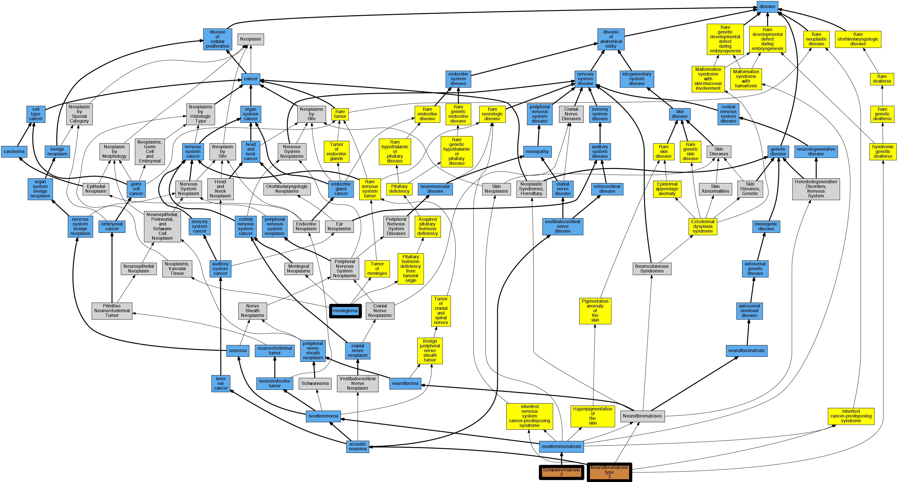

## GENE: NF2

[matched diseases visual](NF2.png)  <-- click on raw to zoom

### MENINGIOMA, SOMATIC
 * [MESH:D008579 Meningioma](http://beta.monarchinitiative.org/disease/MESH:D008579) Confidence: low/0.15625

### NEUROFIBROMATOSIS, TYPE II
 * [OMIM:101000 Neurofibromatosis 2](http://beta.monarchinitiative.org/disease/OMIM:101000) Confidence: low/0.1640625
    * Equiv:[MESH:D016518 Neurofibromatosis 2](http://beta.monarchinitiative.org/disease/MESH:D016518)
    * Syn: "Acoustic Neurinoma, Bilateral"
    * Syn: "Acoustic Schwannomas, Bilateral"
    * Syn: "Bilateral Acoustic Neurofibromatosis"
    * Syn: "Neurofibromatosis, Central Type"
    * Syn: "NEUROFIBROMATOSIS, TYPE II; NF2"
    * Syn: "NF2"

### SCHWANNOMATOSIS, SOMATIC
 * [OMIM:615670 Schwannomatosis 2](http://beta.monarchinitiative.org/disease/OMIM:615670) Confidence: low/0.05555555555555555
    * Syn: "SCHWANNOMATOSIS 2; SWNTS2"
    * Syn: "SWNTS2"
