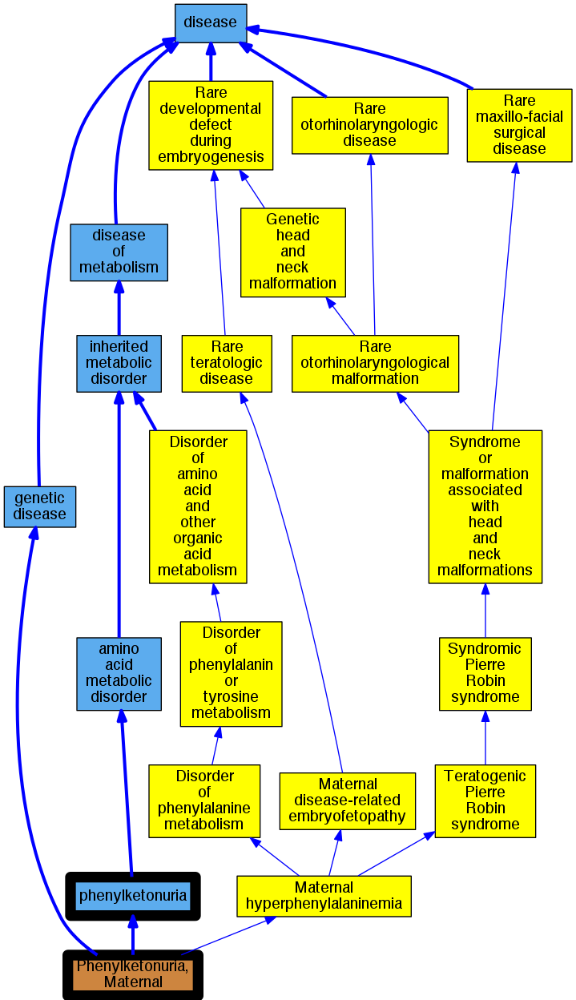

## GENE: PAH

[matched diseases visual](PAH.png)  <-- click on raw to zoom

### HYPERPHENYLALANINEMIA, NON-PKU
 * [MESH:C567494 Hyperphenylalaninemia, Non-Pku Mild](http://beta.monarchinitiative.org/disease/MESH:C567494) Confidence: low/0.1640625

### HYPERPHENYLALANINEMIA, NON-PKU MILD
 * [MESH:C567494 Hyperphenylalaninemia, Non-Pku Mild](http://beta.monarchinitiative.org/disease/MESH:C567494) Confidence: high

### Hyperphenylalaninaemia
 * [OMIM:261600 phenylketonuria](http://beta.monarchinitiative.org/disease/OMIM:261600) Confidence: high
    * Equiv:[Orphanet:716 Phenylketonuria](http://beta.monarchinitiative.org/disease/Orphanet:716)
    * Equiv:[DOID:9281 phenylketonuria](http://beta.monarchinitiative.org/disease/DOID:9281)
    * Equiv:[MESH:D010661 Phenylketonurias](http://beta.monarchinitiative.org/disease/MESH:D010661)
    * Syn: "Atypical Phenylketonuria"
    * Syn: "Atypical PKU"
    * Syn: "BH4 Deficiency"
    * Syn: "Classical Phenylketonuria"
    * Syn: "Deficiency Disease, Dihydropteridine Reductase"
    * Syn: "Deficiency Disease, Phenylalanine Hydroxylase"
    * Syn: "Deficiency Disease, Phenylalanine Hydroxylase, Severe"
    * Syn: "Deficiency, BH4"
    * Syn: "Deficiency, DHPR"
    * Syn: "Deficiency, Dihydropteridine Reductase"
    * Syn: "Deficiency, PAH"
    * Syn: "Deficiency, Phenylalanine Hydroxylase"
    * Syn: "Deficiency, QDPR"
    * Syn: "Deficiency, Tetrahydrobiopterin"
    * Syn: "DHPR Deficiency"
    * Syn: "Dihydropteridine Reductase Deficiency"
    * Syn: "Dihydropteridine Reductase Deficiency Disease"
    * Syn: "Disease, Folling"
    * Syn: "Disease, Folling's"
    * Syn: "Folling Disease"
    * Syn: "Folling's Disease"
    * Syn: "FC8lling's disease"
    * Syn: "Hpa, Non-Pku Mild"
    * Syn: "Hyperphenylalaninaemia"
    * Syn: "Hyperphenylalaninemia Caused by a Defect in Biopterin Metabolism"
    * Syn: "Hyperphenylalaninemia, BH4-Deficient, C"
    * Syn: "Hyperphenylalaninemia, Non Phenylketonuric"
    * Syn: "Hyperphenylalaninemia, Non-Phenylketonuric"
    * Syn: "Hyperphenylalaninemia, Non-Pku Mild"
    * Syn: "Hyperphenylalaninemia, Tetrahydrobiopterin-Deficient, Due To DHPR Deficiency"
    * Syn: "maternal phenylketonuria"
    * Syn: "Non Phenylketonuric Hyperphenylalaninemia"
    * Syn: "Non-Phenylketonuric Hyperphenylalaninemia"
    * Syn: "Non-Phenylketonuric Hyperphenylalaninemias"
    * Syn: "Oligophrenia Phenylpyruvica"
    * Syn: "PAH Deficiency"
    * Syn: "PAH deficiency"
    * Syn: "Pah Deficiency"
    * Syn: "Phenylalanine Hydroxylase Deficiency"
    * Syn: "Phenylalanine hydroxylase deficiency"
    * Syn: "Phenylalanine Hydroxylase Deficiency Disease"
    * Syn: "Phenylalanine Hydroxylase Deficiency Disease, Severe"
    * Syn: "phenylalaninemia"
    * Syn: "Phenylketonuria"
    * Syn: "Phenylketonuria I"
    * Syn: "Phenylketonuria II"
    * Syn: "Phenylketonuria Type 2"
    * Syn: "Phenylketonuria, Atypical"
    * Syn: "Phenylketonuria, Classical"
    * Syn: "Phenylketonuria, Maternal"
    * Syn: "PHENYLKETONURIA; PKU"
    * Syn: "PKU"
    * Syn: "PKU"
    * Syn: "PKU, Atypical"
    * Syn: "QDPR Deficiency"
    * Syn: "Quinoid Dihydropteridine Reductase Deficiency"
    * Syn: "Tetrahydrobiopterin Deficiency"

### PHENYLKETONURIA
 * [OMIM:261600 phenylketonuria](http://beta.monarchinitiative.org/disease/OMIM:261600) Confidence: high
    * Equiv:[Orphanet:716 Phenylketonuria](http://beta.monarchinitiative.org/disease/Orphanet:716)
    * Equiv:[DOID:9281 phenylketonuria](http://beta.monarchinitiative.org/disease/DOID:9281)
    * Equiv:[MESH:D010661 Phenylketonurias](http://beta.monarchinitiative.org/disease/MESH:D010661)
    * Syn: "Atypical Phenylketonuria"
    * Syn: "Atypical PKU"
    * Syn: "BH4 Deficiency"
    * Syn: "Classical Phenylketonuria"
    * Syn: "Deficiency Disease, Dihydropteridine Reductase"
    * Syn: "Deficiency Disease, Phenylalanine Hydroxylase"
    * Syn: "Deficiency Disease, Phenylalanine Hydroxylase, Severe"
    * Syn: "Deficiency, BH4"
    * Syn: "Deficiency, DHPR"
    * Syn: "Deficiency, Dihydropteridine Reductase"
    * Syn: "Deficiency, PAH"
    * Syn: "Deficiency, Phenylalanine Hydroxylase"
    * Syn: "Deficiency, QDPR"
    * Syn: "Deficiency, Tetrahydrobiopterin"
    * Syn: "DHPR Deficiency"
    * Syn: "Dihydropteridine Reductase Deficiency"
    * Syn: "Dihydropteridine Reductase Deficiency Disease"
    * Syn: "Disease, Folling"
    * Syn: "Disease, Folling's"
    * Syn: "Folling Disease"
    * Syn: "Folling's Disease"
    * Syn: "FC8lling's disease"
    * Syn: "Hpa, Non-Pku Mild"
    * Syn: "Hyperphenylalaninaemia"
    * Syn: "Hyperphenylalaninemia Caused by a Defect in Biopterin Metabolism"
    * Syn: "Hyperphenylalaninemia, BH4-Deficient, C"
    * Syn: "Hyperphenylalaninemia, Non Phenylketonuric"
    * Syn: "Hyperphenylalaninemia, Non-Phenylketonuric"
    * Syn: "Hyperphenylalaninemia, Non-Pku Mild"
    * Syn: "Hyperphenylalaninemia, Tetrahydrobiopterin-Deficient, Due To DHPR Deficiency"
    * Syn: "maternal phenylketonuria"
    * Syn: "Non Phenylketonuric Hyperphenylalaninemia"
    * Syn: "Non-Phenylketonuric Hyperphenylalaninemia"
    * Syn: "Non-Phenylketonuric Hyperphenylalaninemias"
    * Syn: "Oligophrenia Phenylpyruvica"
    * Syn: "PAH Deficiency"
    * Syn: "PAH deficiency"
    * Syn: "Pah Deficiency"
    * Syn: "Phenylalanine Hydroxylase Deficiency"
    * Syn: "Phenylalanine hydroxylase deficiency"
    * Syn: "Phenylalanine Hydroxylase Deficiency Disease"
    * Syn: "Phenylalanine Hydroxylase Deficiency Disease, Severe"
    * Syn: "phenylalaninemia"
    * Syn: "Phenylketonuria"
    * Syn: "Phenylketonuria I"
    * Syn: "Phenylketonuria II"
    * Syn: "Phenylketonuria Type 2"
    * Syn: "Phenylketonuria, Atypical"
    * Syn: "Phenylketonuria, Classical"
    * Syn: "Phenylketonuria, Maternal"
    * Syn: "PHENYLKETONURIA; PKU"
    * Syn: "PKU"
    * Syn: "PKU"
    * Syn: "PKU, Atypical"
    * Syn: "QDPR Deficiency"
    * Syn: "Quinoid Dihydropteridine Reductase Deficiency"
    * Syn: "Tetrahydrobiopterin Deficiency"

### Phenylketonuria
 * [OMIM:261600 phenylketonuria](http://beta.monarchinitiative.org/disease/OMIM:261600) Confidence: high
    * Equiv:[Orphanet:716 Phenylketonuria](http://beta.monarchinitiative.org/disease/Orphanet:716)
    * Equiv:[DOID:9281 phenylketonuria](http://beta.monarchinitiative.org/disease/DOID:9281)
    * Equiv:[MESH:D010661 Phenylketonurias](http://beta.monarchinitiative.org/disease/MESH:D010661)
    * Syn: "Atypical Phenylketonuria"
    * Syn: "Atypical PKU"
    * Syn: "BH4 Deficiency"
    * Syn: "Classical Phenylketonuria"
    * Syn: "Deficiency Disease, Dihydropteridine Reductase"
    * Syn: "Deficiency Disease, Phenylalanine Hydroxylase"
    * Syn: "Deficiency Disease, Phenylalanine Hydroxylase, Severe"
    * Syn: "Deficiency, BH4"
    * Syn: "Deficiency, DHPR"
    * Syn: "Deficiency, Dihydropteridine Reductase"
    * Syn: "Deficiency, PAH"
    * Syn: "Deficiency, Phenylalanine Hydroxylase"
    * Syn: "Deficiency, QDPR"
    * Syn: "Deficiency, Tetrahydrobiopterin"
    * Syn: "DHPR Deficiency"
    * Syn: "Dihydropteridine Reductase Deficiency"
    * Syn: "Dihydropteridine Reductase Deficiency Disease"
    * Syn: "Disease, Folling"
    * Syn: "Disease, Folling's"
    * Syn: "Folling Disease"
    * Syn: "Folling's Disease"
    * Syn: "FC8lling's disease"
    * Syn: "Hpa, Non-Pku Mild"
    * Syn: "Hyperphenylalaninaemia"
    * Syn: "Hyperphenylalaninemia Caused by a Defect in Biopterin Metabolism"
    * Syn: "Hyperphenylalaninemia, BH4-Deficient, C"
    * Syn: "Hyperphenylalaninemia, Non Phenylketonuric"
    * Syn: "Hyperphenylalaninemia, Non-Phenylketonuric"
    * Syn: "Hyperphenylalaninemia, Non-Pku Mild"
    * Syn: "Hyperphenylalaninemia, Tetrahydrobiopterin-Deficient, Due To DHPR Deficiency"
    * Syn: "maternal phenylketonuria"
    * Syn: "Non Phenylketonuric Hyperphenylalaninemia"
    * Syn: "Non-Phenylketonuric Hyperphenylalaninemia"
    * Syn: "Non-Phenylketonuric Hyperphenylalaninemias"
    * Syn: "Oligophrenia Phenylpyruvica"
    * Syn: "PAH Deficiency"
    * Syn: "PAH deficiency"
    * Syn: "Pah Deficiency"
    * Syn: "Phenylalanine Hydroxylase Deficiency"
    * Syn: "Phenylalanine hydroxylase deficiency"
    * Syn: "Phenylalanine Hydroxylase Deficiency Disease"
    * Syn: "Phenylalanine Hydroxylase Deficiency Disease, Severe"
    * Syn: "phenylalaninemia"
    * Syn: "Phenylketonuria"
    * Syn: "Phenylketonuria I"
    * Syn: "Phenylketonuria II"
    * Syn: "Phenylketonuria Type 2"
    * Syn: "Phenylketonuria, Atypical"
    * Syn: "Phenylketonuria, Classical"
    * Syn: "Phenylketonuria, Maternal"
    * Syn: "PHENYLKETONURIA; PKU"
    * Syn: "PKU"
    * Syn: "PKU"
    * Syn: "PKU, Atypical"
    * Syn: "QDPR Deficiency"
    * Syn: "Quinoid Dihydropteridine Reductase Deficiency"
    * Syn: "Tetrahydrobiopterin Deficiency"
