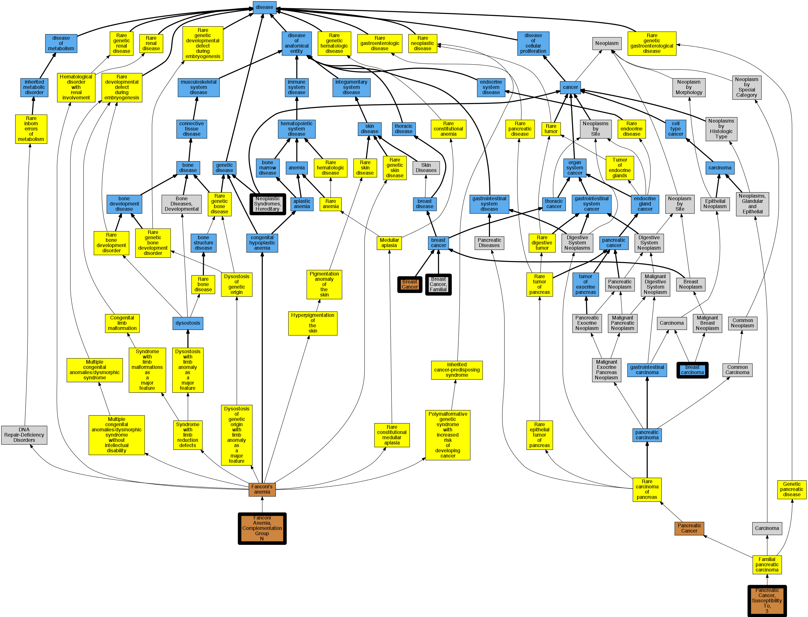

## GENE: PALB2

[matched diseases visual](PALB2.png)  <-- click on raw to zoom

### FANCONI ANEMIA, COMPLEMENTATION GROUP N
 * [OMIM:610832 Fanconi Anemia, Complementation Group N](http://beta.monarchinitiative.org/disease/OMIM:610832) Confidence: high
    * Equiv:[MESH:C563657 Fanconi Anemia, Complementation Group N](http://beta.monarchinitiative.org/disease/MESH:C563657)
    * Syn: "FANCN"
    * Syn: "FANCONI ANEMIA, COMPLEMENTATION GROUP N; FANCN"

### Familial cancer of breast
 * [MESH:C562840 Breast Cancer, Familial](http://beta.monarchinitiative.org/disease/MESH:C562840) Confidence: high

### BREAST CANCER, SUSCEPTIBILITY TO
 * [OMIM:114480 Breast Cancer](http://beta.monarchinitiative.org/disease/OMIM:114480) Confidence: low/0.15625
    * Syn: "BREAST CANCER"
    * Syn: "Breast Cancer, Familial"
    * Syn: "Breast Cancer, Familial Male"

### Breast carcinoma
 * [DOID:3459 breast carcinoma](http://beta.monarchinitiative.org/disease/DOID:3459) Confidence: high
    * Syn: "carcinoma OF breast"
    * Syn: "carcinoma of breast"
    * Syn: "carcinoma of breast (disorder)"
    * Syn: "carcinoma of breast NOS (disorder)"
    * Syn: "Mammary carcinoma"

### Neoplastic Syndromes, Hereditary
 * [MESH:D009386 Neoplastic Syndromes, Hereditary](http://beta.monarchinitiative.org/disease/MESH:D009386) Confidence: high
    * Syn: "Cancer Syndrome, Hereditary"
    * Syn: "Cancer Syndromes, Hereditary"
    * Syn: "Hereditary Cancer Syndrome"
    * Syn: "Hereditary Cancer Syndromes"
    * Syn: "Hereditary Neoplastic Syndrome"
    * Syn: "Hereditary Neoplastic Syndromes"
    * Syn: "Neoplastic Syndrome, Hereditary"
    * Syn: "Syndrome, Hereditary Cancer"
    * Syn: "Syndrome, Hereditary Neoplastic"
    * Syn: "Syndromes, Hereditary Cancer"
    * Syn: "Syndromes, Hereditary Neoplastic"

### PANCREATIC CANCER, SUSCEPTIBILITY TO, 3
 * [OMIM:613348 Pancreatic Cancer, Susceptibility To, 3](http://beta.monarchinitiative.org/disease/OMIM:613348) Confidence: high
    * Syn: "PANCREATIC CANCER, SUSCEPTIBILITY TO, 3"
    * Syn: "Pnca3"
