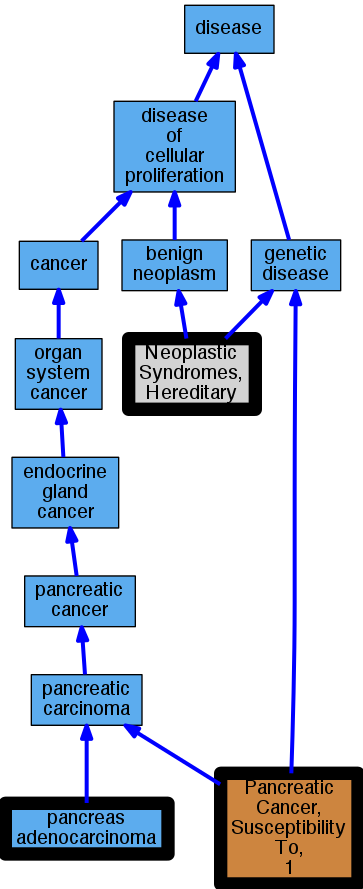

## GENE: PALLD

[matched diseases visual](PALLD.png)  <-- click on raw to zoom

### Neoplastic Syndromes, Hereditary
 * [MESH:D009386 Neoplastic Syndromes, Hereditary](http://beta.monarchinitiative.org/disease/MESH:D009386) Confidence: high
    * Syn: "Cancer Syndrome, Hereditary"
    * Syn: "Cancer Syndromes, Hereditary"
    * Syn: "Hereditary Cancer Syndrome"
    * Syn: "Hereditary Cancer Syndromes"
    * Syn: "Hereditary Neoplastic Syndrome"
    * Syn: "Hereditary Neoplastic Syndromes"
    * Syn: "Neoplastic Syndrome, Hereditary"
    * Syn: "Syndrome, Hereditary Cancer"
    * Syn: "Syndrome, Hereditary Neoplastic"
    * Syn: "Syndromes, Hereditary Cancer"
    * Syn: "Syndromes, Hereditary Neoplastic"

### Pancreatic adenocarcinoma
 * [DOID:4074 pancreas adenocarcinoma](http://beta.monarchinitiative.org/disease/DOID:4074) Confidence: high
    * Syn: "adenocarcinoma of the pancreas"
    * Syn: "pancreatic adenocarcinoma"

### PANCREATIC CANCER, SUSCEPTIBILITY TO, 1
 * [OMIM:606856 Pancreatic Cancer, Susceptibility To, 1](http://beta.monarchinitiative.org/disease/OMIM:606856) Confidence: high
    * Syn: "PANCREATIC CANCER, SUSCEPTIBILITY TO, 1"
    * Syn: "Pnca1"

### Pancreatic adenocarcinoma
 * [DOID:4074 pancreas adenocarcinoma](http://beta.monarchinitiative.org/disease/DOID:4074) Confidence: high
    * Syn: "adenocarcinoma of the pancreas"
    * Syn: "pancreatic adenocarcinoma"
