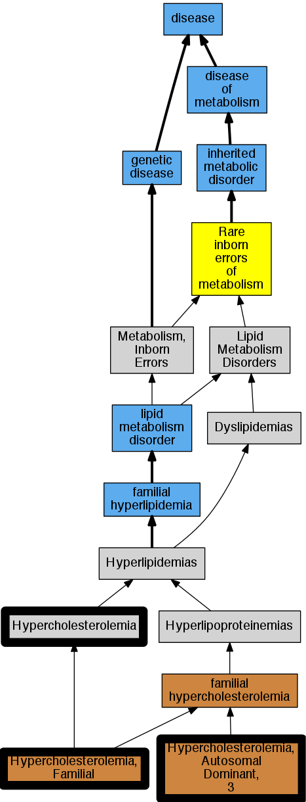

## GENE: PCSK9

[matched diseases visual](PCSK9.png)  <-- click on raw to zoom

### Familial Hypercholesterolemia
 * [DOID:13810 familial hypercholesterolemia](http://beta.monarchinitiative.org/disease/DOID:13810) Confidence: high
    * Syn: "familial hyperbetalipoproteinaemia"
    * Syn: "familial hypercholesteremia"
    * Syn: "Fredrickson type IIa hyperlipoproteinemia"
    * Syn: "Fredrickson type IIa lipidaemia"
    * Syn: "hyperbetalipoproteinemia"
    * Syn: "type II hyperlipidemia"

### HYPERCHOLESTEROLEMIA, FAMILIAL, 3
 * [OMIM:143890 Hypercholesterolemia](http://beta.monarchinitiative.org/disease/OMIM:143890) Confidence: low/0.18055555555555555
    * Equiv:[MESH:D006937 Hypercholesterolemia](http://beta.monarchinitiative.org/disease/MESH:D006937)
    * Syn: "Fhc"
    * Syn: "Hyper-Low-Density-Lipoproteinemia"
    * Syn: "HYPERCHOLESTEROLEMIA, FAMILIAL"
    * Syn: "Hypercholesterolemic Xanthomatosis, Familial"
    * Syn: "Hyperlipoproteinemia, Type 2"
    * Syn: "Hyperlipoproteinemia, Type 2A"
    * Syn: "Ldl Receptor Disorder"
    * Syn: "Low Density Lipoprotein Cholesterol Level Quantitative Trait Locus 2"

### LOW DENSITY LIPOPROTEIN CHOLESTEROL LEVEL QUANTITATIVE TRAIT LOCUS 1
 * [OMIM:603776 Hypercholesterolemia, Autosomal Dominant, 3](http://beta.monarchinitiative.org/disease/OMIM:603776) Confidence: high
    * Equiv:[MESH:C566337 Hypercholesterolemia, Autosomal Dominant, 3](http://beta.monarchinitiative.org/disease/MESH:C566337)
    * Syn: "Fh3"
    * Syn: "HCHOLA3"
    * Syn: "HYPERCHOLESTEROLEMIA, AUTOSOMAL DOMINANT, 3; HCHOLA3"
    * Syn: "Low Density Lipoprotein Cholesterol Level Quantitative Trait Locus 1"
