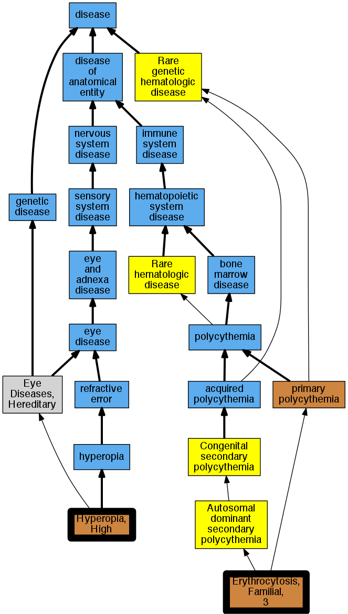

## GENE: PHD2/EGLN1

[matched diseases visual](PHD2-EGLN1.png)  <-- click on raw to zoom

### ERYTHROCYTOSIS, FAMILIAL, 3
 * [OMIM:609820 Erythrocytosis, Familial, 3](http://beta.monarchinitiative.org/disease/OMIM:609820) Confidence: high
    * Equiv:[MESH:C565221 Erythrocytosis, Familial, 3](http://beta.monarchinitiative.org/disease/MESH:C565221)
    * Syn: "ECYT3"
    * Syn: "ERYTHROCYTOSIS, FAMILIAL, 3; ECYT3"

### HEMOGLOBIN, HIGH ALTITUDE ADAPTATION
 * [OMIM:238950 Hyperopia, High](http://beta.monarchinitiative.org/disease/OMIM:238950) Confidence: low/0.0703125
    * Equiv:[MESH:C565497 Hyperopia, High](http://beta.monarchinitiative.org/disease/MESH:C565497)
    * Syn: "HYPEROPIA, HIGH"
