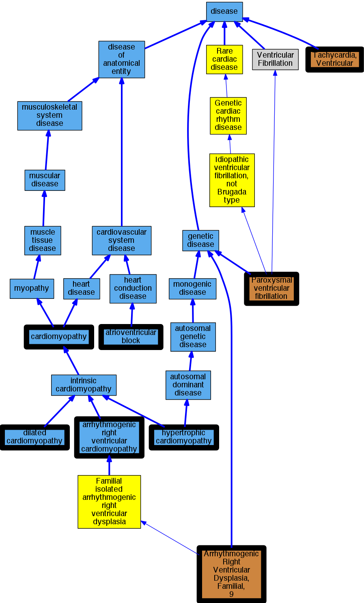

## GENE: PKP2

[matched diseases visual](PKP2.png)  <-- click on raw to zoom

### ARRHYTHMOGENIC RIGHT VENTRICULAR DYSPLASIA, FAMILIAL, 9
 * [OMIM:609040 Arrhythmogenic Right Ventricular Dysplasia, Familial, 9](http://beta.monarchinitiative.org/disease/OMIM:609040) Confidence: high
    * Equiv:[MESH:C563808 Arrhythmogenic Right Ventricular Dysplasia, Familial, 9](http://beta.monarchinitiative.org/disease/MESH:C563808)
    * Syn: "Arrhythmogenic Right Ventricular Cardiomyopathy 9"
    * Syn: "ARRHYTHMOGENIC RIGHT VENTRICULAR DYSPLASIA, FAMILIAL, 9; ARVD9"
    * Syn: "ARVD9"

### AV junctional rhythm
 * [DOID:0050820 atrioventricular block](http://beta.monarchinitiative.org/disease/DOID:0050820) Confidence: low/0.0763888888888889
    * Equiv:[MESH:D054537 Atrioventricular Block](http://beta.monarchinitiative.org/disease/MESH:D054537)
    * Syn: "AV block"

### Arrhythmogenic Right Ventricular Dysplasia/Cardiomyopathy
 * [DOID:0050431 arrhythmogenic right ventricular cardiomyopathy](http://beta.monarchinitiative.org/disease/DOID:0050431) Confidence: high
    * Equiv:[MESH:D019571 Arrhythmogenic Right Ventricular Dysplasia](http://beta.monarchinitiative.org/disease/MESH:D019571)
    * Syn: "arrhythmogenic right ventricular dysplasia"
    * Syn: "arrhythmogenic right ventricular dysplasia/cardiomyopathy"
    * Syn: "ARVC"
    * Syn: "ARVC cardiomyopathy"
    * Syn: "ARVD"

### Arrhythmogenic right ventricular cardiomyopathy
 * [DOID:0050431 arrhythmogenic right ventricular cardiomyopathy](http://beta.monarchinitiative.org/disease/DOID:0050431) Confidence: high
    * Equiv:[MESH:D019571 Arrhythmogenic Right Ventricular Dysplasia](http://beta.monarchinitiative.org/disease/MESH:D019571)
    * Syn: "arrhythmogenic right ventricular dysplasia"
    * Syn: "arrhythmogenic right ventricular dysplasia/cardiomyopathy"
    * Syn: "ARVC"
    * Syn: "ARVC cardiomyopathy"
    * Syn: "ARVD"

### Arrhythmogenic right ventricular cardiomyopathy 9
 * [OMIM:609040 Arrhythmogenic Right Ventricular Dysplasia, Familial, 9](http://beta.monarchinitiative.org/disease/OMIM:609040) Confidence: high
    * Equiv:[MESH:C563808 Arrhythmogenic Right Ventricular Dysplasia, Familial, 9](http://beta.monarchinitiative.org/disease/MESH:C563808)
    * Syn: "Arrhythmogenic Right Ventricular Cardiomyopathy 9"
    * Syn: "ARRHYTHMOGENIC RIGHT VENTRICULAR DYSPLASIA, FAMILIAL, 9; ARVD9"
    * Syn: "ARVD9"

### Arrhythmogenic right ventricular cardiomyopathy ?
 * [DOID:0050431 arrhythmogenic right ventricular cardiomyopathy](http://beta.monarchinitiative.org/disease/DOID:0050431) Confidence: low/0.20500000000000002
    * Equiv:[MESH:D019571 Arrhythmogenic Right Ventricular Dysplasia](http://beta.monarchinitiative.org/disease/MESH:D019571)
    * Syn: "arrhythmogenic right ventricular dysplasia"
    * Syn: "arrhythmogenic right ventricular dysplasia/cardiomyopathy"
    * Syn: "ARVC"
    * Syn: "ARVC cardiomyopathy"
    * Syn: "ARVD"

### Arrhythmogenic right ventricular cardiomyopathy, type 9
 * [OMIM:609040 Arrhythmogenic Right Ventricular Dysplasia, Familial, 9](http://beta.monarchinitiative.org/disease/OMIM:609040) Confidence: low/0.21180555555555558
    * Equiv:[MESH:C563808 Arrhythmogenic Right Ventricular Dysplasia, Familial, 9](http://beta.monarchinitiative.org/disease/MESH:C563808)
    * Syn: "Arrhythmogenic Right Ventricular Cardiomyopathy 9"
    * Syn: "ARRHYTHMOGENIC RIGHT VENTRICULAR DYSPLASIA, FAMILIAL, 9; ARVD9"
    * Syn: "ARVD9"

### Arrhythmogenic right ventricular dysplasia
 * [DOID:0050431 arrhythmogenic right ventricular cardiomyopathy](http://beta.monarchinitiative.org/disease/DOID:0050431) Confidence: high
    * Equiv:[MESH:D019571 Arrhythmogenic Right Ventricular Dysplasia](http://beta.monarchinitiative.org/disease/MESH:D019571)
    * Syn: "arrhythmogenic right ventricular dysplasia"
    * Syn: "arrhythmogenic right ventricular dysplasia/cardiomyopathy"
    * Syn: "ARVC"
    * Syn: "ARVC cardiomyopathy"
    * Syn: "ARVD"

### Arrhythmogenic right ventricular dysplasia/cardiomyopathy
 * [DOID:0050431 arrhythmogenic right ventricular cardiomyopathy](http://beta.monarchinitiative.org/disease/DOID:0050431) Confidence: high
    * Equiv:[MESH:D019571 Arrhythmogenic Right Ventricular Dysplasia](http://beta.monarchinitiative.org/disease/MESH:D019571)
    * Syn: "arrhythmogenic right ventricular dysplasia"
    * Syn: "arrhythmogenic right ventricular dysplasia/cardiomyopathy"
    * Syn: "ARVC"
    * Syn: "ARVC cardiomyopathy"
    * Syn: "ARVD"

### Cardiomyopathy
 * [DOID:0050700 cardiomyopathy](http://beta.monarchinitiative.org/disease/DOID:0050700) Confidence: high
    * Equiv:[MESH:D009202 Cardiomyopathies](http://beta.monarchinitiative.org/disease/MESH:D009202)
    * Syn: "Cardiomyopathies"

### Cardiomyopathy, right ventricular arrhythmogenic
 * [DOID:0050431 arrhythmogenic right ventricular cardiomyopathy](http://beta.monarchinitiative.org/disease/DOID:0050431) Confidence: high
    * Equiv:[MESH:D019571 Arrhythmogenic Right Ventricular Dysplasia](http://beta.monarchinitiative.org/disease/MESH:D019571)
    * Syn: "arrhythmogenic right ventricular dysplasia"
    * Syn: "arrhythmogenic right ventricular dysplasia/cardiomyopathy"
    * Syn: "ARVC"
    * Syn: "ARVC cardiomyopathy"
    * Syn: "ARVD"

### Paroxysmal familial ventricular fibrillation
 * [OMIM:612956 Paroxysmal ventricular fibrillation](http://beta.monarchinitiative.org/disease/OMIM:612956) Confidence: low/0.1953125
    * Equiv:[MESH:C537182 Paroxysmal ventricular fibrillation](http://beta.monarchinitiative.org/disease/MESH:C537182)
    * Equiv:[MESH:C567841 Ventricular Fibrillation, Paroxysmal Familial, 2](http://beta.monarchinitiative.org/disease/MESH:C567841)
    * Syn: "VENTRICULAR FIBRILLATION, PAROXYSMAL FAMILIAL, 2; VF2"
    * Syn: "VF2"

### Primary dilated cardiomyopathy
 * [DOID:12930 dilated cardiomyopathy](http://beta.monarchinitiative.org/disease/DOID:12930) Confidence: high
    * Syn: "Congestive cardiomyopathy"
    * Syn: "Familial dilated cardiomyopathy"
    * Syn: "Idiopathic dilation cardiomyopathy"
    * Syn: "primary dilated cardiomyopathy"

### Primary familial hypertrophic cardiomyopathy
 * [DOID:11984 hypertrophic cardiomyopathy](http://beta.monarchinitiative.org/disease/DOID:11984) Confidence: low/0.1953125
    * Equiv:[MESH:D002312 Cardiomyopathy, Hypertrophic](http://beta.monarchinitiative.org/disease/MESH:D002312)
    * Equiv:[MESH:D024741 Cardiomyopathy, Hypertrophic, Familial](http://beta.monarchinitiative.org/disease/MESH:D024741)
    * Syn: "familial hypertrophic cardiomyopathy"
    * Syn: "hypertrophic obstructive cardiomyopathy"

### Ventricular tachycardia
 * [OMIM:192605 Tachycardia, Ventricular](http://beta.monarchinitiative.org/disease/OMIM:192605) Confidence: high
    * Equiv:[MESH:D017180 Tachycardia, Ventricular](http://beta.monarchinitiative.org/disease/MESH:D017180)
    * Syn: "VENTRICULAR TACHYCARDIA, FAMILIAL"
    * Syn: "Ventricular Tachycardia, Familial Polymorphic"
