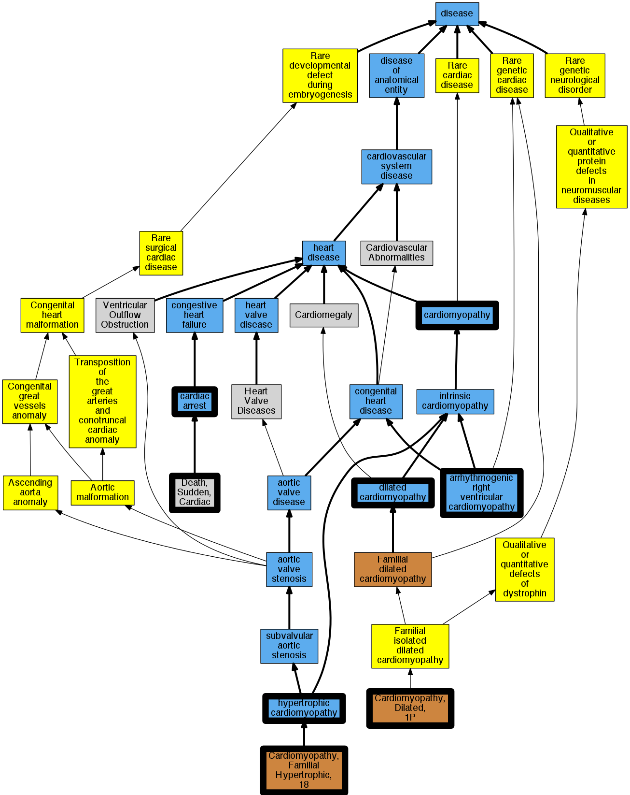

## GENE: PLN

[matched diseases visual](PLN.png)  <-- click on raw to zoom

### Arrhythmogenic right ventricular cardiomyopathy
 * [DOID:0050431 arrhythmogenic right ventricular cardiomyopathy](http://beta.monarchinitiative.org/disease/DOID:0050431) Confidence: high
    * Equiv:[MESH:D019571 Arrhythmogenic Right Ventricular Dysplasia](http://beta.monarchinitiative.org/disease/MESH:D019571)
    * Syn: "arrhythmogenic right ventricular dysplasia"
    * Syn: "arrhythmogenic right ventricular dysplasia/cardiomyopathy"
    * Syn: "ARVC"
    * Syn: "ARVC cardiomyopathy"
    * Syn: "ARVD"

### Cardiomyopathy, dilated
 * [DOID:12930 dilated cardiomyopathy](http://beta.monarchinitiative.org/disease/DOID:12930) Confidence: high
    * Syn: "Congestive cardiomyopathy"
    * Syn: "Familial dilated cardiomyopathy"
    * Syn: "Idiopathic dilation cardiomyopathy"
    * Syn: "primary dilated cardiomyopathy"

### Dilated cardiomyopathy 1P
 * [OMIM:609909 Cardiomyopathy, Dilated, 1p](http://beta.monarchinitiative.org/disease/OMIM:609909) Confidence: high
    * Equiv:[MESH:C563690 Cardiomyopathy, Dilated, 1p](http://beta.monarchinitiative.org/disease/MESH:C563690)
    * Syn: "CARDIOMYOPATHY, DILATED, 1P; CMD1P"
    * Syn: "CMD1P"

### CARDIOMYOPATHY, FAMILIAL HYPERTROPHIC 18
 * [OMIM:613874 Cardiomyopathy, Familial Hypertrophic, 18](http://beta.monarchinitiative.org/disease/OMIM:613874) Confidence: high
    * Syn: "CARDIOMYOPATHY, FAMILIAL HYPERTROPHIC, 18; CMH18"
    * Syn: "CMH18"

### CARDIOMYOPATHY, FAMILIAL HYPERTROPHIC, 18
 * [OMIM:613874 Cardiomyopathy, Familial Hypertrophic, 18](http://beta.monarchinitiative.org/disease/OMIM:613874) Confidence: high
    * Syn: "CARDIOMYOPATHY, FAMILIAL HYPERTROPHIC, 18; CMH18"
    * Syn: "CMH18"

### Cardiac Arrest
 * [DOID:0060319 cardiac arrest](http://beta.monarchinitiative.org/disease/DOID:0060319) Confidence: high
    * Equiv:[MESH:D006323 Heart Arrest](http://beta.monarchinitiative.org/disease/MESH:D006323)
    * Syn: "cardiopulmonary arrest"
    * Syn: "circulatory arrest"

### Primary familial hypertrophic cardiomyopathy
 * [DOID:11984 hypertrophic cardiomyopathy](http://beta.monarchinitiative.org/disease/DOID:11984) Confidence: low/0.1953125
    * Equiv:[MESH:D002312 Cardiomyopathy, Hypertrophic](http://beta.monarchinitiative.org/disease/MESH:D002312)
    * Equiv:[MESH:D024741 Cardiomyopathy, Hypertrophic, Familial](http://beta.monarchinitiative.org/disease/MESH:D024741)
    * Syn: "familial hypertrophic cardiomyopathy"
    * Syn: "hypertrophic obstructive cardiomyopathy"

### Primary familial hypertrophic cardiomyopathy
 * [DOID:11984 hypertrophic cardiomyopathy](http://beta.monarchinitiative.org/disease/DOID:11984) Confidence: low/0.1953125
    * Equiv:[MESH:D002312 Cardiomyopathy, Hypertrophic](http://beta.monarchinitiative.org/disease/MESH:D002312)
    * Equiv:[MESH:D024741 Cardiomyopathy, Hypertrophic, Familial](http://beta.monarchinitiative.org/disease/MESH:D024741)
    * Syn: "familial hypertrophic cardiomyopathy"
    * Syn: "hypertrophic obstructive cardiomyopathy"

### Sudden cardiac death
 * [OMIM:115080 Death, Sudden, Cardiac](http://beta.monarchinitiative.org/disease/OMIM:115080) Confidence: high
    * Equiv:[MESH:C562490 Cardiac Conduction Defect](http://beta.monarchinitiative.org/disease/MESH:C562490)
    * Equiv:[MESH:C566172 Familial Sudden Death](http://beta.monarchinitiative.org/disease/MESH:C566172)
    * Equiv:[MESH:D003645 Death, Sudden](http://beta.monarchinitiative.org/disease/MESH:D003645)
    * Equiv:[MESH:D016757 Death, Sudden, Cardiac](http://beta.monarchinitiative.org/disease/MESH:D016757)
    * Syn: "CARDIAC CONDUCTION DEFECT"
    * Syn: "Familial Sudden Death"
    * Syn: "Sudden Cardiac Death"

### CARDIOMYOPATHY, DILATED, 1P
 * [OMIM:609909 Cardiomyopathy, Dilated, 1p](http://beta.monarchinitiative.org/disease/OMIM:609909) Confidence: high
    * Equiv:[MESH:C563690 Cardiomyopathy, Dilated, 1p](http://beta.monarchinitiative.org/disease/MESH:C563690)
    * Syn: "CARDIOMYOPATHY, DILATED, 1P; CMD1P"
    * Syn: "CMD1P"

### Cardiomyopathy
 * [DOID:0050700 cardiomyopathy](http://beta.monarchinitiative.org/disease/DOID:0050700) Confidence: high
    * Equiv:[MESH:D009202 Cardiomyopathies](http://beta.monarchinitiative.org/disease/MESH:D009202)
    * Syn: "Cardiomyopathies"

### Cardiomyopathy
 * [DOID:0050700 cardiomyopathy](http://beta.monarchinitiative.org/disease/DOID:0050700) Confidence: high
    * Equiv:[MESH:D009202 Cardiomyopathies](http://beta.monarchinitiative.org/disease/MESH:D009202)
    * Syn: "Cardiomyopathies"

### Dilated cardiomyopathy 1P
 * [OMIM:609909 Cardiomyopathy, Dilated, 1p](http://beta.monarchinitiative.org/disease/OMIM:609909) Confidence: high
    * Equiv:[MESH:C563690 Cardiomyopathy, Dilated, 1p](http://beta.monarchinitiative.org/disease/MESH:C563690)
    * Syn: "CARDIOMYOPATHY, DILATED, 1P; CMD1P"
    * Syn: "CMD1P"

### Familial hypertrophic cardiomyopathy 18
 * [OMIM:613874 Cardiomyopathy, Familial Hypertrophic, 18](http://beta.monarchinitiative.org/disease/OMIM:613874) Confidence: high
    * Syn: "CARDIOMYOPATHY, FAMILIAL HYPERTROPHIC, 18; CMH18"
    * Syn: "CMH18"

### Familial hypertrophic cardiomyopathy 18
 * [OMIM:613874 Cardiomyopathy, Familial Hypertrophic, 18](http://beta.monarchinitiative.org/disease/OMIM:613874) Confidence: high
    * Syn: "CARDIOMYOPATHY, FAMILIAL HYPERTROPHIC, 18; CMH18"
    * Syn: "CMH18"

### Cardiomyopathy, dilated
 * [DOID:12930 dilated cardiomyopathy](http://beta.monarchinitiative.org/disease/DOID:12930) Confidence: high
    * Syn: "Congestive cardiomyopathy"
    * Syn: "Familial dilated cardiomyopathy"
    * Syn: "Idiopathic dilation cardiomyopathy"
    * Syn: "primary dilated cardiomyopathy"

### Cardiomyopathy, dilated, 1P
 * [OMIM:609909 Cardiomyopathy, Dilated, 1p](http://beta.monarchinitiative.org/disease/OMIM:609909) Confidence: high
    * Equiv:[MESH:C563690 Cardiomyopathy, Dilated, 1p](http://beta.monarchinitiative.org/disease/MESH:C563690)
    * Syn: "CARDIOMYOPATHY, DILATED, 1P; CMD1P"
    * Syn: "CMD1P"

### Primary familial hypertrophic cardiomyopathy
 * [DOID:11984 hypertrophic cardiomyopathy](http://beta.monarchinitiative.org/disease/DOID:11984) Confidence: low/0.1953125
    * Equiv:[MESH:D002312 Cardiomyopathy, Hypertrophic](http://beta.monarchinitiative.org/disease/MESH:D002312)
    * Equiv:[MESH:D024741 Cardiomyopathy, Hypertrophic, Familial](http://beta.monarchinitiative.org/disease/MESH:D024741)
    * Syn: "familial hypertrophic cardiomyopathy"
    * Syn: "hypertrophic obstructive cardiomyopathy"
