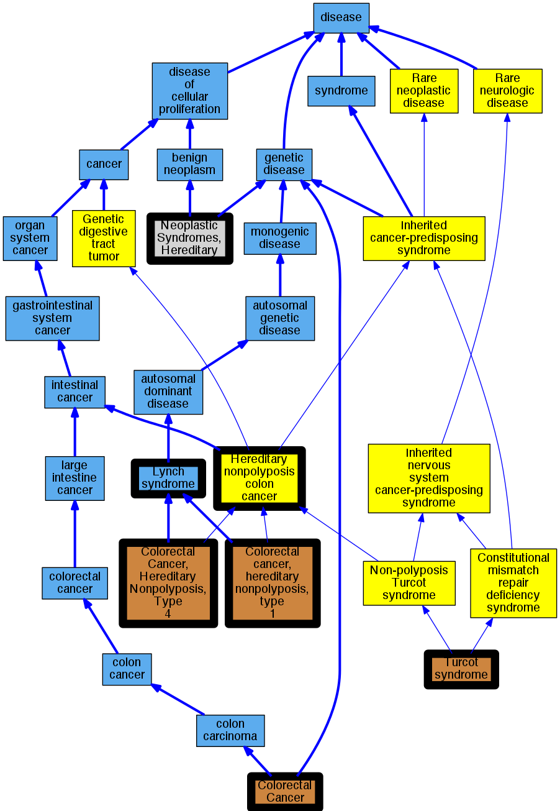

## GENE: PMS2

[matched diseases visual](PMS2.png)  <-- click on raw to zoom

### Hereditary nonpolyposis colorectal cancer type 4
 * [OMIM:614337 Colorectal Cancer, Hereditary Nonpolyposis, Type 4](http://beta.monarchinitiative.org/disease/OMIM:614337) Confidence: high
    * Equiv:[MESH:C563971 Colorectal Cancer, Hereditary Nonpolyposis, Type 4](http://beta.monarchinitiative.org/disease/MESH:C563971)
    * Syn: "COLORECTAL CANCER, HEREDITARY NONPOLYPOSIS, TYPE 4; HNPCC4"
    * Syn: "HNPCC4"

### Lynch Syndrome
 * [DOID:3883 Lynch syndrome](http://beta.monarchinitiative.org/disease/DOID:3883) Confidence: high
    * Syn: "COCA 1"
    * Syn: "Hereditary Defective Mismatch Repair syndrome"
    * Syn: "hereditary non-polyposis colon cancer type 1"
    * Syn: "hereditary nonpolyposis colorectal cancer"
    * Syn: "hereditary nonpolyposis colorectal neoplasm"
    * Syn: "HNPCC - hereditary nonpolyposis colon cancer"

### Lynch syndrome
 * [DOID:3883 Lynch syndrome](http://beta.monarchinitiative.org/disease/DOID:3883) Confidence: high
    * Syn: "COCA 1"
    * Syn: "Hereditary Defective Mismatch Repair syndrome"
    * Syn: "hereditary non-polyposis colon cancer type 1"
    * Syn: "hereditary nonpolyposis colorectal cancer"
    * Syn: "hereditary nonpolyposis colorectal neoplasm"
    * Syn: "HNPCC - hereditary nonpolyposis colon cancer"

### Lynch syndrome I
 * [OMIM:120435 Colorectal cancer, hereditary nonpolyposis, type 1](http://beta.monarchinitiative.org/disease/OMIM:120435) Confidence: high
    * Equiv:[MESH:C535972 Colorectal cancer, hereditary nonpolyposis, type 1](http://beta.monarchinitiative.org/disease/MESH:C535972)
    * Syn: "Coca1"
    * Syn: "Colon Cancer, Familial Nonpolyposis, Type 1"
    * Syn: "Colorectal Cancer, Hereditary Nonpolyposis, Type 1"
    * Syn: "Lynch Syndrome 2"
    * Syn: "LYNCH SYNDROME I"

### MISMATCH REPAIR CANCER SYNDROME
 * [OMIM:276300 Turcot syndrome](http://beta.monarchinitiative.org/disease/OMIM:276300) Confidence: low/0.18000000000000002
    * Equiv:[MESH:C536928 Turcot syndrome](http://beta.monarchinitiative.org/disease/MESH:C536928)
    * Syn: "Brain Tumor-Polyposis Syndrome 1"
    * Syn: "Btp1 Syndrome"
    * Syn: "Childhood Cancer Syndrome"
    * Syn: "Constitutional Mismatch Repair Deficiency Syndrome"
    * Syn: "MISMATCH REPAIR CANCER SYNDROME; MMRCS"
    * Syn: "Mismatch Repair Deficiency"
    * Syn: "Mmr Deficiency"
    * Syn: "MMRCS"
    * Syn: "Turcot Syndrome"

### Hereditary non-polyposis colon cancer
 * [Orphanet:144 Hereditary nonpolyposis colon cancer](http://beta.monarchinitiative.org/disease/Orphanet:144) Confidence: high

### COLORECTAL CANCER, HEREDITARY NONPOLYPOSIS, TYPE 4
 * [OMIM:614337 Colorectal Cancer, Hereditary Nonpolyposis, Type 4](http://beta.monarchinitiative.org/disease/OMIM:614337) Confidence: high
    * Equiv:[MESH:C563971 Colorectal Cancer, Hereditary Nonpolyposis, Type 4](http://beta.monarchinitiative.org/disease/MESH:C563971)
    * Syn: "COLORECTAL CANCER, HEREDITARY NONPOLYPOSIS, TYPE 4; HNPCC4"
    * Syn: "HNPCC4"

### Colorectal cancer, non-polyposis
 * [OMIM:114500 Colorectal Cancer](http://beta.monarchinitiative.org/disease/OMIM:114500) Confidence: low/0.15625
    * Syn: "Colon Cancer"
    * Syn: "COLORECTAL CANCER; CRC"
    * Syn: "CRC"

### Neoplastic Syndromes, Hereditary
 * [MESH:D009386 Neoplastic Syndromes, Hereditary](http://beta.monarchinitiative.org/disease/MESH:D009386) Confidence: high

### Turcot syndrome
 * [OMIM:276300 Turcot syndrome](http://beta.monarchinitiative.org/disease/OMIM:276300) Confidence: high
    * Equiv:[MESH:C536928 Turcot syndrome](http://beta.monarchinitiative.org/disease/MESH:C536928)
    * Syn: "Brain Tumor-Polyposis Syndrome 1"
    * Syn: "Btp1 Syndrome"
    * Syn: "Childhood Cancer Syndrome"
    * Syn: "Constitutional Mismatch Repair Deficiency Syndrome"
    * Syn: "MISMATCH REPAIR CANCER SYNDROME; MMRCS"
    * Syn: "Mismatch Repair Deficiency"
    * Syn: "Mmr Deficiency"
    * Syn: "MMRCS"
    * Syn: "Turcot Syndrome"
