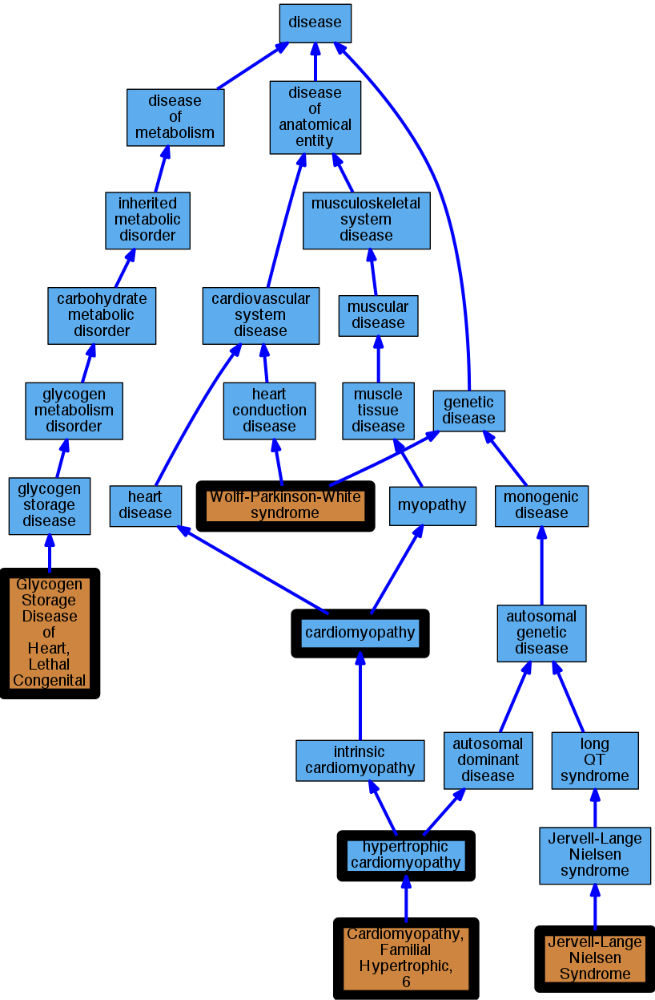

## GENE: PRKAG2

[matched diseases visual](PRKAG2.png)  <-- click on raw to zoom

### CARDIOMYOPATHY, FAMILIAL HYPERTROPHIC, 6
 * [OMIM:600858 Cardiomyopathy, Familial Hypertrophic, 6](http://beta.monarchinitiative.org/disease/OMIM:600858) Confidence: high
    * Equiv:[MESH:C563436 Cardiomyopathy, Familial Hypertrophic, 6](http://beta.monarchinitiative.org/disease/MESH:C563436)
    * Syn: "CARDIOMYOPATHY, FAMILIAL HYPERTROPHIC, 6; CMH6"
    * Syn: "CMH6"

### Cardiomyopathy
 * [DOID:0050700 cardiomyopathy](http://beta.monarchinitiative.org/disease/DOID:0050700) Confidence: high
    * Equiv:[MESH:D009202 Cardiomyopathies](http://beta.monarchinitiative.org/disease/MESH:D009202)
    * Syn: "Cardiomyopathies"

### Cardiomyopathy, familial hypertrophic 6
 * [OMIM:600858 Cardiomyopathy, Familial Hypertrophic, 6](http://beta.monarchinitiative.org/disease/OMIM:600858) Confidence: high
    * Equiv:[MESH:C563436 Cardiomyopathy, Familial Hypertrophic, 6](http://beta.monarchinitiative.org/disease/MESH:C563436)
    * Syn: "CARDIOMYOPATHY, FAMILIAL HYPERTROPHIC, 6; CMH6"
    * Syn: "CMH6"

### Familial hypertrophic cardiomyopathy 6
 * [OMIM:600858 Cardiomyopathy, Familial Hypertrophic, 6](http://beta.monarchinitiative.org/disease/OMIM:600858) Confidence: high
    * Equiv:[MESH:C563436 Cardiomyopathy, Familial Hypertrophic, 6](http://beta.monarchinitiative.org/disease/MESH:C563436)
    * Syn: "CARDIOMYOPATHY, FAMILIAL HYPERTROPHIC, 6; CMH6"
    * Syn: "CMH6"

### GLYCOGEN STORAGE DISEASE OF HEART, LETHAL CONGENITAL
 * [OMIM:261740 Glycogen Storage Disease of Heart, Lethal Congenital](http://beta.monarchinitiative.org/disease/OMIM:261740) Confidence: high
    * Equiv:[MESH:C564888 Glycogen Storage Disease of Heart, Lethal Congenital](http://beta.monarchinitiative.org/disease/MESH:C564888)
    * Syn: "Glycogen Storage Disease of Heart"
    * Syn: "GLYCOGEN STORAGE DISEASE OF HEART, LETHAL CONGENITAL"
    * Syn: "Phosphorylase Kinase Deficiency of Heart"

### Hypertrophic Cardiomyopathy
 * [DOID:11984 hypertrophic cardiomyopathy](http://beta.monarchinitiative.org/disease/DOID:11984) Confidence: high
    * Equiv:[MESH:D002312 Cardiomyopathy, Hypertrophic](http://beta.monarchinitiative.org/disease/MESH:D002312)
    * Equiv:[MESH:D024741 Cardiomyopathy, Hypertrophic, Familial](http://beta.monarchinitiative.org/disease/MESH:D024741)
    * Syn: "familial hypertrophic cardiomyopathy"
    * Syn: "hypertrophic obstructive cardiomyopathy"

### PRKAG2 cardiac syndrome
 * [OMIM:220400 Jervell-Lange Nielsen Syndrome](http://beta.monarchinitiative.org/disease/OMIM:220400) Confidence: low/0.1388888888888889
    * Equiv:[MESH:D029593 Jervell-Lange Nielsen Syndrome](http://beta.monarchinitiative.org/disease/MESH:D029593)
    * Syn: "Cardioauditory Syndrome of Jervell and Lange-Nielsen"
    * Syn: "Deafness, Congenital, and Functional Heart Disease"
    * Syn: "JERVELL AND LANGE-NIELSEN SYNDROME 1; JLNS1"
    * Syn: "JLNS1"
    * Syn: "Prolonged Qt Interval 1N Ekg and Sudden Death"
    * Syn: "Surdo-Cardiac Syndrome"

### Primary familial hypertrophic cardiomyopathy
 * [DOID:11984 hypertrophic cardiomyopathy](http://beta.monarchinitiative.org/disease/DOID:11984) Confidence: low/0.1953125
    * Equiv:[MESH:D002312 Cardiomyopathy, Hypertrophic](http://beta.monarchinitiative.org/disease/MESH:D002312)
    * Equiv:[MESH:D024741 Cardiomyopathy, Hypertrophic, Familial](http://beta.monarchinitiative.org/disease/MESH:D024741)
    * Syn: "familial hypertrophic cardiomyopathy"
    * Syn: "hypertrophic obstructive cardiomyopathy"

### WOLFF-PARKINSON-WHITE SYNDROME
 * [OMIM:194200 Wolff-Parkinson-White syndrome](http://beta.monarchinitiative.org/disease/OMIM:194200) Confidence: high
    * Equiv:[DOID:384 Wolff-Parkinson-White syndrome](http://beta.monarchinitiative.org/disease/DOID:384)
    * Equiv:[MESH:D011226 Pre-Excitation Syndromes](http://beta.monarchinitiative.org/disease/MESH:D011226)
    * Equiv:[MESH:D014927 Wolff-Parkinson-White Syndrome](http://beta.monarchinitiative.org/disease/MESH:D014927)
    * Syn: "Accessory Atrioventricular Pathways"
    * Syn: "Anomalous A-V excitation"
    * Syn: "anomalous atrioventricular excitation"
    * Syn: "Preexcitation Syndrome"
    * Syn: "Wolff-Parkinson-White pattern (finding)"
    * Syn: "WOLFF-PARKINSON-WHITE SYNDROME"
    * Syn: "Wpw Syndrome"

### WOLFF-PARKINSON-WHITE SYNDROME, CHILDHOOD-ONSET
 * [OMIM:194200 Wolff-Parkinson-White syndrome](http://beta.monarchinitiative.org/disease/OMIM:194200) Confidence: low/0.18055555555555555
    * Equiv:[DOID:384 Wolff-Parkinson-White syndrome](http://beta.monarchinitiative.org/disease/DOID:384)
    * Equiv:[MESH:D011226 Pre-Excitation Syndromes](http://beta.monarchinitiative.org/disease/MESH:D011226)
    * Equiv:[MESH:D014927 Wolff-Parkinson-White Syndrome](http://beta.monarchinitiative.org/disease/MESH:D014927)
    * Syn: "Accessory Atrioventricular Pathways"
    * Syn: "Anomalous A-V excitation"
    * Syn: "anomalous atrioventricular excitation"
    * Syn: "Preexcitation Syndrome"
    * Syn: "Wolff-Parkinson-White pattern (finding)"
    * Syn: "WOLFF-PARKINSON-WHITE SYNDROME"
    * Syn: "Wpw Syndrome"
