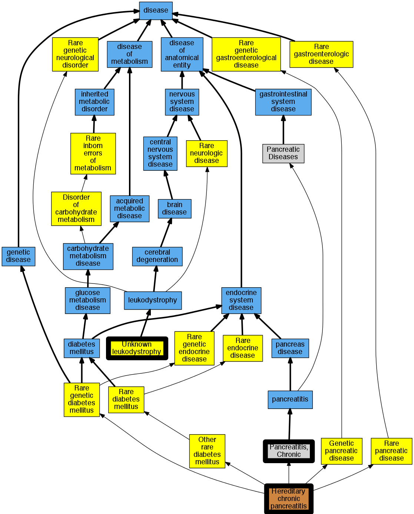

## GENE: PRSS1

[matched diseases visual](PRSS1.png)  <-- click on raw to zoom

### PANCREATITIS, HEREDITARY
 * [OMIM:167800 Hereditary chronic pancreatitis](http://beta.monarchinitiative.org/disease/OMIM:167800) Confidence: high
    * Equiv:[Orphanet:676 Hereditary chronic pancreatitis](http://beta.monarchinitiative.org/disease/Orphanet:676)
    * Equiv:[MESH:C537262 Hereditary pancreatitis](http://beta.monarchinitiative.org/disease/MESH:C537262)
    * Syn: "Autosomal Dominant Hereditary Pancreatitis"
    * Syn: "Familial Pancreatitis"
    * Syn: "Hereditary Chronic Pancreatitis"
    * Syn: "Hp"
    * Syn: "Hpc"
    * Syn: "Pancreatitis, Calcific"
    * Syn: "Pancreatitis, Chronic"
    * Syn: "Pancreatitis, Chronic, Protection Against"
    * Syn: "Pancreatitis, Chronic, Susceptibility to"
    * Syn: "Pancreatitis, Hereditary"
    * Syn: "PANCREATITIS, HEREDITARY; PCTT"
    * Syn: "PCTT"

### RECLASSIFIED - VARIANT OF UNKNOWN SIGNIFICANCE
 * [Orphanet:84096 Unknown leukodystrophy](http://beta.monarchinitiative.org/disease/Orphanet:84096) Confidence: low/0.0675

### RECLASSIFIED - VARIANT OF UNKNOWN SIGNIFICANCE
 * [Orphanet:84096 Unknown leukodystrophy](http://beta.monarchinitiative.org/disease/Orphanet:84096) Confidence: low/0.0675

### RECLASSIFIED - VARIANT OF UNKNOWN SIGNIFICANCE
 * [Orphanet:84096 Unknown leukodystrophy](http://beta.monarchinitiative.org/disease/Orphanet:84096) Confidence: low/0.0675

### RECLASSIFIED - VARIANT OF UNKNOWN SIGNIFICANCE
 * [Orphanet:84096 Unknown leukodystrophy](http://beta.monarchinitiative.org/disease/Orphanet:84096) Confidence: low/0.0675

### RECLASSIFIED - VARIANT OF UNKNOWN SIGNIFICANCE
 * [Orphanet:84096 Unknown leukodystrophy](http://beta.monarchinitiative.org/disease/Orphanet:84096) Confidence: low/0.0675

### RECLASSIFIED - VARIANT OF UNKNOWN SIGNIFICANCE
 * [Orphanet:84096 Unknown leukodystrophy](http://beta.monarchinitiative.org/disease/Orphanet:84096) Confidence: low/0.0675

### RECLASSIFIED - VARIANT OF UNKNOWN SIGNIFICANCE
 * [Orphanet:84096 Unknown leukodystrophy](http://beta.monarchinitiative.org/disease/Orphanet:84096) Confidence: low/0.0675

### RECLASSIFIED - VARIANT OF UNKNOWN SIGNIFICANCE
 * [Orphanet:84096 Unknown leukodystrophy](http://beta.monarchinitiative.org/disease/Orphanet:84096) Confidence: low/0.0675

### heritable chronic pancreatitis
 * [MESH:D050500 Pancreatitis, Chronic](http://beta.monarchinitiative.org/disease/MESH:D050500) Confidence: low/0.18055555555555555
    * Syn: "Chronic Pancreatitis"

### Hereditary pancreatitis
 * [OMIM:167800 Hereditary chronic pancreatitis](http://beta.monarchinitiative.org/disease/OMIM:167800) Confidence: high
    * Equiv:[Orphanet:676 Hereditary chronic pancreatitis](http://beta.monarchinitiative.org/disease/Orphanet:676)
    * Equiv:[MESH:C537262 Hereditary pancreatitis](http://beta.monarchinitiative.org/disease/MESH:C537262)
    * Syn: "Autosomal Dominant Hereditary Pancreatitis"
    * Syn: "Familial Pancreatitis"
    * Syn: "Hereditary Chronic Pancreatitis"
    * Syn: "Hp"
    * Syn: "Hpc"
    * Syn: "Pancreatitis, Calcific"
    * Syn: "Pancreatitis, Chronic"
    * Syn: "Pancreatitis, Chronic, Protection Against"
    * Syn: "Pancreatitis, Chronic, Susceptibility to"
    * Syn: "Pancreatitis, Hereditary"
    * Syn: "PANCREATITIS, HEREDITARY; PCTT"
    * Syn: "PCTT"

### RECLASSIFIED - VARIANT OF UNKNOWN SIGNIFICANCE
 * [Orphanet:84096 Unknown leukodystrophy](http://beta.monarchinitiative.org/disease/Orphanet:84096) Confidence: low/0.0675

### RECLASSIFIED - VARIANT OF UNKNOWN SIGNIFICANCE
 * [Orphanet:84096 Unknown leukodystrophy](http://beta.monarchinitiative.org/disease/Orphanet:84096) Confidence: low/0.0675

### RECLASSIFIED - VARIANT OF UNKNOWN SIGNIFICANCE
 * [Orphanet:84096 Unknown leukodystrophy](http://beta.monarchinitiative.org/disease/Orphanet:84096) Confidence: low/0.0675
