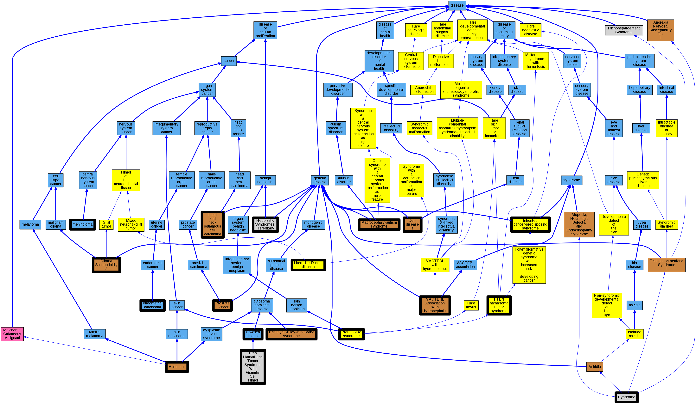

## GENE: PTEN

[matched diseases visual](PTEN.png)  <-- click on raw to zoom

### COWDEN DISEASE 1
 * [DOID:0050817 Stargardt disease](http://beta.monarchinitiative.org/disease/DOID:0050817) Confidence: low/0.11111111111111112
    * Equiv:[Orphanet:827 Stargardt disease](http://beta.monarchinitiative.org/disease/Orphanet:827)
    * Syn: "Fundus flavimaculatus"
    * Syn: "Stargardt 1"
    * Syn: "STARGARDT DISEASE 1"

### ENDOMETRIAL CARCINOMA
 * [DOID:2871 endometrial carcinoma](http://beta.monarchinitiative.org/disease/DOID:2871) Confidence: high
    * Equiv:[MESH:D018269 Carcinoma, Endometrioid](http://beta.monarchinitiative.org/disease/MESH:D018269)
    * Syn: "Adenocarcinoma, Endometrioid"
    * Syn: "Adenocarcinomas, Endometrioid"
    * Syn: "carcinoma of the Endometrium"
    * Syn: "Carcinomas, Endometrioid"
    * Syn: "Endometrioid Adenocarcinoma"
    * Syn: "Endometrioid Adenocarcinomas"
    * Syn: "Endometrioid Carcinoma"
    * Syn: "endometrioid carcinoma"
    * Syn: "endometrioid carcinoma of female Reproductive system"
    * Syn: "Endometrioid Carcinomas"

### PROSTATE CANCER, SOMATIC
 * [DOID:162 cancer](http://beta.monarchinitiative.org/disease/DOID:162) Confidence: low/0.1388888888888889
    * Equiv:[MESH:D009369 Neoplasms](http://beta.monarchinitiative.org/disease/MESH:D009369)
    * Syn: "Benign Neoplasm"
    * Syn: "Benign Neoplasms"
    * Syn: "Cancer"
    * Syn: "Cancers"
    * Syn: "malignant neoplasm"
    * Syn: "malignant tumor "
    * Syn: "Neoplasia"
    * Syn: "Neoplasm"
    * Syn: "Neoplasm, Benign"
    * Syn: "Neoplasms, Benign"
    * Syn: "primary cancer"
    * Syn: "Tumor"
    * Syn: "Tumors"

### PTEN hamartoma tumor syndrome
 * [Orphanet:306498 PTEN hamartoma tumor syndrome](http://beta.monarchinitiative.org/disease/Orphanet:306498) Confidence: high
    * Syn: "PHTS"

### SQUAMOUS CELL CARCINOMA, HEAD AND NECK, SOMATIC
 * [OMIM:275355 head and neck squamous cell carcinoma](http://beta.monarchinitiative.org/disease/OMIM:275355) Confidence: low/0.1679421768707483
    * Equiv:[Orphanet:67037 Squamous cell carcinoma of head and neck](http://beta.monarchinitiative.org/disease/Orphanet:67037)
    * Equiv:[DOID:5520 head and neck squamous cell carcinoma](http://beta.monarchinitiative.org/disease/DOID:5520)
    * Equiv:[MESH:C535575 Carcinoma, squamous cell of head and neck](http://beta.monarchinitiative.org/disease/MESH:C535575)
    * Syn: "carcinoma of the head and neck"
    * Syn: "Head and neck squamous cell carcinoma"
    * Syn: "HNSCC"
    * Syn: "HNSCC"
    * Syn: "Squamous cell carcinoma of the head and neck"
    * Syn: "squamous cell carcinoma of the head and neck"
    * Syn: "Squamous Cell Carcinoma, Head And Neck"
    * Syn: "SQUAMOUS CELL CARCINOMA, HEAD AND NECK; HNSCC"
    * Syn: "squamous cell carcinomas of head and neck"

### VATER ASSOCIATION WITH MACROCEPHALY AND VENTRICULOMEGALY
 * [MESH:C564752 Vater Association With Hydrocephalus](http://beta.monarchinitiative.org/disease/MESH:C564752) Confidence: high
    * Syn: "Vater Association With Macrocephaly And Ventriculomegaly"

### Neoplastic Syndromes, Hereditary
 * [MESH:D009386 Neoplastic Syndromes, Hereditary](http://beta.monarchinitiative.org/disease/MESH:D009386) Confidence: high
    * Syn: "Cancer Syndrome, Hereditary"
    * Syn: "Cancer Syndromes, Hereditary"
    * Syn: "Hereditary Cancer Syndrome"
    * Syn: "Hereditary Cancer Syndromes"
    * Syn: "Hereditary Neoplastic Syndrome"
    * Syn: "Hereditary Neoplastic Syndromes"
    * Syn: "Neoplastic Syndrome, Hereditary"
    * Syn: "Syndrome, Hereditary Cancer"
    * Syn: "Syndrome, Hereditary Neoplastic"
    * Syn: "Syndromes, Hereditary Cancer"
    * Syn: "Syndromes, Hereditary Neoplastic"

### PROTEUS-LIKE SYNDROME
 * [OMIM:158350 Proteus-like syndrome](http://beta.monarchinitiative.org/disease/OMIM:158350) Confidence: high
    * Equiv:[Orphanet:2969 Proteus-like syndrome](http://beta.monarchinitiative.org/disease/Orphanet:2969)
    * Syn: "Cerebellar Granule Cell Hypertrophy and Megalencephaly"
    * Syn: "Cerebelloparenchymal Disorder 6"
    * Syn: "Cohen-Hayden syndrome"
    * Syn: "COWDEN SYNDROME 1; CWS1"
    * Syn: "Cs"
    * Syn: "CWS1"
    * Syn: "Dysplastic Gangliocytoma of the Cerebellum"
    * Syn: "Lhermitte-Duclos Disease"
    * Syn: "Multiple Hamartoma Syndrome"
    * Syn: "Proteus-Like Syndrome"

### PTEN HAMARTOMA TUMOR SYNDROME WITH GRANULAR CELL TUMOR
 * [MESH:C566636 Pten Hamartoma Tumor Syndrome With Granular Cell Tumor](http://beta.monarchinitiative.org/disease/MESH:C566636) Confidence: high

### PTEN Hamartomatous Tumour Syndrome
 * [http://www.ncbi.nlm.nih.gov/gene/403832 PTEN](http://beta.monarchinitiative.org/disease/http://www.ncbi.nlm.nih.gov/gene/403832) Confidence: low/0.1328125

### Cowden disease
 * [DOID:6457 Cowden disease](http://beta.monarchinitiative.org/disease/DOID:6457) Confidence: high
    * Equiv:[MESH:D006223 Hamartoma Syndrome, Multiple](http://beta.monarchinitiative.org/disease/MESH:D006223)
    * Equiv:[Orphanet:201 Cowden syndrome](http://beta.monarchinitiative.org/disease/Orphanet:201)
    * Syn: "Bannayan Riley Ruvalcaba Syndrome"
    * Syn: "Bannayan Zonana Syndrome"
    * Syn: "Bannayan-Riley-Ruvalcaba Syndrome"
    * Syn: "Bannayan-Ruvalcaba-Riley Syndrome"
    * Syn: "Bannayan-Zonana Syndrome"
    * Syn: "Cerebellum Dysplastic Gangliocytoma"
    * Syn: "Cerebellum Dysplastic Gangliocytomas"
    * Syn: "Cowden Disease"
    * Syn: "Cowden disease"
    * Syn: "Cowden Syndrome"
    * Syn: "Cowden's Disease"
    * Syn: "Cowden's Syndrome"
    * Syn: "Cowdens Disease"
    * Syn: "Cowdens Syndrome"
    * Syn: "Dysplastic Gangliocytoma of Cerebellum"
    * Syn: "dysplastic Gangliocytoma of Cerebellum"
    * Syn: "Dysplastic Gangliocytoma of the Cerebellum"
    * Syn: "Hamartoma Syndromes, Multiple"
    * Syn: "Lhermitte Duclos Disease"
    * Syn: "Lhermitte-Duclos Disease"
    * Syn: "Lhermitte-Duclos disease (disorder)"
    * Syn: "Macrocephaly, Multiple Lipomas, and Hemangiomata"
    * Syn: "Macrocephaly, Pseudopapilledema, and Multiple Hemangiomas"
    * Syn: "Macrocephaly, Pseudopapilledema, and Multiple Hemangiomata"
    * Syn: "Multiple Hamartoma Syndrome"
    * Syn: "Multiple hamartoma syndrome"
    * Syn: "multiple hamartoma syndrome"
    * Syn: "Multiple Hamartoma Syndromes"
    * Syn: "Myhre Riley Smith Syndrome"
    * Syn: "Myhre-Riley-Smith Syndrome"
    * Syn: "PTEN Hamartoma Tumor Syndrome"
    * Syn: "Riley Smith Syndrome"
    * Syn: "Riley-Smith Syndrome"
    * Syn: "Ruvalcaba Myhre Smith Syndrome"
    * Syn: "Ruvalcaba-Myhre Syndrome"
    * Syn: "Ruvalcaba-Myhre-Smith Syndrome"

### Hereditary cancer-predisposing syndrome
 * [Orphanet:140162 Inherited cancer-predisposing syndrome](http://beta.monarchinitiative.org/disease/Orphanet:140162) Confidence: low/0.1640625

### MACROCEPHALY/AUTISM SYNDROME
 * [OMIM:605309 Macrocephaly-autism syndrome](http://beta.monarchinitiative.org/disease/OMIM:605309) Confidence: high
    * Equiv:[Orphanet:210548 Macrocephaly-autism syndrome](http://beta.monarchinitiative.org/disease/Orphanet:210548)
    * Equiv:[MESH:C565342 Macrocephaly Autism Syndrome](http://beta.monarchinitiative.org/disease/MESH:C565342)
    * Syn: "MACROCEPHALY/AUTISM SYNDROME"

### Macrocephaly/autism syndrome
 * [OMIM:605309 Macrocephaly-autism syndrome](http://beta.monarchinitiative.org/disease/OMIM:605309) Confidence: high
    * Equiv:[Orphanet:210548 Macrocephaly-autism syndrome](http://beta.monarchinitiative.org/disease/Orphanet:210548)
    * Equiv:[MESH:C565342 Macrocephaly Autism Syndrome](http://beta.monarchinitiative.org/disease/MESH:C565342)
    * Syn: "MACROCEPHALY/AUTISM SYNDROME"

### PTEN HAMARTOMA TUMOR SYNDROME
 * [Orphanet:306498 PTEN hamartoma tumor syndrome](http://beta.monarchinitiative.org/disease/Orphanet:306498) Confidence: high
    * Syn: "PHTS"

### BANNAYAN-RILEY-RUVALCABA SYNDROME
 * [OMIM:153480 Bannayan-Riley-Ruvalcaba syndrome](http://beta.monarchinitiative.org/disease/OMIM:153480) Confidence: high
    * Equiv:[Orphanet:109 Bannayan-Riley-Ruvalcaba syndrome](http://beta.monarchinitiative.org/disease/Orphanet:109)
    * Equiv:[DOID:0050657 Bannayan-Riley-Ruvalcaba syndrome](http://beta.monarchinitiative.org/disease/DOID:0050657)
    * Syn: "BANNAYAN-RILEY-RUVALCABA SYNDROME; BRRS"
    * Syn: "BANNAYAN-ZONANA SYNDROME"
    * Syn: "Bannayan-Zonana Syndrome"
    * Syn: "BRRS"
    * Syn: "BRRS"
    * Syn: "Macrocephaly, Multiple Lipomas, and Hemangiomata"
    * Syn: "Macrocephaly, Pseudopapilledema, and Multiple Hemangiomata"
    * Syn: "Myhre-Riley-Smith syndrome"
    * Syn: "RILEY-SMITH SYNDROME"
    * Syn: "Riley-Smith Syndrome"
    * Syn: "RUVALCABA-MYHRE-SMITH SYNDROME"
    * Syn: "Ruvalcaba-Myhre-Smith Syndrome"

### Cowden syndrome
 * [DOID:6457 Cowden disease](http://beta.monarchinitiative.org/disease/DOID:6457) Confidence: high
    * Equiv:[MESH:D006223 Hamartoma Syndrome, Multiple](http://beta.monarchinitiative.org/disease/MESH:D006223)
    * Equiv:[Orphanet:201 Cowden syndrome](http://beta.monarchinitiative.org/disease/Orphanet:201)
    * Syn: "Bannayan Riley Ruvalcaba Syndrome"
    * Syn: "Bannayan Zonana Syndrome"
    * Syn: "Bannayan-Riley-Ruvalcaba Syndrome"
    * Syn: "Bannayan-Ruvalcaba-Riley Syndrome"
    * Syn: "Bannayan-Zonana Syndrome"
    * Syn: "Cerebellum Dysplastic Gangliocytoma"
    * Syn: "Cerebellum Dysplastic Gangliocytomas"
    * Syn: "Cowden Disease"
    * Syn: "Cowden disease"
    * Syn: "Cowden Syndrome"
    * Syn: "Cowden's Disease"
    * Syn: "Cowden's Syndrome"
    * Syn: "Cowdens Disease"
    * Syn: "Cowdens Syndrome"
    * Syn: "Dysplastic Gangliocytoma of Cerebellum"
    * Syn: "dysplastic Gangliocytoma of Cerebellum"
    * Syn: "Dysplastic Gangliocytoma of the Cerebellum"
    * Syn: "Hamartoma Syndromes, Multiple"
    * Syn: "Lhermitte Duclos Disease"
    * Syn: "Lhermitte-Duclos Disease"
    * Syn: "Lhermitte-Duclos disease (disorder)"
    * Syn: "Macrocephaly, Multiple Lipomas, and Hemangiomata"
    * Syn: "Macrocephaly, Pseudopapilledema, and Multiple Hemangiomas"
    * Syn: "Macrocephaly, Pseudopapilledema, and Multiple Hemangiomata"
    * Syn: "Multiple Hamartoma Syndrome"
    * Syn: "Multiple hamartoma syndrome"
    * Syn: "multiple hamartoma syndrome"
    * Syn: "Multiple Hamartoma Syndromes"
    * Syn: "Myhre Riley Smith Syndrome"
    * Syn: "Myhre-Riley-Smith Syndrome"
    * Syn: "PTEN Hamartoma Tumor Syndrome"
    * Syn: "Riley Smith Syndrome"
    * Syn: "Riley-Smith Syndrome"
    * Syn: "Ruvalcaba Myhre Smith Syndrome"
    * Syn: "Ruvalcaba-Myhre Syndrome"
    * Syn: "Ruvalcaba-Myhre-Smith Syndrome"

### GLIOMA SUSCEPTIBILITY 2
 * [OMIM:613028 Glioma Susceptibility 2](http://beta.monarchinitiative.org/disease/OMIM:613028) Confidence: high
    * Syn: "GLIOMA SUSCEPTIBILITY 2; GLM2"
    * Syn: "GLM2"

### LHERMITTE-DUCLOS DISEASE
 * [Orphanet:65285 Lhermitte-Duclos disease](http://beta.monarchinitiative.org/disease/Orphanet:65285) Confidence: high
    * Syn: "Dysplastic gangliocytoma of the cerebellum"
    * Syn: "LDD"

### MALIGNANT MELANOMA, SOMATIC
 * [DOID:1909 melanoma](http://beta.monarchinitiative.org/disease/DOID:1909) Confidence: low/0.1388888888888889
    * Equiv:[MESH:D008545 Melanoma](http://beta.monarchinitiative.org/disease/MESH:D008545)
    * Syn: "Malignant Melanoma"
    * Syn: "malignant melanoma"
    * Syn: "Malignant Melanomas"
    * Syn: "Melanoma, Malignant"
    * Syn: "Melanomas"
    * Syn: "Melanomas, Malignant"
    * Syn: "Naevocarcinoma"

### MENINGIOMA
 * [DOID:3565 meningioma](http://beta.monarchinitiative.org/disease/DOID:3565) Confidence: high
    * Equiv:[Orphanet:2495 Meningioma](http://beta.monarchinitiative.org/disease/Orphanet:2495)
    * Syn: "Angioblastic Meningioma"
    * Syn: "Angioblastic Meningiomas"
    * Syn: "Angiomatous Meningioma"
    * Syn: "Angiomatous Meningiomas"
    * Syn: "Benign Meningioma"
    * Syn: "Benign Meningiomas"
    * Syn: "Cerebral Convexity Meningioma"
    * Syn: "Cerebral Convexity Meningiomas"
    * Syn: "Clear Cell Meningioma"
    * Syn: "Clear Cell Meningiomas"
    * Syn: "Convexity Meningioma, Cerebral"
    * Syn: "Convexity Meningiomas, Cerebral"
    * Syn: "Fibrous Meningioma"
    * Syn: "Fibrous Meningiomas"
    * Syn: "Groove Meningiomas, Olfactory"
    * Syn: "Hemangioblastic Meningioma"
    * Syn: "Hemangioblastic Meningiomas"
    * Syn: "Hemangiopericytic Meningioma"
    * Syn: "Hemangiopericytic Meningiomas"
    * Syn: "Intracranial Meningioma"
    * Syn: "intracranial meningioma"
    * Syn: "Intracranial Meningiomas"
    * Syn: "Intraorbital Meningioma"
    * Syn: "Intraorbital Meningiomas"
    * Syn: "Intraventricular Meningioma"
    * Syn: "Intraventricular Meningiomas"
    * Syn: "Malignant Meningioma"
    * Syn: "Malignant Meningiomas"
    * Syn: "meningeal neoplasm"
    * Syn: "Meningioma, Angioblastic"
    * Syn: "Meningioma, Angiomatous"
    * Syn: "Meningioma, Benign"
    * Syn: "Meningioma, Cerebral Convexity"
    * Syn: "Meningioma, Clear Cell"
    * Syn: "Meningioma, Fibrous"
    * Syn: "Meningioma, Hemangioblastic"
    * Syn: "Meningioma, Hemangiopericytic"
    * Syn: "Meningioma, Intracranial"
    * Syn: "Meningioma, Intraorbital"
    * Syn: "Meningioma, Intraventricular"
    * Syn: "Meningioma, Malignant"
    * Syn: "Meningioma, Meningotheliomatous"
    * Syn: "Meningioma, Microcystic"
    * Syn: "Meningioma, Multiple"
    * Syn: "Meningioma, Olfactory Groove"
    * Syn: "Meningioma, Papillary"
    * Syn: "Meningioma, Parasagittal"
    * Syn: "Meningioma, Posterior Fossa"
    * Syn: "Meningioma, Psammomatous"
    * Syn: "Meningioma, Secretory"
    * Syn: "Meningioma, Sphenoid Wing"
    * Syn: "Meningioma, Spinal"
    * Syn: "Meningioma, Transitional"
    * Syn: "Meningioma, Xanthomatous"
    * Syn: "Meningiomas"
    * Syn: "Meningiomas, Angioblastic"
    * Syn: "Meningiomas, Angiomatous"
    * Syn: "Meningiomas, Benign"
    * Syn: "Meningiomas, Cerebral Convexity"
    * Syn: "Meningiomas, Clear Cell"
    * Syn: "Meningiomas, Fibrous"
    * Syn: "Meningiomas, Hemangioblastic"
    * Syn: "Meningiomas, Hemangiopericytic"
    * Syn: "Meningiomas, Intracranial"
    * Syn: "Meningiomas, Intraorbital"
    * Syn: "Meningiomas, Intraventricular"
    * Syn: "Meningiomas, Malignant"
    * Syn: "Meningiomas, Meningotheliomatous"
    * Syn: "Meningiomas, Microcystic"
    * Syn: "Meningiomas, Multiple"
    * Syn: "Meningiomas, Olfactory Groove"
    * Syn: "Meningiomas, Papillary"
    * Syn: "Meningiomas, Parasagittal"
    * Syn: "Meningiomas, Posterior Fossa"
    * Syn: "Meningiomas, Psammomatous"
    * Syn: "Meningiomas, Secretory"
    * Syn: "Meningiomas, Sphenoid Wing"
    * Syn: "Meningiomas, Spinal"
    * Syn: "Meningiomas, Transitional"
    * Syn: "Meningiomas, Xanthomatous"
    * Syn: "Meningiomatoses"
    * Syn: "Meningiomatosis"
    * Syn: "meningothelial cell tumor"
    * Syn: "Meningotheliomatous Meningioma"
    * Syn: "Meningotheliomatous Meningiomas"
    * Syn: "Microcystic Meningioma"
    * Syn: "Microcystic Meningiomas"
    * Syn: "Multiple Meningioma"
    * Syn: "Multiple Meningiomas"
    * Syn: "neoplasm of the meninges"
    * Syn: "Olfactory Groove Meningioma"
    * Syn: "Olfactory Groove Meningiomas"
    * Syn: "Papillary Meningioma"
    * Syn: "Papillary Meningiomas"
    * Syn: "Parasagittal Meningioma"
    * Syn: "Parasagittal Meningiomas"
    * Syn: "Posterior Fossa Meningioma"
    * Syn: "Posterior Fossa Meningiomas"
    * Syn: "primary Meningeal tumor"
    * Syn: "Psammomatous Meningioma"
    * Syn: "Psammomatous Meningiomas"
    * Syn: "Secretory Meningioma"
    * Syn: "Secretory Meningiomas"
    * Syn: "Sphenoid Wing Meningioma"
    * Syn: "Sphenoid Wing Meningiomas"
    * Syn: "Spinal Meningioma"
    * Syn: "Spinal Meningiomas"
    * Syn: "supratentorial meningioma"
    * Syn: "Transitional Meningioma"
    * Syn: "Transitional Meningiomas"
    * Syn: "Wing Meningioma, Sphenoid"
    * Syn: "Wing Meningiomas, Sphenoid"
    * Syn: "Xanthomatous Meningioma"
    * Syn: "Xanthomatous Meningiomas"
