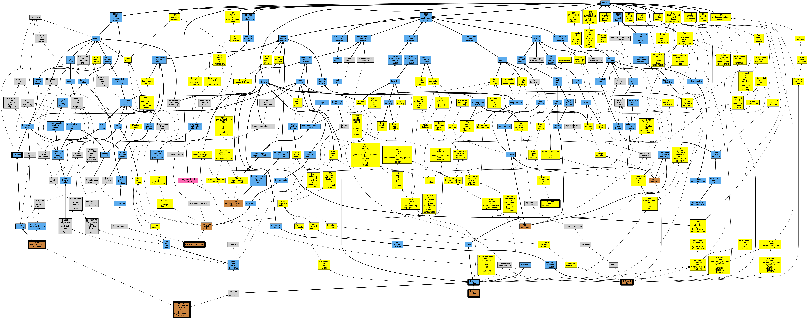

## GENE: PTPN11

[matched diseases visual](PTPN11.png)  <-- click on raw to zoom

### LEOPARD SYNDROME 1
 * [OMIM:151100 Leopard Syndrome 1](http://beta.monarchinitiative.org/disease/OMIM:151100) Confidence: high
    * Syn: "Lentiginosis, Cardiomyopathic"
    * Syn: "LEOPARD SYNDROME 1; LPRD1"
    * Syn: "LPRD1"
    * Syn: "Multiple Lentigines Syndrome"

### LEOPARD syndrome
 * [DOID:14291 LEOPARD syndrome](http://beta.monarchinitiative.org/disease/DOID:14291) Confidence: high
    * Equiv:[MESH:D044542 LEOPARD Syndrome](http://beta.monarchinitiative.org/disease/MESH:D044542)
    * Equiv:[Orphanet:500 LEOPARD syndrome](http://beta.monarchinitiative.org/disease/Orphanet:500)
    * Syn: "Capute-Rimoin-Konigsmark-Esterly-Richardson syndrome"
    * Syn: "Cardio Cutaneous Syndrome"
    * Syn: "Cardio-Cutaneous Syndrome"
    * Syn: "Cardio-Cutaneous Syndromes"
    * Syn: "Cardiocutaneous syndrome"
    * Syn: "Cardiomyopathic Lentiginoses"
    * Syn: "Cardiomyopathic Lentiginoses, Progressive"
    * Syn: "Cardiomyopathic Lentiginosis"
    * Syn: "Cardiomyopathic lentiginosis"
    * Syn: "Cardiomyopathic Lentiginosis, Progressive"
    * Syn: "Cardiomyopathic, Lentiginosis"
    * Syn: "Cardiomyopathics, Lentiginosis"
    * Syn: "Familial multiple lentigines syndrome"
    * Syn: "Generalized lentiginosis (disorder)"
    * Syn: "Gorlin syndrome II"
    * Syn: "Lentigines Syndrome, Multiple"
    * Syn: "Lentigines Syndromes, Multiple"
    * Syn: "Lentiginoses, Cardiomyopathic"
    * Syn: "Lentiginoses, Progressive Cardiomyopathic"
    * Syn: "Lentiginosis Cardiomyopathic"
    * Syn: "Lentiginosis Cardiomyopathics"
    * Syn: "Lentiginosis profusa syndrome"
    * Syn: "Lentiginosis, Cardiomyopathic"
    * Syn: "Lentiginosis, Progressive Cardiomyopathic"
    * Syn: "LEOPARD syndrome"
    * Syn: "LEOPARD syndrome"
    * Syn: "Leopard Syndrome 1"
    * Syn: "Leopard Syndrome 1s"
    * Syn: "LEOPARD Syndrome, 1"
    * Syn: "LEOPARD Syndromes"
    * Syn: "LEOPARD Syndromes, 1"
    * Syn: "Moynahan syndrome"
    * Syn: "Multiple Lentigines Syndrome"
    * Syn: "Multiple lentigines syndrome (disorder)"
    * Syn: "Multiple Lentigines Syndromes"
    * Syn: "Noonan Syndrome with Multiple Lentigines"
    * Syn: "Progressive Cardiomyopathic Lentiginoses"
    * Syn: "Progressive Cardiomyopathic Lentiginosis"
    * Syn: "Progressive cardiomyopathic lentiginosis"
    * Syn: "Syndrome, Cardio-Cutaneous"
    * Syn: "Syndrome, LEOPARD"
    * Syn: "Syndrome, Multiple Lentigines"
    * Syn: "Syndromes, 1 LEOPARD"
    * Syn: "Syndromes, Cardio-Cutaneous"
    * Syn: "Syndromes, LEOPARD"
    * Syn: "Syndromes, Multiple Lentigines"

### LEOPARD syndrome 1
 * [OMIM:151100 Leopard Syndrome 1](http://beta.monarchinitiative.org/disease/OMIM:151100) Confidence: high
    * Syn: "Lentiginosis, Cardiomyopathic"
    * Syn: "LEOPARD SYNDROME 1; LPRD1"
    * Syn: "LPRD1"
    * Syn: "Multiple Lentigines Syndrome"

### METACHONDROMATOSIS
 * [OMIM:156250 Metachondromatosis](http://beta.monarchinitiative.org/disease/OMIM:156250) Confidence: high
    * Equiv:[Orphanet:2499 Metachondromatosis](http://beta.monarchinitiative.org/disease/Orphanet:2499)
    * Equiv:[MESH:C562938 Metachondromatosis](http://beta.monarchinitiative.org/disease/MESH:C562938)
    * Syn: "METACHONDROMATOSIS; METCDS"
    * Syn: "METCDS"

### NOONAN SYNDROME
 * [DOID:3490 Noonan syndrome](http://beta.monarchinitiative.org/disease/DOID:3490) Confidence: high
    * Equiv:[MESH:D009634 Noonan Syndrome](http://beta.monarchinitiative.org/disease/MESH:D009634)
    * Equiv:[Orphanet:648 Noonan syndrome](http://beta.monarchinitiative.org/disease/Orphanet:648)
    * Syn: "Familial Turner Syndrome"
    * Syn: "Female Pseudo Turner Syndrome"
    * Syn: "Female Pseudo-Turner Syndrome"
    * Syn: "Male Turner Syndrome"
    * Syn: "Male Turner's Syndrome"
    * Syn: "Noonan Ehmke Syndrome"
    * Syn: "Noonan Syndrome 1"
    * Syn: "Noonan-Ehmke Syndrome"
    * Syn: "Pseudo Ullrich Turner Syndrome"
    * Syn: "Pseudo-Turner Syndrome, Female"
    * Syn: "Pseudo-Ullrich-Turner Syndrome"
    * Syn: "Syndrome, Familial Turner"
    * Syn: "Syndrome, Female Pseudo-Turner"
    * Syn: "Syndrome, Male Turner"
    * Syn: "Syndrome, Male Turner's"
    * Syn: "Syndrome, Noonan"
    * Syn: "Syndrome, Noonan-Ehmke"
    * Syn: "Syndrome, Pseudo-Ullrich-Turner"
    * Syn: "Syndrome, Turner-Like"
    * Syn: "Syndrome, Ullrich-Noonan"
    * Syn: "Turner Like Syndrome"
    * Syn: "Turner Phenotype with Normal Karyotype"
    * Syn: "Turner Syndrome, Familial"
    * Syn: "Turner Syndrome, Male"
    * Syn: "Turner's Phenotype, Karyotype Normal"
    * Syn: "Turner's phenotype, karyotype normal (disorder)"
    * Syn: "Turner's Syndrome, Male"
    * Syn: "Turner-Like Syndrome"
    * Syn: "Ullrich Noonan Syndrome"
    * Syn: "Ullrich-Noonan Syndrome"

### Noonan's syndrome
 * [Orphanet:88633 Superior limbic keratoconjunctivitis](http://beta.monarchinitiative.org/disease/Orphanet:88633) Confidence: low/0.1640625
    * Syn: "SLK"
    * Syn: "Theodore's superior limbic keratoconjunctivitis"
    * Syn: "Theodore's syndrome"

### Rasopathy

### LEUKEMIA, JUVENILE MYELOMONOCYTIC, SOMATIC
 * [DOID:1240 leukemia](http://beta.monarchinitiative.org/disease/DOID:1240) Confidence: low/0.1328125
    * Equiv:[MESH:D007938 Leukemia](http://beta.monarchinitiative.org/disease/MESH:D007938)
    * Syn: "Leucocythaemia"
    * Syn: "Leucocythaemias"
    * Syn: "Leucocythemia"
    * Syn: "Leucocythemias"
    * Syn: "Leukemias"

### Noonan Syndrome with Juvenile Myelomonocytic Leukemia
 * [OMIM:613563 Noonan syndrome-like disorder with juvenile myelomonocytic leukemia](http://beta.monarchinitiative.org/disease/OMIM:613563) Confidence: low/0.1640625
    * Equiv:[Orphanet:363972 Noonan syndrome-like disorder with juvenile myelomonocytic leukemia](http://beta.monarchinitiative.org/disease/Orphanet:363972)
    * Syn: "Cbl Mutation-Associated Syndrome"
    * Syn: "CBL syndrome"
    * Syn: "Cbl Syndrome"
    * Syn: "Noonan syndrome-like disorder with JMML"
    * Syn: "NOONAN SYNDROME-LIKE DISORDER WITH OR WITHOUT JUVENILE MYELOMONOCYTIC LEUKEMIA; NSLL"
    * Syn: "NSLL"

### Noonan syndrome 1
 * [OMIM:163950 Noonan Syndrome 1](http://beta.monarchinitiative.org/disease/OMIM:163950) Confidence: high
    * Syn: "Female Pseudo-Turner Syndrome"
    * Syn: "Male Turner Syndrome"
    * Syn: "Noonan Syndrome"
    * Syn: "NOONAN SYNDROME 1; NS1"
    * Syn: "NS1"
    * Syn: "Pterygium Colli Syndrome"
    * Syn: "Turner Phenotype With Normal Karyotype"

### Metachondromatosis
 * [OMIM:156250 Metachondromatosis](http://beta.monarchinitiative.org/disease/OMIM:156250) Confidence: high
    * Equiv:[Orphanet:2499 Metachondromatosis](http://beta.monarchinitiative.org/disease/Orphanet:2499)
    * Equiv:[MESH:C562938 Metachondromatosis](http://beta.monarchinitiative.org/disease/MESH:C562938)
    * Syn: "METACHONDROMATOSIS; METCDS"
    * Syn: "METCDS"

### NOONAN SYNDROME 1
 * [OMIM:163950 Noonan Syndrome 1](http://beta.monarchinitiative.org/disease/OMIM:163950) Confidence: high
    * Syn: "Female Pseudo-Turner Syndrome"
    * Syn: "Male Turner Syndrome"
    * Syn: "Noonan Syndrome"
    * Syn: "NOONAN SYNDROME 1; NS1"
    * Syn: "NS1"
    * Syn: "Pterygium Colli Syndrome"
    * Syn: "Turner Phenotype With Normal Karyotype"

### Noonan Syndrome
 * [DOID:3490 Noonan syndrome](http://beta.monarchinitiative.org/disease/DOID:3490) Confidence: high
    * Equiv:[MESH:D009634 Noonan Syndrome](http://beta.monarchinitiative.org/disease/MESH:D009634)
    * Equiv:[Orphanet:648 Noonan syndrome](http://beta.monarchinitiative.org/disease/Orphanet:648)
    * Syn: "Familial Turner Syndrome"
    * Syn: "Female Pseudo Turner Syndrome"
    * Syn: "Female Pseudo-Turner Syndrome"
    * Syn: "Male Turner Syndrome"
    * Syn: "Male Turner's Syndrome"
    * Syn: "Noonan Ehmke Syndrome"
    * Syn: "Noonan Syndrome 1"
    * Syn: "Noonan-Ehmke Syndrome"
    * Syn: "Pseudo Ullrich Turner Syndrome"
    * Syn: "Pseudo-Turner Syndrome, Female"
    * Syn: "Pseudo-Ullrich-Turner Syndrome"
    * Syn: "Syndrome, Familial Turner"
    * Syn: "Syndrome, Female Pseudo-Turner"
    * Syn: "Syndrome, Male Turner"
    * Syn: "Syndrome, Male Turner's"
    * Syn: "Syndrome, Noonan"
    * Syn: "Syndrome, Noonan-Ehmke"
    * Syn: "Syndrome, Pseudo-Ullrich-Turner"
    * Syn: "Syndrome, Turner-Like"
    * Syn: "Syndrome, Ullrich-Noonan"
    * Syn: "Turner Like Syndrome"
    * Syn: "Turner Phenotype with Normal Karyotype"
    * Syn: "Turner Syndrome, Familial"
    * Syn: "Turner Syndrome, Male"
    * Syn: "Turner's Phenotype, Karyotype Normal"
    * Syn: "Turner's phenotype, karyotype normal (disorder)"
    * Syn: "Turner's Syndrome, Male"
    * Syn: "Turner-Like Syndrome"
    * Syn: "Ullrich Noonan Syndrome"
    * Syn: "Ullrich-Noonan Syndrome"

### Noonan Syndrome
 * [DOID:3490 Noonan syndrome](http://beta.monarchinitiative.org/disease/DOID:3490) Confidence: high
    * Equiv:[MESH:D009634 Noonan Syndrome](http://beta.monarchinitiative.org/disease/MESH:D009634)
    * Equiv:[Orphanet:648 Noonan syndrome](http://beta.monarchinitiative.org/disease/Orphanet:648)
    * Syn: "Familial Turner Syndrome"
    * Syn: "Female Pseudo Turner Syndrome"
    * Syn: "Female Pseudo-Turner Syndrome"
    * Syn: "Male Turner Syndrome"
    * Syn: "Male Turner's Syndrome"
    * Syn: "Noonan Ehmke Syndrome"
    * Syn: "Noonan Syndrome 1"
    * Syn: "Noonan-Ehmke Syndrome"
    * Syn: "Pseudo Ullrich Turner Syndrome"
    * Syn: "Pseudo-Turner Syndrome, Female"
    * Syn: "Pseudo-Ullrich-Turner Syndrome"
    * Syn: "Syndrome, Familial Turner"
    * Syn: "Syndrome, Female Pseudo-Turner"
    * Syn: "Syndrome, Male Turner"
    * Syn: "Syndrome, Male Turner's"
    * Syn: "Syndrome, Noonan"
    * Syn: "Syndrome, Noonan-Ehmke"
    * Syn: "Syndrome, Pseudo-Ullrich-Turner"
    * Syn: "Syndrome, Turner-Like"
    * Syn: "Syndrome, Ullrich-Noonan"
    * Syn: "Turner Like Syndrome"
    * Syn: "Turner Phenotype with Normal Karyotype"
    * Syn: "Turner Syndrome, Familial"
    * Syn: "Turner Syndrome, Male"
    * Syn: "Turner's Phenotype, Karyotype Normal"
    * Syn: "Turner's phenotype, karyotype normal (disorder)"
    * Syn: "Turner's Syndrome, Male"
    * Syn: "Turner-Like Syndrome"
    * Syn: "Ullrich Noonan Syndrome"
    * Syn: "Ullrich-Noonan Syndrome"

### Noonan Syndrome
 * [DOID:3490 Noonan syndrome](http://beta.monarchinitiative.org/disease/DOID:3490) Confidence: high
    * Equiv:[MESH:D009634 Noonan Syndrome](http://beta.monarchinitiative.org/disease/MESH:D009634)
    * Equiv:[Orphanet:648 Noonan syndrome](http://beta.monarchinitiative.org/disease/Orphanet:648)
    * Syn: "Familial Turner Syndrome"
    * Syn: "Female Pseudo Turner Syndrome"
    * Syn: "Female Pseudo-Turner Syndrome"
    * Syn: "Male Turner Syndrome"
    * Syn: "Male Turner's Syndrome"
    * Syn: "Noonan Ehmke Syndrome"
    * Syn: "Noonan Syndrome 1"
    * Syn: "Noonan-Ehmke Syndrome"
    * Syn: "Pseudo Ullrich Turner Syndrome"
    * Syn: "Pseudo-Turner Syndrome, Female"
    * Syn: "Pseudo-Ullrich-Turner Syndrome"
    * Syn: "Syndrome, Familial Turner"
    * Syn: "Syndrome, Female Pseudo-Turner"
    * Syn: "Syndrome, Male Turner"
    * Syn: "Syndrome, Male Turner's"
    * Syn: "Syndrome, Noonan"
    * Syn: "Syndrome, Noonan-Ehmke"
    * Syn: "Syndrome, Pseudo-Ullrich-Turner"
    * Syn: "Syndrome, Turner-Like"
    * Syn: "Syndrome, Ullrich-Noonan"
    * Syn: "Turner Like Syndrome"
    * Syn: "Turner Phenotype with Normal Karyotype"
    * Syn: "Turner Syndrome, Familial"
    * Syn: "Turner Syndrome, Male"
    * Syn: "Turner's Phenotype, Karyotype Normal"
    * Syn: "Turner's phenotype, karyotype normal (disorder)"
    * Syn: "Turner's Syndrome, Male"
    * Syn: "Turner-Like Syndrome"
    * Syn: "Ullrich Noonan Syndrome"
    * Syn: "Ullrich-Noonan Syndrome"

### Noonan Syndrome
 * [DOID:3490 Noonan syndrome](http://beta.monarchinitiative.org/disease/DOID:3490) Confidence: high
    * Equiv:[MESH:D009634 Noonan Syndrome](http://beta.monarchinitiative.org/disease/MESH:D009634)
    * Equiv:[Orphanet:648 Noonan syndrome](http://beta.monarchinitiative.org/disease/Orphanet:648)
    * Syn: "Familial Turner Syndrome"
    * Syn: "Female Pseudo Turner Syndrome"
    * Syn: "Female Pseudo-Turner Syndrome"
    * Syn: "Male Turner Syndrome"
    * Syn: "Male Turner's Syndrome"
    * Syn: "Noonan Ehmke Syndrome"
    * Syn: "Noonan Syndrome 1"
    * Syn: "Noonan-Ehmke Syndrome"
    * Syn: "Pseudo Ullrich Turner Syndrome"
    * Syn: "Pseudo-Turner Syndrome, Female"
    * Syn: "Pseudo-Ullrich-Turner Syndrome"
    * Syn: "Syndrome, Familial Turner"
    * Syn: "Syndrome, Female Pseudo-Turner"
    * Syn: "Syndrome, Male Turner"
    * Syn: "Syndrome, Male Turner's"
    * Syn: "Syndrome, Noonan"
    * Syn: "Syndrome, Noonan-Ehmke"
    * Syn: "Syndrome, Pseudo-Ullrich-Turner"
    * Syn: "Syndrome, Turner-Like"
    * Syn: "Syndrome, Ullrich-Noonan"
    * Syn: "Turner Like Syndrome"
    * Syn: "Turner Phenotype with Normal Karyotype"
    * Syn: "Turner Syndrome, Familial"
    * Syn: "Turner Syndrome, Male"
    * Syn: "Turner's Phenotype, Karyotype Normal"
    * Syn: "Turner's phenotype, karyotype normal (disorder)"
    * Syn: "Turner's Syndrome, Male"
    * Syn: "Turner-Like Syndrome"
    * Syn: "Ullrich Noonan Syndrome"
    * Syn: "Ullrich-Noonan Syndrome"

### Noonan Syndrome with Juvenile Myelomonocytic Leukemia
 * [OMIM:613563 Noonan syndrome-like disorder with juvenile myelomonocytic leukemia](http://beta.monarchinitiative.org/disease/OMIM:613563) Confidence: low/0.1640625
    * Equiv:[Orphanet:363972 Noonan syndrome-like disorder with juvenile myelomonocytic leukemia](http://beta.monarchinitiative.org/disease/Orphanet:363972)
    * Syn: "Cbl Mutation-Associated Syndrome"
    * Syn: "CBL syndrome"
    * Syn: "Cbl Syndrome"
    * Syn: "Noonan syndrome-like disorder with JMML"
    * Syn: "NOONAN SYNDROME-LIKE DISORDER WITH OR WITHOUT JUVENILE MYELOMONOCYTIC LEUKEMIA; NSLL"
    * Syn: "NSLL"

### Noonan Syndrome/Leopard Syndrome
 * [DOID:3490 Noonan syndrome](http://beta.monarchinitiative.org/disease/DOID:3490) Confidence: low/0.15625
    * Equiv:[MESH:D009634 Noonan Syndrome](http://beta.monarchinitiative.org/disease/MESH:D009634)
    * Equiv:[Orphanet:648 Noonan syndrome](http://beta.monarchinitiative.org/disease/Orphanet:648)
    * Syn: "Familial Turner Syndrome"
    * Syn: "Female Pseudo Turner Syndrome"
    * Syn: "Female Pseudo-Turner Syndrome"
    * Syn: "Male Turner Syndrome"
    * Syn: "Male Turner's Syndrome"
    * Syn: "Noonan Ehmke Syndrome"
    * Syn: "Noonan Syndrome 1"
    * Syn: "Noonan-Ehmke Syndrome"
    * Syn: "Pseudo Ullrich Turner Syndrome"
    * Syn: "Pseudo-Turner Syndrome, Female"
    * Syn: "Pseudo-Ullrich-Turner Syndrome"
    * Syn: "Syndrome, Familial Turner"
    * Syn: "Syndrome, Female Pseudo-Turner"
    * Syn: "Syndrome, Male Turner"
    * Syn: "Syndrome, Male Turner's"
    * Syn: "Syndrome, Noonan"
    * Syn: "Syndrome, Noonan-Ehmke"
    * Syn: "Syndrome, Pseudo-Ullrich-Turner"
    * Syn: "Syndrome, Turner-Like"
    * Syn: "Syndrome, Ullrich-Noonan"
    * Syn: "Turner Like Syndrome"
    * Syn: "Turner Phenotype with Normal Karyotype"
    * Syn: "Turner Syndrome, Familial"
    * Syn: "Turner Syndrome, Male"
    * Syn: "Turner's Phenotype, Karyotype Normal"
    * Syn: "Turner's phenotype, karyotype normal (disorder)"
    * Syn: "Turner's Syndrome, Male"
    * Syn: "Turner-Like Syndrome"
    * Syn: "Ullrich Noonan Syndrome"
    * Syn: "Ullrich-Noonan Syndrome"

### Noonan syndrome
 * [DOID:3490 Noonan syndrome](http://beta.monarchinitiative.org/disease/DOID:3490) Confidence: high
    * Equiv:[MESH:D009634 Noonan Syndrome](http://beta.monarchinitiative.org/disease/MESH:D009634)
    * Equiv:[Orphanet:648 Noonan syndrome](http://beta.monarchinitiative.org/disease/Orphanet:648)
    * Syn: "Familial Turner Syndrome"
    * Syn: "Female Pseudo Turner Syndrome"
    * Syn: "Female Pseudo-Turner Syndrome"
    * Syn: "Male Turner Syndrome"
    * Syn: "Male Turner's Syndrome"
    * Syn: "Noonan Ehmke Syndrome"
    * Syn: "Noonan Syndrome 1"
    * Syn: "Noonan-Ehmke Syndrome"
    * Syn: "Pseudo Ullrich Turner Syndrome"
    * Syn: "Pseudo-Turner Syndrome, Female"
    * Syn: "Pseudo-Ullrich-Turner Syndrome"
    * Syn: "Syndrome, Familial Turner"
    * Syn: "Syndrome, Female Pseudo-Turner"
    * Syn: "Syndrome, Male Turner"
    * Syn: "Syndrome, Male Turner's"
    * Syn: "Syndrome, Noonan"
    * Syn: "Syndrome, Noonan-Ehmke"
    * Syn: "Syndrome, Pseudo-Ullrich-Turner"
    * Syn: "Syndrome, Turner-Like"
    * Syn: "Syndrome, Ullrich-Noonan"
    * Syn: "Turner Like Syndrome"
    * Syn: "Turner Phenotype with Normal Karyotype"
    * Syn: "Turner Syndrome, Familial"
    * Syn: "Turner Syndrome, Male"
    * Syn: "Turner's Phenotype, Karyotype Normal"
    * Syn: "Turner's phenotype, karyotype normal (disorder)"
    * Syn: "Turner's Syndrome, Male"
    * Syn: "Turner-Like Syndrome"
    * Syn: "Ullrich Noonan Syndrome"
    * Syn: "Ullrich-Noonan Syndrome"

### Juvenile myelomonocytic leukemia
 * [OMIM:607785 juvenile myelomonocytic leukemia](http://beta.monarchinitiative.org/disease/OMIM:607785) Confidence: high
    * Equiv:[Orphanet:86834 Juvenile myelomonocytic leukemia](http://beta.monarchinitiative.org/disease/Orphanet:86834)
    * Equiv:[DOID:0050458 juvenile myelomonocytic leukemia](http://beta.monarchinitiative.org/disease/DOID:0050458)
    * Equiv:[MESH:D054429 Leukemia, Myelomonocytic, Juvenile](http://beta.monarchinitiative.org/disease/MESH:D054429)
    * Syn: "JMML"
    * Syn: "Juvenile Chronic Myelogenous Leukemia"
    * Syn: "Juvenile chronic myelomonocytic leukemia"
    * Syn: "Juvenile Myelomonocytic Leukemia"
    * Syn: "JUVENILE MYELOMONOCYTIC LEUKEMIA; JMML"
    * Syn: "Juvenile Myelomonocytic Leukemias"
    * Syn: "Leukemia, Chronic Myelomonocytic"
    * Syn: "Leukemia, Juvenile Myelomonocytic"
    * Syn: "Myelomonocytic Leukemia, Juvenile"
    * Syn: "Myelomonocytic Leukemias, Juvenile"

### Juvenile myelomonocytic leukemia
 * [OMIM:607785 juvenile myelomonocytic leukemia](http://beta.monarchinitiative.org/disease/OMIM:607785) Confidence: high
    * Equiv:[Orphanet:86834 Juvenile myelomonocytic leukemia](http://beta.monarchinitiative.org/disease/Orphanet:86834)
    * Equiv:[DOID:0050458 juvenile myelomonocytic leukemia](http://beta.monarchinitiative.org/disease/DOID:0050458)
    * Equiv:[MESH:D054429 Leukemia, Myelomonocytic, Juvenile](http://beta.monarchinitiative.org/disease/MESH:D054429)
    * Syn: "JMML"
    * Syn: "Juvenile Chronic Myelogenous Leukemia"
    * Syn: "Juvenile chronic myelomonocytic leukemia"
    * Syn: "Juvenile Myelomonocytic Leukemia"
    * Syn: "JUVENILE MYELOMONOCYTIC LEUKEMIA; JMML"
    * Syn: "Juvenile Myelomonocytic Leukemias"
    * Syn: "Leukemia, Chronic Myelomonocytic"
    * Syn: "Leukemia, Juvenile Myelomonocytic"
    * Syn: "Myelomonocytic Leukemia, Juvenile"
    * Syn: "Myelomonocytic Leukemias, Juvenile"

### LEOPARD syndrome
 * [DOID:14291 LEOPARD syndrome](http://beta.monarchinitiative.org/disease/DOID:14291) Confidence: high
    * Equiv:[MESH:D044542 LEOPARD Syndrome](http://beta.monarchinitiative.org/disease/MESH:D044542)
    * Equiv:[Orphanet:500 LEOPARD syndrome](http://beta.monarchinitiative.org/disease/Orphanet:500)
    * Syn: "Capute-Rimoin-Konigsmark-Esterly-Richardson syndrome"
    * Syn: "Cardio Cutaneous Syndrome"
    * Syn: "Cardio-Cutaneous Syndrome"
    * Syn: "Cardio-Cutaneous Syndromes"
    * Syn: "Cardiocutaneous syndrome"
    * Syn: "Cardiomyopathic Lentiginoses"
    * Syn: "Cardiomyopathic Lentiginoses, Progressive"
    * Syn: "Cardiomyopathic Lentiginosis"
    * Syn: "Cardiomyopathic lentiginosis"
    * Syn: "Cardiomyopathic Lentiginosis, Progressive"
    * Syn: "Cardiomyopathic, Lentiginosis"
    * Syn: "Cardiomyopathics, Lentiginosis"
    * Syn: "Familial multiple lentigines syndrome"
    * Syn: "Generalized lentiginosis (disorder)"
    * Syn: "Gorlin syndrome II"
    * Syn: "Lentigines Syndrome, Multiple"
    * Syn: "Lentigines Syndromes, Multiple"
    * Syn: "Lentiginoses, Cardiomyopathic"
    * Syn: "Lentiginoses, Progressive Cardiomyopathic"
    * Syn: "Lentiginosis Cardiomyopathic"
    * Syn: "Lentiginosis Cardiomyopathics"
    * Syn: "Lentiginosis profusa syndrome"
    * Syn: "Lentiginosis, Cardiomyopathic"
    * Syn: "Lentiginosis, Progressive Cardiomyopathic"
    * Syn: "LEOPARD syndrome"
    * Syn: "LEOPARD syndrome"
    * Syn: "Leopard Syndrome 1"
    * Syn: "Leopard Syndrome 1s"
    * Syn: "LEOPARD Syndrome, 1"
    * Syn: "LEOPARD Syndromes"
    * Syn: "LEOPARD Syndromes, 1"
    * Syn: "Moynahan syndrome"
    * Syn: "Multiple Lentigines Syndrome"
    * Syn: "Multiple lentigines syndrome (disorder)"
    * Syn: "Multiple Lentigines Syndromes"
    * Syn: "Noonan Syndrome with Multiple Lentigines"
    * Syn: "Progressive Cardiomyopathic Lentiginoses"
    * Syn: "Progressive Cardiomyopathic Lentiginosis"
    * Syn: "Progressive cardiomyopathic lentiginosis"
    * Syn: "Syndrome, Cardio-Cutaneous"
    * Syn: "Syndrome, LEOPARD"
    * Syn: "Syndrome, Multiple Lentigines"
    * Syn: "Syndromes, 1 LEOPARD"
    * Syn: "Syndromes, Cardio-Cutaneous"
    * Syn: "Syndromes, LEOPARD"
    * Syn: "Syndromes, Multiple Lentigines"

### Noonan Syndrome/Leopard Syndrome
 * [DOID:3490 Noonan syndrome](http://beta.monarchinitiative.org/disease/DOID:3490) Confidence: low/0.15625
    * Equiv:[MESH:D009634 Noonan Syndrome](http://beta.monarchinitiative.org/disease/MESH:D009634)
    * Equiv:[Orphanet:648 Noonan syndrome](http://beta.monarchinitiative.org/disease/Orphanet:648)
    * Syn: "Familial Turner Syndrome"
    * Syn: "Female Pseudo Turner Syndrome"
    * Syn: "Female Pseudo-Turner Syndrome"
    * Syn: "Male Turner Syndrome"
    * Syn: "Male Turner's Syndrome"
    * Syn: "Noonan Ehmke Syndrome"
    * Syn: "Noonan Syndrome 1"
    * Syn: "Noonan-Ehmke Syndrome"
    * Syn: "Pseudo Ullrich Turner Syndrome"
    * Syn: "Pseudo-Turner Syndrome, Female"
    * Syn: "Pseudo-Ullrich-Turner Syndrome"
    * Syn: "Syndrome, Familial Turner"
    * Syn: "Syndrome, Female Pseudo-Turner"
    * Syn: "Syndrome, Male Turner"
    * Syn: "Syndrome, Male Turner's"
    * Syn: "Syndrome, Noonan"
    * Syn: "Syndrome, Noonan-Ehmke"
    * Syn: "Syndrome, Pseudo-Ullrich-Turner"
    * Syn: "Syndrome, Turner-Like"
    * Syn: "Syndrome, Ullrich-Noonan"
    * Syn: "Turner Like Syndrome"
    * Syn: "Turner Phenotype with Normal Karyotype"
    * Syn: "Turner Syndrome, Familial"
    * Syn: "Turner Syndrome, Male"
    * Syn: "Turner's Phenotype, Karyotype Normal"
    * Syn: "Turner's phenotype, karyotype normal (disorder)"
    * Syn: "Turner's Syndrome, Male"
    * Syn: "Turner-Like Syndrome"
    * Syn: "Ullrich Noonan Syndrome"
    * Syn: "Ullrich-Noonan Syndrome"

### Noonan syndrome 1
 * [OMIM:163950 Noonan Syndrome 1](http://beta.monarchinitiative.org/disease/OMIM:163950) Confidence: high
    * Syn: "Female Pseudo-Turner Syndrome"
    * Syn: "Male Turner Syndrome"
    * Syn: "Noonan Syndrome"
    * Syn: "NOONAN SYNDROME 1; NS1"
    * Syn: "NS1"
    * Syn: "Pterygium Colli Syndrome"
    * Syn: "Turner Phenotype With Normal Karyotype"

### Noonan''s syndrome
 * [Orphanet:88633 Superior limbic keratoconjunctivitis](http://beta.monarchinitiative.org/disease/Orphanet:88633) Confidence: low/0.1640625
    * Syn: "SLK"
    * Syn: "Theodore's superior limbic keratoconjunctivitis"
    * Syn: "Theodore's syndrome"

### Noonan's syndrome
 * [Orphanet:88633 Superior limbic keratoconjunctivitis](http://beta.monarchinitiative.org/disease/Orphanet:88633) Confidence: low/0.1640625
    * Syn: "SLK"
    * Syn: "Theodore's superior limbic keratoconjunctivitis"
    * Syn: "Theodore's syndrome"
