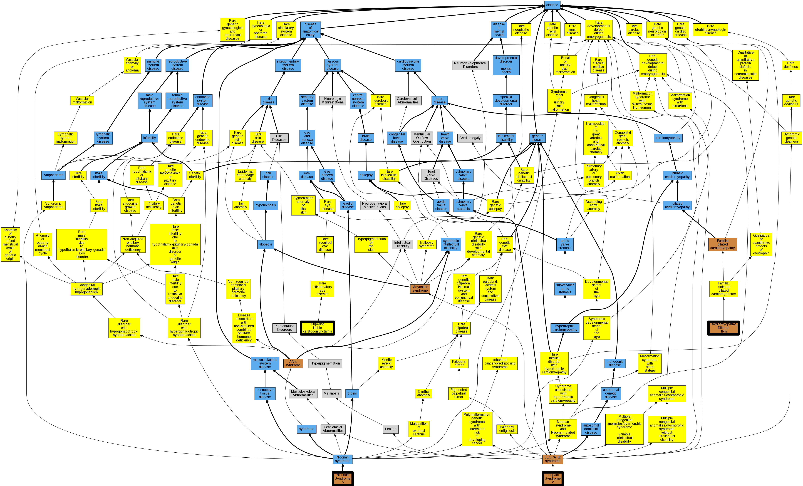

## GENE: RAF1

[matched diseases visual](RAF1.png)  <-- click on raw to zoom

### CARDIOMYOPATHY, DILATED, 1NN
 * [OMIM:615916 Cardiomyopathy, Dilated, 1Nn](http://beta.monarchinitiative.org/disease/OMIM:615916) Confidence: high
    * Syn: "CARDIOMYOPATHY, DILATED, 1NN; CMD1NN"
    * Syn: "CMD1NN"

### LEOPARD SYNDROME 2
 * [OMIM:611554 LEOPARD syndrome, 2](http://beta.monarchinitiative.org/disease/OMIM:611554) Confidence: high
    * Equiv:[MESH:C537117 LEOPARD syndrome, 2](http://beta.monarchinitiative.org/disease/MESH:C537117)
    * Syn: "LEOPARD SYNDROME 2; LPRD2"
    * Syn: "LPRD2"

### NOONAN SYNDROME 5
 * [OMIM:611553 Noonan Syndrome 5](http://beta.monarchinitiative.org/disease/OMIM:611553) Confidence: high
    * Equiv:[MESH:C548083 Noonan Syndrome 5](http://beta.monarchinitiative.org/disease/MESH:C548083)
    * Syn: "NOONAN SYNDROME 5; NS5"
    * Syn: "NS5"

### Noonan syndrome 5
 * [OMIM:611553 Noonan Syndrome 5](http://beta.monarchinitiative.org/disease/OMIM:611553) Confidence: high
    * Equiv:[MESH:C548083 Noonan Syndrome 5](http://beta.monarchinitiative.org/disease/MESH:C548083)
    * Syn: "NOONAN SYNDROME 5; NS5"
    * Syn: "NS5"

### Noonan''s syndrome
 * [OMIM:309900 mucopolysaccharidosis II](http://beta.monarchinitiative.org/disease/OMIM:309900) Confidence: low/0.1640625
    * Equiv:[Orphanet:580 Mucopolysaccharidosis type 2](http://beta.monarchinitiative.org/disease/Orphanet:580)
    * Equiv:[DOID:12799 mucopolysaccharidosis II](http://beta.monarchinitiative.org/disease/DOID:12799)
    * Syn: "deficiency of iduronate-2-sulphatase"
    * Syn: "Hunter Syndrome"
    * Syn: "Hunter syndrome"
    * Syn: "Hunter's syndrome"
    * Syn: "Ids Deficiency"
    * Syn: "Iduronate 2-Sulfatase Deficiency"
    * Syn: "Mps 2"
    * Syn: "MPS II - Hunter syndrome"
    * Syn: "MPS2"
    * Syn: "Mucopolysaccharidosis, MPS-II (disorder)"
    * Syn: "MUCOPOLYSACCHARIDOSIS, TYPE II; MPS2"
    * Syn: "Sids Deficiency"
    * Syn: "Sulfoiduronate Sulfatase Deficiency"

### Noonan's syndrome
 * [OMIM:309900 mucopolysaccharidosis II](http://beta.monarchinitiative.org/disease/OMIM:309900) Confidence: low/0.1640625
    * Equiv:[Orphanet:580 Mucopolysaccharidosis type 2](http://beta.monarchinitiative.org/disease/Orphanet:580)
    * Equiv:[DOID:12799 mucopolysaccharidosis II](http://beta.monarchinitiative.org/disease/DOID:12799)
    * Syn: "deficiency of iduronate-2-sulphatase"
    * Syn: "Hunter Syndrome"
    * Syn: "Hunter syndrome"
    * Syn: "Hunter's syndrome"
    * Syn: "Ids Deficiency"
    * Syn: "Iduronate 2-Sulfatase Deficiency"
    * Syn: "Mps 2"
    * Syn: "MPS II - Hunter syndrome"
    * Syn: "MPS2"
    * Syn: "Mucopolysaccharidosis, MPS-II (disorder)"
    * Syn: "MUCOPOLYSACCHARIDOSIS, TYPE II; MPS2"
    * Syn: "Sids Deficiency"
    * Syn: "Sulfoiduronate Sulfatase Deficiency"

### Rasopathy
