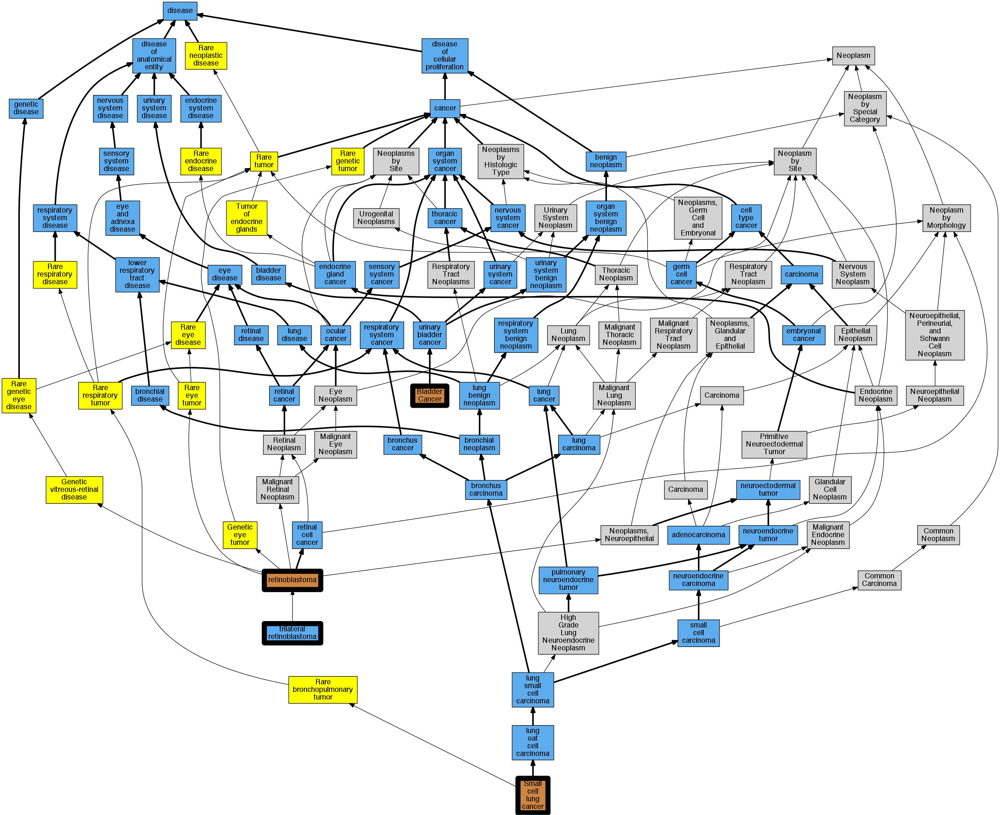

## GENE: RB1

[matched diseases visual](RB1.png)  <-- click on raw to zoom

### RETINOBLASTOMA
 * [OMIM:180200 retinoblastoma](http://beta.monarchinitiative.org/disease/OMIM:180200) Confidence: high
    * Equiv:[Orphanet:790 Retinoblastoma](http://beta.monarchinitiative.org/disease/Orphanet:790)
    * Equiv:[DOID:768 retinoblastoma](http://beta.monarchinitiative.org/disease/DOID:768)
    * Equiv:[MESH:D012175 Retinoblastoma](http://beta.monarchinitiative.org/disease/MESH:D012175)
    * Syn: "Eye Cancer, Retinoblastoma"
    * Syn: "Familial Retinoblastoma"
    * Syn: "Familial Retinoblastomas"
    * Syn: "Glioblastoma, Retinal"
    * Syn: "Glioblastomas, Retinal"
    * Syn: "Glioma, Retinal"
    * Syn: "Gliomas, Retinal"
    * Syn: "Hereditary Retinoblastoma"
    * Syn: "Hereditary Retinoblastomas"
    * Syn: "neuroblastoma of Retina"
    * Syn: "Neuroblastoma, Retinal"
    * Syn: "Neuroblastomas, Retinal"
    * Syn: "RB"
    * Syn: "Rb"
    * Syn: "RB - Retinoblastoma"
    * Syn: "RB1"
    * Syn: "Retinal Glioblastoma"
    * Syn: "Retinal Glioblastomas"
    * Syn: "Retinal Glioma"
    * Syn: "Retinal Gliomas"
    * Syn: "Retinal Neuroblastoma"
    * Syn: "Retinal Neuroblastomas"
    * Syn: "Retinoblastoma, Familial"
    * Syn: "Retinoblastoma, Hereditary"
    * Syn: "Retinoblastoma, Sporadic"
    * Syn: "RETINOBLASTOMA; RB1"
    * Syn: "Retinoblastomas"
    * Syn: "Retinoblastomas, Familial"
    * Syn: "Retinoblastomas, Hereditary"
    * Syn: "Retinoblastomas, Sporadic"
    * Syn: "Sporadic Retinoblastoma"
    * Syn: "Sporadic Retinoblastomas"

### SMALL CELL CANCER OF THE LUNG, SOMATIC
 * [OMIM:182280 Small cell lung cancer](http://beta.monarchinitiative.org/disease/OMIM:182280) Confidence: low/0.18055555555555555
    * Equiv:[Orphanet:70573 Small cell lung cancer](http://beta.monarchinitiative.org/disease/Orphanet:70573)
    * Syn: "SCLC"
    * Syn: "Sclc"
    * Syn: "Sclc1"
    * Syn: "SMALL CELL CANCER OF THE LUNG"

### RETINOBLASTOMA, TRILATERAL
 * [DOID:4647 trilateral retinoblastoma](http://beta.monarchinitiative.org/disease/DOID:4647) Confidence: high

### BLADDER CANCER, SOMATIC
 * [OMIM:109800 Bladder Cancer](http://beta.monarchinitiative.org/disease/OMIM:109800) Confidence: low/0.18055555555555555
    * Syn: "BLADDER CANCER"

### RETINOBLASTOMA, SOMATIC
 * [OMIM:180200 retinoblastoma](http://beta.monarchinitiative.org/disease/OMIM:180200) Confidence: low/0.15625
    * Equiv:[Orphanet:790 Retinoblastoma](http://beta.monarchinitiative.org/disease/Orphanet:790)
    * Equiv:[DOID:768 retinoblastoma](http://beta.monarchinitiative.org/disease/DOID:768)
    * Equiv:[MESH:D012175 Retinoblastoma](http://beta.monarchinitiative.org/disease/MESH:D012175)
    * Syn: "Eye Cancer, Retinoblastoma"
    * Syn: "Familial Retinoblastoma"
    * Syn: "Familial Retinoblastomas"
    * Syn: "Glioblastoma, Retinal"
    * Syn: "Glioblastomas, Retinal"
    * Syn: "Glioma, Retinal"
    * Syn: "Gliomas, Retinal"
    * Syn: "Hereditary Retinoblastoma"
    * Syn: "Hereditary Retinoblastomas"
    * Syn: "neuroblastoma of Retina"
    * Syn: "Neuroblastoma, Retinal"
    * Syn: "Neuroblastomas, Retinal"
    * Syn: "RB"
    * Syn: "Rb"
    * Syn: "RB - Retinoblastoma"
    * Syn: "RB1"
    * Syn: "Retinal Glioblastoma"
    * Syn: "Retinal Glioblastomas"
    * Syn: "Retinal Glioma"
    * Syn: "Retinal Gliomas"
    * Syn: "Retinal Neuroblastoma"
    * Syn: "Retinal Neuroblastomas"
    * Syn: "Retinoblastoma, Familial"
    * Syn: "Retinoblastoma, Hereditary"
    * Syn: "Retinoblastoma, Sporadic"
    * Syn: "RETINOBLASTOMA; RB1"
    * Syn: "Retinoblastomas"
    * Syn: "Retinoblastomas, Familial"
    * Syn: "Retinoblastomas, Hereditary"
    * Syn: "Retinoblastomas, Sporadic"
    * Syn: "Sporadic Retinoblastoma"
    * Syn: "Sporadic Retinoblastomas"

### Retinoblastoma
 * [OMIM:180200 retinoblastoma](http://beta.monarchinitiative.org/disease/OMIM:180200) Confidence: high
    * Equiv:[Orphanet:790 Retinoblastoma](http://beta.monarchinitiative.org/disease/Orphanet:790)
    * Equiv:[DOID:768 retinoblastoma](http://beta.monarchinitiative.org/disease/DOID:768)
    * Equiv:[MESH:D012175 Retinoblastoma](http://beta.monarchinitiative.org/disease/MESH:D012175)
    * Syn: "Eye Cancer, Retinoblastoma"
    * Syn: "Familial Retinoblastoma"
    * Syn: "Familial Retinoblastomas"
    * Syn: "Glioblastoma, Retinal"
    * Syn: "Glioblastomas, Retinal"
    * Syn: "Glioma, Retinal"
    * Syn: "Gliomas, Retinal"
    * Syn: "Hereditary Retinoblastoma"
    * Syn: "Hereditary Retinoblastomas"
    * Syn: "neuroblastoma of Retina"
    * Syn: "Neuroblastoma, Retinal"
    * Syn: "Neuroblastomas, Retinal"
    * Syn: "RB"
    * Syn: "Rb"
    * Syn: "RB - Retinoblastoma"
    * Syn: "RB1"
    * Syn: "Retinal Glioblastoma"
    * Syn: "Retinal Glioblastomas"
    * Syn: "Retinal Glioma"
    * Syn: "Retinal Gliomas"
    * Syn: "Retinal Neuroblastoma"
    * Syn: "Retinal Neuroblastomas"
    * Syn: "Retinoblastoma, Familial"
    * Syn: "Retinoblastoma, Hereditary"
    * Syn: "Retinoblastoma, Sporadic"
    * Syn: "RETINOBLASTOMA; RB1"
    * Syn: "Retinoblastomas"
    * Syn: "Retinoblastomas, Familial"
    * Syn: "Retinoblastomas, Hereditary"
    * Syn: "Retinoblastomas, Sporadic"
    * Syn: "Sporadic Retinoblastoma"
    * Syn: "Sporadic Retinoblastomas"
