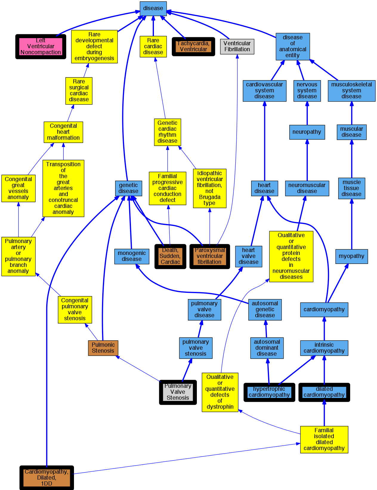

## GENE: RBM20

[matched diseases visual](RBM20.png)  <-- click on raw to zoom

### Cardiomyopathy, dilated, 1DD
 * [OMIM:613172 Cardiomyopathy, Dilated, 1DD](http://beta.monarchinitiative.org/disease/OMIM:613172) Confidence: high
    * Equiv:[MESH:C567725 Cardiomyopathy, Dilated, 1DD](http://beta.monarchinitiative.org/disease/MESH:C567725)
    * Syn: "CARDIOMYOPATHY, DILATED, 1DD; CMD1DD"
    * Syn: "CMD1DD"

### Primary dilated cardiomyopathy
 * [DOID:12930 dilated cardiomyopathy](http://beta.monarchinitiative.org/disease/DOID:12930) Confidence: high
    * Syn: "Congestive cardiomyopathy"
    * Syn: "Familial dilated cardiomyopathy"
    * Syn: "Idiopathic dilation cardiomyopathy"
    * Syn: "primary dilated cardiomyopathy"

### Sudden cardiac death
 * [OMIM:115080 Death, Sudden, Cardiac](http://beta.monarchinitiative.org/disease/OMIM:115080) Confidence: high
    * Equiv:[MESH:C562490 Cardiac Conduction Defect](http://beta.monarchinitiative.org/disease/MESH:C562490)
    * Equiv:[MESH:C566172 Familial Sudden Death](http://beta.monarchinitiative.org/disease/MESH:C566172)
    * Equiv:[MESH:D003645 Death, Sudden](http://beta.monarchinitiative.org/disease/MESH:D003645)
    * Equiv:[MESH:D016757 Death, Sudden, Cardiac](http://beta.monarchinitiative.org/disease/MESH:D016757)
    * Syn: "CARDIAC CONDUCTION DEFECT"
    * Syn: "Familial Sudden Death"
    * Syn: "Sudden Cardiac Death"

### Ventricular tachycardia
 * [OMIM:192605 Tachycardia, Ventricular](http://beta.monarchinitiative.org/disease/OMIM:192605) Confidence: high
    * Equiv:[MESH:D017180 Tachycardia, Ventricular](http://beta.monarchinitiative.org/disease/MESH:D017180)
    * Syn: "VENTRICULAR TACHYCARDIA, FAMILIAL"
    * Syn: "Ventricular Tachycardia, Familial Polymorphic"

### Cardiomyopathy
 * [DOID:0050700 cardiomyopathy](http://beta.monarchinitiative.org/disease/DOID:0050700) Confidence: high
    * Equiv:[MESH:D009202 Cardiomyopathies](http://beta.monarchinitiative.org/disease/MESH:D009202)
    * Syn: "Cardiomyopathies"

### Paroxysmal familial ventricular fibrillation
 * [OMIM:612956 Paroxysmal ventricular fibrillation](http://beta.monarchinitiative.org/disease/OMIM:612956) Confidence: low/0.1953125
    * Equiv:[MESH:C537182 Paroxysmal ventricular fibrillation](http://beta.monarchinitiative.org/disease/MESH:C537182)
    * Equiv:[MESH:C567841 Ventricular Fibrillation, Paroxysmal Familial, 2](http://beta.monarchinitiative.org/disease/MESH:C567841)
    * Syn: "VENTRICULAR FIBRILLATION, PAROXYSMAL FAMILIAL, 2; VF2"
    * Syn: "VF2"

### Primary dilated cardiomyopathy
 * [DOID:12930 dilated cardiomyopathy](http://beta.monarchinitiative.org/disease/DOID:12930) Confidence: high
    * Syn: "Congestive cardiomyopathy"
    * Syn: "Familial dilated cardiomyopathy"
    * Syn: "Idiopathic dilation cardiomyopathy"
    * Syn: "primary dilated cardiomyopathy"

### Primary dilated cardiomyopathy
 * [DOID:12930 dilated cardiomyopathy](http://beta.monarchinitiative.org/disease/DOID:12930) Confidence: high
    * Syn: "Congestive cardiomyopathy"
    * Syn: "Familial dilated cardiomyopathy"
    * Syn: "Idiopathic dilation cardiomyopathy"
    * Syn: "primary dilated cardiomyopathy"

### Pulmonary valve stenosis (rare)
 * [MESH:D011666 Pulmonary Valve Stenosis](http://beta.monarchinitiative.org/disease/MESH:D011666) Confidence: low/0.15625

### Pulmonary valve stenosis (rare)
 * [MESH:D011666 Pulmonary Valve Stenosis](http://beta.monarchinitiative.org/disease/MESH:D011666) Confidence: low/0.15625

### Left ventricular noncompaction cardiomyopathy
 * [DC:0000237 Left Ventricular Noncompaction](http://beta.monarchinitiative.org/disease/DC:0000237) Confidence: low/0.1953125

### Paroxysmal familial ventricular fibrillation
 * [OMIM:612956 Paroxysmal ventricular fibrillation](http://beta.monarchinitiative.org/disease/OMIM:612956) Confidence: low/0.1953125
    * Equiv:[MESH:C537182 Paroxysmal ventricular fibrillation](http://beta.monarchinitiative.org/disease/MESH:C537182)
    * Equiv:[MESH:C567841 Ventricular Fibrillation, Paroxysmal Familial, 2](http://beta.monarchinitiative.org/disease/MESH:C567841)
    * Syn: "VENTRICULAR FIBRILLATION, PAROXYSMAL FAMILIAL, 2; VF2"
    * Syn: "VF2"

### Primary dilated cardiomyopathy
 * [DOID:12930 dilated cardiomyopathy](http://beta.monarchinitiative.org/disease/DOID:12930) Confidence: high
    * Syn: "Congestive cardiomyopathy"
    * Syn: "Familial dilated cardiomyopathy"
    * Syn: "Idiopathic dilation cardiomyopathy"
    * Syn: "primary dilated cardiomyopathy"

### Primary familial hypertrophic cardiomyopathy
 * [DOID:11984 hypertrophic cardiomyopathy](http://beta.monarchinitiative.org/disease/DOID:11984) Confidence: low/0.1953125
    * Equiv:[MESH:D002312 Cardiomyopathy, Hypertrophic](http://beta.monarchinitiative.org/disease/MESH:D002312)
    * Equiv:[MESH:D024741 Cardiomyopathy, Hypertrophic, Familial](http://beta.monarchinitiative.org/disease/MESH:D024741)
    * Syn: "familial hypertrophic cardiomyopathy"
    * Syn: "hypertrophic obstructive cardiomyopathy"

### Primary familial hypertrophic cardiomyopathy
 * [DOID:11984 hypertrophic cardiomyopathy](http://beta.monarchinitiative.org/disease/DOID:11984) Confidence: low/0.1953125
    * Equiv:[MESH:D002312 Cardiomyopathy, Hypertrophic](http://beta.monarchinitiative.org/disease/MESH:D002312)
    * Equiv:[MESH:D024741 Cardiomyopathy, Hypertrophic, Familial](http://beta.monarchinitiative.org/disease/MESH:D024741)
    * Syn: "familial hypertrophic cardiomyopathy"
    * Syn: "hypertrophic obstructive cardiomyopathy"

### CARDIOMYOPATHY, DILATED, 1DD
 * [OMIM:613172 Cardiomyopathy, Dilated, 1DD](http://beta.monarchinitiative.org/disease/OMIM:613172) Confidence: high
    * Equiv:[MESH:C567725 Cardiomyopathy, Dilated, 1DD](http://beta.monarchinitiative.org/disease/MESH:C567725)
    * Syn: "CARDIOMYOPATHY, DILATED, 1DD; CMD1DD"
    * Syn: "CMD1DD"

### Cardiomyopathy
 * [DOID:0050700 cardiomyopathy](http://beta.monarchinitiative.org/disease/DOID:0050700) Confidence: high
    * Equiv:[MESH:D009202 Cardiomyopathies](http://beta.monarchinitiative.org/disease/MESH:D009202)
    * Syn: "Cardiomyopathies"

### Cardiomyopathy, dilated
 * [DOID:12930 dilated cardiomyopathy](http://beta.monarchinitiative.org/disease/DOID:12930) Confidence: high
    * Syn: "Congestive cardiomyopathy"
    * Syn: "Familial dilated cardiomyopathy"
    * Syn: "Idiopathic dilation cardiomyopathy"
    * Syn: "primary dilated cardiomyopathy"

### Cardiomyopathy, dilated
 * [DOID:12930 dilated cardiomyopathy](http://beta.monarchinitiative.org/disease/DOID:12930) Confidence: high
    * Syn: "Congestive cardiomyopathy"
    * Syn: "Familial dilated cardiomyopathy"
    * Syn: "Idiopathic dilation cardiomyopathy"
    * Syn: "primary dilated cardiomyopathy"

### Primary familial hypertrophic cardiomyopathy
 * [DOID:11984 hypertrophic cardiomyopathy](http://beta.monarchinitiative.org/disease/DOID:11984) Confidence: low/0.1953125
    * Equiv:[MESH:D002312 Cardiomyopathy, Hypertrophic](http://beta.monarchinitiative.org/disease/MESH:D002312)
    * Equiv:[MESH:D024741 Cardiomyopathy, Hypertrophic, Familial](http://beta.monarchinitiative.org/disease/MESH:D024741)
    * Syn: "familial hypertrophic cardiomyopathy"
    * Syn: "hypertrophic obstructive cardiomyopathy"

### Ventricular tachycardia
 * [OMIM:192605 Tachycardia, Ventricular](http://beta.monarchinitiative.org/disease/OMIM:192605) Confidence: high
    * Equiv:[MESH:D017180 Tachycardia, Ventricular](http://beta.monarchinitiative.org/disease/MESH:D017180)
    * Syn: "VENTRICULAR TACHYCARDIA, FAMILIAL"
    * Syn: "Ventricular Tachycardia, Familial Polymorphic"

### Ventricular tachycardia
 * [OMIM:192605 Tachycardia, Ventricular](http://beta.monarchinitiative.org/disease/OMIM:192605) Confidence: high
    * Equiv:[MESH:D017180 Tachycardia, Ventricular](http://beta.monarchinitiative.org/disease/MESH:D017180)
    * Syn: "VENTRICULAR TACHYCARDIA, FAMILIAL"
    * Syn: "Ventricular Tachycardia, Familial Polymorphic"
