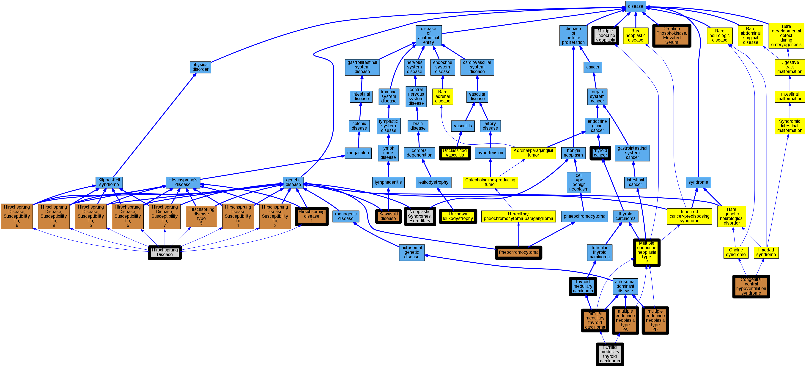

## GENE: RET

[matched diseases visual](RET.png)  <-- click on raw to zoom

### CENTRAL HYPOVENTILATION SYNDROME, CONGENITAL
 * [OMIM:209880 Congenital central hypoventilation syndrome](http://beta.monarchinitiative.org/disease/OMIM:209880) Confidence: high
    * Equiv:[MESH:C536209 Congenital central hypoventilation syndrome](http://beta.monarchinitiative.org/disease/MESH:C536209)
    * Syn: "Autonomic Control, Congenital Failure of"
    * Syn: "CCHS"
    * Syn: "Cchs With Hirschsprung Disease"
    * Syn: "CENTRAL HYPOVENTILATION SYNDROME, CONGENITAL; CCHS"
    * Syn: "Haddad Syndrome"
    * Syn: "Ondine Curse, Congenital"
    * Syn: "Ondine-Hirschsprung Disease"

### CENTRAL HYPOVENTILATION SYNDROME, CONGENITAL, WITH HIRSCHSPRUNG DISEASE
 * [OMIM:209880 Congenital central hypoventilation syndrome](http://beta.monarchinitiative.org/disease/OMIM:209880) Confidence: low/0.14081632653061224
    * Equiv:[MESH:C536209 Congenital central hypoventilation syndrome](http://beta.monarchinitiative.org/disease/MESH:C536209)
    * Syn: "Autonomic Control, Congenital Failure of"
    * Syn: "CCHS"
    * Syn: "Cchs With Hirschsprung Disease"
    * Syn: "CENTRAL HYPOVENTILATION SYNDROME, CONGENITAL; CCHS"
    * Syn: "Haddad Syndrome"
    * Syn: "Ondine Curse, Congenital"
    * Syn: "Ondine-Hirschsprung Disease"

### Elevated basal serum calcitonin
 * [OMIM:123320 Creatine Phosphokinase, Elevated Serum](http://beta.monarchinitiative.org/disease/OMIM:123320) Confidence: low/0.11458333333333333
    * Syn: "Cpk, Elevated Serum"
    * Syn: "CREATINE PHOSPHOKINASE, ELEVATED SERUM"
    * Syn: "Hyperckemia, Idiopathic"

### FMTC and Unclassified
 * [OMIM:155240 familial medullary thyroid carcinoma](http://beta.monarchinitiative.org/disease/OMIM:155240) Confidence: low/0.1388888888888889
    * Equiv:[DOID:0050547 familial medullary thyroid carcinoma](http://beta.monarchinitiative.org/disease/DOID:0050547)
    * Syn: "Fmtc"
    * Syn: "MTC"
    * Syn: "Mtc1"
    * Syn: "THYROID CARCINOMA, FAMILIAL MEDULLARY"
    * Syn: "THYROID CARCINOMA, FAMILIAL MEDULLARY; MTC"

### Familial medullary thyroid carcinoma
 * [MESH:C536911 Familial medullary thyroid carcinoma](http://beta.monarchinitiative.org/disease/MESH:C536911) Confidence: high

### HIRSCHSPRUNG DISEASE, PROTECTION AGAINST
 * [OMIM:611775 Kawasaki disease](http://beta.monarchinitiative.org/disease/OMIM:611775) Confidence: low/0.0703125
    * Equiv:[DOID:13378 Kawasaki disease](http://beta.monarchinitiative.org/disease/DOID:13378)
    * Equiv:[MESH:C537014 Infantile polyarteritis](http://beta.monarchinitiative.org/disease/MESH:C537014)
    * Equiv:[MESH:D009080 Mucocutaneous Lymph Node Syndrome](http://beta.monarchinitiative.org/disease/MESH:D009080)
    * Syn: "acute febrile MCLS"
    * Syn: "acute febrile mucocutaneous lymph node syndrome [MCLS]"
    * Syn: "Infantile Polyarteritis"
    * Syn: "KAWASAKI DISEASE"
    * Syn: "Kawasaki's disease"
    * Syn: "Kd"
    * Syn: "MLNS"
    * Syn: "Mucocutaneous Lymph Node Syndrome"
    * Syn: "mucocutaneous lymph node syndrome"

### HIRSCHSPRUNG DISEASE, SUSCEPTIBILITY TO, 1
 * [OMIM:142623 Hirschsprung disease 1](http://beta.monarchinitiative.org/disease/OMIM:142623) Confidence: low/0.1388888888888889
    * Equiv:[MESH:C538540 Hirschsprung disease 1](http://beta.monarchinitiative.org/disease/MESH:C538540)
    * Syn: "Aganglionic Megacolon"
    * Syn: "Hirschsprung Disease"
    * Syn: "HIRSCHSPRUNG DISEASE, SUSCEPTIBILITY TO, 1; HSCR1"
    * Syn: "HSCR1"
    * Syn: "Megacolon, Aganglionic"

### Hirschsprung Disease
 * [MESH:D006627 Hirschsprung Disease](http://beta.monarchinitiative.org/disease/MESH:D006627) Confidence: high

### Hirschsprung disease
 * [MESH:D006627 Hirschsprung Disease](http://beta.monarchinitiative.org/disease/MESH:D006627) Confidence: high

### MEN2 phenotype: Unclassified
 * [Orphanet:251328 Unclassified vasculitis](http://beta.monarchinitiative.org/disease/Orphanet:251328) Confidence: low/0.0763888888888889

### MEN2 phenotype: Unknown
 * [Orphanet:84096 Unknown leukodystrophy](http://beta.monarchinitiative.org/disease/Orphanet:84096) Confidence: low/0.0763888888888889

### MEN2A and FMTC
 * [OMIM:171400 multiple endocrine neoplasia type 2A](http://beta.monarchinitiative.org/disease/OMIM:171400) Confidence: low/0.1388888888888889
    * Equiv:[DOID:0050430 multiple endocrine neoplasia type 2A](http://beta.monarchinitiative.org/disease/DOID:0050430)
    * Equiv:[MESH:D018813 Multiple Endocrine Neoplasia Type 2a](http://beta.monarchinitiative.org/disease/MESH:D018813)
    * Syn: "MEN2A"
    * Syn: "multiple endocrine neoplasia II"
    * Syn: "MULTIPLE ENDOCRINE NEOPLASIA, TYPE IIA; MEN2A"
    * Syn: "Pheochromocytoma and Amyloid-Producing Medullary Thyroid Carcinoma"
    * Syn: "Ptc Syndrome"
    * Syn: "Sipple Syndrome"
    * Syn: "Sipple syndrome"
    * Syn: "Thyroid Carcinoma, Familial Medullary"

### MEN2A and Unclassified
 * [OMIM:171400 multiple endocrine neoplasia type 2A](http://beta.monarchinitiative.org/disease/OMIM:171400) Confidence: low/0.1388888888888889
    * Equiv:[DOID:0050430 multiple endocrine neoplasia type 2A](http://beta.monarchinitiative.org/disease/DOID:0050430)
    * Equiv:[MESH:D018813 Multiple Endocrine Neoplasia Type 2a](http://beta.monarchinitiative.org/disease/MESH:D018813)
    * Syn: "MEN2A"
    * Syn: "multiple endocrine neoplasia II"
    * Syn: "MULTIPLE ENDOCRINE NEOPLASIA, TYPE IIA; MEN2A"
    * Syn: "Pheochromocytoma and Amyloid-Producing Medullary Thyroid Carcinoma"
    * Syn: "Ptc Syndrome"
    * Syn: "Sipple Syndrome"
    * Syn: "Sipple syndrome"
    * Syn: "Thyroid Carcinoma, Familial Medullary"

### MULTIPLE ENDOCRINE NEOPLASIA, TYPE IIA
 * [OMIM:171400 multiple endocrine neoplasia type 2A](http://beta.monarchinitiative.org/disease/OMIM:171400) Confidence: low/0.19097222222222224
    * Equiv:[DOID:0050430 multiple endocrine neoplasia type 2A](http://beta.monarchinitiative.org/disease/DOID:0050430)
    * Equiv:[MESH:D018813 Multiple Endocrine Neoplasia Type 2a](http://beta.monarchinitiative.org/disease/MESH:D018813)
    * Syn: "MEN2A"
    * Syn: "multiple endocrine neoplasia II"
    * Syn: "MULTIPLE ENDOCRINE NEOPLASIA, TYPE IIA; MEN2A"
    * Syn: "Pheochromocytoma and Amyloid-Producing Medullary Thyroid Carcinoma"
    * Syn: "Ptc Syndrome"
    * Syn: "Sipple Syndrome"
    * Syn: "Sipple syndrome"
    * Syn: "Thyroid Carcinoma, Familial Medullary"

### MULTIPLE ENDOCRINE NEOPLASIA, TYPE IIA, WITH HIRSCHSPRUNG DISEASE
 * [OMIM:171400 multiple endocrine neoplasia type 2A](http://beta.monarchinitiative.org/disease/OMIM:171400) Confidence: low/0.15299479166666669
    * Equiv:[DOID:0050430 multiple endocrine neoplasia type 2A](http://beta.monarchinitiative.org/disease/DOID:0050430)
    * Equiv:[MESH:D018813 Multiple Endocrine Neoplasia Type 2a](http://beta.monarchinitiative.org/disease/MESH:D018813)
    * Syn: "MEN2A"
    * Syn: "multiple endocrine neoplasia II"
    * Syn: "MULTIPLE ENDOCRINE NEOPLASIA, TYPE IIA; MEN2A"
    * Syn: "Pheochromocytoma and Amyloid-Producing Medullary Thyroid Carcinoma"
    * Syn: "Ptc Syndrome"
    * Syn: "Sipple Syndrome"
    * Syn: "Sipple syndrome"
    * Syn: "Thyroid Carcinoma, Familial Medullary"

### MULTIPLE ENDOCRINE NEOPLASIA, TYPE IIA, WITHOUT PHEOCHROMOCYTOMA
 * [OMIM:171400 multiple endocrine neoplasia type 2A](http://beta.monarchinitiative.org/disease/OMIM:171400) Confidence: low/0.1679421768707483
    * Equiv:[DOID:0050430 multiple endocrine neoplasia type 2A](http://beta.monarchinitiative.org/disease/DOID:0050430)
    * Equiv:[MESH:D018813 Multiple Endocrine Neoplasia Type 2a](http://beta.monarchinitiative.org/disease/MESH:D018813)
    * Syn: "MEN2A"
    * Syn: "multiple endocrine neoplasia II"
    * Syn: "MULTIPLE ENDOCRINE NEOPLASIA, TYPE IIA; MEN2A"
    * Syn: "Pheochromocytoma and Amyloid-Producing Medullary Thyroid Carcinoma"
    * Syn: "Ptc Syndrome"
    * Syn: "Sipple Syndrome"
    * Syn: "Sipple syndrome"
    * Syn: "Thyroid Carcinoma, Familial Medullary"

### MULTIPLE ENDOCRINE NEOPLASIA, TYPE IIB
 * [OMIM:162300 multiple endocrine neoplasia type 2B](http://beta.monarchinitiative.org/disease/OMIM:162300) Confidence: low/0.19097222222222224
    * Equiv:[DOID:10016 multiple endocrine neoplasia type 2B](http://beta.monarchinitiative.org/disease/DOID:10016)
    * Equiv:[MESH:D018814 Multiple Endocrine Neoplasia Type 2b](http://beta.monarchinitiative.org/disease/MESH:D018814)
    * Syn: "Men 2B"
    * Syn: "MEN type IIB"
    * Syn: "MEN2B"
    * Syn: "Mucosal Neuroma Syndrome"
    * Syn: "mucosal neuroma syndrome"
    * Syn: "multiple endocrine neoplasia type 2b"
    * Syn: "Multiple endocrine neoplasia, type 3"
    * Syn: "MULTIPLE ENDOCRINE NEOPLASIA, TYPE IIB; MEN2B"
    * Syn: "Multiple Endocrine Neoplasia, Type Iii, Formerly"
    * Syn: "Neuromata, Mucosal, With Endocrine Tumors"
    * Syn: "Wagenmann-Froboese Syndrome"
    * Syn: "Wagenmann-Froboese syndrome"

### Multiple Endocrine Neoplasia Type 2
 * [Orphanet:653 Multiple endocrine neoplasia type 2](http://beta.monarchinitiative.org/disease/Orphanet:653) Confidence: high

### Multiple Endocrine Neoplasia Type 2A
 * [OMIM:171400 multiple endocrine neoplasia type 2A](http://beta.monarchinitiative.org/disease/OMIM:171400) Confidence: high
    * Equiv:[DOID:0050430 multiple endocrine neoplasia type 2A](http://beta.monarchinitiative.org/disease/DOID:0050430)
    * Equiv:[MESH:D018813 Multiple Endocrine Neoplasia Type 2a](http://beta.monarchinitiative.org/disease/MESH:D018813)
    * Syn: "MEN2A"
    * Syn: "multiple endocrine neoplasia II"
    * Syn: "MULTIPLE ENDOCRINE NEOPLASIA, TYPE IIA; MEN2A"
    * Syn: "Pheochromocytoma and Amyloid-Producing Medullary Thyroid Carcinoma"
    * Syn: "Ptc Syndrome"
    * Syn: "Sipple Syndrome"
    * Syn: "Sipple syndrome"
    * Syn: "Thyroid Carcinoma, Familial Medullary"

### Multiple endocrine neoplasia 2
 * [MESH:D009377 Multiple Endocrine Neoplasia](http://beta.monarchinitiative.org/disease/MESH:D009377) Confidence: low/0.1953125
    * Equiv:[DC:0000291 -](http://beta.monarchinitiative.org/disease/DC:0000291)

### Multiple endocrine neoplasia 2A
 * [OMIM:171400 multiple endocrine neoplasia type 2A](http://beta.monarchinitiative.org/disease/OMIM:171400) Confidence: low/0.19097222222222224
    * Equiv:[DOID:0050430 multiple endocrine neoplasia type 2A](http://beta.monarchinitiative.org/disease/DOID:0050430)
    * Equiv:[MESH:D018813 Multiple Endocrine Neoplasia Type 2a](http://beta.monarchinitiative.org/disease/MESH:D018813)
    * Syn: "MEN2A"
    * Syn: "multiple endocrine neoplasia II"
    * Syn: "MULTIPLE ENDOCRINE NEOPLASIA, TYPE IIA; MEN2A"
    * Syn: "Pheochromocytoma and Amyloid-Producing Medullary Thyroid Carcinoma"
    * Syn: "Ptc Syndrome"
    * Syn: "Sipple Syndrome"
    * Syn: "Sipple syndrome"
    * Syn: "Thyroid Carcinoma, Familial Medullary"

### Multiple endocrine neoplasia type 2A
 * [OMIM:171400 multiple endocrine neoplasia type 2A](http://beta.monarchinitiative.org/disease/OMIM:171400) Confidence: high
    * Equiv:[DOID:0050430 multiple endocrine neoplasia type 2A](http://beta.monarchinitiative.org/disease/DOID:0050430)
    * Equiv:[MESH:D018813 Multiple Endocrine Neoplasia Type 2a](http://beta.monarchinitiative.org/disease/MESH:D018813)
    * Syn: "MEN2A"
    * Syn: "multiple endocrine neoplasia II"
    * Syn: "MULTIPLE ENDOCRINE NEOPLASIA, TYPE IIA; MEN2A"
    * Syn: "Pheochromocytoma and Amyloid-Producing Medullary Thyroid Carcinoma"
    * Syn: "Ptc Syndrome"
    * Syn: "Sipple Syndrome"
    * Syn: "Sipple syndrome"
    * Syn: "Thyroid Carcinoma, Familial Medullary"

### Multiple endocrine neoplasia type 2B
 * [OMIM:162300 multiple endocrine neoplasia type 2B](http://beta.monarchinitiative.org/disease/OMIM:162300) Confidence: high
    * Equiv:[DOID:10016 multiple endocrine neoplasia type 2B](http://beta.monarchinitiative.org/disease/DOID:10016)
    * Equiv:[MESH:D018814 Multiple Endocrine Neoplasia Type 2b](http://beta.monarchinitiative.org/disease/MESH:D018814)
    * Syn: "Men 2B"
    * Syn: "MEN type IIB"
    * Syn: "MEN2B"
    * Syn: "Mucosal Neuroma Syndrome"
    * Syn: "mucosal neuroma syndrome"
    * Syn: "multiple endocrine neoplasia type 2b"
    * Syn: "Multiple endocrine neoplasia, type 3"
    * Syn: "MULTIPLE ENDOCRINE NEOPLASIA, TYPE IIB; MEN2B"
    * Syn: "Multiple Endocrine Neoplasia, Type Iii, Formerly"
    * Syn: "Neuromata, Mucosal, With Endocrine Tumors"
    * Syn: "Wagenmann-Froboese Syndrome"
    * Syn: "Wagenmann-Froboese syndrome"

### Multiple endocrine neoplasia, type 2
 * [Orphanet:653 Multiple endocrine neoplasia type 2](http://beta.monarchinitiative.org/disease/Orphanet:653) Confidence: high

### Multiple endocrine neoplasia, type 2a
 * [OMIM:171400 multiple endocrine neoplasia type 2A](http://beta.monarchinitiative.org/disease/OMIM:171400) Confidence: high
    * Equiv:[DOID:0050430 multiple endocrine neoplasia type 2A](http://beta.monarchinitiative.org/disease/DOID:0050430)
    * Equiv:[MESH:D018813 Multiple Endocrine Neoplasia Type 2a](http://beta.monarchinitiative.org/disease/MESH:D018813)
    * Syn: "MEN2A"
    * Syn: "multiple endocrine neoplasia II"
    * Syn: "MULTIPLE ENDOCRINE NEOPLASIA, TYPE IIA; MEN2A"
    * Syn: "Pheochromocytoma and Amyloid-Producing Medullary Thyroid Carcinoma"
    * Syn: "Ptc Syndrome"
    * Syn: "Sipple Syndrome"
    * Syn: "Sipple syndrome"
    * Syn: "Thyroid Carcinoma, Familial Medullary"

### Neoplastic Syndromes, Hereditary
 * [MESH:D009386 Neoplastic Syndromes, Hereditary](http://beta.monarchinitiative.org/disease/MESH:D009386) Confidence: high

### No MEN2 disease
 * [disease -](http://beta.monarchinitiative.org/disease/disease) Confidence: low/0.1388888888888889

### PHEOCHROMOCYTOMA
 * [OMIM:171300 Pheochromocytoma](http://beta.monarchinitiative.org/disease/OMIM:171300) Confidence: high
    * Equiv:[MESH:D010673 Pheochromocytoma](http://beta.monarchinitiative.org/disease/MESH:D010673)
    * Syn: "PHEOCHROMOCYTOMA"
    * Syn: "Pheochromocytoma, Susceptibility to"

### PHEOCHROMOCYTOMA, SOMATIC
 * [OMIM:171300 Pheochromocytoma](http://beta.monarchinitiative.org/disease/OMIM:171300) Confidence: low/0.15625
    * Equiv:[MESH:D010673 Pheochromocytoma](http://beta.monarchinitiative.org/disease/MESH:D010673)
    * Syn: "PHEOCHROMOCYTOMA"
    * Syn: "Pheochromocytoma, Susceptibility to"

### RECLASSIFIED - VARIANT OF UNKNOWN SIGNIFICANCE
 * [Orphanet:84096 Unknown leukodystrophy](http://beta.monarchinitiative.org/disease/Orphanet:84096) Confidence: low/0.0675

### THYROID CARCINOMA, FAMILIAL MEDULLARY
 * [MESH:C536911 Familial medullary thyroid carcinoma](http://beta.monarchinitiative.org/disease/MESH:C536911) Confidence: high

### THYROID CARCINOMA, SPORADIC MEDULLARY
 * [OMIM:155240 familial medullary thyroid carcinoma](http://beta.monarchinitiative.org/disease/OMIM:155240) Confidence: low/0.1640625
    * Equiv:[DOID:0050547 familial medullary thyroid carcinoma](http://beta.monarchinitiative.org/disease/DOID:0050547)
    * Syn: "Fmtc"
    * Syn: "MTC"
    * Syn: "Mtc1"
    * Syn: "THYROID CARCINOMA, FAMILIAL MEDULLARY"
    * Syn: "THYROID CARCINOMA, FAMILIAL MEDULLARY; MTC"

### Thyroid cancer
 * [DOID:1781 thyroid cancer](http://beta.monarchinitiative.org/disease/DOID:1781) Confidence: high
    * Syn: "malignant neoplasm of thyroid gland"
    * Syn: "malignant tumour of thyroid gland"
    * Syn: "neoplasm of thyroid gland"
    * Syn: "Thyroid gland neoplasm"
    * Syn: "thyroid neoplasm"

### Thyroid carcinoma, medullary
 * [DOID:3973 thyroid medullary carcinoma](http://beta.monarchinitiative.org/disease/DOID:3973) Confidence: high
    * Equiv:[MESH:C536914 Thyroid cancer, medullary](http://beta.monarchinitiative.org/disease/MESH:C536914)
    * Syn: "Medullary carcinoma of the Thyroid gland"
    * Syn: "medullary thyroid carcinoma"
    * Syn: "Medullary thyroid carcinoma (disorder)"
    * Syn: "Ultimobranchial thyroid tumor"
    * Syn: "Ultimobranchial thyroid tumour"

### Unclassifed
