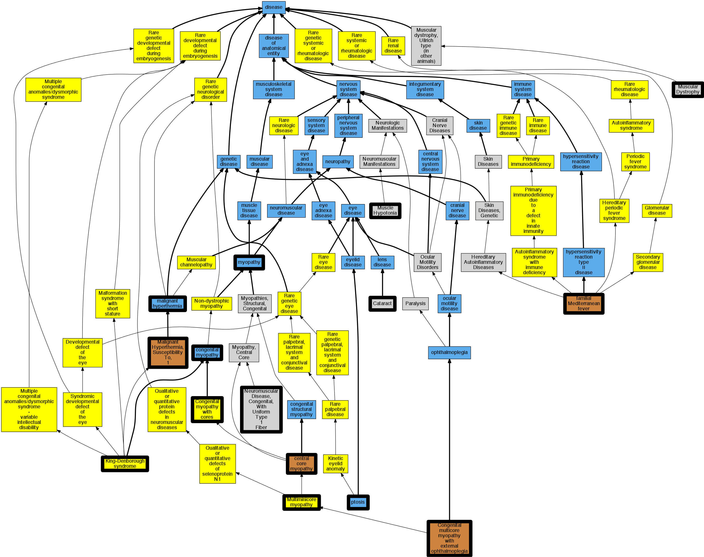

## GENE: RYR1

[matched diseases visual](RYR1.png)  <-- click on raw to zoom

### CENTRAL CORE DISEASE, AUTOSOMAL RECESSIVE
 * [OMIM:254700 Myeloproliferative Disease, Autosomal Recessive](http://beta.monarchinitiative.org/disease/OMIM:254700) Confidence: low/0.13874999999999998
    * Equiv:[MESH:C564977 Myeloproliferative Disease, Autosomal Recessive](http://beta.monarchinitiative.org/disease/MESH:C564977)
    * Syn: "MYELOPROLIFERATIVE DISEASE, AUTOSOMAL RECESSIVE"

### KING-DENBOROUGH SYNDROME
 * [OMIM:145600 King-Denborough syndrome](http://beta.monarchinitiative.org/disease/OMIM:145600) Confidence: high
    * Equiv:[Orphanet:99741 King-Denborough syndrome](http://beta.monarchinitiative.org/disease/Orphanet:99741)
    * Equiv:[MESH:C535694 Malignant hyperthermia susceptibility type 1](http://beta.monarchinitiative.org/disease/MESH:C535694)
    * Equiv:[MESH:C536883 King Denborough syndrome](http://beta.monarchinitiative.org/disease/MESH:C536883)
    * Syn: "Hyperpyrexia, Malignant"
    * Syn: "Hyperthermia of Anesthesia"
    * Syn: "King Syndrome"
    * Syn: "King-Denborough Syndrome"
    * Syn: "MALIGNANT HYPERTHERMIA, SUSCEPTIBILITY TO, 1; MHS1"
    * Syn: "Mhs"
    * Syn: "MHS1"

### Malignant hyperthermia equivocal with halotane
 * [DOID:8545 malignant hyperthermia](http://beta.monarchinitiative.org/disease/DOID:8545) Confidence: low/0.14500000000000002
    * Equiv:[MESH:D008305 Malignant Hyperthermia](http://beta.monarchinitiative.org/disease/MESH:D008305)
    * Syn: "anesthesia related hyperthermia"
    * Syn: "malignant hyperpyrexia due to anesthesia"

### Malignant hyperthermia susceptibility 1
 * [DOID:8545 malignant hyperthermia](http://beta.monarchinitiative.org/disease/DOID:8545) Confidence: low/0.15625
    * Equiv:[MESH:D008305 Malignant Hyperthermia](http://beta.monarchinitiative.org/disease/MESH:D008305)
    * Syn: "anesthesia related hyperthermia"
    * Syn: "malignant hyperpyrexia due to anesthesia"

### Myopathy, congenital with cores
 * [Orphanet:172976 Congenital myopathy with cores](http://beta.monarchinitiative.org/disease/Orphanet:172976) Confidence: high

### Myopathy, progressive axial with cataracts
 * [DOID:83 cataract](http://beta.monarchinitiative.org/disease/DOID:83) Confidence: low/0.13
    * Equiv:[MESH:D002386 Cataract](http://beta.monarchinitiative.org/disease/MESH:D002386)

### Axial myopathy, late-onset
 * [DOID:423 myopathy](http://beta.monarchinitiative.org/disease/DOID:423) Confidence: low/0.1328125
    * Equiv:[MESH:D009135 Muscular Diseases](http://beta.monarchinitiative.org/disease/MESH:D009135)

### Central core disease
 * [DOID:3529 central core myopathy](http://beta.monarchinitiative.org/disease/DOID:3529) Confidence: high
    * Syn: "central core disease"
    * Syn: "central core disease (disorder)"

### MINICORE MYOPATHY WITH EXTERNAL OPHTHALMOPLEGIA
 * [OMIM:255320 Minicore Myopathy with External Ophthalmoplegia](http://beta.monarchinitiative.org/disease/OMIM:255320) Confidence: high
    * Equiv:[MESH:C537474 Minicore myopathy, antenatal onset, with arthrogryposis](http://beta.monarchinitiative.org/disease/MESH:C537474)
    * Equiv:[MESH:C564969 Minicore Myopathy with External Ophthalmoplegia](http://beta.monarchinitiative.org/disease/MESH:C564969)
    * Syn: "Minicore Myopathy"
    * Syn: "MINICORE MYOPATHY WITH EXTERNAL OPHTHALMOPLEGIA"
    * Syn: "Minicore Myopathy, Antenatal Onset, with Arthrogryposis"
    * Syn: "Multicore Myopathy"
    * Syn: "Multiminicore Disease With External Ophthalmoplegia"
    * Syn: "Multiminicore Myopathy Multicore Myopathy With External Ophthalmoplegia"

### Multi-minicore disease
 * [disease -](http://beta.monarchinitiative.org/disease/disease) Confidence: low/0.1388888888888889

### Ptosis
 * [DOID:0060260 ptosis](http://beta.monarchinitiative.org/disease/DOID:0060260) Confidence: high
    * Equiv:[MESH:D001763 Blepharoptosis](http://beta.monarchinitiative.org/disease/MESH:D001763)
    * Syn: "blepharoptosis"
    * Syn: "drooping eyelid"

### Ptosis
 * [DOID:0060260 ptosis](http://beta.monarchinitiative.org/disease/DOID:0060260) Confidence: high
    * Equiv:[MESH:D001763 Blepharoptosis](http://beta.monarchinitiative.org/disease/MESH:D001763)
    * Syn: "blepharoptosis"
    * Syn: "drooping eyelid"

### Sacral agenesis
 * [OMIM:600145 Sacral defect and anterior sacral meningocele](http://beta.monarchinitiative.org/disease/OMIM:600145) Confidence: high
    * Equiv:[MESH:C537221 Sacral defect and anterior sacral meningocele](http://beta.monarchinitiative.org/disease/MESH:C537221)
    * Syn: "Caudal Dysgenesis Syndrome"
    * Syn: "Caudal Regression Syndrome"
    * Syn: "Sacral Agenesis"
    * Syn: "SACRAL DEFECT WITH ANTERIOR MENINGOCELE"
    * Syn: "Sdam"
    * Syn: "Sirenomelia"

### Sacral agenesis
 * [OMIM:600145 Sacral defect and anterior sacral meningocele](http://beta.monarchinitiative.org/disease/OMIM:600145) Confidence: high
    * Equiv:[MESH:C537221 Sacral defect and anterior sacral meningocele](http://beta.monarchinitiative.org/disease/MESH:C537221)
    * Syn: "Caudal Dysgenesis Syndrome"
    * Syn: "Caudal Regression Syndrome"
    * Syn: "Sacral Agenesis"
    * Syn: "SACRAL DEFECT WITH ANTERIOR MENINGOCELE"
    * Syn: "Sdam"
    * Syn: "Sirenomelia"

### Sacral agenesis
 * [OMIM:600145 Sacral defect and anterior sacral meningocele](http://beta.monarchinitiative.org/disease/OMIM:600145) Confidence: high
    * Equiv:[MESH:C537221 Sacral defect and anterior sacral meningocele](http://beta.monarchinitiative.org/disease/MESH:C537221)
    * Syn: "Caudal Dysgenesis Syndrome"
    * Syn: "Caudal Regression Syndrome"
    * Syn: "Sacral Agenesis"
    * Syn: "SACRAL DEFECT WITH ANTERIOR MENINGOCELE"
    * Syn: "Sdam"
    * Syn: "Sirenomelia"

### History of neonatal hypotonia
 * [Orphanet:44 Neonatal adrenoleukodystrophy](http://beta.monarchinitiative.org/disease/Orphanet:44) Confidence: low/0.0703125
    * Equiv:[MESH:D018901 Peroxisomal Disorders](http://beta.monarchinitiative.org/disease/MESH:D018901)

### History of neonatal hypotonia
 * [Orphanet:44 Neonatal adrenoleukodystrophy](http://beta.monarchinitiative.org/disease/Orphanet:44) Confidence: low/0.0703125
    * Equiv:[MESH:D018901 Peroxisomal Disorders](http://beta.monarchinitiative.org/disease/MESH:D018901)

### History of neonatal hypotonia
 * [Orphanet:44 Neonatal adrenoleukodystrophy](http://beta.monarchinitiative.org/disease/Orphanet:44) Confidence: low/0.0703125
    * Equiv:[MESH:D018901 Peroxisomal Disorders](http://beta.monarchinitiative.org/disease/MESH:D018901)

### MALIGNANT HYPERTHERMIA, SUSCEPTIBILITY TO, 1
 * [OMIM:145600 King-Denborough syndrome](http://beta.monarchinitiative.org/disease/OMIM:145600) Confidence: low/0.1388888888888889
    * Equiv:[Orphanet:99741 King-Denborough syndrome](http://beta.monarchinitiative.org/disease/Orphanet:99741)
    * Equiv:[MESH:C535694 Malignant hyperthermia susceptibility type 1](http://beta.monarchinitiative.org/disease/MESH:C535694)
    * Equiv:[MESH:C536883 King Denborough syndrome](http://beta.monarchinitiative.org/disease/MESH:C536883)
    * Syn: "Hyperpyrexia, Malignant"
    * Syn: "Hyperthermia of Anesthesia"
    * Syn: "King Syndrome"
    * Syn: "King-Denborough Syndrome"
    * Syn: "MALIGNANT HYPERTHERMIA, SUSCEPTIBILITY TO, 1; MHS1"
    * Syn: "Mhs"
    * Syn: "MHS1"

### Malignant hyperthermia
 * [DOID:8545 malignant hyperthermia](http://beta.monarchinitiative.org/disease/DOID:8545) Confidence: high
    * Equiv:[MESH:D008305 Malignant Hyperthermia](http://beta.monarchinitiative.org/disease/MESH:D008305)
    * Syn: "anesthesia related hyperthermia"
    * Syn: "malignant hyperpyrexia due to anesthesia"

### Malignant hyperthermia & exertional rhabdomyolosis
 * [DOID:8545 malignant hyperthermia](http://beta.monarchinitiative.org/disease/DOID:8545) Confidence: low/0.14500000000000002
    * Equiv:[MESH:D008305 Malignant Hyperthermia](http://beta.monarchinitiative.org/disease/MESH:D008305)
    * Syn: "anesthesia related hyperthermia"
    * Syn: "malignant hyperpyrexia due to anesthesia"

### Malignant hyperthermia susceptibility type 1
 * [OMIM:601888 Malignant hyperthermia susceptibility type 6](http://beta.monarchinitiative.org/disease/OMIM:601888) Confidence: low/0.18000000000000002
    * Equiv:[MESH:C535699 Malignant hyperthermia susceptibility type 6](http://beta.monarchinitiative.org/disease/MESH:C535699)
    * Syn: "MALIGNANT HYPERTHERMIA, SUSCEPTIBILITY TO, 6"
    * Syn: "Mhs6"

### Multiminicore/minicore/multicore disease
 * [disease -](http://beta.monarchinitiative.org/disease/disease) Confidence: low/0.13

### Myopathy, RYR1-associated
 * [DOID:423 myopathy](http://beta.monarchinitiative.org/disease/DOID:423) Confidence: low/0.1388888888888889
    * Equiv:[MESH:D009135 Muscular Diseases](http://beta.monarchinitiative.org/disease/MESH:D009135)

### Myopathy, congenital
 * [DC:0000302 Myopathy, Congenital](http://beta.monarchinitiative.org/disease/DC:0000302) Confidence: high

### CENTRAL CORE DISEASE
 * [DOID:3529 central core myopathy](http://beta.monarchinitiative.org/disease/DOID:3529) Confidence: high
    * Syn: "central core disease"
    * Syn: "central core disease (disorder)"

### Minicore myopathy with external ophthalmoplegia
 * [OMIM:255320 Minicore Myopathy with External Ophthalmoplegia](http://beta.monarchinitiative.org/disease/OMIM:255320) Confidence: high
    * Equiv:[MESH:C537474 Minicore myopathy, antenatal onset, with arthrogryposis](http://beta.monarchinitiative.org/disease/MESH:C537474)
    * Equiv:[MESH:C564969 Minicore Myopathy with External Ophthalmoplegia](http://beta.monarchinitiative.org/disease/MESH:C564969)
    * Syn: "Minicore Myopathy"
    * Syn: "MINICORE MYOPATHY WITH EXTERNAL OPHTHALMOPLEGIA"
    * Syn: "Minicore Myopathy, Antenatal Onset, with Arthrogryposis"
    * Syn: "Multicore Myopathy"
    * Syn: "Multiminicore Disease With External Ophthalmoplegia"
    * Syn: "Multiminicore Myopathy Multicore Myopathy With External Ophthalmoplegia"

### Multi-minicore disease & atypical periodic paralysis
 * [disease -](http://beta.monarchinitiative.org/disease/disease) Confidence: low/0.12755102040816327

### Muscular dystrophy and arthrogryposis
 * [DOID:9884 muscular dystrophy](http://beta.monarchinitiative.org/disease/DOID:9884) Confidence: low/0.15625
    * Equiv:[MESH:D009136 Muscular Dystrophies](http://beta.monarchinitiative.org/disease/MESH:D009136)

### NEUROMUSCULAR DISEASE, CONGENITAL, WITH UNIFORM TYPE 1 FIBER
 * [OMIM:117000 Moderate multiminicore disease with hand involvement](http://beta.monarchinitiative.org/disease/OMIM:117000) Confidence: high
    * Equiv:[Orphanet:178145 Moderate multiminicore disease with hand involvement](http://beta.monarchinitiative.org/disease/Orphanet:178145)
    * Equiv:[MESH:C566147 Minicore Myopathy, Moderate, with Hand Involvement](http://beta.monarchinitiative.org/disease/MESH:C566147)
    * Equiv:[MESH:C567162 Neuromuscular Disease, Congenital, With Uniform Type 1 Fiber](http://beta.monarchinitiative.org/disease/MESH:C567162)
    * Equiv:[MESH:D020512 Myopathy, Central Core](http://beta.monarchinitiative.org/disease/MESH:D020512)
    * Syn: "CCD"
    * Syn: "Cco"
    * Syn: "CENTRAL CORE DISEASE OF MUSCLE; CCD"
    * Syn: "Minicore Myopathy, Moderate, With Hand Involvement"
    * Syn: "Multicore Myopathy, Moderate, With Hand Involvement"
    * Syn: "Multiminicore Disease, Moderate, With Hand Involvement"
    * Syn: "Neuromuscular Disease, Congenital, With Uniform Type 1 Fiber"

### Ptosis
 * [DOID:0060260 ptosis](http://beta.monarchinitiative.org/disease/DOID:0060260) Confidence: high
    * Equiv:[MESH:D001763 Blepharoptosis](http://beta.monarchinitiative.org/disease/MESH:D001763)
    * Syn: "blepharoptosis"
    * Syn: "drooping eyelid"
