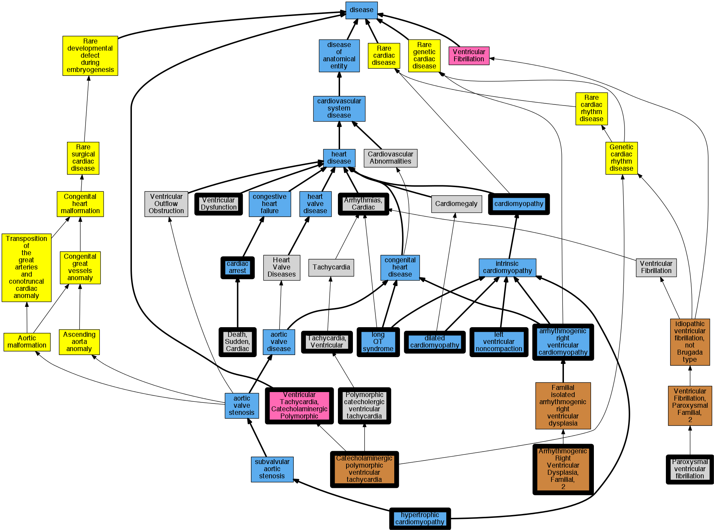

## GENE: RYR2

[matched diseases visual](RYR2.png)  <-- click on raw to zoom

### Arrhythmogenic right ventricular cardiomyopathy
 * [DOID:0050431 arrhythmogenic right ventricular cardiomyopathy](http://beta.monarchinitiative.org/disease/DOID:0050431) Confidence: high
    * Equiv:[MESH:D019571 Arrhythmogenic Right Ventricular Dysplasia](http://beta.monarchinitiative.org/disease/MESH:D019571)
    * Equiv:[Orphanet:247 Arrhythmogenic right ventricular dysplasia](http://beta.monarchinitiative.org/disease/Orphanet:247)
    * Syn: "Arrhythmogenic Right Ventricular Cardiomyopathy"
    * Syn: "Arrhythmogenic Right Ventricular Cardiomyopathy Dysplasia"
    * Syn: "Arrhythmogenic Right Ventricular Cardiomyopathy-Dysplasia"
    * Syn: "Arrhythmogenic right ventricular dysplasia"
    * Syn: "arrhythmogenic right ventricular dysplasia"
    * Syn: "Arrhythmogenic Right Ventricular Dysplasia-Cardiomyopathy"
    * Syn: "arrhythmogenic right ventricular dysplasia/cardiomyopathy"
    * Syn: "ARVC"
    * Syn: "ARVC cardiomyopathy"
    * Syn: "ARVD"
    * Syn: "Right Ventricular Dysplasia, Arrhythmogenic"
    * Syn: "Ventricular Dysplasia, Right, Arrhythmogenic"

### Cardiomyopathy
 * [DOID:0050700 cardiomyopathy](http://beta.monarchinitiative.org/disease/DOID:0050700) Confidence: high
    * Equiv:[MESH:D009202 Cardiomyopathies](http://beta.monarchinitiative.org/disease/MESH:D009202)
    * Equiv:[Orphanet:167848 Cardiomyopathy](http://beta.monarchinitiative.org/disease/Orphanet:167848)
    * Syn: "Cardiomyopathies"
    * Syn: "Cardiomyopathies, Primary"
    * Syn: "Cardiomyopathies, Secondary"
    * Syn: "Cardiomyopathy"
    * Syn: "Cardiomyopathy, Primary"
    * Syn: "Cardiomyopathy, Secondary"
    * Syn: "Disease, Myocardial"
    * Syn: "Disease, Primary Myocardial"
    * Syn: "Disease, Secondary Myocardial"
    * Syn: "Diseases, Myocardial"
    * Syn: "Diseases, Primary Myocardial"
    * Syn: "Diseases, Secondary Myocardial"
    * Syn: "Myocardial Disease"
    * Syn: "Myocardial Disease, Primary"
    * Syn: "Myocardial Disease, Secondary"
    * Syn: "Myocardial Diseases"
    * Syn: "Myocardial Diseases, Primary"
    * Syn: "Myocardial Diseases, Secondary"
    * Syn: "Myocardiopathies"
    * Syn: "Myocardiopathy"
    * Syn: "Primary Cardiomyopathies"
    * Syn: "Primary Cardiomyopathy"
    * Syn: "Primary Myocardial Disease"
    * Syn: "Primary Myocardial Diseases"
    * Syn: "Secondary Cardiomyopathies"
    * Syn: "Secondary Cardiomyopathy"
    * Syn: "Secondary Myocardial Disease"
    * Syn: "Secondary Myocardial Diseases"

### Catecholaminergic polymorphic ventricular tachycardia ?
 * [Orphanet:3286 Catecholaminergic polymorphic ventricular tachycardia](http://beta.monarchinitiative.org/disease/Orphanet:3286) Confidence: low/0.20500000000000002
    * Syn: "Bidirectional tachycardia induced by catecholamine"
    * Syn: "CPVT"
    * Syn: "Double tachycardia induced by catecholamines"
    * Syn: "Malignant paroxysmal ventricular tachycardia"
    * Syn: "Multifocal ventricular premature beats"

### Left ventricular noncompaction cardiomyopathy
 * [DOID:0060480 left ventricular noncompaction](http://beta.monarchinitiative.org/disease/DOID:0060480) Confidence: low/0.1953125
    * Equiv:[Orphanet:54260 Left ventricular noncompaction](http://beta.monarchinitiative.org/disease/Orphanet:54260)
    * Syn: "Left ventricular hypertrabeculation"
    * Syn: "left ventricular hypertrabeculation"
    * Syn: "LVNC"
    * Syn: "Spongy myocardium"

### Primary dilated cardiomyopathy
 * [DOID:12930 dilated cardiomyopathy](http://beta.monarchinitiative.org/disease/DOID:12930) Confidence: high
    * Equiv:[Orphanet:217604 Dilated cardiomyopathy](http://beta.monarchinitiative.org/disease/Orphanet:217604)
    * Syn: "1A, Dilated cardiomyopathy"
    * Syn: "1As, Dilated cardiomyopathy"
    * Syn: "Cardiomyopathies, Congestive"
    * Syn: "Cardiomyopathies, Dilated"
    * Syn: "Cardiomyopathies, Familial Idiopathic"
    * Syn: "Cardiomyopathies, Idiopathic Dilated"
    * Syn: "cardiomyopathy 1A, Dilated"
    * Syn: "cardiomyopathy 1As, Dilated"
    * Syn: "Cardiomyopathy, Congestive"
    * Syn: "Cardiomyopathy, Dilated, 1a"
    * Syn: "Cardiomyopathy, Dilated, Autosomal Recessive"
    * Syn: "Cardiomyopathy, Dilated, CMD1A"
    * Syn: "Cardiomyopathy, Dilated, LMNA"
    * Syn: "Cardiomyopathy, Dilated, With Conduction Defect 1"
    * Syn: "Cardiomyopathy, Dilated, with Conduction Deffect1"
    * Syn: "Cardiomyopathy, Familial Idiopathic"
    * Syn: "Cardiomyopathy, Idiopathic Dilated"
    * Syn: "Congestive Cardiomyopathies"
    * Syn: "Congestive Cardiomyopathy"
    * Syn: "Congestive cardiomyopathy"
    * Syn: "Dilated Cardiomyopathies"
    * Syn: "Dilated Cardiomyopathies, Idiopathic"
    * Syn: "Dilated Cardiomyopathy"
    * Syn: "Dilated cardiomyopathy 1A"
    * Syn: "Dilated cardiomyopathy 1As"
    * Syn: "Dilated Cardiomyopathy, Idiopathic"
    * Syn: "Familial dilated cardiomyopathy"
    * Syn: "Familial Idiopathic Cardiomyopathies"
    * Syn: "Familial Idiopathic Cardiomyopathy"
    * Syn: "Idiopathic Cardiomyopathies, Familial"
    * Syn: "Idiopathic Cardiomyopathy, Familial"
    * Syn: "Idiopathic Dilated Cardiomyopathies"
    * Syn: "Idiopathic Dilated Cardiomyopathy"
    * Syn: "Idiopathic dilation cardiomyopathy"
    * Syn: "primary dilated cardiomyopathy"

### Ventricular tachycardia, polymorphic
 * [MESH:D017180 Tachycardia, Ventricular](http://beta.monarchinitiative.org/disease/MESH:D017180) Confidence: low/0.18055555555555555
    * Syn: "Tachycardias, Ventricular"
    * Syn: "Ventricular Tachycardia"
    * Syn: "Ventricular Tachycardias"

### Arrhythmia
 * [MESH:D001145 Arrhythmias, Cardiac](http://beta.monarchinitiative.org/disease/MESH:D001145) Confidence: high
    * Syn: "Arrhythmia"
    * Syn: "Arrhythmia, Cardiac"
    * Syn: "Arrythmia"
    * Syn: "Cardiac Arrhythmia"
    * Syn: "Cardiac Arrhythmias"
    * Syn: "Cardiac Dysrhythmia"
    * Syn: "Dysrhythmia, Cardiac"

### Cardiac Arrest
 * [DOID:0060319 cardiac arrest](http://beta.monarchinitiative.org/disease/DOID:0060319) Confidence: high
    * Equiv:[MESH:D006323 Heart Arrest](http://beta.monarchinitiative.org/disease/MESH:D006323)
    * Syn: "Arrest, Cardiac"
    * Syn: "Arrest, Cardiopulmonary"
    * Syn: "Arrest, Heart"
    * Syn: "Asystole"
    * Syn: "Asystoles"
    * Syn: "Cardiac Arrest"
    * Syn: "Cardiopulmonary Arrest"
    * Syn: "cardiopulmonary arrest"
    * Syn: "circulatory arrest"

### Cardiomyopathy
 * [DOID:0050700 cardiomyopathy](http://beta.monarchinitiative.org/disease/DOID:0050700) Confidence: high
    * Equiv:[MESH:D009202 Cardiomyopathies](http://beta.monarchinitiative.org/disease/MESH:D009202)
    * Equiv:[Orphanet:167848 Cardiomyopathy](http://beta.monarchinitiative.org/disease/Orphanet:167848)
    * Syn: "Cardiomyopathies"
    * Syn: "Cardiomyopathies, Primary"
    * Syn: "Cardiomyopathies, Secondary"
    * Syn: "Cardiomyopathy"
    * Syn: "Cardiomyopathy, Primary"
    * Syn: "Cardiomyopathy, Secondary"
    * Syn: "Disease, Myocardial"
    * Syn: "Disease, Primary Myocardial"
    * Syn: "Disease, Secondary Myocardial"
    * Syn: "Diseases, Myocardial"
    * Syn: "Diseases, Primary Myocardial"
    * Syn: "Diseases, Secondary Myocardial"
    * Syn: "Myocardial Disease"
    * Syn: "Myocardial Disease, Primary"
    * Syn: "Myocardial Disease, Secondary"
    * Syn: "Myocardial Diseases"
    * Syn: "Myocardial Diseases, Primary"
    * Syn: "Myocardial Diseases, Secondary"
    * Syn: "Myocardiopathies"
    * Syn: "Myocardiopathy"
    * Syn: "Primary Cardiomyopathies"
    * Syn: "Primary Cardiomyopathy"
    * Syn: "Primary Myocardial Disease"
    * Syn: "Primary Myocardial Diseases"
    * Syn: "Secondary Cardiomyopathies"
    * Syn: "Secondary Cardiomyopathy"
    * Syn: "Secondary Myocardial Disease"
    * Syn: "Secondary Myocardial Diseases"

### Catecholaminergic polymorphic ventricular tachycardia
 * [DC:0000665 Ventricular Tachycardia, Catecholaminergic Polymorphic](http://beta.monarchinitiative.org/disease/DC:0000665) Confidence: high

### Diastolic dysfunction
 * [MESH:D018754 Ventricular Dysfunction](http://beta.monarchinitiative.org/disease/MESH:D018754) Confidence: low/0.09375
    * Syn: "Dysfunction, Ventricular"
    * Syn: "Dysfunctions, Ventricular"
    * Syn: "Ventricular Dysfunctions"

### Primary dilated cardiomyopathy
 * [DOID:12930 dilated cardiomyopathy](http://beta.monarchinitiative.org/disease/DOID:12930) Confidence: high
    * Equiv:[Orphanet:217604 Dilated cardiomyopathy](http://beta.monarchinitiative.org/disease/Orphanet:217604)
    * Syn: "1A, Dilated cardiomyopathy"
    * Syn: "1As, Dilated cardiomyopathy"
    * Syn: "Cardiomyopathies, Congestive"
    * Syn: "Cardiomyopathies, Dilated"
    * Syn: "Cardiomyopathies, Familial Idiopathic"
    * Syn: "Cardiomyopathies, Idiopathic Dilated"
    * Syn: "cardiomyopathy 1A, Dilated"
    * Syn: "cardiomyopathy 1As, Dilated"
    * Syn: "Cardiomyopathy, Congestive"
    * Syn: "Cardiomyopathy, Dilated, 1a"
    * Syn: "Cardiomyopathy, Dilated, Autosomal Recessive"
    * Syn: "Cardiomyopathy, Dilated, CMD1A"
    * Syn: "Cardiomyopathy, Dilated, LMNA"
    * Syn: "Cardiomyopathy, Dilated, With Conduction Defect 1"
    * Syn: "Cardiomyopathy, Dilated, with Conduction Deffect1"
    * Syn: "Cardiomyopathy, Familial Idiopathic"
    * Syn: "Cardiomyopathy, Idiopathic Dilated"
    * Syn: "Congestive Cardiomyopathies"
    * Syn: "Congestive Cardiomyopathy"
    * Syn: "Congestive cardiomyopathy"
    * Syn: "Dilated Cardiomyopathies"
    * Syn: "Dilated Cardiomyopathies, Idiopathic"
    * Syn: "Dilated Cardiomyopathy"
    * Syn: "Dilated cardiomyopathy 1A"
    * Syn: "Dilated cardiomyopathy 1As"
    * Syn: "Dilated Cardiomyopathy, Idiopathic"
    * Syn: "Familial dilated cardiomyopathy"
    * Syn: "Familial Idiopathic Cardiomyopathies"
    * Syn: "Familial Idiopathic Cardiomyopathy"
    * Syn: "Idiopathic Cardiomyopathies, Familial"
    * Syn: "Idiopathic Cardiomyopathy, Familial"
    * Syn: "Idiopathic Dilated Cardiomyopathies"
    * Syn: "Idiopathic Dilated Cardiomyopathy"
    * Syn: "Idiopathic dilation cardiomyopathy"
    * Syn: "primary dilated cardiomyopathy"

### Sudden cardiac death
 * [MESH:D016757 Death, Sudden, Cardiac](http://beta.monarchinitiative.org/disease/MESH:D016757) Confidence: high
    * Syn: "Arrest, Sudden Cardiac"
    * Syn: "Cardiac Arrest, Sudden"
    * Syn: "Cardiac Arrests, Sudden"
    * Syn: "Cardiac Death, Sudden"
    * Syn: "Cardiac Sudden Death"
    * Syn: "Death, Cardiac Sudden"
    * Syn: "Death, Sudden Cardiac"
    * Syn: "Sudden Cardiac Arrest"
    * Syn: "Sudden Cardiac Death"
    * Syn: "Sudden Death, Cardiac"

### VENTRICULAR TACHYCARDIA, CATECHOLAMINERGIC POLYMORPHIC, 1
 * [MESH:C536334 Polymorphic catecholergic ventricular tachycardia](http://beta.monarchinitiative.org/disease/MESH:C536334) Confidence: high
    * Syn: "Bidirectional Tachycardia Induced By Catecholamines"
    * Syn: "Catecholamine-induced polymorphic ventricular tachycardia"
    * Syn: "Catecholaminergic polymorphic ventricular tachycardia"
    * Syn: "Cpvt2"
    * Syn: "Familial polymorphic ventricular tachycardia"
    * Syn: "Stress-induced polymorphic ventricular tachycardia"
    * Syn: "Ventricular Tachycardia, Catecholaminergic Polymorphic, 1"
    * Syn: "Ventricular Tachycardia, Catecholaminergic Polymorphic, 2"
    * Syn: "Ventricular Tachycardia, Familial"
    * Syn: "Ventricular Tachycardia, Familial Polymorphic"

### Arrhythmogenic Right Ventricular Dysplasia/Cardiomyopathy
 * [DOID:0050431 arrhythmogenic right ventricular cardiomyopathy](http://beta.monarchinitiative.org/disease/DOID:0050431) Confidence: high
    * Equiv:[MESH:D019571 Arrhythmogenic Right Ventricular Dysplasia](http://beta.monarchinitiative.org/disease/MESH:D019571)
    * Equiv:[Orphanet:247 Arrhythmogenic right ventricular dysplasia](http://beta.monarchinitiative.org/disease/Orphanet:247)
    * Syn: "Arrhythmogenic Right Ventricular Cardiomyopathy"
    * Syn: "Arrhythmogenic Right Ventricular Cardiomyopathy Dysplasia"
    * Syn: "Arrhythmogenic Right Ventricular Cardiomyopathy-Dysplasia"
    * Syn: "Arrhythmogenic right ventricular dysplasia"
    * Syn: "arrhythmogenic right ventricular dysplasia"
    * Syn: "Arrhythmogenic Right Ventricular Dysplasia-Cardiomyopathy"
    * Syn: "arrhythmogenic right ventricular dysplasia/cardiomyopathy"
    * Syn: "ARVC"
    * Syn: "ARVC cardiomyopathy"
    * Syn: "ARVD"
    * Syn: "Right Ventricular Dysplasia, Arrhythmogenic"
    * Syn: "Ventricular Dysplasia, Right, Arrhythmogenic"

### Long QT syndrome
 * [DOID:2843 long QT syndrome](http://beta.monarchinitiative.org/disease/DOID:2843) Confidence: high
    * Equiv:[MESH:D008133 Long QT Syndrome](http://beta.monarchinitiative.org/disease/MESH:D008133)
    * Syn: "long Q-T syndrome"
    * Syn: "LQT"
    * Syn: "Romano-Ward syndrome"
    * Syn: "Romano-Ward syndrome (disorder)"

### Paroxysmal familial ventricular fibrillation
 * [MESH:C537182 Paroxysmal ventricular fibrillation](http://beta.monarchinitiative.org/disease/MESH:C537182) Confidence: high
    * Syn: "Idiopathic ventricular fibrillation"
    * Syn: "Paroxysmal familial ventricular fibrillation"
    * Syn: "Ventricular fibrillation, paroxysmal familial"

### Primary dilated cardiomyopathy
 * [DOID:12930 dilated cardiomyopathy](http://beta.monarchinitiative.org/disease/DOID:12930) Confidence: high
    * Equiv:[Orphanet:217604 Dilated cardiomyopathy](http://beta.monarchinitiative.org/disease/Orphanet:217604)
    * Syn: "1A, Dilated cardiomyopathy"
    * Syn: "1As, Dilated cardiomyopathy"
    * Syn: "Cardiomyopathies, Congestive"
    * Syn: "Cardiomyopathies, Dilated"
    * Syn: "Cardiomyopathies, Familial Idiopathic"
    * Syn: "Cardiomyopathies, Idiopathic Dilated"
    * Syn: "cardiomyopathy 1A, Dilated"
    * Syn: "cardiomyopathy 1As, Dilated"
    * Syn: "Cardiomyopathy, Congestive"
    * Syn: "Cardiomyopathy, Dilated, 1a"
    * Syn: "Cardiomyopathy, Dilated, Autosomal Recessive"
    * Syn: "Cardiomyopathy, Dilated, CMD1A"
    * Syn: "Cardiomyopathy, Dilated, LMNA"
    * Syn: "Cardiomyopathy, Dilated, With Conduction Defect 1"
    * Syn: "Cardiomyopathy, Dilated, with Conduction Deffect1"
    * Syn: "Cardiomyopathy, Familial Idiopathic"
    * Syn: "Cardiomyopathy, Idiopathic Dilated"
    * Syn: "Congestive Cardiomyopathies"
    * Syn: "Congestive Cardiomyopathy"
    * Syn: "Congestive cardiomyopathy"
    * Syn: "Dilated Cardiomyopathies"
    * Syn: "Dilated Cardiomyopathies, Idiopathic"
    * Syn: "Dilated Cardiomyopathy"
    * Syn: "Dilated cardiomyopathy 1A"
    * Syn: "Dilated cardiomyopathy 1As"
    * Syn: "Dilated Cardiomyopathy, Idiopathic"
    * Syn: "Familial dilated cardiomyopathy"
    * Syn: "Familial Idiopathic Cardiomyopathies"
    * Syn: "Familial Idiopathic Cardiomyopathy"
    * Syn: "Idiopathic Cardiomyopathies, Familial"
    * Syn: "Idiopathic Cardiomyopathy, Familial"
    * Syn: "Idiopathic Dilated Cardiomyopathies"
    * Syn: "Idiopathic Dilated Cardiomyopathy"
    * Syn: "Idiopathic dilation cardiomyopathy"
    * Syn: "primary dilated cardiomyopathy"

### Ventricular tachycardia, Catecholaminergic Polymorphic, 1
 * [MESH:C536334 Polymorphic catecholergic ventricular tachycardia](http://beta.monarchinitiative.org/disease/MESH:C536334) Confidence: high
    * Syn: "Bidirectional Tachycardia Induced By Catecholamines"
    * Syn: "Catecholamine-induced polymorphic ventricular tachycardia"
    * Syn: "Catecholaminergic polymorphic ventricular tachycardia"
    * Syn: "Cpvt2"
    * Syn: "Familial polymorphic ventricular tachycardia"
    * Syn: "Stress-induced polymorphic ventricular tachycardia"
    * Syn: "Ventricular Tachycardia, Catecholaminergic Polymorphic, 1"
    * Syn: "Ventricular Tachycardia, Catecholaminergic Polymorphic, 2"
    * Syn: "Ventricular Tachycardia, Familial"
    * Syn: "Ventricular Tachycardia, Familial Polymorphic"

### ARRHYTHMOGENIC RIGHT VENTRICULAR DYSPLASIA, FAMILIAL, 2
 * [OMIM:600996 Arrhythmogenic Right Ventricular Dysplasia, Familial, 2](http://beta.monarchinitiative.org/disease/OMIM:600996) Confidence: high
    * Equiv:[MESH:C563409 Arrhythmogenic Right Ventricular Dysplasia, Familial, 2](http://beta.monarchinitiative.org/disease/MESH:C563409)
    * Syn: "Arrhythmogenic Right Ventricular Cardiomyopathy 2"
    * Syn: "ARRHYTHMOGENIC RIGHT VENTRICULAR DYSPLASIA, FAMILIAL, 2; ARVD2"
    * Syn: "ARVD2"

### Arrhythmogenic Right Ventricular Dysplasia 2
 * [DOID:0050431 arrhythmogenic right ventricular cardiomyopathy](http://beta.monarchinitiative.org/disease/DOID:0050431) Confidence: low/0.20500000000000002
    * Equiv:[MESH:D019571 Arrhythmogenic Right Ventricular Dysplasia](http://beta.monarchinitiative.org/disease/MESH:D019571)
    * Equiv:[Orphanet:247 Arrhythmogenic right ventricular dysplasia](http://beta.monarchinitiative.org/disease/Orphanet:247)
    * Syn: "Arrhythmogenic Right Ventricular Cardiomyopathy"
    * Syn: "Arrhythmogenic Right Ventricular Cardiomyopathy Dysplasia"
    * Syn: "Arrhythmogenic Right Ventricular Cardiomyopathy-Dysplasia"
    * Syn: "Arrhythmogenic right ventricular dysplasia"
    * Syn: "arrhythmogenic right ventricular dysplasia"
    * Syn: "Arrhythmogenic Right Ventricular Dysplasia-Cardiomyopathy"
    * Syn: "arrhythmogenic right ventricular dysplasia/cardiomyopathy"
    * Syn: "ARVC"
    * Syn: "ARVC cardiomyopathy"
    * Syn: "ARVD"
    * Syn: "Right Ventricular Dysplasia, Arrhythmogenic"
    * Syn: "Ventricular Dysplasia, Right, Arrhythmogenic"

### Long QT syndrome
 * [DOID:2843 long QT syndrome](http://beta.monarchinitiative.org/disease/DOID:2843) Confidence: high
    * Equiv:[MESH:D008133 Long QT Syndrome](http://beta.monarchinitiative.org/disease/MESH:D008133)
    * Syn: "long Q-T syndrome"
    * Syn: "LQT"
    * Syn: "Romano-Ward syndrome"
    * Syn: "Romano-Ward syndrome (disorder)"

### Long QT syndrome
 * [DOID:2843 long QT syndrome](http://beta.monarchinitiative.org/disease/DOID:2843) Confidence: high
    * Equiv:[MESH:D008133 Long QT Syndrome](http://beta.monarchinitiative.org/disease/MESH:D008133)
    * Syn: "long Q-T syndrome"
    * Syn: "LQT"
    * Syn: "Romano-Ward syndrome"
    * Syn: "Romano-Ward syndrome (disorder)"

### Paroxysmal familial ventricular fibrillation
 * [MESH:C537182 Paroxysmal ventricular fibrillation](http://beta.monarchinitiative.org/disease/MESH:C537182) Confidence: high
    * Syn: "Idiopathic ventricular fibrillation"
    * Syn: "Paroxysmal familial ventricular fibrillation"
    * Syn: "Ventricular fibrillation, paroxysmal familial"

### Primary dilated cardiomyopathy
 * [DOID:12930 dilated cardiomyopathy](http://beta.monarchinitiative.org/disease/DOID:12930) Confidence: high
    * Equiv:[Orphanet:217604 Dilated cardiomyopathy](http://beta.monarchinitiative.org/disease/Orphanet:217604)
    * Syn: "1A, Dilated cardiomyopathy"
    * Syn: "1As, Dilated cardiomyopathy"
    * Syn: "Cardiomyopathies, Congestive"
    * Syn: "Cardiomyopathies, Dilated"
    * Syn: "Cardiomyopathies, Familial Idiopathic"
    * Syn: "Cardiomyopathies, Idiopathic Dilated"
    * Syn: "cardiomyopathy 1A, Dilated"
    * Syn: "cardiomyopathy 1As, Dilated"
    * Syn: "Cardiomyopathy, Congestive"
    * Syn: "Cardiomyopathy, Dilated, 1a"
    * Syn: "Cardiomyopathy, Dilated, Autosomal Recessive"
    * Syn: "Cardiomyopathy, Dilated, CMD1A"
    * Syn: "Cardiomyopathy, Dilated, LMNA"
    * Syn: "Cardiomyopathy, Dilated, With Conduction Defect 1"
    * Syn: "Cardiomyopathy, Dilated, with Conduction Deffect1"
    * Syn: "Cardiomyopathy, Familial Idiopathic"
    * Syn: "Cardiomyopathy, Idiopathic Dilated"
    * Syn: "Congestive Cardiomyopathies"
    * Syn: "Congestive Cardiomyopathy"
    * Syn: "Congestive cardiomyopathy"
    * Syn: "Dilated Cardiomyopathies"
    * Syn: "Dilated Cardiomyopathies, Idiopathic"
    * Syn: "Dilated Cardiomyopathy"
    * Syn: "Dilated cardiomyopathy 1A"
    * Syn: "Dilated cardiomyopathy 1As"
    * Syn: "Dilated Cardiomyopathy, Idiopathic"
    * Syn: "Familial dilated cardiomyopathy"
    * Syn: "Familial Idiopathic Cardiomyopathies"
    * Syn: "Familial Idiopathic Cardiomyopathy"
    * Syn: "Idiopathic Cardiomyopathies, Familial"
    * Syn: "Idiopathic Cardiomyopathy, Familial"
    * Syn: "Idiopathic Dilated Cardiomyopathies"
    * Syn: "Idiopathic Dilated Cardiomyopathy"
    * Syn: "Idiopathic dilation cardiomyopathy"
    * Syn: "primary dilated cardiomyopathy"

### Primary familial hypertrophic cardiomyopathy
 * [DOID:11984 hypertrophic cardiomyopathy](http://beta.monarchinitiative.org/disease/DOID:11984) Confidence: low/0.1953125
    * Equiv:[MESH:D002312 Cardiomyopathy, Hypertrophic](http://beta.monarchinitiative.org/disease/MESH:D002312)
    * Equiv:[Orphanet:217569 Hypertrophic cardiomyopathy](http://beta.monarchinitiative.org/disease/Orphanet:217569)
    * Syn: "Cardiomyopathies, Hypertrophic"
    * Syn: "Cardiomyopathies, Hypertrophic Obstructive"
    * Syn: "Cardiomyopathy, Hypertrophic Obstructive"
    * Syn: "familial hypertrophic cardiomyopathy"
    * Syn: "Hypertrophic Cardiomyopathies"
    * Syn: "Hypertrophic Cardiomyopathy"
    * Syn: "Hypertrophic Obstructive Cardiomyopathies"
    * Syn: "Hypertrophic Obstructive Cardiomyopathy"
    * Syn: "hypertrophic obstructive cardiomyopathy"
    * Syn: "Hypertrophic subaortic stenosis"
    * Syn: "Obstructive Cardiomyopathies, Hypertrophic"
    * Syn: "Obstructive Cardiomyopathy, Hypertrophic"
    * Syn: "Obstructive hypertrophic cardiomyopathy"

### Primary familial hypertrophic cardiomyopathy
 * [DOID:11984 hypertrophic cardiomyopathy](http://beta.monarchinitiative.org/disease/DOID:11984) Confidence: low/0.1953125
    * Equiv:[MESH:D002312 Cardiomyopathy, Hypertrophic](http://beta.monarchinitiative.org/disease/MESH:D002312)
    * Equiv:[Orphanet:217569 Hypertrophic cardiomyopathy](http://beta.monarchinitiative.org/disease/Orphanet:217569)
    * Syn: "Cardiomyopathies, Hypertrophic"
    * Syn: "Cardiomyopathies, Hypertrophic Obstructive"
    * Syn: "Cardiomyopathy, Hypertrophic Obstructive"
    * Syn: "familial hypertrophic cardiomyopathy"
    * Syn: "Hypertrophic Cardiomyopathies"
    * Syn: "Hypertrophic Cardiomyopathy"
    * Syn: "Hypertrophic Obstructive Cardiomyopathies"
    * Syn: "Hypertrophic Obstructive Cardiomyopathy"
    * Syn: "hypertrophic obstructive cardiomyopathy"
    * Syn: "Hypertrophic subaortic stenosis"
    * Syn: "Obstructive Cardiomyopathies, Hypertrophic"
    * Syn: "Obstructive Cardiomyopathy, Hypertrophic"
    * Syn: "Obstructive hypertrophic cardiomyopathy"

### Primary familial hypertrophic cardiomyopathy
 * [DOID:11984 hypertrophic cardiomyopathy](http://beta.monarchinitiative.org/disease/DOID:11984) Confidence: low/0.1953125
    * Equiv:[MESH:D002312 Cardiomyopathy, Hypertrophic](http://beta.monarchinitiative.org/disease/MESH:D002312)
    * Equiv:[Orphanet:217569 Hypertrophic cardiomyopathy](http://beta.monarchinitiative.org/disease/Orphanet:217569)
    * Syn: "Cardiomyopathies, Hypertrophic"
    * Syn: "Cardiomyopathies, Hypertrophic Obstructive"
    * Syn: "Cardiomyopathy, Hypertrophic Obstructive"
    * Syn: "familial hypertrophic cardiomyopathy"
    * Syn: "Hypertrophic Cardiomyopathies"
    * Syn: "Hypertrophic Cardiomyopathy"
    * Syn: "Hypertrophic Obstructive Cardiomyopathies"
    * Syn: "Hypertrophic Obstructive Cardiomyopathy"
    * Syn: "hypertrophic obstructive cardiomyopathy"
    * Syn: "Hypertrophic subaortic stenosis"
    * Syn: "Obstructive Cardiomyopathies, Hypertrophic"
    * Syn: "Obstructive Cardiomyopathy, Hypertrophic"
    * Syn: "Obstructive hypertrophic cardiomyopathy"

### VENTRICULAR TACHYCARDIA, CATECHOLAMINERGIC POLYMORPHIC, 1, WITH OR WITHOUT ATRIAL DYSFUNCTION AND DILATED CARDIOMYOPATHY
 * [OMIM:604772 Ventricular Tachycardia, Catecholaminergic Polymorphic, 1, With or Without Atrial Dysfunction And/Or Dilated Cardiomyopathy](http://beta.monarchinitiative.org/disease/OMIM:604772) Confidence: high
    * Syn: "CPVT1"
    * Syn: "VENTRICULAR TACHYCARDIA, CATECHOLAMINERGIC POLYMORPHIC, 1, WITH OR WITHOUT ATRIAL DYSFUNCTION AND/OR DILATED CARDIOMYOPATHY; CPVT1"
    * Syn: "Ventricular Tachycardia, Stress-Induced Polymorphic"

### Ventricular tachycardia, catecholaminergic polymorphic, 1
 * [MESH:C536334 Polymorphic catecholergic ventricular tachycardia](http://beta.monarchinitiative.org/disease/MESH:C536334) Confidence: high
    * Syn: "Bidirectional Tachycardia Induced By Catecholamines"
    * Syn: "Catecholamine-induced polymorphic ventricular tachycardia"
    * Syn: "Catecholaminergic polymorphic ventricular tachycardia"
    * Syn: "Cpvt2"
    * Syn: "Familial polymorphic ventricular tachycardia"
    * Syn: "Stress-induced polymorphic ventricular tachycardia"
    * Syn: "Ventricular Tachycardia, Catecholaminergic Polymorphic, 1"
    * Syn: "Ventricular Tachycardia, Catecholaminergic Polymorphic, 2"
    * Syn: "Ventricular Tachycardia, Familial"
    * Syn: "Ventricular Tachycardia, Familial Polymorphic"
