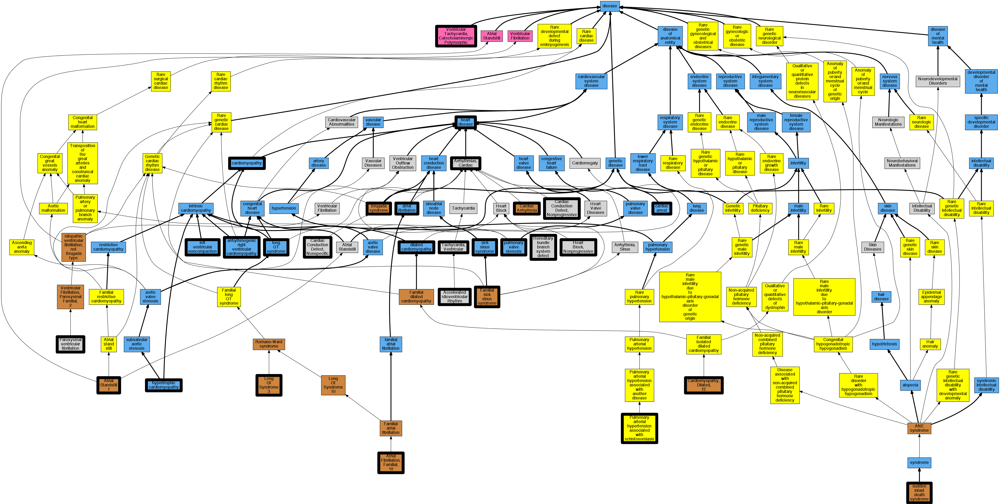

## GENE: SCN5A

[matched diseases visual](SCN5A.png)  <-- click on raw to zoom

### ATRIAL FIBRILLATION, FAMILIAL, 10
 * [OMIM:614022 Atrial Fibrillation, Familial, 10](http://beta.monarchinitiative.org/disease/OMIM:614022) Confidence: high
    * Syn: "ATFB10"
    * Syn: "ATRIAL FIBRILLATION, FAMILIAL, 10; ATFB10"

### ATRIAL STANDSTILL 1, DIGENIC
 * [OMIM:108770 Atrial Standstill](http://beta.monarchinitiative.org/disease/OMIM:108770) Confidence: low/0.1640625
    * Equiv:[MESH:C563984 Atrial Standstill](http://beta.monarchinitiative.org/disease/MESH:C563984)
    * Syn: "Atrial Cardiomyopathy With Heart Block"
    * Syn: "ATRIAL STANDSTILL 1; ATRST1"
    * Syn: "ATRST1"
    * Syn: "Cardiomyopathy, Familial, With Conduction Disturbance"

### Arrhythmia
 * [OMIM:115000 Cardiac Complexes, Premature](http://beta.monarchinitiative.org/disease/OMIM:115000) Confidence: low/0.09375
    * Equiv:[MESH:D001145 Arrhythmias, Cardiac](http://beta.monarchinitiative.org/disease/MESH:D001145)
    * Equiv:[MESH:D005117 Cardiac Complexes, Premature](http://beta.monarchinitiative.org/disease/MESH:D005117)
    * Syn: "CARDIAC ARRHYTHMIA"
    * Syn: "Extrasystoles"

### Arrhythmogenic right ventricular cardiomyopathy
 * [DOID:0050431 arrhythmogenic right ventricular cardiomyopathy](http://beta.monarchinitiative.org/disease/DOID:0050431) Confidence: high
    * Equiv:[MESH:D019571 Arrhythmogenic Right Ventricular Dysplasia](http://beta.monarchinitiative.org/disease/MESH:D019571)
    * Syn: "arrhythmogenic right ventricular dysplasia"
    * Syn: "arrhythmogenic right ventricular dysplasia/cardiomyopathy"
    * Syn: "ARVC"
    * Syn: "ARVC cardiomyopathy"
    * Syn: "ARVD"

### Atrial fibrillation
 * [DOID:0060224 atrial fibrillation](http://beta.monarchinitiative.org/disease/DOID:0060224) Confidence: high
    * Syn: "A-fib"

### Atrial fibrillation,Brugada syndrome
 * [OMIM:601144 Brugada Syndrome](http://beta.monarchinitiative.org/disease/OMIM:601144) Confidence: low/0.15625
    * Equiv:[MESH:D053840 Brugada Syndrome](http://beta.monarchinitiative.org/disease/MESH:D053840)
    * Syn: "BRGDA1"
    * Syn: "BRUGADA SYNDROME 1; BRGDA1"
    * Syn: "Cardiac Conduction Defect, Nonspecific"
    * Syn: "Right Bundle Branch Block, St Segment Elevation, and Sudden Death Syndrome"
    * Syn: "Sudden Unexplained Nocturnal Death Syndrome"

### BRUGADA SYNDROME 1
 * [OMIM:601144 Brugada Syndrome](http://beta.monarchinitiative.org/disease/OMIM:601144) Confidence: low/0.1640625
    * Equiv:[MESH:D053840 Brugada Syndrome](http://beta.monarchinitiative.org/disease/MESH:D053840)
    * Syn: "BRGDA1"
    * Syn: "BRUGADA SYNDROME 1; BRGDA1"
    * Syn: "Cardiac Conduction Defect, Nonspecific"
    * Syn: "Right Bundle Branch Block, St Segment Elevation, and Sudden Death Syndrome"
    * Syn: "Sudden Unexplained Nocturnal Death Syndrome"

### Brugada Syndrome
 * [DOID:0050451 Brugada syndrome](http://beta.monarchinitiative.org/disease/DOID:0050451) Confidence: high

### Brugada Syndrome 1
 * [OMIM:601144 Brugada Syndrome](http://beta.monarchinitiative.org/disease/OMIM:601144) Confidence: low/0.18055555555555555
    * Equiv:[MESH:D053840 Brugada Syndrome](http://beta.monarchinitiative.org/disease/MESH:D053840)
    * Syn: "BRGDA1"
    * Syn: "BRUGADA SYNDROME 1; BRGDA1"
    * Syn: "Cardiac Conduction Defect, Nonspecific"
    * Syn: "Right Bundle Branch Block, St Segment Elevation, and Sudden Death Syndrome"
    * Syn: "Sudden Unexplained Nocturnal Death Syndrome"

### Brugada syndrome
 * [DOID:0050451 Brugada syndrome](http://beta.monarchinitiative.org/disease/DOID:0050451) Confidence: high

### Brugada syndrome, lidocaine-induced
 * [OMIM:601144 Brugada Syndrome](http://beta.monarchinitiative.org/disease/OMIM:601144) Confidence: low/0.15625
    * Equiv:[MESH:D053840 Brugada Syndrome](http://beta.monarchinitiative.org/disease/MESH:D053840)
    * Syn: "BRGDA1"
    * Syn: "BRUGADA SYNDROME 1; BRGDA1"
    * Syn: "Cardiac Conduction Defect, Nonspecific"
    * Syn: "Right Bundle Branch Block, St Segment Elevation, and Sudden Death Syndrome"
    * Syn: "Sudden Unexplained Nocturnal Death Syndrome"

### Brugada syndrome,Long QT syndrome
 * [DOID:2843 long QT syndrome](http://beta.monarchinitiative.org/disease/DOID:2843) Confidence: low/0.1953125
    * Equiv:[MESH:D008133 Long QT Syndrome](http://beta.monarchinitiative.org/disease/MESH:D008133)
    * Syn: "long Q-T syndrome"
    * Syn: "LQT"
    * Syn: "Romano-Ward syndrome"
    * Syn: "Romano-Ward syndrome (disorder)"

### CARDIAC CONDUCTION DEFECT, NONPROGRESSIVE
 * [OMIM:113900 Hereditary bundle branch system defect](http://beta.monarchinitiative.org/disease/OMIM:113900) Confidence: high
    * Equiv:[MESH:C566185 Heart Block, Nonprogressive](http://beta.monarchinitiative.org/disease/MESH:C566185)
    * Equiv:[MESH:C566186 Cardiac Conduction Defect, Nonprogressive](http://beta.monarchinitiative.org/disease/MESH:C566186)
    * Equiv:[MESH:C566873 Hereditary bundle branch system defect](http://beta.monarchinitiative.org/disease/MESH:C566873)
    * Syn: "Bundle Branch Block"
    * Syn: "Cardiac Conduction Defect, Nonprogressive"
    * Syn: "Cardiac Conduction Defect, Progressive"
    * Syn: "Heart Block, Nonprogressive"
    * Syn: "Heart Block, Progressive Familial, Type 1"
    * Syn: "Hereditary Bundle Branch System Defect"
    * Syn: "Lenegre-Lev Disease"
    * Syn: "PFHB1A"
    * Syn: "Pfhbia"
    * Syn: "PROGRESSIVE FAMILIAL HEART BLOCK, TYPE IA; PFHB1A"

### CARDIAC CONDUCTION DEFECT, NONSPECIFIC
 * [MESH:C567557 Cardiac Conduction Defect, Nonspecific](http://beta.monarchinitiative.org/disease/MESH:C567557) Confidence: high

### CARDIOMYOPATHY, DILATED, 1E
 * [OMIM:601154 Cardiomyopathy, Dilated, 1E](http://beta.monarchinitiative.org/disease/OMIM:601154) Confidence: high
    * Equiv:[MESH:C563384 Cardiomyopathy, Dilated, 1E](http://beta.monarchinitiative.org/disease/MESH:C563384)
    * Syn: "CARDIOMYOPATHY, DILATED, 1E; CMD1E"
    * Syn: "Cardiomyopathy, Dilated, With Conduction Defect 2"
    * Syn: "Cardiomyopathy, Dilated, With Conduction Disorder and Arrhythmia"
    * Syn: "CMD1E"

### Cardiac Arrest
 * [DOID:0060319 cardiac arrest](http://beta.monarchinitiative.org/disease/DOID:0060319) Confidence: high
    * Equiv:[MESH:D006323 Heart Arrest](http://beta.monarchinitiative.org/disease/MESH:D006323)
    * Syn: "cardiopulmonary arrest"
    * Syn: "circulatory arrest"

### Cardiac arrhythmia
 * [OMIM:115000 Cardiac Complexes, Premature](http://beta.monarchinitiative.org/disease/OMIM:115000) Confidence: medium
    * Equiv:[MESH:D001145 Arrhythmias, Cardiac](http://beta.monarchinitiative.org/disease/MESH:D001145)
    * Equiv:[MESH:D005117 Cardiac Complexes, Premature](http://beta.monarchinitiative.org/disease/MESH:D005117)
    * Syn: "CARDIAC ARRHYTHMIA"
    * Syn: "Extrasystoles"

### Cardiac arrhythmia, increased risk, association
 * [OMIM:115000 Cardiac Complexes, Premature](http://beta.monarchinitiative.org/disease/OMIM:115000) Confidence: low/0.14500000000000002
    * Equiv:[MESH:D001145 Arrhythmias, Cardiac](http://beta.monarchinitiative.org/disease/MESH:D001145)
    * Equiv:[MESH:D005117 Cardiac Complexes, Premature](http://beta.monarchinitiative.org/disease/MESH:D005117)
    * Syn: "CARDIAC ARRHYTHMIA"
    * Syn: "Extrasystoles"

### Cardiac conduction disease
 * [disease -](http://beta.monarchinitiative.org/disease/disease) Confidence: low/0.1388888888888889

### Cardiomyopathy
 * [DOID:0050700 cardiomyopathy](http://beta.monarchinitiative.org/disease/DOID:0050700) Confidence: high
    * Equiv:[MESH:D009202 Cardiomyopathies](http://beta.monarchinitiative.org/disease/MESH:D009202)
    * Syn: "Cardiomyopathies"

### Cardiomyopathy, dilated
 * [DOID:12930 dilated cardiomyopathy](http://beta.monarchinitiative.org/disease/DOID:12930) Confidence: high
    * Syn: "Congestive cardiomyopathy"
    * Syn: "Familial dilated cardiomyopathy"
    * Syn: "Idiopathic dilation cardiomyopathy"
    * Syn: "primary dilated cardiomyopathy"

### Cardiomyopathy, dilated, 1E
 * [OMIM:601154 Cardiomyopathy, Dilated, 1E](http://beta.monarchinitiative.org/disease/OMIM:601154) Confidence: high
    * Equiv:[MESH:C563384 Cardiomyopathy, Dilated, 1E](http://beta.monarchinitiative.org/disease/MESH:C563384)
    * Syn: "CARDIOMYOPATHY, DILATED, 1E; CMD1E"
    * Syn: "Cardiomyopathy, Dilated, With Conduction Defect 2"
    * Syn: "Cardiomyopathy, Dilated, With Conduction Disorder and Arrhythmia"
    * Syn: "CMD1E"

### Catecholaminergic polymorphic ventricular tachycardia
 * [DC:0000665 Ventricular Tachycardia, Catecholaminergic Polymorphic](http://beta.monarchinitiative.org/disease/DC:0000665) Confidence: high

### Dilated cardiomyopathy
 * [DOID:12930 dilated cardiomyopathy](http://beta.monarchinitiative.org/disease/DOID:12930) Confidence: high
    * Syn: "Congestive cardiomyopathy"
    * Syn: "Familial dilated cardiomyopathy"
    * Syn: "Idiopathic dilation cardiomyopathy"
    * Syn: "primary dilated cardiomyopathy"

### HEART BLOCK, NONPROGRESSIVE
 * [OMIM:113900 Hereditary bundle branch system defect](http://beta.monarchinitiative.org/disease/OMIM:113900) Confidence: high
    * Equiv:[MESH:C566185 Heart Block, Nonprogressive](http://beta.monarchinitiative.org/disease/MESH:C566185)
    * Equiv:[MESH:C566186 Cardiac Conduction Defect, Nonprogressive](http://beta.monarchinitiative.org/disease/MESH:C566186)
    * Equiv:[MESH:C566873 Hereditary bundle branch system defect](http://beta.monarchinitiative.org/disease/MESH:C566873)
    * Syn: "Bundle Branch Block"
    * Syn: "Cardiac Conduction Defect, Nonprogressive"
    * Syn: "Cardiac Conduction Defect, Progressive"
    * Syn: "Heart Block, Nonprogressive"
    * Syn: "Heart Block, Progressive Familial, Type 1"
    * Syn: "Hereditary Bundle Branch System Defect"
    * Syn: "Lenegre-Lev Disease"
    * Syn: "PFHB1A"
    * Syn: "Pfhbia"
    * Syn: "PROGRESSIVE FAMILIAL HEART BLOCK, TYPE IA; PFHB1A"

### LONG QT SYNDROME 2/3, DIGENIC
 * [OMIM:603830 Long QT syndrome type 3](http://beta.monarchinitiative.org/disease/OMIM:603830) Confidence: high
    * Equiv:[MESH:C537034 Long QT syndrome type 3](http://beta.monarchinitiative.org/disease/MESH:C537034)
    * Equiv:[MESH:C565840 Long Qt Syndrome 3](http://beta.monarchinitiative.org/disease/MESH:C565840)
    * Syn: "Long Qt Syndrome 2/3, Digenic"
    * Syn: "Long Qt Syndrome 3, Acquired, Susceptibility to"
    * Syn: "Long Qt Syndrome 3/6, Digenic"
    * Syn: "LONG QT SYNDROME 3; LQT3"
    * Syn: "LQT3"

### LONG QT SYNDROME 3
 * [OMIM:603830 Long QT syndrome type 3](http://beta.monarchinitiative.org/disease/OMIM:603830) Confidence: low/0.18000000000000002
    * Equiv:[MESH:C537034 Long QT syndrome type 3](http://beta.monarchinitiative.org/disease/MESH:C537034)
    * Equiv:[MESH:C565840 Long Qt Syndrome 3](http://beta.monarchinitiative.org/disease/MESH:C565840)
    * Syn: "Long Qt Syndrome 2/3, Digenic"
    * Syn: "Long Qt Syndrome 3, Acquired, Susceptibility to"
    * Syn: "Long Qt Syndrome 3/6, Digenic"
    * Syn: "LONG QT SYNDROME 3; LQT3"
    * Syn: "LQT3"

### LONG QT SYNDROME 3, ACQUIRED, SUSCEPTIBILITY TO
 * [OMIM:603830 Long QT syndrome type 3](http://beta.monarchinitiative.org/disease/OMIM:603830) Confidence: high
    * Equiv:[MESH:C537034 Long QT syndrome type 3](http://beta.monarchinitiative.org/disease/MESH:C537034)
    * Equiv:[MESH:C565840 Long Qt Syndrome 3](http://beta.monarchinitiative.org/disease/MESH:C565840)
    * Syn: "Long Qt Syndrome 2/3, Digenic"
    * Syn: "Long Qt Syndrome 3, Acquired, Susceptibility to"
    * Syn: "Long Qt Syndrome 3/6, Digenic"
    * Syn: "LONG QT SYNDROME 3; LQT3"
    * Syn: "LQT3"

### LONG QT SYNDROME 3/6, DIGENIC
 * [OMIM:603830 Long QT syndrome type 3](http://beta.monarchinitiative.org/disease/OMIM:603830) Confidence: high
    * Equiv:[MESH:C537034 Long QT syndrome type 3](http://beta.monarchinitiative.org/disease/MESH:C537034)
    * Equiv:[MESH:C565840 Long Qt Syndrome 3](http://beta.monarchinitiative.org/disease/MESH:C565840)
    * Syn: "Long Qt Syndrome 2/3, Digenic"
    * Syn: "Long Qt Syndrome 3, Acquired, Susceptibility to"
    * Syn: "Long Qt Syndrome 3/6, Digenic"
    * Syn: "LONG QT SYNDROME 3; LQT3"
    * Syn: "LQT3"

### Left ventricular noncompaction cardiomyopathy
 * [DC:0000237 Left Ventricular Noncompaction](http://beta.monarchinitiative.org/disease/DC:0000237) Confidence: low/0.1953125

### Long QT Syndrome
 * [DOID:2843 long QT syndrome](http://beta.monarchinitiative.org/disease/DOID:2843) Confidence: high
    * Equiv:[MESH:D008133 Long QT Syndrome](http://beta.monarchinitiative.org/disease/MESH:D008133)
    * Syn: "long Q-T syndrome"
    * Syn: "LQT"
    * Syn: "Romano-Ward syndrome"
    * Syn: "Romano-Ward syndrome (disorder)"

### Long QT syndrome
 * [DOID:2843 long QT syndrome](http://beta.monarchinitiative.org/disease/DOID:2843) Confidence: high
    * Equiv:[MESH:D008133 Long QT Syndrome](http://beta.monarchinitiative.org/disease/MESH:D008133)
    * Syn: "long Q-T syndrome"
    * Syn: "LQT"
    * Syn: "Romano-Ward syndrome"
    * Syn: "Romano-Ward syndrome (disorder)"

### Long QT syndrome, drug-associated
 * [DOID:2843 long QT syndrome](http://beta.monarchinitiative.org/disease/DOID:2843) Confidence: low/0.16999999999999998
    * Equiv:[MESH:D008133 Long QT Syndrome](http://beta.monarchinitiative.org/disease/MESH:D008133)
    * Syn: "long Q-T syndrome"
    * Syn: "LQT"
    * Syn: "Romano-Ward syndrome"
    * Syn: "Romano-Ward syndrome (disorder)"

### Long QT syndrome, drugNot providedassociated
 * [DOID:2843 long QT syndrome](http://beta.monarchinitiative.org/disease/DOID:2843) Confidence: low/0.16999999999999998
    * Equiv:[MESH:D008133 Long QT Syndrome](http://beta.monarchinitiative.org/disease/MESH:D008133)
    * Syn: "long Q-T syndrome"
    * Syn: "LQT"
    * Syn: "Romano-Ward syndrome"
    * Syn: "Romano-Ward syndrome (disorder)"

### Nodal rhythm
 * [MESH:D016170 Accelerated Idioventricular Rhythm](http://beta.monarchinitiative.org/disease/MESH:D016170) Confidence: low/0.05555555555555555

### PROGRESSIVE FAMILIAL HEART BLOCK, TYPE IA
 * [OMIM:113900 Hereditary bundle branch system defect](http://beta.monarchinitiative.org/disease/OMIM:113900) Confidence: low/0.1989795918367347
    * Equiv:[MESH:C566185 Heart Block, Nonprogressive](http://beta.monarchinitiative.org/disease/MESH:C566185)
    * Equiv:[MESH:C566186 Cardiac Conduction Defect, Nonprogressive](http://beta.monarchinitiative.org/disease/MESH:C566186)
    * Equiv:[MESH:C566873 Hereditary bundle branch system defect](http://beta.monarchinitiative.org/disease/MESH:C566873)
    * Syn: "Bundle Branch Block"
    * Syn: "Cardiac Conduction Defect, Nonprogressive"
    * Syn: "Cardiac Conduction Defect, Progressive"
    * Syn: "Heart Block, Nonprogressive"
    * Syn: "Heart Block, Progressive Familial, Type 1"
    * Syn: "Hereditary Bundle Branch System Defect"
    * Syn: "Lenegre-Lev Disease"
    * Syn: "PFHB1A"
    * Syn: "Pfhbia"
    * Syn: "PROGRESSIVE FAMILIAL HEART BLOCK, TYPE IA; PFHB1A"

### Paroxysmal familial ventricular fibrillation
 * [OMIM:612956 Paroxysmal ventricular fibrillation](http://beta.monarchinitiative.org/disease/OMIM:612956) Confidence: low/0.1953125
    * Equiv:[MESH:C537182 Paroxysmal ventricular fibrillation](http://beta.monarchinitiative.org/disease/MESH:C537182)
    * Equiv:[MESH:C567841 Ventricular Fibrillation, Paroxysmal Familial, 2](http://beta.monarchinitiative.org/disease/MESH:C567841)
    * Syn: "VENTRICULAR FIBRILLATION, PAROXYSMAL FAMILIAL, 2; VF2"
    * Syn: "VF2"

### Phenotype modifier, association with
 * [OMIM:601321 Neurofibromatosis-Noonan syndrome](http://beta.monarchinitiative.org/disease/OMIM:601321) Confidence: low/0.09375
    * Equiv:[Orphanet:638 Neurofibromatosis-Noonan syndrome](http://beta.monarchinitiative.org/disease/Orphanet:638)
    * Equiv:[MESH:C537393 Neurofibromatosis-Noonan syndrome](http://beta.monarchinitiative.org/disease/MESH:C537393)
    * Syn: "Neurofibromatosis With Noonan Phenotype"
    * Syn: "NEUROFIBROMATOSIS-NOONAN SYNDROME; NFNS"
    * Syn: "NFNS"
    * Syn: "Noonan-Neurofibromatosis Syndrome"

### Primary dilated cardiomyopathy
 * [DOID:12930 dilated cardiomyopathy](http://beta.monarchinitiative.org/disease/DOID:12930) Confidence: high
    * Syn: "Congestive cardiomyopathy"
    * Syn: "Familial dilated cardiomyopathy"
    * Syn: "Idiopathic dilation cardiomyopathy"
    * Syn: "primary dilated cardiomyopathy"

### Primary familial hypertrophic cardiomyopathy
 * [DOID:11984 hypertrophic cardiomyopathy](http://beta.monarchinitiative.org/disease/DOID:11984) Confidence: low/0.1953125
    * Equiv:[MESH:D002312 Cardiomyopathy, Hypertrophic](http://beta.monarchinitiative.org/disease/MESH:D002312)
    * Equiv:[MESH:D024741 Cardiomyopathy, Hypertrophic, Familial](http://beta.monarchinitiative.org/disease/MESH:D024741)
    * Syn: "familial hypertrophic cardiomyopathy"
    * Syn: "hypertrophic obstructive cardiomyopathy"

### Pulmonary valve stenosis (rare)
 * [MESH:D011666 Pulmonary Valve Stenosis](http://beta.monarchinitiative.org/disease/MESH:D011666) Confidence: low/0.15625

### SICK SINUS SYNDROME 1, AUTOSOMAL RECESSIVE
 * [OMIM:608567 Sick Sinus Syndrome 1, Autosomal Recessive](http://beta.monarchinitiative.org/disease/OMIM:608567) Confidence: high
    * Equiv:[MESH:C563907 Sick Sinus Syndrome 1, Autosomal Recessive](http://beta.monarchinitiative.org/disease/MESH:C563907)
    * Syn: "SICK SINUS SYNDROME 1, AUTOSOMAL RECESSIVE; SSS1"
    * Syn: "Sick Sinus Syndrome, Congenital"
    * Syn: "Sinus Bradycardia Syndrome, Familial"
    * Syn: "Sinus Node Disease, Familial, Autosomal Recessive"
    * Syn: "Sinus Rhythm, Congenital Absence of"
    * Syn: "SSS1"

### SINUS NODE DISEASE
 * [DOID:0050127 sinusitis](http://beta.monarchinitiative.org/disease/DOID:0050127) Confidence: low/0.1388888888888889
    * Equiv:[MESH:D012852 Sinusitis](http://beta.monarchinitiative.org/disease/MESH:D012852)

### SUDDEN INFANT DEATH SYNDROME
 * [OMIM:272120 sudden infant death syndrome](http://beta.monarchinitiative.org/disease/OMIM:272120) Confidence: high
    * Equiv:[DOID:9007 sudden infant death syndrome](http://beta.monarchinitiative.org/disease/DOID:9007)
    * Equiv:[MESH:D013398 Sudden Infant Death](http://beta.monarchinitiative.org/disease/MESH:D013398)
    * Syn: "Cot death"
    * Syn: "Cot death (context-dependent category)"
    * Syn: "Crib death (context-dependent category)"
    * Syn: "SIDS"
    * Syn: "Sids"
    * Syn: "Sudden death of nonspecific cause in infancy"
    * Syn: "SUDDEN INFANT DEATH SYNDROME"
    * Syn: "Sudden infant death syndrome (context-dependent category)"
    * Syn: "Sudden infant death syndrome (finding)"
    * Syn: "Sudden infant death syndrome NOS (context-dependent category)"

### Sudden adult death syndrome
 * [OMIM:272120 sudden infant death syndrome](http://beta.monarchinitiative.org/disease/OMIM:272120) Confidence: low/0.1640625
    * Equiv:[DOID:9007 sudden infant death syndrome](http://beta.monarchinitiative.org/disease/DOID:9007)
    * Equiv:[MESH:D013398 Sudden Infant Death](http://beta.monarchinitiative.org/disease/MESH:D013398)
    * Syn: "Cot death"
    * Syn: "Cot death (context-dependent category)"
    * Syn: "Crib death (context-dependent category)"
    * Syn: "SIDS"
    * Syn: "Sids"
    * Syn: "Sudden death of nonspecific cause in infancy"
    * Syn: "SUDDEN INFANT DEATH SYNDROME"
    * Syn: "Sudden infant death syndrome (context-dependent category)"
    * Syn: "Sudden infant death syndrome (finding)"
    * Syn: "Sudden infant death syndrome NOS (context-dependent category)"

### Sudden infant death syndrome
 * [OMIM:272120 sudden infant death syndrome](http://beta.monarchinitiative.org/disease/OMIM:272120) Confidence: high
    * Equiv:[DOID:9007 sudden infant death syndrome](http://beta.monarchinitiative.org/disease/DOID:9007)
    * Equiv:[MESH:D013398 Sudden Infant Death](http://beta.monarchinitiative.org/disease/MESH:D013398)
    * Syn: "Cot death"
    * Syn: "Cot death (context-dependent category)"
    * Syn: "Crib death (context-dependent category)"
    * Syn: "SIDS"
    * Syn: "Sids"
    * Syn: "Sudden death of nonspecific cause in infancy"
    * Syn: "SUDDEN INFANT DEATH SYNDROME"
    * Syn: "Sudden infant death syndrome (context-dependent category)"
    * Syn: "Sudden infant death syndrome (finding)"
    * Syn: "Sudden infant death syndrome NOS (context-dependent category)"

### Sudden infant death syndrome, Brugada syndrome
 * [OMIM:272120 sudden infant death syndrome](http://beta.monarchinitiative.org/disease/OMIM:272120) Confidence: low/0.20500000000000002
    * Equiv:[DOID:9007 sudden infant death syndrome](http://beta.monarchinitiative.org/disease/DOID:9007)
    * Equiv:[MESH:D013398 Sudden Infant Death](http://beta.monarchinitiative.org/disease/MESH:D013398)
    * Syn: "Cot death"
    * Syn: "Cot death (context-dependent category)"
    * Syn: "Crib death (context-dependent category)"
    * Syn: "SIDS"
    * Syn: "Sids"
    * Syn: "Sudden death of nonspecific cause in infancy"
    * Syn: "SUDDEN INFANT DEATH SYNDROME"
    * Syn: "Sudden infant death syndrome (context-dependent category)"
    * Syn: "Sudden infant death syndrome (finding)"
    * Syn: "Sudden infant death syndrome NOS (context-dependent category)"

### Sudden unexplained nocturnal death syndrome
 * [OMIM:601144 Brugada Syndrome](http://beta.monarchinitiative.org/disease/OMIM:601144) Confidence: high
    * Equiv:[MESH:D053840 Brugada Syndrome](http://beta.monarchinitiative.org/disease/MESH:D053840)
    * Syn: "BRGDA1"
    * Syn: "BRUGADA SYNDROME 1; BRGDA1"
    * Syn: "Cardiac Conduction Defect, Nonspecific"
    * Syn: "Right Bundle Branch Block, St Segment Elevation, and Sudden Death Syndrome"
    * Syn: "Sudden Unexplained Nocturnal Death Syndrome"

### VENTRICULAR FIBRILLATION, PAROXYSMAL FAMILIAL
 * [OMIM:612956 Paroxysmal ventricular fibrillation](http://beta.monarchinitiative.org/disease/OMIM:612956) Confidence: low/0.1388888888888889
    * Equiv:[MESH:C537182 Paroxysmal ventricular fibrillation](http://beta.monarchinitiative.org/disease/MESH:C537182)
    * Equiv:[MESH:C567841 Ventricular Fibrillation, Paroxysmal Familial, 2](http://beta.monarchinitiative.org/disease/MESH:C567841)
    * Syn: "VENTRICULAR FIBRILLATION, PAROXYSMAL FAMILIAL, 2; VF2"
    * Syn: "VF2"

### Ventricular tachycardia
 * [OMIM:192605 Tachycardia, Ventricular](http://beta.monarchinitiative.org/disease/OMIM:192605) Confidence: high
    * Equiv:[MESH:D017180 Tachycardia, Ventricular](http://beta.monarchinitiative.org/disease/MESH:D017180)
    * Syn: "VENTRICULAR TACHYCARDIA, FAMILIAL"
    * Syn: "Ventricular Tachycardia, Familial Polymorphic"
