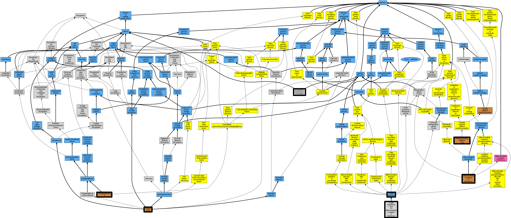

## GENE: SDHA

[matched diseases visual](SDHA.png)  <-- click on raw to zoom

### Carney triad
 * [OMIM:604287 Carney triad](http://beta.monarchinitiative.org/disease/OMIM:604287) Confidence: high
    * Equiv:[Orphanet:139411 Carney triad](http://beta.monarchinitiative.org/disease/Orphanet:139411)
    * Equiv:[MESH:C565803 Carney Triad](http://beta.monarchinitiative.org/disease/MESH:C565803)
    * Syn: "CARNEY TRIAD"
    * Syn: "Gastric Leiomyosarcoma, Pulmonary Chondroma, and Extraadrenal Paraganglioma"

### Neoplastic Syndromes, Hereditary
 * [MESH:D009386 Neoplastic Syndromes, Hereditary](http://beta.monarchinitiative.org/disease/MESH:D009386) Confidence: high

### CARDIOMYOPATHY, DILATED, 1GG
 * [OMIM:613642 Cardiomyopathy, Dilated, 1Gg](http://beta.monarchinitiative.org/disease/OMIM:613642) Confidence: high
    * Syn: "CARDIOMYOPATHY, DILATED, 1GG; CMD1GG"
    * Syn: "CMD1GG"

### LEIGH SYNDROME
 * [DOID:3652 Leigh disease](http://beta.monarchinitiative.org/disease/DOID:3652) Confidence: high
    * Syn: "Infantile necrotizing encephalomyelopathy"
    * Syn: "juvenile subacute necrotizing encephalomyelopathy"
    * Syn: "Leigh syndrome"
    * Syn: "subacute necrotizing encephalomyelopathy"

### PARAGANGLIOMAS 5
 * [OMIM:614165 Paragangliomas 5](http://beta.monarchinitiative.org/disease/OMIM:614165) Confidence: high
    * Syn: "PARAGANGLIOMAS 5; PGL5"
    * Syn: "PGL5"

### Paragangliomas 5
 * [OMIM:614165 Paragangliomas 5](http://beta.monarchinitiative.org/disease/OMIM:614165) Confidence: high
    * Syn: "PARAGANGLIOMAS 5; PGL5"
    * Syn: "PGL5"

### LEIGH SYNDROME DUE TO MITOCHONDRIAL COMPLEX II DEFICIENCY
 * [MESH:C564961 Leigh Syndrome Due To Mitochondrial Complex II Deficiency](http://beta.monarchinitiative.org/disease/MESH:C564961) Confidence: high

### MITOCHONDRIAL COMPLEX II DEFICIENCY
 * [OMIM:252011 Mitochondrial Complex II Deficiency](http://beta.monarchinitiative.org/disease/OMIM:252011) Confidence: high
    * Equiv:[MESH:C565375 Mitochondrial Complex II Deficiency](http://beta.monarchinitiative.org/disease/MESH:C565375)
    * Syn: "MITOCHONDRIAL COMPLEX II DEFICIENCY"
    * Syn: "Succinate Coq Reductase Deficiency"

### Mitochondrial complex II deficiency
 * [OMIM:252011 Mitochondrial Complex II Deficiency](http://beta.monarchinitiative.org/disease/OMIM:252011) Confidence: high
    * Equiv:[MESH:C565375 Mitochondrial Complex II Deficiency](http://beta.monarchinitiative.org/disease/MESH:C565375)
    * Syn: "MITOCHONDRIAL COMPLEX II DEFICIENCY"
    * Syn: "Succinate Coq Reductase Deficiency"
