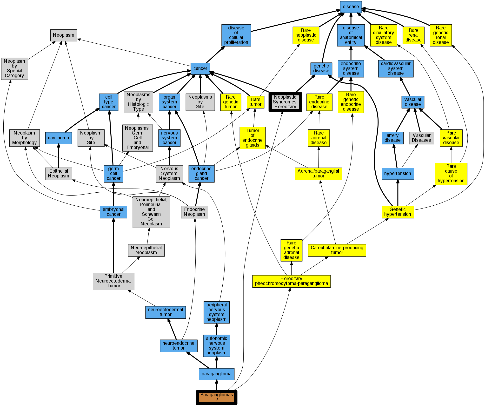

## GENE: SDHAF2

[matched diseases visual](SDHAF2.png)  <-- click on raw to zoom

### Neoplastic Syndromes, Hereditary
 * [MESH:D009386 Neoplastic Syndromes, Hereditary](http://beta.monarchinitiative.org/disease/MESH:D009386) Confidence: high
    * Syn: "Cancer Syndrome, Hereditary"
    * Syn: "Cancer Syndromes, Hereditary"
    * Syn: "Hereditary Cancer Syndrome"
    * Syn: "Hereditary Cancer Syndromes"
    * Syn: "Hereditary Neoplastic Syndrome"
    * Syn: "Hereditary Neoplastic Syndromes"
    * Syn: "Neoplastic Syndrome, Hereditary"
    * Syn: "Syndrome, Hereditary Cancer"
    * Syn: "Syndrome, Hereditary Neoplastic"
    * Syn: "Syndromes, Hereditary Cancer"
    * Syn: "Syndromes, Hereditary Neoplastic"

### PARAGANGLIOMAS 2
 * [OMIM:601650 Paragangliomas 2](http://beta.monarchinitiative.org/disease/OMIM:601650) Confidence: high
    * Equiv:[MESH:C566646 Paragangliomas 2](http://beta.monarchinitiative.org/disease/MESH:C566646)
    * Syn: "Glomus Tumors, Familial, 2"
    * Syn: "PARAGANGLIOMAS 2; PGL2"
    * Syn: "PGL2"
