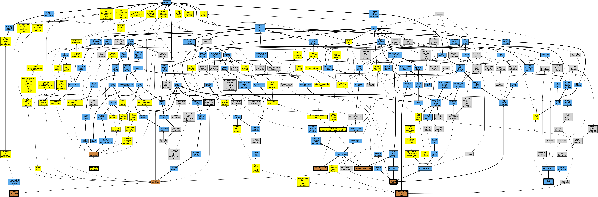

## GENE: SDHB

[matched diseases visual](SDHB.png)  <-- click on raw to zoom

### Carney triad
 * [OMIM:604287 Carney triad](http://beta.monarchinitiative.org/disease/OMIM:604287) Confidence: high
    * Equiv:[Orphanet:139411 Carney triad](http://beta.monarchinitiative.org/disease/Orphanet:139411)
    * Equiv:[MESH:C565803 Carney Triad](http://beta.monarchinitiative.org/disease/MESH:C565803)
    * Syn: "CARNEY TRIAD"
    * Syn: "Gastric Leiomyosarcoma, Pulmonary Chondroma, and Extraadrenal Paraganglioma"

### Cowden-like syndrome
 * [OMIM:612359 Cowden-Like Syndrome](http://beta.monarchinitiative.org/disease/OMIM:612359) Confidence: high
    * Equiv:[MESH:C567337 Cowden-Like Syndrome](http://beta.monarchinitiative.org/disease/MESH:C567337)
    * Syn: "COWDEN SYNDROME 2; CWS2"
    * Syn: "CWS2"

### GASTROINTESTINAL STROMAL TUMOR
 * [OMIM:606764 gastrointestinal stromal tumor](http://beta.monarchinitiative.org/disease/OMIM:606764) Confidence: high
    * Equiv:[DOID:9253 gastrointestinal stromal tumor](http://beta.monarchinitiative.org/disease/DOID:9253)
    * Equiv:[MESH:D046152 Gastrointestinal Stromal Tumors](http://beta.monarchinitiative.org/disease/MESH:D046152)
    * Syn: "GANT"
    * Syn: "GASTROINTESTINAL STROMAL TUMOR; GIST"
    * Syn: "GIST"
    * Syn: "Stromal tumor of gastrointestinal tract"

### Hereditary Paragangliomas and Pheochromocytomas
 * [Orphanet:29072 Hereditary pheochromocytoma-paraganglioma](http://beta.monarchinitiative.org/disease/Orphanet:29072) Confidence: low/0.1953125

### PARAGANGLIOMA AND GASTRIC STROMAL SARCOMA
 * [OMIM:606864 Carney-Stratakis syndrome](http://beta.monarchinitiative.org/disease/OMIM:606864) Confidence: medium
    * Equiv:[Orphanet:97286 Carney-Stratakis syndrome](http://beta.monarchinitiative.org/disease/Orphanet:97286)
    * Equiv:[MESH:C564650 Carney-Stratakis Syndrome](http://beta.monarchinitiative.org/disease/MESH:C564650)
    * Syn: "Carney-Stratakis Syndrome"
    * Syn: "PARAGANGLIOMA AND GASTRIC STROMAL SARCOMA"
    * Syn: "Paraganglioma and Gastrointestinal Stromal Tumor"

### PARAGANGLIOMAS 4
 * [OMIM:115310 Paragangliomas 4](http://beta.monarchinitiative.org/disease/OMIM:115310) Confidence: high
    * Syn: "Carotid Body Tumors and Multiple Extraadrenal Pheochromocytomas"
    * Syn: "Paraganglioma, Familial Malignant"
    * Syn: "PARAGANGLIOMAS 4; PGL4"
    * Syn: "Paragangliomas, Hereditary Extraadrenal"
    * Syn: "PGL4"
    * Syn: "Pheochromocytoma, Extraadrenal, and Cervical Paraganglioma"
    * Syn: "Pheochromocytoma, Familial Extraadrenal"

### Paragangliomas 4
 * [OMIM:115310 Paragangliomas 4](http://beta.monarchinitiative.org/disease/OMIM:115310) Confidence: high
    * Syn: "Carotid Body Tumors and Multiple Extraadrenal Pheochromocytomas"
    * Syn: "Paraganglioma, Familial Malignant"
    * Syn: "PARAGANGLIOMAS 4; PGL4"
    * Syn: "Paragangliomas, Hereditary Extraadrenal"
    * Syn: "PGL4"
    * Syn: "Pheochromocytoma, Extraadrenal, and Cervical Paraganglioma"
    * Syn: "Pheochromocytoma, Familial Extraadrenal"

### Pheochromocytoma
 * [OMIM:171300 Pheochromocytoma](http://beta.monarchinitiative.org/disease/OMIM:171300) Confidence: high
    * Equiv:[MESH:D010673 Pheochromocytoma](http://beta.monarchinitiative.org/disease/MESH:D010673)
    * Syn: "PHEOCHROMOCYTOMA"
    * Syn: "Pheochromocytoma, Susceptibility to"

### Renal cell carcinoma
 * [DOID:4450 renal cell carcinoma](http://beta.monarchinitiative.org/disease/DOID:4450) Confidence: high
    * Equiv:[MESH:C536851 Familial renal cell carcinoma](http://beta.monarchinitiative.org/disease/MESH:C536851)
    * Syn: "adenocarcinoma of kidney"
    * Syn: "hypernephroma (disorder)"
    * Syn: "RCC"

### Pheochromocytoma/Paraganglioma
 * [Orphanet:29072 Hereditary pheochromocytoma-paraganglioma](http://beta.monarchinitiative.org/disease/Orphanet:29072) Confidence: low/0.1388888888888889

### COWDEN SYNDROME 2
 * [OMIM:612359 Cowden-Like Syndrome](http://beta.monarchinitiative.org/disease/OMIM:612359) Confidence: low/0.1640625
    * Equiv:[MESH:C567337 Cowden-Like Syndrome](http://beta.monarchinitiative.org/disease/MESH:C567337)
    * Syn: "COWDEN SYNDROME 2; CWS2"
    * Syn: "CWS2"

### Gastrointestinal Stromal Tumors
 * [OMIM:606764 gastrointestinal stromal tumor](http://beta.monarchinitiative.org/disease/OMIM:606764) Confidence: medium
    * Equiv:[DOID:9253 gastrointestinal stromal tumor](http://beta.monarchinitiative.org/disease/DOID:9253)
    * Equiv:[MESH:D046152 Gastrointestinal Stromal Tumors](http://beta.monarchinitiative.org/disease/MESH:D046152)
    * Syn: "GANT"
    * Syn: "GASTROINTESTINAL STROMAL TUMOR; GIST"
    * Syn: "GIST"
    * Syn: "Stromal tumor of gastrointestinal tract"

### Neoplastic Syndromes, Hereditary
 * [MESH:D009386 Neoplastic Syndromes, Hereditary](http://beta.monarchinitiative.org/disease/MESH:D009386) Confidence: high

### PHEOCHROMOCYTOMA
 * [OMIM:171300 Pheochromocytoma](http://beta.monarchinitiative.org/disease/OMIM:171300) Confidence: high
    * Equiv:[MESH:D010673 Pheochromocytoma](http://beta.monarchinitiative.org/disease/MESH:D010673)
    * Syn: "PHEOCHROMOCYTOMA"
    * Syn: "Pheochromocytoma, Susceptibility to"

### Phaeochromocytoma
 * [DOID:0050771 phaeochromocytoma](http://beta.monarchinitiative.org/disease/DOID:0050771) Confidence: high

### Pheochromocytoma/Paraganglioma
 * [Orphanet:29072 Hereditary pheochromocytoma-paraganglioma](http://beta.monarchinitiative.org/disease/Orphanet:29072) Confidence: low/0.1388888888888889
