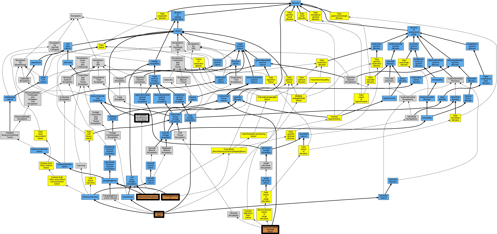

## GENE: SDHC

[matched diseases visual](SDHC.png)  <-- click on raw to zoom

### Carney triad
 * [OMIM:604287 Carney triad](http://beta.monarchinitiative.org/disease/OMIM:604287) Confidence: high
    * Equiv:[Orphanet:139411 Carney triad](http://beta.monarchinitiative.org/disease/Orphanet:139411)
    * Equiv:[MESH:C565803 Carney Triad](http://beta.monarchinitiative.org/disease/MESH:C565803)
    * Syn: "CARNEY TRIAD"
    * Syn: "Gastric Leiomyosarcoma, Pulmonary Chondroma, and Extraadrenal Paraganglioma"

### GASTROINTESTINAL STROMAL TUMOR
 * [OMIM:606764 gastrointestinal stromal tumor](http://beta.monarchinitiative.org/disease/OMIM:606764) Confidence: high
    * Equiv:[DOID:9253 gastrointestinal stromal tumor](http://beta.monarchinitiative.org/disease/DOID:9253)
    * Equiv:[MESH:D046152 Gastrointestinal Stromal Tumors](http://beta.monarchinitiative.org/disease/MESH:D046152)
    * Syn: "GANT"
    * Syn: "GASTROINTESTINAL STROMAL TUMOR; GIST"
    * Syn: "GIST"
    * Syn: "Stromal tumor of gastrointestinal tract"

### Neoplastic Syndromes, Hereditary
 * [MESH:D009386 Neoplastic Syndromes, Hereditary](http://beta.monarchinitiative.org/disease/MESH:D009386) Confidence: high

### PARAGANGLIOMA AND GASTRIC STROMAL SARCOMA
 * [OMIM:606864 Carney-Stratakis syndrome](http://beta.monarchinitiative.org/disease/OMIM:606864) Confidence: medium
    * Equiv:[Orphanet:97286 Carney-Stratakis syndrome](http://beta.monarchinitiative.org/disease/Orphanet:97286)
    * Equiv:[MESH:C564650 Carney-Stratakis Syndrome](http://beta.monarchinitiative.org/disease/MESH:C564650)
    * Syn: "Carney-Stratakis Syndrome"
    * Syn: "PARAGANGLIOMA AND GASTRIC STROMAL SARCOMA"
    * Syn: "Paraganglioma and Gastrointestinal Stromal Tumor"

### PARAGANGLIOMAS 3
 * [MESH:C565335 Paragangliomas 3](http://beta.monarchinitiative.org/disease/MESH:C565335) Confidence: high

### Paragangliomas 3
 * [MESH:C565335 Paragangliomas 3](http://beta.monarchinitiative.org/disease/MESH:C565335) Confidence: high

### Phaeochromocytoma
 * [DOID:0050771 phaeochromocytoma](http://beta.monarchinitiative.org/disease/DOID:0050771) Confidence: high
