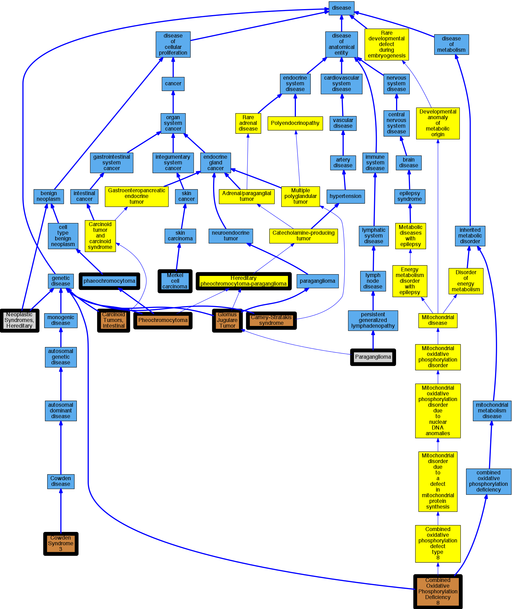

## GENE: SDHD

[matched diseases visual](SDHD.png)  <-- click on raw to zoom

### Fatal infantile mitochondrial cardiomyopathy
 * [OMIM:614096 Combined Oxidative Phosphorylation Deficiency 8](http://beta.monarchinitiative.org/disease/OMIM:614096) Confidence: low/0.18000000000000002
    * Syn: "Cardiomyopathy, Hypertrophic Mitochondrial, Fatal Infantile"
    * Syn: "COMBINED OXIDATIVE PHOSPHORYLATION DEFICIENCY 8; COXPD8"
    * Syn: "COXPD8"

### MERKEL CELL CARCINOMA, SOMATIC
 * [DOID:3965 Merkel cell carcinoma](http://beta.monarchinitiative.org/disease/DOID:3965) Confidence: low/0.1953125
    * Equiv:[MESH:D015266 Carcinoma, Merkel Cell](http://beta.monarchinitiative.org/disease/MESH:D015266)
    * Syn: "Trabecular adenocarcinoma (morphologic abnormality)"
    * Syn: "trabecular carcinoma"

### Neoplastic Syndromes, Hereditary
 * [MESH:D009386 Neoplastic Syndromes, Hereditary](http://beta.monarchinitiative.org/disease/MESH:D009386) Confidence: high

### PHEOCHROMOCYTOMA, SOMATIC
 * [OMIM:171300 Pheochromocytoma](http://beta.monarchinitiative.org/disease/OMIM:171300) Confidence: low/0.15625
    * Equiv:[MESH:D010673 Pheochromocytoma](http://beta.monarchinitiative.org/disease/MESH:D010673)
    * Syn: "PHEOCHROMOCYTOMA"
    * Syn: "Pheochromocytoma, Susceptibility to"

### Phaeochromocytoma
 * [DOID:0050771 phaeochromocytoma](http://beta.monarchinitiative.org/disease/DOID:0050771) Confidence: high

### COWDEN SYNDROME 3
 * [OMIM:615106 Cowden Syndrome 3](http://beta.monarchinitiative.org/disease/OMIM:615106) Confidence: high
    * Syn: "COWDEN SYNDROME 3; CWS3"
    * Syn: "CWS3"

### PARAGANGLIOMAS 1
 * [OMIM:168000 Glomus Jugulare Tumor](http://beta.monarchinitiative.org/disease/OMIM:168000) Confidence: low/0.1388888888888889
    * Equiv:[MESH:C566831 Paragangliomas with Sensorineural Hearing Loss](http://beta.monarchinitiative.org/disease/MESH:C566831)
    * Equiv:[MESH:D005925 Glomus Jugulare Tumor](http://beta.monarchinitiative.org/disease/MESH:D005925)
    * Syn: "Carotid Body Tumors"
    * Syn: "Chemodectomas"
    * Syn: "Glomus Jugulare Tumors"
    * Syn: "Glomus Tumors, Familial, 1"
    * Syn: "Paraganglioma, Carotid Body"
    * Syn: "PARAGANGLIOMAS 1; PGL1"
    * Syn: "Paragangliomas With Sensorineural Hearing Loss"
    * Syn: "Paragangliomas, Familial Nonchromaffin, 1"
    * Syn: "Paragangliomas, Familial, 1"
    * Syn: "Paragangliomata"
    * Syn: "PGL1"

### PHEOCHROMOCYTOMA
 * [OMIM:171300 Pheochromocytoma](http://beta.monarchinitiative.org/disease/OMIM:171300) Confidence: high
    * Equiv:[MESH:D010673 Pheochromocytoma](http://beta.monarchinitiative.org/disease/MESH:D010673)
    * Syn: "PHEOCHROMOCYTOMA"
    * Syn: "Pheochromocytoma, Susceptibility to"

### CARCINOID TUMORS, INTESTINAL
 * [OMIM:114900 Carcinoid Tumors, Intestinal](http://beta.monarchinitiative.org/disease/OMIM:114900) Confidence: high
    * Equiv:[MESH:C562842 Carcinoid Tumors, Intestinal](http://beta.monarchinitiative.org/disease/MESH:C562842)
    * Syn: "CARCINOID TUMORS, INTESTINAL"

### Hereditary Paragangliomas and Pheochromocytomas
 * [Orphanet:29072 Hereditary pheochromocytoma-paraganglioma](http://beta.monarchinitiative.org/disease/Orphanet:29072) Confidence: low/0.1953125

### PARAGANGLIOMA AND GASTRIC STROMAL SARCOMA
 * [OMIM:606864 Carney-Stratakis syndrome](http://beta.monarchinitiative.org/disease/OMIM:606864) Confidence: medium
    * Equiv:[Orphanet:97286 Carney-Stratakis syndrome](http://beta.monarchinitiative.org/disease/Orphanet:97286)
    * Equiv:[MESH:C564650 Carney-Stratakis Syndrome](http://beta.monarchinitiative.org/disease/MESH:C564650)
    * Syn: "Carney-Stratakis Syndrome"
    * Syn: "PARAGANGLIOMA AND GASTRIC STROMAL SARCOMA"
    * Syn: "Paraganglioma and Gastrointestinal Stromal Tumor"

### PARAGANGLIOMA, CAROTID BODY, SOMATIC
 * [MESH:D010235 Paraganglioma](http://beta.monarchinitiative.org/disease/MESH:D010235) Confidence: low/0.1328125

### PARAGANGLIOMAS 1 WITH SENSORINEURAL HEARING LOSS
 * [OMIM:168000 Glomus Jugulare Tumor](http://beta.monarchinitiative.org/disease/OMIM:168000) Confidence: low/0.09722222222222221
    * Equiv:[MESH:C566831 Paragangliomas with Sensorineural Hearing Loss](http://beta.monarchinitiative.org/disease/MESH:C566831)
    * Equiv:[MESH:D005925 Glomus Jugulare Tumor](http://beta.monarchinitiative.org/disease/MESH:D005925)
    * Syn: "Carotid Body Tumors"
    * Syn: "Chemodectomas"
    * Syn: "Glomus Jugulare Tumors"
    * Syn: "Glomus Tumors, Familial, 1"
    * Syn: "Paraganglioma, Carotid Body"
    * Syn: "PARAGANGLIOMAS 1; PGL1"
    * Syn: "Paragangliomas With Sensorineural Hearing Loss"
    * Syn: "Paragangliomas, Familial Nonchromaffin, 1"
    * Syn: "Paragangliomas, Familial, 1"
    * Syn: "Paragangliomata"
    * Syn: "PGL1"
