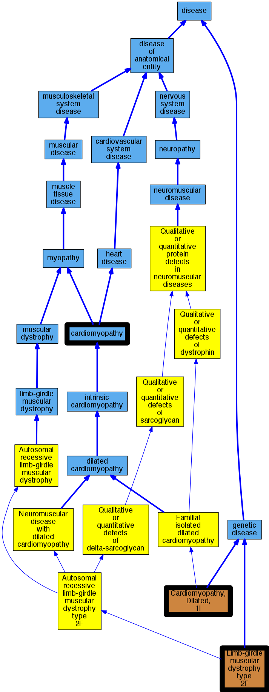

## GENE: SGCD

[matched diseases visual](SGCD.png)  <-- click on raw to zoom

### CARDIOMYOPATHY, DILATED, 1L
 * [OMIM:606685 Cardiomyopathy, Dilated, 1l](http://beta.monarchinitiative.org/disease/OMIM:606685) Confidence: high
    * Equiv:[MESH:C564679 Cardiomyopathy, Dilated, 1l](http://beta.monarchinitiative.org/disease/MESH:C564679)
    * Syn: "CARDIOMYOPATHY, DILATED, 1L; CMD1L"
    * Syn: "CMD1L"

### MUSCULAR DYSTROPHY, LIMB-GIRDLE, TYPE 2F, DIGENIC
 * [OMIM:601287 Limb-girdle muscular dystrophy type 2F](http://beta.monarchinitiative.org/disease/OMIM:601287) Confidence: low/0.205078125
    * Equiv:[MESH:C535896 Limb-girdle muscular dystrophy type 2F](http://beta.monarchinitiative.org/disease/MESH:C535896)
    * Syn: "LGMD2F"
    * Syn: "MUSCULAR DYSTROPHY, LIMB-GIRDLE, TYPE 2F; LGMD2F"

### Cardiomyopathy
 * [DOID:0050700 cardiomyopathy](http://beta.monarchinitiative.org/disease/DOID:0050700) Confidence: high
    * Equiv:[MESH:D009202 Cardiomyopathies](http://beta.monarchinitiative.org/disease/MESH:D009202)
    * Syn: "Cardiomyopathies"

### Cardiomyopathy, dilated, 1L
 * [OMIM:606685 Cardiomyopathy, Dilated, 1l](http://beta.monarchinitiative.org/disease/OMIM:606685) Confidence: high
    * Equiv:[MESH:C564679 Cardiomyopathy, Dilated, 1l](http://beta.monarchinitiative.org/disease/MESH:C564679)
    * Syn: "CARDIOMYOPATHY, DILATED, 1L; CMD1L"
    * Syn: "CMD1L"

### MUSCULAR DYSTROPHY, LIMB-GIRDLE, TYPE 2F
 * [OMIM:601287 Limb-girdle muscular dystrophy type 2F](http://beta.monarchinitiative.org/disease/OMIM:601287) Confidence: high
    * Equiv:[MESH:C535896 Limb-girdle muscular dystrophy type 2F](http://beta.monarchinitiative.org/disease/MESH:C535896)
    * Syn: "LGMD2F"
    * Syn: "MUSCULAR DYSTROPHY, LIMB-GIRDLE, TYPE 2F; LGMD2F"

### Muscular dystrophy, limb-girdle, type 2F
 * [OMIM:601287 Limb-girdle muscular dystrophy type 2F](http://beta.monarchinitiative.org/disease/OMIM:601287) Confidence: high
    * Equiv:[MESH:C535896 Limb-girdle muscular dystrophy type 2F](http://beta.monarchinitiative.org/disease/MESH:C535896)
    * Syn: "LGMD2F"
    * Syn: "MUSCULAR DYSTROPHY, LIMB-GIRDLE, TYPE 2F; LGMD2F"

### Cardiomyopathy
 * [DOID:0050700 cardiomyopathy](http://beta.monarchinitiative.org/disease/DOID:0050700) Confidence: high
    * Equiv:[MESH:D009202 Cardiomyopathies](http://beta.monarchinitiative.org/disease/MESH:D009202)
    * Syn: "Cardiomyopathies"

### Muscular dystrophy, limb girdle 2F
 * [OMIM:601287 Limb-girdle muscular dystrophy type 2F](http://beta.monarchinitiative.org/disease/OMIM:601287) Confidence: low/0.1989795918367347
    * Equiv:[MESH:C535896 Limb-girdle muscular dystrophy type 2F](http://beta.monarchinitiative.org/disease/MESH:C535896)
    * Syn: "LGMD2F"
    * Syn: "MUSCULAR DYSTROPHY, LIMB-GIRDLE, TYPE 2F; LGMD2F"
