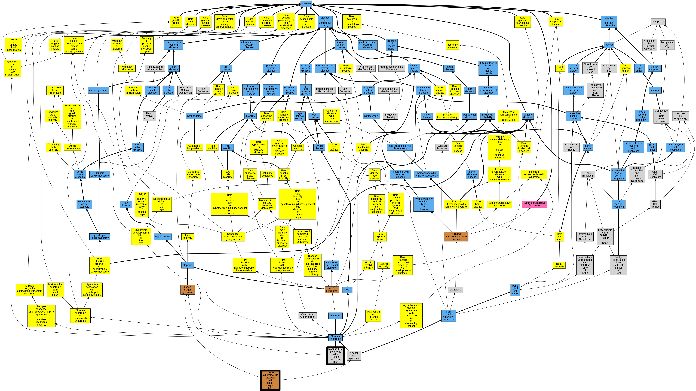

## GENE: SHOC2

[matched diseases visual](SHOC2.png)  <-- click on raw to zoom

### Rasopathy

### NOONAN SYNDROME-LIKE DISORDER WITH LOOSE ANAGEN HAIR
 * [OMIM:607721 Noonan syndrome-like disorder with loose anagen hair](http://beta.monarchinitiative.org/disease/OMIM:607721) Confidence: high
    * Equiv:[Orphanet:2701 Noonan syndrome-like disorder with loose anagen hair](http://beta.monarchinitiative.org/disease/Orphanet:2701)
    * Equiv:[MESH:C564342 Noonan-Like Syndrome With Loose Anagen Hair](http://beta.monarchinitiative.org/disease/MESH:C564342)
    * Syn: "NOONAN SYNDROME-LIKE DISORDER WITH LOOSE ANAGEN HAIR; NSLH"
    * Syn: "NSLH"
    * Syn: "Tosti Syndrome"

### Noonan-like syndrome with loose anagen hair
 * [OMIM:607721 Noonan syndrome-like disorder with loose anagen hair](http://beta.monarchinitiative.org/disease/OMIM:607721) Confidence: low/0.205078125
    * Equiv:[Orphanet:2701 Noonan syndrome-like disorder with loose anagen hair](http://beta.monarchinitiative.org/disease/Orphanet:2701)
    * Equiv:[MESH:C564342 Noonan-Like Syndrome With Loose Anagen Hair](http://beta.monarchinitiative.org/disease/MESH:C564342)
    * Syn: "NOONAN SYNDROME-LIKE DISORDER WITH LOOSE ANAGEN HAIR; NSLH"
    * Syn: "NSLH"
    * Syn: "Tosti Syndrome"
