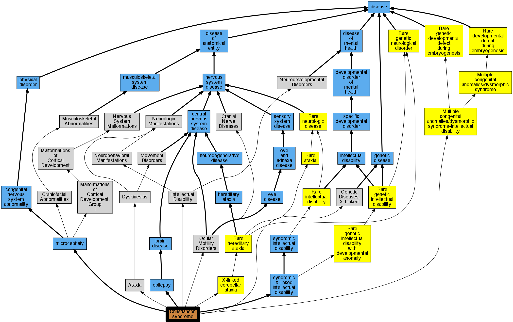

## GENE: SLC9A6

[matched diseases visual](SLC9A6.png)  <-- click on raw to zoom

### MENTAL RETARDATION, X-LINKED, SYNDROMIC, CHRISTIANSON TYPE
 * [OMIM:300243 Mental Retardation, X-Linked, Syndromic, Christianson Type](http://beta.monarchinitiative.org/disease/OMIM:300243) Confidence: high
    * Equiv:[MESH:C567484 Mental Retardation, X-Linked, Syndromic, Christianson Type](http://beta.monarchinitiative.org/disease/MESH:C567484)
    * Syn: "Angelman-Like Syndrome, X-Linked"
    * Syn: "Mental Retardation, Microcephaly, Epilepsy, and Ataxia Syndrome"
    * Syn: "MENTAL RETARDATION, X-LINKED, SYNDROMIC, CHRISTIANSON TYPE; MRXSCH"
    * Syn: "MRXSCH"

### Christianson syndrome
 * [Orphanet:85278 Christianson syndrome](http://beta.monarchinitiative.org/disease/Orphanet:85278) Confidence: high

### Mental retardation, X-linked syndromic, Christianson type
 * [OMIM:300243 Mental Retardation, X-Linked, Syndromic, Christianson Type](http://beta.monarchinitiative.org/disease/OMIM:300243) Confidence: high
    * Equiv:[MESH:C567484 Mental Retardation, X-Linked, Syndromic, Christianson Type](http://beta.monarchinitiative.org/disease/MESH:C567484)
    * Syn: "Angelman-Like Syndrome, X-Linked"
    * Syn: "Mental Retardation, Microcephaly, Epilepsy, and Ataxia Syndrome"
    * Syn: "MENTAL RETARDATION, X-LINKED, SYNDROMIC, CHRISTIANSON TYPE; MRXSCH"
    * Syn: "MRXSCH"
