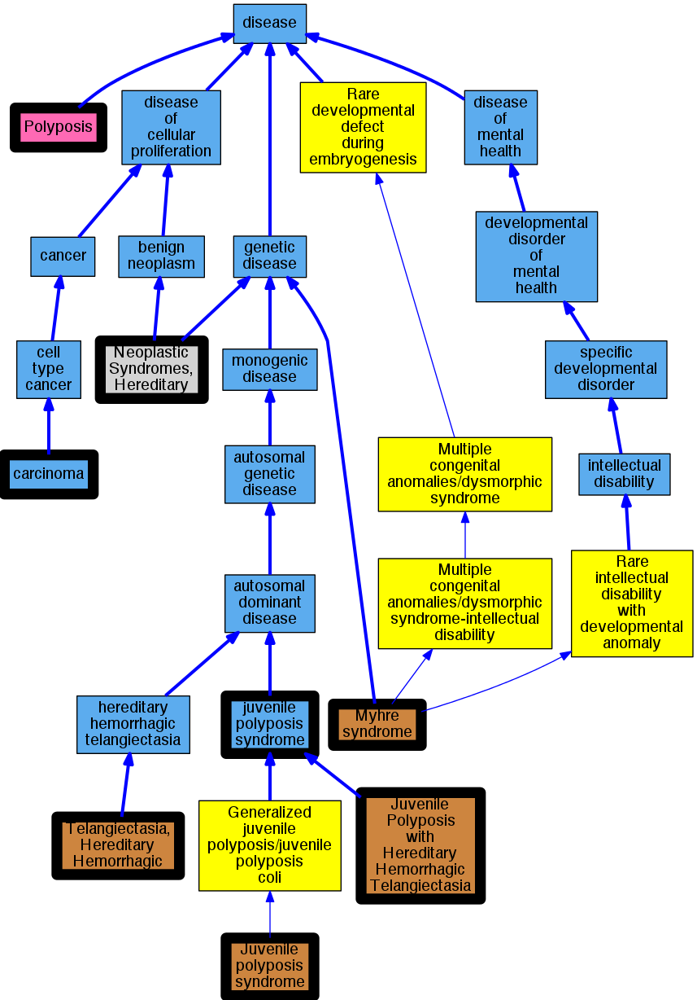

## GENE: SMAD4

[matched diseases visual](SMAD4.png)  <-- click on raw to zoom

### JP and JP/HHT
 * [OMIM:187300 Telangiectasia, Hereditary Hemorrhagic](http://beta.monarchinitiative.org/disease/OMIM:187300) Confidence: low/0.1328125
    * Equiv:[MESH:D013683 Telangiectasia, Hereditary Hemorrhagic](http://beta.monarchinitiative.org/disease/MESH:D013683)
    * Syn: "HHT"
    * Syn: "Orw Disease"
    * Syn: "Osler-Rendu-Weber Disease"
    * Syn: "TELANGIECTASIA, HEREDITARY HEMORRHAGIC, OF RENDU, OSLER, AND WEBER; HHT"
    * Syn: "Telangiectasia, Hereditary Hemorrhagic, Type 1"

### JP/HHT
 * [OMIM:175050 Juvenile Polyposis with Hereditary Hemorrhagic Telangiectasia](http://beta.monarchinitiative.org/disease/OMIM:175050) Confidence: medium
    * Equiv:[MESH:C563412 Juvenile Polyposis with Hereditary Hemorrhagic Telangiectasia](http://beta.monarchinitiative.org/disease/MESH:C563412)
    * Syn: "Jp/Hht Syndrome"
    * Syn: "JPHT"
    * Syn: "Jps/Hht"
    * Syn: "Juvenile Polyposis With Hereditary Hemorrhagic Telangiectasia"
    * Syn: "JUVENILE POLYPOSIS/HEREDITARY HEMORRHAGIC TELANGIECTASIA SYNDROME; JPHT"
    * Syn: "Polyposis, Generalized Juvenile, With Pulmonary Arteriovenous Malformation"
    * Syn: "Telangiectasia, Hereditary Hemorrhagic, With Juvenile Polyposis Coli"

### JUVENILE POLYPOSIS OF STOMACH
 * [OMIM:174900 Juvenile polyposis syndrome](http://beta.monarchinitiative.org/disease/OMIM:174900) Confidence: high
    * Equiv:[MESH:C537702 Juvenile polyposis syndrome](http://beta.monarchinitiative.org/disease/MESH:C537702)
    * Syn: "JPS"
    * Syn: "Juvenile Intestinal Polyposis"
    * Syn: "Juvenile Polyposis Coli"
    * Syn: "Juvenile Polyposis of Stomach"
    * Syn: "JUVENILE POLYPOSIS SYNDROME; JPS"
    * Syn: "Polyposis, Familial, of Entire Gastrointestinal Tract"
    * Syn: "Polyposis, Juvenile Intestinal"

### JUVENILE POLYPOSIS SYNDROME
 * [DOID:0050787 juvenile polyposis syndrome](http://beta.monarchinitiative.org/disease/DOID:0050787) Confidence: high

### JUVENILE POLYPOSIS/HEREDITARY HEMORRHAGIC TELANGIECTASIA SYNDROME
 * [OMIM:175050 Juvenile Polyposis with Hereditary Hemorrhagic Telangiectasia](http://beta.monarchinitiative.org/disease/OMIM:175050) Confidence: low/0.1640625
    * Equiv:[MESH:C563412 Juvenile Polyposis with Hereditary Hemorrhagic Telangiectasia](http://beta.monarchinitiative.org/disease/MESH:C563412)
    * Syn: "Jp/Hht Syndrome"
    * Syn: "JPHT"
    * Syn: "Jps/Hht"
    * Syn: "Juvenile Polyposis With Hereditary Hemorrhagic Telangiectasia"
    * Syn: "JUVENILE POLYPOSIS/HEREDITARY HEMORRHAGIC TELANGIECTASIA SYNDROME; JPHT"
    * Syn: "Polyposis, Generalized Juvenile, With Pulmonary Arteriovenous Malformation"
    * Syn: "Telangiectasia, Hereditary Hemorrhagic, With Juvenile Polyposis Coli"

### Juvenile polyposis syndrome
 * [DOID:0050787 juvenile polyposis syndrome](http://beta.monarchinitiative.org/disease/DOID:0050787) Confidence: high

### Neoplastic Syndromes, Hereditary
 * [MESH:D009386 Neoplastic Syndromes, Hereditary](http://beta.monarchinitiative.org/disease/MESH:D009386) Confidence: high

### MYHRE SYNDROME
 * [OMIM:139210 Myhre syndrome](http://beta.monarchinitiative.org/disease/OMIM:139210) Confidence: high
    * Equiv:[Orphanet:2588 Myhre syndrome](http://beta.monarchinitiative.org/disease/Orphanet:2588)
    * Equiv:[MESH:C537620 Growth mental deficiency syndrome of Myhre](http://beta.monarchinitiative.org/disease/MESH:C537620)
    * Syn: "Growth-Mental Deficiency Syndrome of Myhre"
    * Syn: "Laryngotracheal Stenosis, Arthropathy, Prognathism, and Short Stature"
    * Syn: "MYHRE SYNDROME; MYHRS"
    * Syn: "MYHRS"

### Gastrointestinal polyposis
 * [DC:0000587 Polyposis](http://beta.monarchinitiative.org/disease/DC:0000587) Confidence: low/0.15625

### JP, JP/HHT, and HHT
 * [OMIM:187300 Telangiectasia, Hereditary Hemorrhagic](http://beta.monarchinitiative.org/disease/OMIM:187300) Confidence: low/0.1328125
    * Equiv:[MESH:D013683 Telangiectasia, Hereditary Hemorrhagic](http://beta.monarchinitiative.org/disease/MESH:D013683)
    * Syn: "HHT"
    * Syn: "Orw Disease"
    * Syn: "Osler-Rendu-Weber Disease"
    * Syn: "TELANGIECTASIA, HEREDITARY HEMORRHAGIC, OF RENDU, OSLER, AND WEBER; HHT"
    * Syn: "Telangiectasia, Hereditary Hemorrhagic, Type 1"

### PANCREATIC CARCINOMA, SOMATIC
 * [DOID:305 carcinoma](http://beta.monarchinitiative.org/disease/DOID:305) Confidence: low/0.1388888888888889
    * Syn: "epithelioma"
    * Syn: "malignant Epithelioma"
