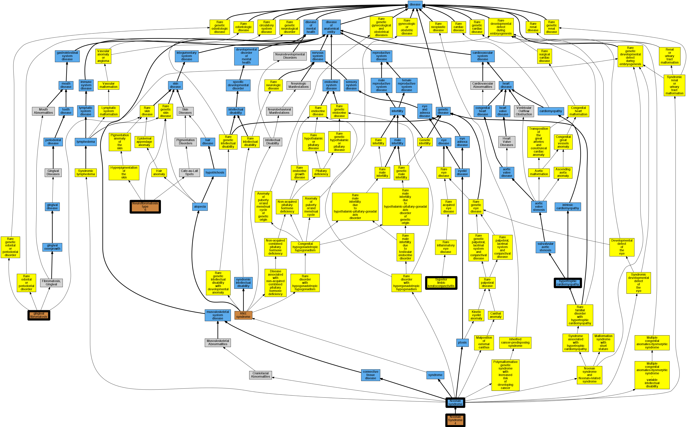

## GENE: SOS1

[matched diseases visual](SOS1.png)  <-- click on raw to zoom

### Cafe au lait spots, multiple
 * [OMIM:114030 Cafe au lait spots, multiple](http://beta.monarchinitiative.org/disease/OMIM:114030) Confidence: high
    * Equiv:[MESH:C537421 Cafe au lait spots, multiple](http://beta.monarchinitiative.org/disease/MESH:C537421)
    * Syn: "CAFE-AU-LAIT SPOTS, MULTIPLE"

### NOONAN SYNDROME 4
 * [OMIM:610733 Noonan Syndrome 4](http://beta.monarchinitiative.org/disease/OMIM:610733) Confidence: high
    * Equiv:[MESH:C548082 Noonan Syndrome 4](http://beta.monarchinitiative.org/disease/MESH:C548082)
    * Syn: "NOONAN SYNDROME 4; NS4"
    * Syn: "NS4"

### Primary familial hypertrophic cardiomyopathy
 * [DOID:11984 hypertrophic cardiomyopathy](http://beta.monarchinitiative.org/disease/DOID:11984) Confidence: low/0.1953125
    * Equiv:[MESH:D002312 Cardiomyopathy, Hypertrophic](http://beta.monarchinitiative.org/disease/MESH:D002312)
    * Equiv:[MESH:D024741 Cardiomyopathy, Hypertrophic, Familial](http://beta.monarchinitiative.org/disease/MESH:D024741)
    * Syn: "familial hypertrophic cardiomyopathy"
    * Syn: "hypertrophic obstructive cardiomyopathy"

### Noonan syndrome
 * [DOID:3490 Noonan syndrome](http://beta.monarchinitiative.org/disease/DOID:3490) Confidence: high
    * Syn: "Turner's phenotype, karyotype normal (disorder)"

### Noonan's syndrome
 * [OMIM:309900 mucopolysaccharidosis II](http://beta.monarchinitiative.org/disease/OMIM:309900) Confidence: low/0.1640625
    * Equiv:[Orphanet:580 Mucopolysaccharidosis type 2](http://beta.monarchinitiative.org/disease/Orphanet:580)
    * Equiv:[DOID:12799 mucopolysaccharidosis II](http://beta.monarchinitiative.org/disease/DOID:12799)
    * Syn: "deficiency of iduronate-2-sulphatase"
    * Syn: "Hunter Syndrome"
    * Syn: "Hunter syndrome"
    * Syn: "Hunter's syndrome"
    * Syn: "Ids Deficiency"
    * Syn: "Iduronate 2-Sulfatase Deficiency"
    * Syn: "Mps 2"
    * Syn: "MPS II - Hunter syndrome"
    * Syn: "MPS2"
    * Syn: "Mucopolysaccharidosis, MPS-II (disorder)"
    * Syn: "MUCOPOLYSACCHARIDOSIS, TYPE II; MPS2"
    * Syn: "Sids Deficiency"
    * Syn: "Sulfoiduronate Sulfatase Deficiency"

### Primary familial hypertrophic cardiomyopathy
 * [DOID:11984 hypertrophic cardiomyopathy](http://beta.monarchinitiative.org/disease/DOID:11984) Confidence: low/0.1953125
    * Equiv:[MESH:D002312 Cardiomyopathy, Hypertrophic](http://beta.monarchinitiative.org/disease/MESH:D002312)
    * Equiv:[MESH:D024741 Cardiomyopathy, Hypertrophic, Familial](http://beta.monarchinitiative.org/disease/MESH:D024741)
    * Syn: "familial hypertrophic cardiomyopathy"
    * Syn: "hypertrophic obstructive cardiomyopathy"

### Atrial septal defect
 * [DOID:1882 atrial heart septal defect](http://beta.monarchinitiative.org/disease/DOID:1882) Confidence: high
    * Equiv:[MESH:D006344 Heart Septal Defects, Atrial](http://beta.monarchinitiative.org/disease/MESH:D006344)
    * Syn: "atrial septal defect"
    * Syn: "atrioseptal defect"
    * Syn: "auricular septal defect"
    * Syn: "congenital atrial septal defect"
    * Syn: "interatrial septal defect"
    * Syn: "interauricular septal defect"

### Cafe au lait spots, multiple
 * [OMIM:114030 Cafe au lait spots, multiple](http://beta.monarchinitiative.org/disease/OMIM:114030) Confidence: high
    * Equiv:[MESH:C537421 Cafe au lait spots, multiple](http://beta.monarchinitiative.org/disease/MESH:C537421)
    * Syn: "CAFE-AU-LAIT SPOTS, MULTIPLE"

### Noonan syndrome 4
 * [OMIM:610733 Noonan Syndrome 4](http://beta.monarchinitiative.org/disease/OMIM:610733) Confidence: high
    * Equiv:[MESH:C548082 Noonan Syndrome 4](http://beta.monarchinitiative.org/disease/MESH:C548082)
    * Syn: "NOONAN SYNDROME 4; NS4"
    * Syn: "NS4"

### Primary familial hypertrophic cardiomyopathy
 * [DOID:11984 hypertrophic cardiomyopathy](http://beta.monarchinitiative.org/disease/DOID:11984) Confidence: low/0.1953125
    * Equiv:[MESH:D002312 Cardiomyopathy, Hypertrophic](http://beta.monarchinitiative.org/disease/MESH:D002312)
    * Equiv:[MESH:D024741 Cardiomyopathy, Hypertrophic, Familial](http://beta.monarchinitiative.org/disease/MESH:D024741)
    * Syn: "familial hypertrophic cardiomyopathy"
    * Syn: "hypertrophic obstructive cardiomyopathy"

### Atrial septal defect
 * [DOID:1882 atrial heart septal defect](http://beta.monarchinitiative.org/disease/DOID:1882) Confidence: high
    * Equiv:[MESH:D006344 Heart Septal Defects, Atrial](http://beta.monarchinitiative.org/disease/MESH:D006344)
    * Syn: "atrial septal defect"
    * Syn: "atrioseptal defect"
    * Syn: "auricular septal defect"
    * Syn: "congenital atrial septal defect"
    * Syn: "interatrial septal defect"
    * Syn: "interauricular septal defect"

### FIBROMATOSIS, GINGIVAL, 1
 * [OMIM:135300 Fibromatosis, Gingival, Type 1](http://beta.monarchinitiative.org/disease/OMIM:135300) Confidence: low/0.1640625
    * Equiv:[MESH:C562884 Fibromatosis, Gingival, Type 1](http://beta.monarchinitiative.org/disease/MESH:C562884)
    * Syn: "FIBROMATOSIS, GINGIVAL, 1; GINGF1"
    * Syn: "Fibromatosis, Gingival, Hereditary"
    * Syn: "Ggf1"
    * Syn: "Gingf"
    * Syn: "GINGF1"

### Noonan's syndrome
 * [OMIM:309900 mucopolysaccharidosis II](http://beta.monarchinitiative.org/disease/OMIM:309900) Confidence: low/0.1640625
    * Equiv:[Orphanet:580 Mucopolysaccharidosis type 2](http://beta.monarchinitiative.org/disease/Orphanet:580)
    * Equiv:[DOID:12799 mucopolysaccharidosis II](http://beta.monarchinitiative.org/disease/DOID:12799)
    * Syn: "deficiency of iduronate-2-sulphatase"
    * Syn: "Hunter Syndrome"
    * Syn: "Hunter syndrome"
    * Syn: "Hunter's syndrome"
    * Syn: "Ids Deficiency"
    * Syn: "Iduronate 2-Sulfatase Deficiency"
    * Syn: "Mps 2"
    * Syn: "MPS II - Hunter syndrome"
    * Syn: "MPS2"
    * Syn: "Mucopolysaccharidosis, MPS-II (disorder)"
    * Syn: "MUCOPOLYSACCHARIDOSIS, TYPE II; MPS2"
    * Syn: "Sids Deficiency"
    * Syn: "Sulfoiduronate Sulfatase Deficiency"

### Rasopathy
