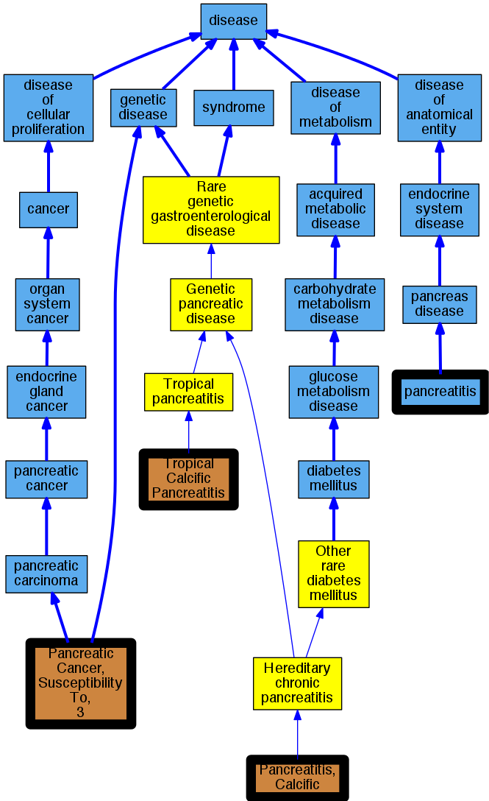

## GENE: SPINK1

[matched diseases visual](SPINK1.png)  <-- click on raw to zoom

### FIBROCALCULOUS PANCREATIC DIABETES, SUSCEPTIBILITY TO
 * [OMIM:612227 diabetic ketoacidosis](http://beta.monarchinitiative.org/disease/OMIM:612227) Confidence: low/0.036250000000000004
    * Equiv:[DOID:1837 diabetic ketoacidosis](http://beta.monarchinitiative.org/disease/DOID:1837)
    * Syn: "Acidoses, Diabetic"
    * Syn: "Acidosis, Diabetic"
    * Syn: "DIABETES MELLITUS, KETOSIS-PRONE"
    * Syn: "DIABETES MELLITUS, KETOSIS-PRONE; KPD"
    * Syn: "Diabetic Acidoses"
    * Syn: "Diabetic Acidosis"
    * Syn: "Diabetic Ketoacidoses"
    * Syn: "Diabetic Ketoses"
    * Syn: "Diabetic Ketosis"
    * Syn: "Ketoacidoses, Diabetic"
    * Syn: "Ketoacidosis, Diabetic"
    * Syn: "Ketoses, Diabetic"
    * Syn: "Ketosis, Diabetic"
    * Syn: "ketosis-prone diabetes mellitus"
    * Syn: "KPD"

### Hereditary pancreatitis
 * [OMIM:167800 Hereditary chronic pancreatitis](http://beta.monarchinitiative.org/disease/OMIM:167800) Confidence: high
    * Equiv:[Orphanet:676 Hereditary chronic pancreatitis](http://beta.monarchinitiative.org/disease/Orphanet:676)
    * Equiv:[MESH:C537262 Hereditary pancreatitis](http://beta.monarchinitiative.org/disease/MESH:C537262)
    * Syn: "Autosomal Dominant Hereditary Pancreatitis"
    * Syn: "Familial Pancreatitis"
    * Syn: "Hereditary Chronic Pancreatitis"
    * Syn: "Hp"
    * Syn: "Hpc"
    * Syn: "Pancreatitis, Calcific"
    * Syn: "Pancreatitis, Chronic"
    * Syn: "Pancreatitis, Chronic, Protection Against"
    * Syn: "Pancreatitis, Chronic, Susceptibility to"
    * Syn: "Pancreatitis, Hereditary"
    * Syn: "PANCREATITIS, HEREDITARY; PCTT"
    * Syn: "PCTT"

### PANCREATITIS, CHRONIC, SUSCEPTIBILITY TO
 * [OMIM:167800 Hereditary chronic pancreatitis](http://beta.monarchinitiative.org/disease/OMIM:167800) Confidence: high
    * Equiv:[Orphanet:676 Hereditary chronic pancreatitis](http://beta.monarchinitiative.org/disease/Orphanet:676)
    * Equiv:[MESH:C537262 Hereditary pancreatitis](http://beta.monarchinitiative.org/disease/MESH:C537262)
    * Syn: "Autosomal Dominant Hereditary Pancreatitis"
    * Syn: "Familial Pancreatitis"
    * Syn: "Hereditary Chronic Pancreatitis"
    * Syn: "Hp"
    * Syn: "Hpc"
    * Syn: "Pancreatitis, Calcific"
    * Syn: "Pancreatitis, Chronic"
    * Syn: "Pancreatitis, Chronic, Protection Against"
    * Syn: "Pancreatitis, Chronic, Susceptibility to"
    * Syn: "Pancreatitis, Hereditary"
    * Syn: "PANCREATITIS, HEREDITARY; PCTT"
    * Syn: "PCTT"

### heritable chronic pancreatitis
 * [MESH:D050500 Pancreatitis, Chronic](http://beta.monarchinitiative.org/disease/MESH:D050500) Confidence: low/0.18055555555555555
    * Syn: "Chronic Pancreatitis"

### TROPICAL CALCIFIC PANCREATITIS
 * [OMIM:608189 Tropical pancreatitis](http://beta.monarchinitiative.org/disease/OMIM:608189) Confidence: medium
    * Equiv:[Orphanet:103918 Tropical pancreatitis](http://beta.monarchinitiative.org/disease/Orphanet:103918)
    * Equiv:[MESH:C564276 Tropical Calcific Pancreatitis](http://beta.monarchinitiative.org/disease/MESH:C564276)
    * Syn: "TCP"
    * Syn: "Tcp"
    * Syn: "Tropical calcific chronic pancreatitis"
    * Syn: "TROPICAL CALCIFIC PANCREATITIS"

### PANCREATITIS, CHRONIC
 * [MESH:D050500 Pancreatitis, Chronic](http://beta.monarchinitiative.org/disease/MESH:D050500) Confidence: high
    * Syn: "Chronic Pancreatitis"

### chronic pancreatitis risk
 * [MESH:D050500 Pancreatitis, Chronic](http://beta.monarchinitiative.org/disease/MESH:D050500) Confidence: low/0.18055555555555555
    * Syn: "Chronic Pancreatitis"
