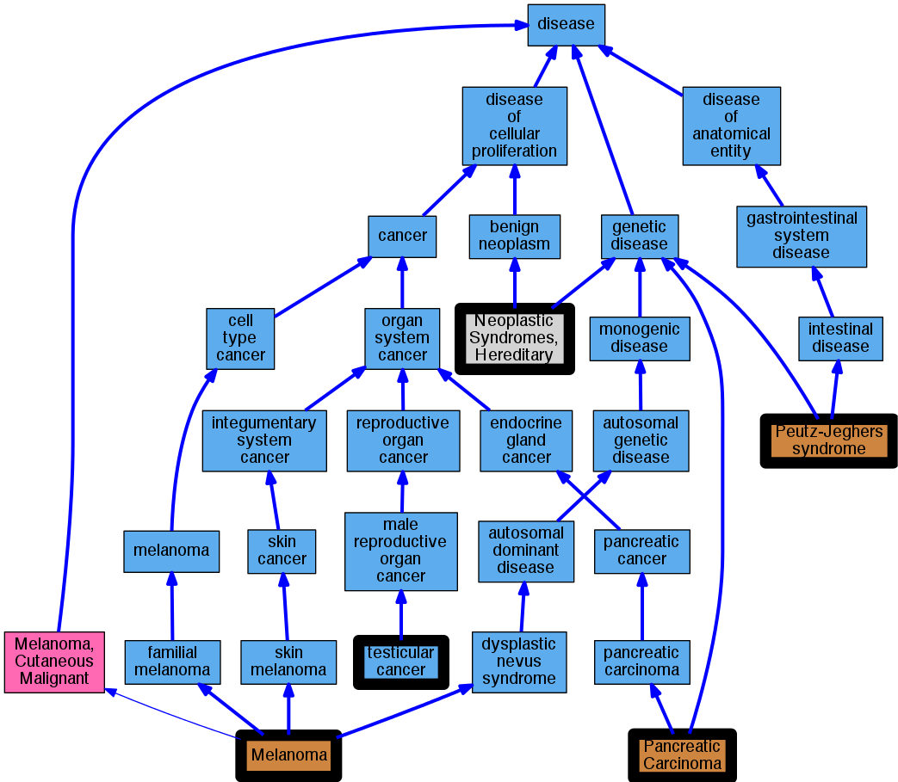

## GENE: STK11

[matched diseases visual](STK11.png)  <-- click on raw to zoom

### PANCREATIC CANCER, SOMATIC
 * [OMIM:260350 Pancreatic Carcinoma](http://beta.monarchinitiative.org/disease/OMIM:260350) Confidence: low/0.18055555555555555
    * Equiv:[MESH:C535837 Pancreatic carcinoma, familial](http://beta.monarchinitiative.org/disease/MESH:C535837)
    * Equiv:[MESH:C562463 Pancreatic Carcinoma](http://beta.monarchinitiative.org/disease/MESH:C562463)
    * Syn: "Pancreatic Acinar Carcinoma"
    * Syn: "PANCREATIC CANCER"
    * Syn: "Pancreatic Carcinoma"

### RECLASSIFIED - VARIANT OF UNKNOWN SIGNIFICANCE
 * [Orphanet:84096 Unknown leukodystrophy](http://beta.monarchinitiative.org/disease/Orphanet:84096) Confidence: low/0.0675

### RECLASSIFIED - VARIANT OF UNKNOWN SIGNIFICANCE
 * [Orphanet:84096 Unknown leukodystrophy](http://beta.monarchinitiative.org/disease/Orphanet:84096) Confidence: low/0.0675

### RECLASSIFIED - VARIANT OF UNKNOWN SIGNIFICANCE
 * [Orphanet:84096 Unknown leukodystrophy](http://beta.monarchinitiative.org/disease/Orphanet:84096) Confidence: low/0.0675

### MELANOMA, MALIGNANT, SOMATIC
 * [OMIM:155600 Melanoma](http://beta.monarchinitiative.org/disease/OMIM:155600) Confidence: low/0.1388888888888889
    * Equiv:[MESH:C562393 Melanoma, Cutaneous Malignant](http://beta.monarchinitiative.org/disease/MESH:C562393)
    * Equiv:[MESH:D008545 Melanoma](http://beta.monarchinitiative.org/disease/MESH:D008545)
    * Syn: "B-K Mole Syndrome"
    * Syn: "CMM1"
    * Syn: "Dysplastic Nevus Syndrome, Hereditary"
    * Syn: "Familial Atypical Mole-Malignant Melanoma Syndrome"
    * Syn: "Melanoma, Cutaneous Malignant"
    * Syn: "MELANOMA, CUTANEOUS MALIGNANT, SUSCEPTIBILITY TO, 1; CMM1"
    * Syn: "Melanoma, Familial"
    * Syn: "Melanoma, Malignant"

### Neoplastic Syndromes, Hereditary
 * [MESH:D009386 Neoplastic Syndromes, Hereditary](http://beta.monarchinitiative.org/disease/MESH:D009386) Confidence: high

### Peutz-Jeghers syndrome
 * [OMIM:175200 Peutz-Jeghers syndrome](http://beta.monarchinitiative.org/disease/OMIM:175200) Confidence: high
    * Equiv:[DOID:3852 Peutz-Jeghers syndrome](http://beta.monarchinitiative.org/disease/DOID:3852)
    * Equiv:[MESH:D010580 Peutz-Jeghers Syndrome](http://beta.monarchinitiative.org/disease/MESH:D010580)
    * Syn: "Colonic hamartomatous polyp"
    * Syn: "gastric Peutz-Jeghers polyp"
    * Syn: "Peutz Jeghers colon polyp"
    * Syn: "Peutz Jeghers polyp"
    * Syn: "Peutz-Jeghers polyp of small Intestine"
    * Syn: "peutz-jeghers small bowel hamartoma"
    * Syn: "PEUTZ-JEGHERS SYNDROME; PJS"
    * Syn: "PJS"
    * Syn: "Polyposis, Hamartomatous Intestinal"
    * Syn: "Polyps-And-Spots Syndrome"

### RECLASSIFIED - VARIANT OF UNKNOWN SIGNIFICANCE
 * [Orphanet:84096 Unknown leukodystrophy](http://beta.monarchinitiative.org/disease/Orphanet:84096) Confidence: low/0.0675

### RECLASSIFIED - VARIANT OF UNKNOWN SIGNIFICANCE
 * [Orphanet:84096 Unknown leukodystrophy](http://beta.monarchinitiative.org/disease/Orphanet:84096) Confidence: low/0.0675

### TESTICULAR TUMOR, SOMATIC
 * [DOID:2998 testicular cancer](http://beta.monarchinitiative.org/disease/DOID:2998) Confidence: low/0.18055555555555555
    * Equiv:[MESH:D013736 Testicular Neoplasms](http://beta.monarchinitiative.org/disease/MESH:D013736)
    * Syn: "neoplasm of testis (disorder)"
    * Syn: "testicular tumor"
    * Syn: "testicular tumor (disorder)"
    * Syn: "testis cancer"
    * Syn: "testis neoplasm"

### PEUTZ-JEGHERS SYNDROME
 * [OMIM:175200 Peutz-Jeghers syndrome](http://beta.monarchinitiative.org/disease/OMIM:175200) Confidence: high
    * Equiv:[DOID:3852 Peutz-Jeghers syndrome](http://beta.monarchinitiative.org/disease/DOID:3852)
    * Equiv:[MESH:D010580 Peutz-Jeghers Syndrome](http://beta.monarchinitiative.org/disease/MESH:D010580)
    * Syn: "Colonic hamartomatous polyp"
    * Syn: "gastric Peutz-Jeghers polyp"
    * Syn: "Peutz Jeghers colon polyp"
    * Syn: "Peutz Jeghers polyp"
    * Syn: "Peutz-Jeghers polyp of small Intestine"
    * Syn: "peutz-jeghers small bowel hamartoma"
    * Syn: "PEUTZ-JEGHERS SYNDROME; PJS"
    * Syn: "PJS"
    * Syn: "Polyposis, Hamartomatous Intestinal"
    * Syn: "Polyps-And-Spots Syndrome"

### RECLASSIFIED - VARIANT OF UNKNOWN SIGNIFICANCE
 * [Orphanet:84096 Unknown leukodystrophy](http://beta.monarchinitiative.org/disease/Orphanet:84096) Confidence: low/0.0675

### RECLASSIFIED - VARIANT OF UNKNOWN SIGNIFICANCE
 * [Orphanet:84096 Unknown leukodystrophy](http://beta.monarchinitiative.org/disease/Orphanet:84096) Confidence: low/0.0675

### RECLASSIFIED - VARIANT OF UNKNOWN SIGNIFICANCE
 * [Orphanet:84096 Unknown leukodystrophy](http://beta.monarchinitiative.org/disease/Orphanet:84096) Confidence: low/0.0675

### RECLASSIFIED - VARIANT OF UNKNOWN SIGNIFICANCE
 * [Orphanet:84096 Unknown leukodystrophy](http://beta.monarchinitiative.org/disease/Orphanet:84096) Confidence: low/0.0675

### MELANOMA, MALIGNANT, SOMATIC
 * [OMIM:155600 Melanoma](http://beta.monarchinitiative.org/disease/OMIM:155600) Confidence: low/0.1388888888888889
    * Equiv:[MESH:C562393 Melanoma, Cutaneous Malignant](http://beta.monarchinitiative.org/disease/MESH:C562393)
    * Equiv:[MESH:D008545 Melanoma](http://beta.monarchinitiative.org/disease/MESH:D008545)
    * Syn: "B-K Mole Syndrome"
    * Syn: "CMM1"
    * Syn: "Dysplastic Nevus Syndrome, Hereditary"
    * Syn: "Familial Atypical Mole-Malignant Melanoma Syndrome"
    * Syn: "Melanoma, Cutaneous Malignant"
    * Syn: "MELANOMA, CUTANEOUS MALIGNANT, SUSCEPTIBILITY TO, 1; CMM1"
    * Syn: "Melanoma, Familial"
    * Syn: "Melanoma, Malignant"

### RECLASSIFIED - VARIANT OF UNKNOWN SIGNIFICANCE
 * [Orphanet:84096 Unknown leukodystrophy](http://beta.monarchinitiative.org/disease/Orphanet:84096) Confidence: low/0.0675

### RECLASSIFIED - VARIANT OF UNKNOWN SIGNIFICANCE
 * [Orphanet:84096 Unknown leukodystrophy](http://beta.monarchinitiative.org/disease/Orphanet:84096) Confidence: low/0.0675
