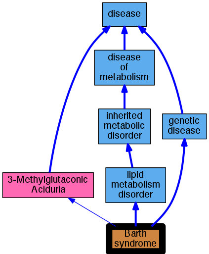

## GENE: TAZ

[matched diseases visual](TAZ.png)  <-- click on raw to zoom

### BARTH SYNDROME
 * [OMIM:302060 Barth syndrome](http://beta.monarchinitiative.org/disease/OMIM:302060) Confidence: high
    * Equiv:[DOID:0050476 Barth syndrome](http://beta.monarchinitiative.org/disease/DOID:0050476)
    * Equiv:[MESH:D056889 Barth Syndrome](http://beta.monarchinitiative.org/disease/MESH:D056889)
    * Syn: "3-Methylglutaconic Aciduria, Type 2"
    * Syn: "3-methylglutaconicaciduria type 2"
    * Syn: "3-methylglutaconicaciduria type II"
    * Syn: "BARTH SYNDROME; BTHS"
    * Syn: "BTHS"
    * Syn: "Cardioskeletal Myopathy With Neutropenia and Abnormal Mitochondria"
    * Syn: "MGA Type 2"
    * Syn: "MGA type II"
    * Syn: "Mga, Type 2"

### Barth Syndrome
 * [OMIM:302060 Barth syndrome](http://beta.monarchinitiative.org/disease/OMIM:302060) Confidence: high
    * Equiv:[DOID:0050476 Barth syndrome](http://beta.monarchinitiative.org/disease/DOID:0050476)
    * Equiv:[MESH:D056889 Barth Syndrome](http://beta.monarchinitiative.org/disease/MESH:D056889)
    * Syn: "3-Methylglutaconic Aciduria, Type 2"
    * Syn: "3-methylglutaconicaciduria type 2"
    * Syn: "3-methylglutaconicaciduria type II"
    * Syn: "BARTH SYNDROME; BTHS"
    * Syn: "BTHS"
    * Syn: "Cardioskeletal Myopathy With Neutropenia and Abnormal Mitochondria"
    * Syn: "MGA Type 2"
    * Syn: "MGA type II"
    * Syn: "Mga, Type 2"

### Barth syndrome
 * [OMIM:302060 Barth syndrome](http://beta.monarchinitiative.org/disease/OMIM:302060) Confidence: high
    * Equiv:[DOID:0050476 Barth syndrome](http://beta.monarchinitiative.org/disease/DOID:0050476)
    * Equiv:[MESH:D056889 Barth Syndrome](http://beta.monarchinitiative.org/disease/MESH:D056889)
    * Syn: "3-Methylglutaconic Aciduria, Type 2"
    * Syn: "3-methylglutaconicaciduria type 2"
    * Syn: "3-methylglutaconicaciduria type II"
    * Syn: "BARTH SYNDROME; BTHS"
    * Syn: "BTHS"
    * Syn: "Cardioskeletal Myopathy With Neutropenia and Abnormal Mitochondria"
    * Syn: "MGA Type 2"
    * Syn: "MGA type II"
    * Syn: "Mga, Type 2"
