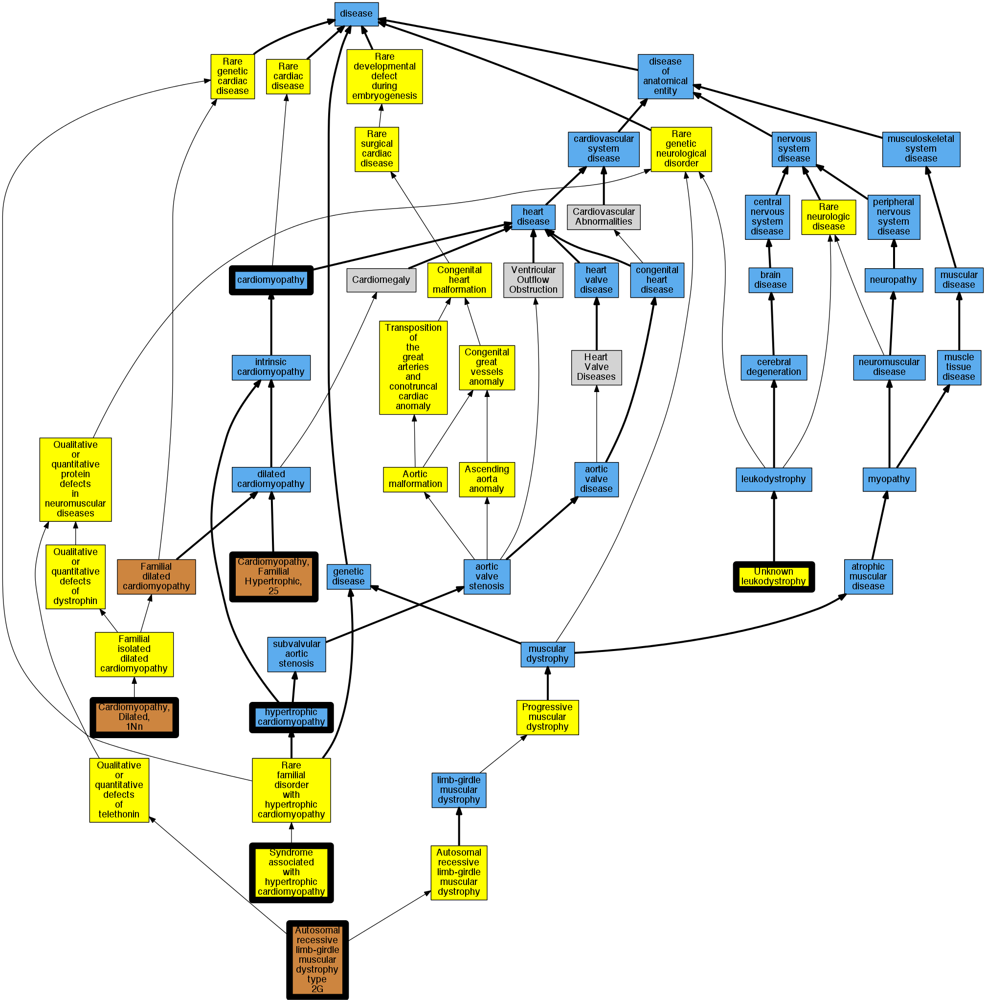

## GENE: TCAP

[matched diseases visual](TCAP.png)  <-- click on raw to zoom

### Cardiomyopathy
 * [DOID:0050700 cardiomyopathy](http://beta.monarchinitiative.org/disease/DOID:0050700) Confidence: high
    * Equiv:[MESH:D009202 Cardiomyopathies](http://beta.monarchinitiative.org/disease/MESH:D009202)
    * Syn: "Cardiomyopathies"

### Cardiomyopathy, dilated, 1N
 * [OMIM:607487 Cardiomyopathy, Dilated, 1N](http://beta.monarchinitiative.org/disease/OMIM:607487) Confidence: high
    * Equiv:[MESH:C564388 Cardiomyopathy, Dilated, 1N](http://beta.monarchinitiative.org/disease/MESH:C564388)
    * Syn: "CARDIOMYOPATHY, FAMILIAL HYPERTROPHIC, 25; CMH25"
    * Syn: "CMH25"

### Cardiomyopathy, hypertrophic, association with
 * [Orphanet:217595 Syndrome associated with hypertrophic cardiomyopathy](http://beta.monarchinitiative.org/disease/Orphanet:217595) Confidence: low/0.18000000000000002

### MUSCULAR DYSTROPHY, LIMB-GIRDLE, TYPE 2G
 * [OMIM:601954 Muscular Dystrophy, Limb-Girdle, Type 2G](http://beta.monarchinitiative.org/disease/OMIM:601954) Confidence: high
    * Equiv:[MESH:C566599 Muscular Dystrophy, Limb-Girdle, Type 2G](http://beta.monarchinitiative.org/disease/MESH:C566599)
    * Syn: "LGMD2G"
    * Syn: "MUSCULAR DYSTROPHY, LIMB-GIRDLE, TYPE 2G; LGMD2G"

### RECLASSIFIED - VARIANT OF UNKNOWN SIGNIFICANCE
 * [Orphanet:84096 Unknown leukodystrophy](http://beta.monarchinitiative.org/disease/Orphanet:84096) Confidence: low/0.0675

### RECLASSIFIED - VARIANT OF UNKNOWN SIGNIFICANCE
 * [Orphanet:84096 Unknown leukodystrophy](http://beta.monarchinitiative.org/disease/Orphanet:84096) Confidence: low/0.0675

### RECLASSIFIED - VARIANT OF UNKNOWN SIGNIFICANCE
 * [Orphanet:84096 Unknown leukodystrophy](http://beta.monarchinitiative.org/disease/Orphanet:84096) Confidence: low/0.0675

### RECLASSIFIED - VARIANT OF UNKNOWN SIGNIFICANCE
 * [Orphanet:84096 Unknown leukodystrophy](http://beta.monarchinitiative.org/disease/Orphanet:84096) Confidence: low/0.0675

### RECLASSIFIED - VARIANT OF UNKNOWN SIGNIFICANCE
 * [Orphanet:84096 Unknown leukodystrophy](http://beta.monarchinitiative.org/disease/Orphanet:84096) Confidence: low/0.0675

### CARDIOMYOPATHY, FAMILIAL HYPERTROPHIC, 25
 * [OMIM:607487 Cardiomyopathy, Dilated, 1N](http://beta.monarchinitiative.org/disease/OMIM:607487) Confidence: low/0.18000000000000002
    * Equiv:[MESH:C564388 Cardiomyopathy, Dilated, 1N](http://beta.monarchinitiative.org/disease/MESH:C564388)
    * Syn: "CARDIOMYOPATHY, FAMILIAL HYPERTROPHIC, 25; CMH25"
    * Syn: "CMH25"

### Cardiomyopathy
 * [DOID:0050700 cardiomyopathy](http://beta.monarchinitiative.org/disease/DOID:0050700) Confidence: high
    * Equiv:[MESH:D009202 Cardiomyopathies](http://beta.monarchinitiative.org/disease/MESH:D009202)
    * Syn: "Cardiomyopathies"

### Cardiomyopathy, hypertrophic
 * [DOID:11984 hypertrophic cardiomyopathy](http://beta.monarchinitiative.org/disease/DOID:11984) Confidence: high
    * Equiv:[MESH:D002312 Cardiomyopathy, Hypertrophic](http://beta.monarchinitiative.org/disease/MESH:D002312)
    * Equiv:[MESH:D024741 Cardiomyopathy, Hypertrophic, Familial](http://beta.monarchinitiative.org/disease/MESH:D024741)
    * Syn: "familial hypertrophic cardiomyopathy"
    * Syn: "hypertrophic obstructive cardiomyopathy"

### RECLASSIFIED - VARIANT OF UNKNOWN SIGNIFICANCE
 * [Orphanet:84096 Unknown leukodystrophy](http://beta.monarchinitiative.org/disease/Orphanet:84096) Confidence: low/0.0675

### RECLASSIFIED - VARIANT OF UNKNOWN SIGNIFICANCE
 * [Orphanet:84096 Unknown leukodystrophy](http://beta.monarchinitiative.org/disease/Orphanet:84096) Confidence: low/0.0675

### RECLASSIFIED - VARIANT OF UNKNOWN SIGNIFICANCE
 * [Orphanet:84096 Unknown leukodystrophy](http://beta.monarchinitiative.org/disease/Orphanet:84096) Confidence: low/0.0675

### RECLASSIFIED - VARIANT OF UNKNOWN SIGNIFICANCE
 * [Orphanet:84096 Unknown leukodystrophy](http://beta.monarchinitiative.org/disease/Orphanet:84096) Confidence: low/0.0675

### RECLASSIFIED - VARIANT OF UNKNOWN SIGNIFICANCE
 * [Orphanet:84096 Unknown leukodystrophy](http://beta.monarchinitiative.org/disease/Orphanet:84096) Confidence: low/0.0675

### Cardiomyopathy, dilated, 1N
 * [OMIM:607487 Cardiomyopathy, Dilated, 1N](http://beta.monarchinitiative.org/disease/OMIM:607487) Confidence: high
    * Equiv:[MESH:C564388 Cardiomyopathy, Dilated, 1N](http://beta.monarchinitiative.org/disease/MESH:C564388)
    * Syn: "CARDIOMYOPATHY, FAMILIAL HYPERTROPHIC, 25; CMH25"
    * Syn: "CMH25"

### Limb-girdle muscular dystrophy, type 2G
 * [OMIM:601954 Muscular Dystrophy, Limb-Girdle, Type 2G](http://beta.monarchinitiative.org/disease/OMIM:601954) Confidence: high
    * Equiv:[MESH:C566599 Muscular Dystrophy, Limb-Girdle, Type 2G](http://beta.monarchinitiative.org/disease/MESH:C566599)
    * Syn: "LGMD2G"
    * Syn: "MUSCULAR DYSTROPHY, LIMB-GIRDLE, TYPE 2G; LGMD2G"

### RECLASSIFIED - VARIANT OF UNKNOWN SIGNIFICANCE
 * [Orphanet:84096 Unknown leukodystrophy](http://beta.monarchinitiative.org/disease/Orphanet:84096) Confidence: low/0.0675
