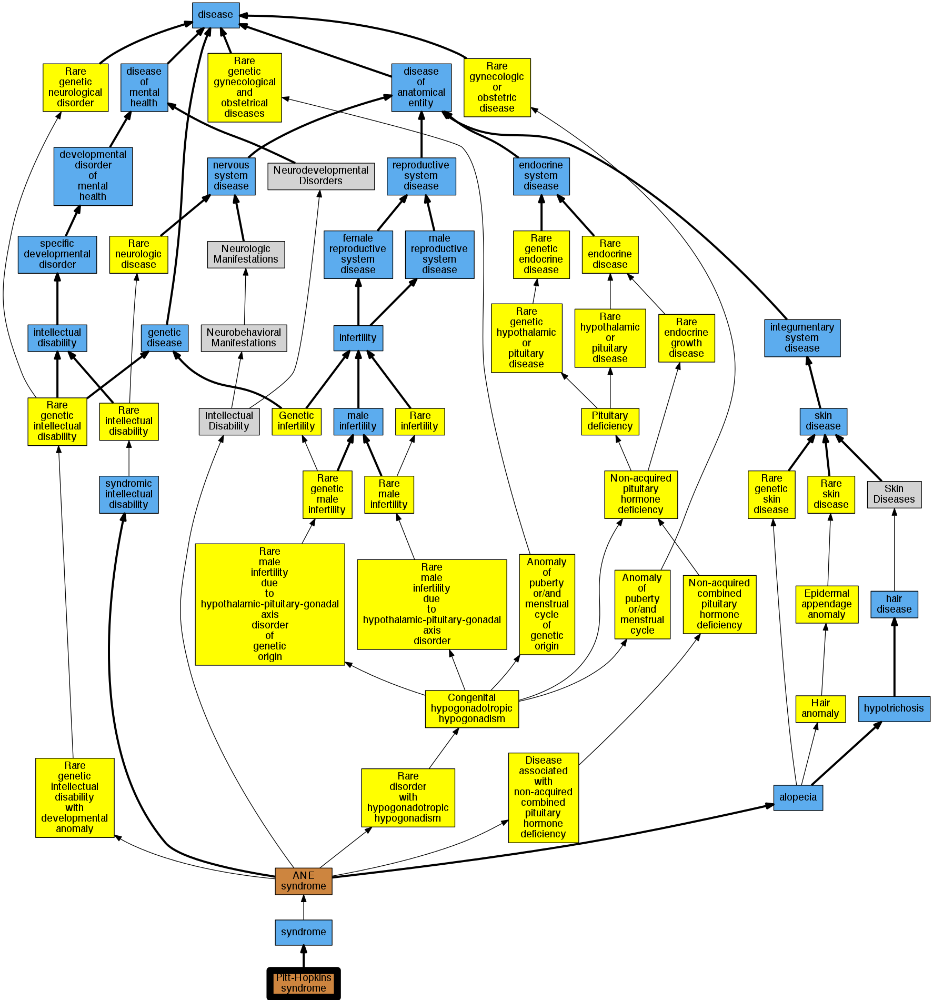

## GENE: TCF4

[matched diseases visual](TCF4.png)  <-- click on raw to zoom

### PITT-HOPKINS SYNDROME
 * [OMIM:610954 Pitt-Hopkins syndrome](http://beta.monarchinitiative.org/disease/OMIM:610954) Confidence: high
    * Equiv:[Orphanet:2896 Pitt-Hopkins syndrome](http://beta.monarchinitiative.org/disease/Orphanet:2896)
    * Equiv:[DOID:0060488 -](http://beta.monarchinitiative.org/disease/DOID:0060488)
    * Equiv:[MESH:C537403 Pitt-Hopkins syndrome](http://beta.monarchinitiative.org/disease/MESH:C537403)
    * Syn: "Encephalopathy, Severe Epileptic, With Autonomic Dysfunction"
    * Syn: "Mental Retardation, Syndromal, With Intermittent Hyperventilation"
    * Syn: "Pitt Hopkins syndrome"
    * Syn: "PITT-HOPKINS SYNDROME; PTHS"
    * Syn: "PTHS"

### Pitt-Hopkins syndrome
 * [OMIM:610954 Pitt-Hopkins syndrome](http://beta.monarchinitiative.org/disease/OMIM:610954) Confidence: high
    * Equiv:[Orphanet:2896 Pitt-Hopkins syndrome](http://beta.monarchinitiative.org/disease/Orphanet:2896)
    * Equiv:[DOID:0060488 -](http://beta.monarchinitiative.org/disease/DOID:0060488)
    * Equiv:[MESH:C537403 Pitt-Hopkins syndrome](http://beta.monarchinitiative.org/disease/MESH:C537403)
    * Syn: "Encephalopathy, Severe Epileptic, With Autonomic Dysfunction"
    * Syn: "Mental Retardation, Syndromal, With Intermittent Hyperventilation"
    * Syn: "Pitt Hopkins syndrome"
    * Syn: "PITT-HOPKINS SYNDROME; PTHS"
    * Syn: "PTHS"
