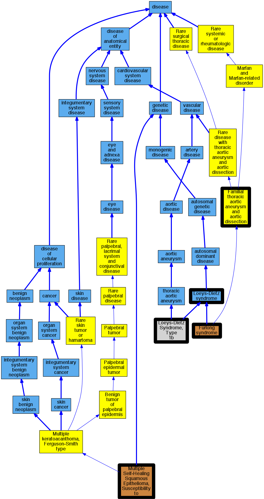

## GENE: TGFBR1

[matched diseases visual](TGFBR1.png)  <-- click on raw to zoom

### LOEYS-DIETZ SYNDROME 1
 * [OMIM:609192 Furlong syndrome](http://beta.monarchinitiative.org/disease/OMIM:609192) Confidence: low/0.18000000000000002
    * Equiv:[MESH:C538192 Furlong syndrome](http://beta.monarchinitiative.org/disease/MESH:C538192)
    * Equiv:[MESH:D055947 Loeys-Dietz Syndrome](http://beta.monarchinitiative.org/disease/MESH:D055947)
    * Syn: "Aortic Aneurysm, Familial Thoracic 5"
    * Syn: "Furlong Syndrome"
    * Syn: "LDS1"
    * Syn: "Loeys-Dietz Aortic Aneurysm Syndrome"
    * Syn: "LOEYS-DIETZ SYNDROME 1; LDS1"

### Loeys-Dietz Syndrome
 * [DOID:0050466 Loeys-Dietz syndrome](http://beta.monarchinitiative.org/disease/DOID:0050466) Confidence: high

### Loeys-Dietz aortic aneurysm syndrome
 * [OMIM:609192 Furlong syndrome](http://beta.monarchinitiative.org/disease/OMIM:609192) Confidence: high
    * Equiv:[MESH:C538192 Furlong syndrome](http://beta.monarchinitiative.org/disease/MESH:C538192)
    * Equiv:[MESH:D055947 Loeys-Dietz Syndrome](http://beta.monarchinitiative.org/disease/MESH:D055947)
    * Syn: "Aortic Aneurysm, Familial Thoracic 5"
    * Syn: "Furlong Syndrome"
    * Syn: "LDS1"
    * Syn: "Loeys-Dietz Aortic Aneurysm Syndrome"
    * Syn: "LOEYS-DIETZ SYNDROME 1; LDS1"

### Thoracic aortic aneurysms and aortic dissections
 * [Orphanet:91387 Familial thoracic aortic aneurysm and aortic dissection](http://beta.monarchinitiative.org/disease/Orphanet:91387) Confidence: low/0.19097222222222224

### Loeys-Dietz syndrome
 * [DOID:0050466 Loeys-Dietz syndrome](http://beta.monarchinitiative.org/disease/DOID:0050466) Confidence: high

### Thoracic aortic aneurysms and aortic dissections
 * [Orphanet:91387 Familial thoracic aortic aneurysm and aortic dissection](http://beta.monarchinitiative.org/disease/Orphanet:91387) Confidence: low/0.19097222222222224

### Thoracic aortic aneurysms and aortic dissections
 * [Orphanet:91387 Familial thoracic aortic aneurysm and aortic dissection](http://beta.monarchinitiative.org/disease/Orphanet:91387) Confidence: low/0.19097222222222224

### Loeys-Dietz Syndrome
 * [DOID:0050466 Loeys-Dietz syndrome](http://beta.monarchinitiative.org/disease/DOID:0050466) Confidence: high

### Loeys-Dietz Syndrome, type 1
 * [MESH:C567181 Loeys-Dietz Syndrome, Type 1b](http://beta.monarchinitiative.org/disease/MESH:C567181) Confidence: low/0.19097222222222224

### MULTIPLE SELF-HEALING SQUAMOUS EPITHELIOMA, SUSCEPTIBILITY TO
 * [OMIM:132800 Multiple Self-Healing Squamous Epithelioma, Susceptibility to](http://beta.monarchinitiative.org/disease/OMIM:132800) Confidence: high
    * Syn: "Ess1, Formerly"
    * Syn: "Ferguson-Smith Type Epithelioma"
    * Syn: "MSSE"
    * Syn: "MULTIPLE SELF-HEALING SQUAMOUS EPITHELIOMA, SUSCEPTIBILITY TO; MSSE"
