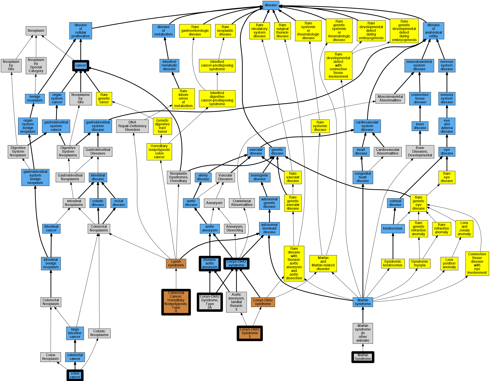

## GENE: TGFBR2

[matched diseases visual](TGFBR2.png)  <-- click on raw to zoom

### COLON CANCER, HEREDITARY NONPOLYPOSIS, TYPE 6, SOMATIC
 * [OMIM:614331 Colorectal Cancer, Hereditary Nonpolyposis, Type 6](http://beta.monarchinitiative.org/disease/OMIM:614331) Confidence: low/0.15306122448979592
    * Equiv:[MESH:C566039 Colorectal Cancer, Hereditary Nonpolyposis, Type 6](http://beta.monarchinitiative.org/disease/MESH:C566039)
    * Syn: "Colon Cancer, Hereditary Nonpolyposis, Type 6"
    * Syn: "COLORECTAL CANCER, HEREDITARY NONPOLYPOSIS, TYPE 6; HNPCC6"
    * Syn: "HNPCC6"

### COLORECTAL CANCER, HEREDITARY NONPOLYPOSIS, TYPE 6
 * [OMIM:614331 Colorectal Cancer, Hereditary Nonpolyposis, Type 6](http://beta.monarchinitiative.org/disease/OMIM:614331) Confidence: high
    * Equiv:[MESH:C566039 Colorectal Cancer, Hereditary Nonpolyposis, Type 6](http://beta.monarchinitiative.org/disease/MESH:C566039)
    * Syn: "Colon Cancer, Hereditary Nonpolyposis, Type 6"
    * Syn: "COLORECTAL CANCER, HEREDITARY NONPOLYPOSIS, TYPE 6; HNPCC6"
    * Syn: "HNPCC6"

### Loeys-Dietz Syndrome
 * [DOID:0050466 Loeys-Dietz syndrome](http://beta.monarchinitiative.org/disease/DOID:0050466) Confidence: high

### Loeys-Dietz syndrome, type 2
 * [MESH:C567156 Loeys-Dietz Syndrome, Type 2A](http://beta.monarchinitiative.org/disease/MESH:C567156) Confidence: low/0.19097222222222224

### Aortic aneurysm, thoracic
 * [DOID:14004 thoracic aortic aneurysm](http://beta.monarchinitiative.org/disease/DOID:14004) Confidence: high

### ESOPHAGEAL CANCER, SOMATIC
 * [OMIM:133239 Esophageal squamous cell carcinoma](http://beta.monarchinitiative.org/disease/OMIM:133239) Confidence: low/0.18055555555555555
    * Equiv:[Orphanet:99977 Squamous cell carcinoma of esophagus](http://beta.monarchinitiative.org/disease/Orphanet:99977)
    * Equiv:[MESH:C562729 Esophageal Squamous Cell Carcinoma](http://beta.monarchinitiative.org/disease/MESH:C562729)
    * Syn: "Aerodigestive Tract Cancer, Susceptibility to"
    * Syn: "Escc, Susceptibility to"
    * Syn: "ESOPHAGEAL CANCER"
    * Syn: "Esophageal Squamous Cell Carcinoma, Susceptibility to"
    * Syn: "Gastric Cardia Adenocarcinoma, Susceptibility to"

### Familial Thoracic Aortic Aneurysm
 * [OMIM:607086 Aortic Aneurysm, Thoracic](http://beta.monarchinitiative.org/disease/OMIM:607086) Confidence: high
    * Equiv:[MESH:C562834 Aortic Aneurysm, Familial Thoracic 1](http://beta.monarchinitiative.org/disease/MESH:C562834)
    * Equiv:[MESH:D017545 Aortic Aneurysm, Thoracic](http://beta.monarchinitiative.org/disease/MESH:D017545)
    * Syn: "AAT1"
    * Syn: "Aneurysm, Thoracic Aortic"
    * Syn: "Annuloaortic Ectasia"
    * Syn: "Aortic Aneurysm, Familial Thoracic"
    * Syn: "AORTIC ANEURYSM, FAMILIAL THORACIC 1; AAT1"
    * Syn: "Aortic Dissection, Familial"
    * Syn: "Erdheim Cystic Medial Necrosis of Aorta"
    * Syn: "Faa1"

### LOEYS-DIETZ SYNDROME 2
 * [OMIM:610168 Aortic aneurysm, familial thoracic 3](http://beta.monarchinitiative.org/disease/OMIM:610168) Confidence: low/0.18000000000000002
    * Equiv:[MESH:C537783 Aortic aneurysm, familial thoracic 3](http://beta.monarchinitiative.org/disease/MESH:C537783)
    * Syn: "Aortic Aneurysm, Familial Thoracic 3"
    * Syn: "LDS2"
    * Syn: "LOEYS-DIETZ SYNDROME 2; LDS2"
    * Syn: "Marfan Syndrome, Type Ii, Formerly"

### Loeys-Dietz Syndrome
 * [DOID:0050466 Loeys-Dietz syndrome](http://beta.monarchinitiative.org/disease/DOID:0050466) Confidence: high

### Marfan syndrome
 * [DOID:14323 Marfan syndrome](http://beta.monarchinitiative.org/disease/DOID:14323) Confidence: high
    * Syn: "Marfan's syndrome"

### Familial Thoracic Aortic Aneurysm
 * [OMIM:607086 Aortic Aneurysm, Thoracic](http://beta.monarchinitiative.org/disease/OMIM:607086) Confidence: high
    * Equiv:[MESH:C562834 Aortic Aneurysm, Familial Thoracic 1](http://beta.monarchinitiative.org/disease/MESH:C562834)
    * Equiv:[MESH:D017545 Aortic Aneurysm, Thoracic](http://beta.monarchinitiative.org/disease/MESH:D017545)
    * Syn: "AAT1"
    * Syn: "Aneurysm, Thoracic Aortic"
    * Syn: "Annuloaortic Ectasia"
    * Syn: "Aortic Aneurysm, Familial Thoracic"
    * Syn: "AORTIC ANEURYSM, FAMILIAL THORACIC 1; AAT1"
    * Syn: "Aortic Dissection, Familial"
    * Syn: "Erdheim Cystic Medial Necrosis of Aorta"
    * Syn: "Faa1"

### Familial Thoracic Aortic Aneurysm
 * [OMIM:607086 Aortic Aneurysm, Thoracic](http://beta.monarchinitiative.org/disease/OMIM:607086) Confidence: high
    * Equiv:[MESH:C562834 Aortic Aneurysm, Familial Thoracic 1](http://beta.monarchinitiative.org/disease/MESH:C562834)
    * Equiv:[MESH:D017545 Aortic Aneurysm, Thoracic](http://beta.monarchinitiative.org/disease/MESH:D017545)
    * Syn: "AAT1"
    * Syn: "Aneurysm, Thoracic Aortic"
    * Syn: "Annuloaortic Ectasia"
    * Syn: "Aortic Aneurysm, Familial Thoracic"
    * Syn: "AORTIC ANEURYSM, FAMILIAL THORACIC 1; AAT1"
    * Syn: "Aortic Dissection, Familial"
    * Syn: "Erdheim Cystic Medial Necrosis of Aorta"
    * Syn: "Faa1"

### Loeys-Dietz aortic aneurysm syndrome
 * [OMIM:609192 Furlong syndrome](http://beta.monarchinitiative.org/disease/OMIM:609192) Confidence: high
    * Equiv:[MESH:C538192 Furlong syndrome](http://beta.monarchinitiative.org/disease/MESH:C538192)
    * Equiv:[MESH:D055947 Loeys-Dietz Syndrome](http://beta.monarchinitiative.org/disease/MESH:D055947)
    * Syn: "Aortic Aneurysm, Familial Thoracic 5"
    * Syn: "Furlong Syndrome"
    * Syn: "LDS1"
    * Syn: "Loeys-Dietz Aortic Aneurysm Syndrome"
    * Syn: "LOEYS-DIETZ SYNDROME 1; LDS1"

### Loeys-Dietz syndrome
 * [DOID:0050466 Loeys-Dietz syndrome](http://beta.monarchinitiative.org/disease/DOID:0050466) Confidence: high

### Marfan syndrome
 * [DOID:14323 Marfan syndrome](http://beta.monarchinitiative.org/disease/DOID:14323) Confidence: high
    * Syn: "Marfan's syndrome"
